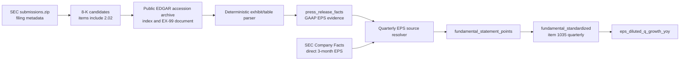

# Reported quarterly EPS source brief

## Root implementation correction - 2026-09-22

The daily source may use the existing FC1 `sec_filed_date_plus_46h_v1` policy
when a valid SEC filing date is known but precise dissemination is not:
filing-date midnight plus46h, max with any later qualified source availability.
Return the conservative policy and source evidence in lineage. Do not claim
exact intraday publication or historical delivery vintage. Unknown naive
timestamps remain excluded from exact UTC interpretation, not from every
daily accounting output. This supersedes any conflicting blanket exclusion
below. Even exact acceptance need not equal dissemination; see the
[SEC's data guidance](https://www.sec.gov/search-filings/edgar-search-assistance/accessing-edgar-data).
Support local bulk SGML/cache inputs; bounded accession/exhibit fetches fill
document gaps without per-CIK submissions API discovery. No daily archive has
been downloaded for this task. Migration0320 is reserved to this implementer
for additive receipt evidence, with its own body and registry lines together.

## Desk acceptance: the question and executable current-state query

An institutional equity long/short desk needs to answer this at each decision
time: **for an issuer's exact fiscal quarters, what reported GAAP diluted EPS
was knowable, what was knowable for the matching prior fiscal quarter, what is
the resulting quarterly YoY growth, and can the analyst trace both numbers to
their filing/document and availability clocks?**  This supports earnings
surprise, earnings-momentum, quality, and catalyst research without confusing a
TTM series, an adjusted EPS release, or a later restatement for the original
reported quarter.

The read-only, current-schema acceptance query is
[quarterly-eps-acceptance.sql](C:/atx/.superpowers/sdd/tier1-parity/quarterly-eps-acceptance.sql).
It accepts a small `operator_input` relation of CIK, cutoff, and exact current
and prior fiscal-quarter windows.  The provided three CVX rows are case
parameters, not implementation branches.  This matters for 52/53-week and
non-calendar fiscal years: the query never creates a comparator with
`period_end - INTERVAL 1 YEAR`.

Against the observed current warehouse, the expected output is:

| Requested quarter | Raw direct EPS inputs | Raw computed quarterly YoY | Stored published YoY | Required diagnostic |
| --- | --- | ---: | --- | --- |
| Q2 2026 | 6.11 / 1.45 | 321.3793103448% | NULL | `materialization_missing` |
| Q1 2026 | 1.11 / 2.00 | -44.5000000000% | NULL | `materialization_missing` |
| Q4 2025 | missing / missing | NULL | NULL | `not_evaluable_raw_input_missing` |

The query returns selected raw accessions, filed dates, stored and effective
availability, units, source-load time, and candidate counts.  Thus the first
two rows distinguish a raw-source success from the known empty downstream
materializations; the third identifies a source gap rather than a broken YoY
formula.  It does not use FY2025 6.63 or 9M2025 5.27, so it cannot emit the
invalid 1.36 residual.

## Decision and bounded outcome

Close the missing-discrete-quarter EPS route with **SEC-filed 8-K Item 2.02
earnings-release exhibits**, discovered from the SEC bulk submissions archive
and retrieved from the public EDGAR archive by accession.  This is a
deterministic, no-credential source path.  It is issuer-generic: it identifies
filing metadata and exhibit/table semantics, never Chevron-specific URLs,
accessions, labels, or values.

The production implementation must support the full requested history and
incremental all-universe coverage.  A two-fiscal-year slice is useful only as
the first bounded validation execution for the generic path; it is not a
product retention limit or an implicit historical cutoff.  The source must make
a qualifying, reported **GAAP diluted EPS** release value available to the
existing quarterly standardized / derived metric route when a direct
three-month Company Facts value is absent.  It must not manufacture Q4 EPS from
FY and year-to-date EPS, nor calculate it from net income and share counts.

## Evidence and availability status

| Surface | What is proven now | Suitability for reported Q4 EPS |
| --- | --- | --- |
| Local `sec_company_facts` | The read-only CVX inspection found direct 3-month `us-gaap:EarningsPerShareDiluted` rows for Q1/Q2 2025 and Q1/Q2 2026, but no direct 70--115-day Q4 2024 or Q4 2025 row.  It found FY2025 `6.63` and 9M2025 `5.27`. | Direct source for the four present quarters; insufficient for the two Q4 inputs. |
| Existing quarterly transformation | Per-share facts are excluded from discrete-quarter subtraction.  `6.63 - 5.27 = 1.36`, while CVX reported Q4 2025 EPS is `1.39`; the exclusion is correct. | Do not change this guard. |
| `press_release_facts` | A deterministic, injectable 8-K Item 2.02 / EX-99 extraction and evidence table already exist.  The default warehouse has no supplied corpus and the loader returns zero rows without a source file or fetch/parse pair.  This table is not currently an input to statement standardization. | Retain as the raw earnings-release evidence layer; extend it with a public-SEC adapter and bridge it to the core route. |
| `sec_submissions` / `SecSubmissionsBulkDataset` | The existing public SEC bulk adapter reads `submissions.zip` CIK JSON and older-history JSON, including form, accession, acceptance datetime, items, and primary-document metadata.  Its own docstring states that these are filing-history metadata members. | Use it to discover 8-K Item 2.02 candidates and their exact accession; it does **not** supply EX-99 text. |
| SEC EDGAR Archives | Public primary source, no paid subscription or personal-email identity required beyond the project SEC user agent already used by SEC adapters.  Per-accession archive documents are the required exhibit-text source after metadata discovery. | Concrete retrieval source for a candidate's EX-99 earnings release. |
| `tbltickerhistory_daily` / `TickerHistoryOptions` | The local archive schema contains daily market fields plus `earnFlag` and `nEarnCnt*` event/count fields.  It has no reported/actual EPS, period, accounting-basis, or earnings-release provenance field. | Do not use it as an EPS value source; it can at most help schedule/monitor filing-event coverage. |
| Credentialed or theoretical vendors | No licensed estimates/actuals corpus or provider adapter with observed reported-quarter EPS coverage was found in this audit. | Out of scope; do not add a paid signup, credentials, or an LLM extraction service. |

The observed CVX acceptance benchmark remains the validation case, not a
special input: the official Chevron Q4 2025 release reports diluted EPS of
`1.39` versus `1.84` for Q4 2024, and the requested result is
`(1.39 / 1.84) - 1 = -24.4565217391%`.  The acceptance document also records
the official Q1/Q2 2026 releases and the source links.  The implementation
must obtain those values through the generic source path rather than embedding
them.

Sources inspected locally:

- [CVX EPS acceptance](C:/atx/atx-db/docs/CVX_EPS_ACCEPTANCE.md)
- [CVX production query audit](C:/atx/.superpowers/sdd/tier1-parity/cvx-eps-production-query-audit.md)
- [archive-stop inspection](C:/atx/.superpowers/sdd/tier1-parity/companyfacts-archive7-stop-inspection.json)
- [PF2-S8 press-release plan](C:/atx/atx-db/plans/pf2/sprint-8-preliminary-press-release.md)

## Proposed source flow

`submissions.zip` is the scalable discovery archive and should be preferred for
the candidate index.  The archive does not package filing exhibits, so an
accession-by-accession EDGAR fetch is still required.  Cache each fetched
document by accession and SHA-256; on later runs fetch only candidates whose
accession/document fingerprint is not already recorded.  The initial
two-fiscal-year run is a bounded validation slice.  The production backfill
must accept an explicit requested-history boundary, process all eligible
universe CIKs through resumable shards, and continue incrementally from durable
receipts; it must not impose a hard-coded two-year ceiling.

## Required source and lineage contract

An extracted row can enter the reported-quarter EPS resolver only when all of
these conditions hold:

1. The discovery row is an SEC `8-K` with Item `2.02`, exact zero-padded CIK,
   accession number, and a source timestamp with a documented timezone.  Raw
   CIK ownership is immutable through archive resume: candidate and receipt
   rows remain CIK-owned even if no market-security link yet exists.  The
   issuer-linkage path may attach a market `security_id` only with the same
   fact-time CIK-history rules as Company Facts; current ticker fallback cannot
   backdate a link or rewrite the raw CIK owner.
2. The selected document is an exhibit from that accession's EDGAR archive;
   store the accession, CIK, document filename, archive/index URL, document
   URL, SHA-256, retrieval receipt, and the source row that selected it.  Do
   not use an issuer IR mirror as the production input.
3. A deterministic extractor identifies a consolidated, reported GAAP diluted
   EPS value and a discrete three-month period.  It must retain the table/row,
   column heading, period-end text, and evidence snippet in `raw_payload_json`
   and `evidence_text`.  It must reject adjusted, non-GAAP, continuing-ops,
   basic-EPS, annual, and ambiguous values rather than choose by proximity.
4. `period_end`, fiscal year/period, and the three-month duration must be
   explicit in the exhibit or deterministically corroborated by filing
   metadata.  A synthetic period boundary must never stand in for a value;
   if the required period semantics cannot be established, emit no EPS row.
5. `basis = 'GAAP'`, `measure_code = 'EPS_DILUTED'`, and the unit is USD/share.
   Preserve the original source timestamp string, explicit UTC offset, parsed
   UTC instant, and timezone-validation status.  `available_at` is the SEC
   acceptance instant (or a later independently recorded document-availability
   instant) only when its offset/zone is explicit and validated.  A naive
   unknown-zone timestamp is `timestamp_zone_unknown`: retain it as evidence
   but reject it from precise PIT publication unless the authoritative source
   contract documents its zone and that qualification is recorded.  Warehouse
   retrieval time is lineage only and must never establish original
   availability.
6. Preserve every accessible source vintage.  For a matching direct Company
   Facts three-month EPS, publish the release value at release availability and
   the direct filing value when it becomes visible.  If both are available and
   disagree beyond the documented display/rounding tolerance, emit an auditable
   conflict/unavailable state; do not pick a winner or average them.
7. The resolver may use an earnings-release row only where no qualifying direct
   70--115-day Company Facts EPS is visible at that point in time.  It may not
   use FY-minus-YTD EPS, net income divided by weighted-average shares, TTM
   EPS, or a `tbltickerhistory` earnings flag.

The source name should explicitly identify the distinction, for example
`SEC 8-K Item 2.02 reported earnings release`, while the canonical item remains
`eps_diluted` / item `1035`.  A separately offered net-income/share result, if
ever desired, must be named `reconstructed_eps` and remain outside this route.

The existing `sec_submissions._parse_acceptance` normalizes timestamps with
`utc=True` and stores a naive UTC value, while the current generic
press-release normalizer can fall back to a date-derived end-of-day timestamp.
Those are not sufficient for this source.  The new SEC adapter must preserve
the original timestamp/offset before normalization and must not use the generic
date or retrieval-time fallback for publication eligibility.

## Bounded implementation task

Implement **SEC 8-K reported-quarter EPS ingestion and core bridge** with no
new provider.  Add a narrow durable receipt surface for every discovered
candidate and document outcome.  `press_release_facts` remains the accepted
fact/evidence surface; the receipt surface makes missing-document, rejected
semantic, cache, timestamp-zone, and CIK-linkage states observable without
turning absence into a guessed fact.

Expected code changes:

| File | Change |
| --- | --- |
| `src/atx_db/sec_submissions.py` | Add a deterministic candidate selector over already loaded `sec_submissions`: form 8-K, Item 2.02, bounded reporting/filing dates, stable accession/CIK ordering.  Keep the existing bulk loader as discovery only; do not claim it contains exhibits. |
| `src/atx_db/press_release.py` | Add the public-SEC accession document adapter, cache/receipt handling, exhibit selection, deterministic GAAP diluted-EPS table extraction, and explicit rejected/ambiguous outcomes. Preserve original clocks/offsets and never promote a naive unknown-zone or retrieval timestamp to `available_at`. Reuse the existing fact evidence fields, without a generic web search or LLM call. |
| `src/atx_db/fundamental_statements.py` | Add a source-resolver input for qualifying `press_release_facts` EPS rows, with a separate source identity and a direct-companyfacts-first-at-each-visible-vintage rule.  It must retain release and filing lineage and never reuse the monetary Q4 subtraction path. |
| `src/atx_db/_standardization_set_based.py` | Ensure the quarterly item-1035 selection preserves the resolver's PIT source precedence and has exactly one valid authoritative quarterly EPS state per security/period/revision event. |
| `src/atx_db/activation.py` | Add an `earnings_release_facts` stage after `submissions_load` and before `statement_points`; expose an explicit requested-history start, resumable all-universe shards, and incremental mode. It needs the existing SEC user-agent/downloader seam and checksum receipts. A two-year range is an optional validation parameter, never the production default ceiling. |
| `src/atx_db/jobs.py` | Register the equivalent governed job and dependencies if jobs remain a supported way to run the source; do not leave the new source reachable only through an ad hoc script. |
| `src/atx_db/migrations/registry.py` and one new registry-assigned migration body | Create `sec_earnings_release_receipts`: immutable CIK/accession/document receipt, SHA, source/retrieval timestamps, raw timestamp, UTC offset, timezone-validation status, candidate outcome/reason, source-owned security key, and run lineage. Never modify migrations `0121`--`0123`. |
| `tests/test_sec_submissions_bulk.py`, `tests/test_press_release.py`, `tests/test_fundamental_statements.py`, `tests/test_standardization.py`, the migration/schema-contract tests, and activation/job DAG tests | Add in-memory fixtures only: metadata discovery, EX-99 selection, GAAP-vs-non-GAAP rejection, explicit-offset preservation, unknown-zone exclusion, no-lookahead, immutable raw CIK ownership through resume, duplicate/revision ordering, direct-source precedence/conflict behavior, and the CVX-shaped FY/YTD subtraction trap. No SEC network in pytest. |

The receipt migration is required for diagnosable production coverage; allocate
its version from the current registry at implementation time, rather than
editing an earlier landed migration or assuming a version while other work is
in flight.

## Required checks before calling coverage closed

1. First run the current-schema
   [acceptance SQL](C:/atx/.superpowers/sdd/tier1-parity/quarterly-eps-acceptance.sql)
   read-only for the three requested rows.  It is the pre-writer baseline:
   record its raw computed values, selected Company Facts lineage, explicit raw
   input states, published availability, and materialization states.  Then run
   the implemented source stage on a deliberately small two-fiscal-year SEC
   candidate slice.  Record counts for discovered Item 2.02
   filings, retrieved documents, selected exhibits, accepted GAAP diluted-EPS
   rows, ambiguous/rejected rows by reason, cache hits, and CIK identity
   failures.  Counts alone are not proof of usable EPS.
2. On the production snapshot, inspect the raw release facts and Company Facts
   rows together by CIK/security, period start/end, accession, basis, source
   document SHA, and `available_at`.  Confirm a qualifying Q4 2025 and Q4 2024
   release row for CVX only as observed output from the generic pipeline.
3. Rebuild the normal stages in order: source receipt, statement points,
   periods, standardization, derived metrics.  Do not manually insert
   `fundamental_standardized` or `derived_metric_values` rows.
4. Keep raw CIK ownership immutable through the verified archive-resume path.
   Apply the fact-time CIK identity check from the existing audit only when
   joining the accepted source row to a market security.  A release value with
   only the unresolved CIK placeholder remains source evidence, not a
   market-security production value.
5. Query `eps_diluted_q_growth_yoy`, `metric_window = 'q'`, preserving derived
   unavailable states before ranking.  It must return reported inputs and
   values for Q2 2026 `321.3793103448%`, Q1 2026 `-44.5000000000%`, and Q4 2025
   `-24.4565217391%`, with lineages for both current and prior-quarter inputs.
   `eps_diluted_growth_yoy` (TTM) is not an acceptance substitute.
6. Verify negative cases: FY 6.63 / 9M 5.27 cannot produce Q4 1.36; a
   non-GAAP/adjusted EPS cannot enter the reported metric; a source conflict or
   missing direct period emits unavailable evidence; and no fact is visible
   before its recorded SEC availability time. An explicit-offset source clock
   must round-trip to its stored UTC instant; an unqualified naive timestamp
   must remain excluded from precise PIT publication.

## Explicit non-goals

- No issuer-specific CVX parser, accession list, hardcoded value, or IR URL.
- No paid data provider, credentials, signup, personal email, or LLM API use.
- No annual-minus-YTD EPS subtraction and no net-income/share reconstruction in
  the reported EPS metric.
- No claim that `tbltickerhistory`, the current local press-release table, or
  the metadata-only submissions archive already supplies the missing Q4 values.
- No hard-coded historical cutoff: the first two-year slice is validation only;
  full requested history and incremental all-universe coverage are required.
