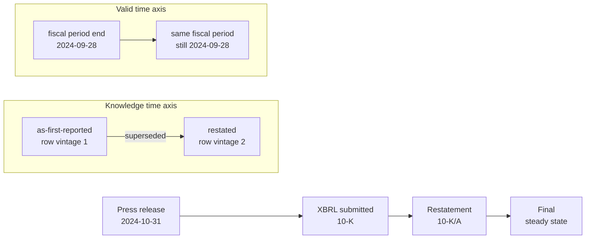
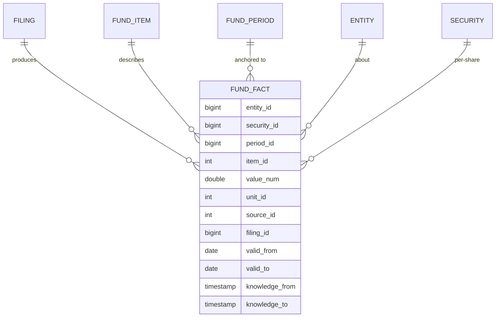
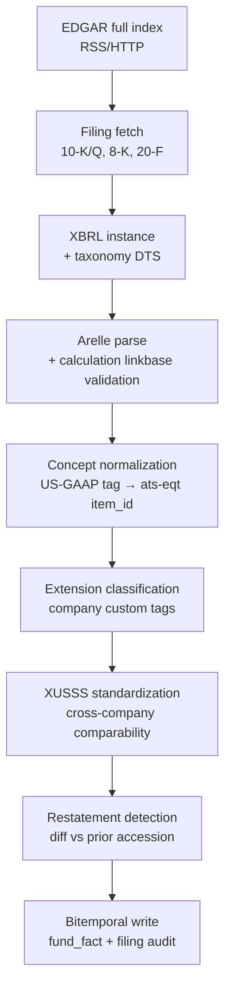
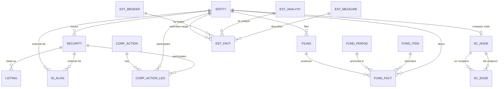
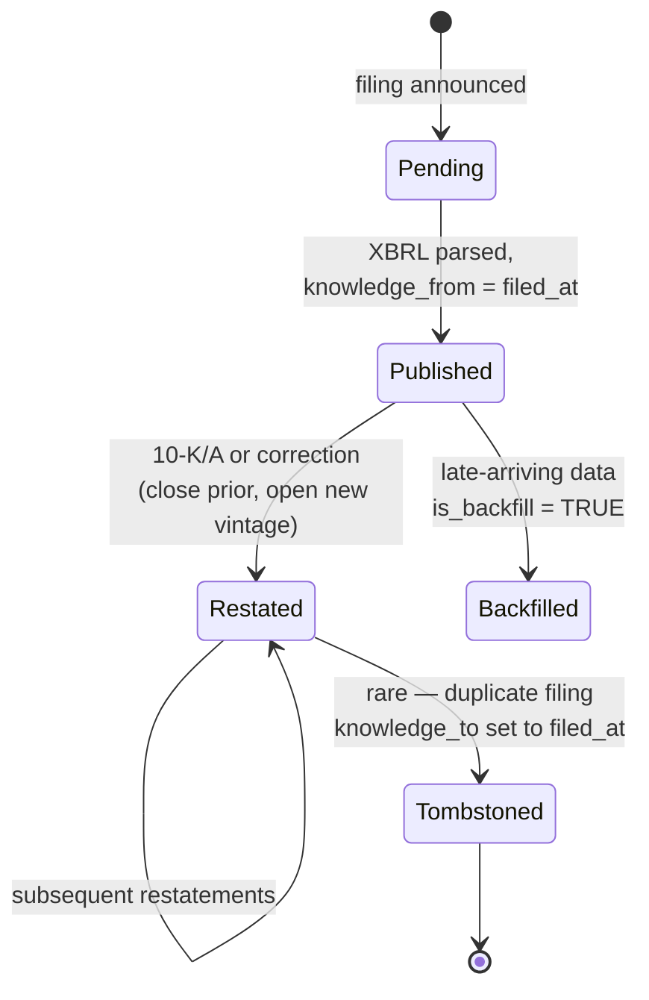

# ats-eqt — Data Models and Collection Methodology

**Status:** Design reference, v0.1
**Audience:** ats-eqt engineering team (storage layer, ingestion, query)
**Scope:** schemas, semantics, and pipelines for fundamentals + estimates + supply chain + identifiers, drawing on three decades of vendor experience (Compustat, Capital IQ, FactSet, I/B/E/S, Worldscope) and modern open ecosystems (XBRL US, SEC EDGAR, OpenFIGI, PermID).
**Last updated:** 2026-05-09

---

## 0. Executive summary

ats-eqt is being designed as an open-source-data competitor to FactSet, S&P Capital IQ, Refinitiv/LSEG, and Bloomberg, sitting on top of the in-house ats-core C database. The schemas in this document are not aspirational — they are reverse-engineered from how the incumbents actually store and serve the data, and from open replicas (SEC EDGAR XBRL, XBRL US standardized statements, tidy-finance, SimFin, Sharadar, OpenBB) that have been forced to converge on similar models.

Five non-negotiables emerge across every vendor reviewed:

1. **Long-format fundamentals.** High-cardinality concept spaces (10k+ items) collapse to `(entity, security, period, item_id, value)` tuples. Compustat publishes a wide quarterly/annual table for analyst convenience, but the Capital IQ underlying store, FactSet's RBICS-linked content, and SEC's XBRL Frames API are all long-form.
2. **Bitemporal (PIT) semantics are mandatory.** Fundamentals, estimates, classifications, identifiers, and supply chain edges all change retroactively. A row in the database needs both *valid time* (when the fact was true in the world) and *transaction time / knowledge time* (when ats-eqt learned of it). Compustat Snapshot, FactSet "as first reported", LSEG Worldscope PIT, and the Refinitiv/LSEG Point-in-Time Fundamentals product all converge on this. (sources below)
3. **Stable internal IDs, vendor IDs as aliases.** Every modern security master (Intrinio, FactSet FSYM, LSEG PermID) uses an internal permanent key with external identifiers as time-bounded aliases. Tickers are a join key, never a primary key.
4. **Survivorship-free entity universe.** Both active and dead/delisted entities must be retained or backtests are biased upward by ~1.6%/yr (CRSP-derived figure).
5. **The "as-reported → standardized" two-tier model.** Vendors keep both the company-reported figure (XBRL tag, custom extension, or vendor-mapped item) and a standardized, comparable figure. ats-eqt should not collapse these.

The remainder of this document is a technical reference. Each part ends with a recommendation for ats-eqt's adopted schema. Part G is the consolidated DDL.

---

## Part A — Fundamentals data schemas

### A.1 The "long format" / EAV pattern

S&P Capital IQ's underlying store and the SEC EDGAR XBRL Frames API are conceptually identical: each financial fact is one row of `(entity, security_or_period_dim, item_id, value, units, vintage_metadata)`. This is variously called *long format*, *narrow*, *EAV (entity-attribute-value)*, or *fact-table* form.

The reason is cardinality. Capital IQ exposes thousands of standardized line items plus per-segment and per-instrument breakouts; FactSet Fundamentals DataFeed advertises 750+ data items across 86,000+ companies (source: <https://insight.factset.com/resources/at-a-glance-factset-fundamental-datafeed>). Storing each as a column would produce a table with sparse population well over 95% — wasteful and rigid.

A canonical long-form fact tuple looks like:

```sql
-- Long-form fundamentals fact (Capital IQ ciqFinInstanceItem-style)
CREATE TABLE fund_fact (
  entity_id        BIGINT      NOT NULL,   -- internal company key
  security_id      BIGINT      NULL,       -- per-share / per-instrument items only
  period_id        BIGINT      NOT NULL,   -- references fund_period
  item_id          INTEGER     NOT NULL,   -- references fund_item dictionary
  value_num        DOUBLE      NULL,       -- numeric facts
  value_text       TEXT        NULL,       -- footnote-style facts
  unit_id          INTEGER     NULL,       -- USD, EUR, shares, ratio…
  source_id        INTEGER     NOT NULL,   -- preliminary press, 10-K, 10-K/A …
  filing_id        BIGINT      NULL,       -- ↩ accession-level provenance
  valid_from       DATE        NOT NULL,   -- when fact became true in the world
  valid_to         DATE        NOT NULL,   -- typically 9999-12-31 for current
  knowledge_from   TIMESTAMP   NOT NULL,   -- when ats-eqt learned of it
  knowledge_to     TIMESTAMP   NOT NULL,
  PRIMARY KEY (entity_id, period_id, item_id, source_id, knowledge_from)
);
```

Capital IQ's analogous physical tables (referenced widely in academic literature and WRDS access guides) are `ciqFinInstance` (one row per filing/snapshot), `ciqFinInstanceItem` (the EAV body), `ciqFinPeriod` (period dimension), and `ciqDataItem` (the item dictionary). The exact column list is proprietary, but the pattern is well documented (source: <https://wrds-www.wharton.upenn.edu/pages/wrds-research/database-linking-matrix/linking-capital-iq-with-compustat/>; HBS guide <https://leqr.wiwi.hu-berlin.de/content/howto/SP_CIQ_Fundamentals_v2.pdf> [unverified — PDF not parsed but commonly cited]).

**Trade-offs vs wide format:**

| Dimension | Long (EAV) | Wide (named columns) |
|---|---|---|
| Cardinality of items | unbounded (1000s, 10000s) | bounded by table column limit |
| Adding a new concept | data-only insert | DDL change, breaks consumers |
| Sparse population | trivial — missing rows | wasted storage |
| SQL ergonomics | requires PIVOT / lots of JOINs | direct `SELECT ni, revt FROM funda` |
| Index strategy | composite on `(entity, period, item)` | per-column |
| Bitemporal versioning | one row per `(item, vintage)` | needs either history table per column or row-level vintage |
| Restatement audit | natural fit | needs side-table |

### A.2 The "wide format" / structured table pattern (Compustat XPF)

Compustat takes the opposite design choice. The flagship tables are:

- `comp.funda` — annual fundamentals, one row per `(gvkey, datadate, indfmt, consol, popsrc, datafmt)` with hundreds of named columns: `at, lt, ceq, seq, ni, revt, oancf, …`
- `comp.fundq` — quarterly fundamentals, primary key `(gvkey, datadate, indfmt, consol, popsrc, datafmt, fyr)`
- `comp.company` — entity-level reference

(source: <https://www.tidy-finance.org/r/wrds-crsp-and-compustat.html>, <https://iangow.github.io/far_book/fin-state.html>, <http://kaichen.work/?p=387>)

The four "format" columns disambiguate which version of the same `(gvkey, datadate)` row to read:
- `indfmt` — `INDL` (industrial template) vs `FS` (financial-services template)
- `consol` — `C` (consolidated) vs `N` (unconsolidated)
- `popsrc` — `D` (domestic), `I` (international)
- `datafmt` — `STD`, `SUMM_STD`, `RESTATED` (in PIT add-on)

Without filtering on these, naive queries return duplicate rows — a well-known pitfall (source: <https://robsonglasscock.wordpress.com/2018/04/12/gvkey-and-datadate-or-fyear-duplicates-in-compustat/>).

The wide table is fast to query, easy to reason about, and works for the ~600 standardized concepts Compustat curates. It does not scale to Capital IQ's tens of thousands of items, nor to ad-hoc per-segment / per-instrument breakouts. Compustat's *segments* and *pension* and *capital-structure* products are themselves long-form because they cannot be fit into a wide table.

**ats-eqt recommendation:** long-form internally, with optional materialized wide views for the ~500–800 most-used concepts (mirroring Compustat coverage). The wide views are query convenience only, not a source of truth.

### A.3 Point-in-time vs as-reported vs restated

These three terms are used inconsistently across vendors. The canonical definitions:

- **As-reported (a.k.a. "as first reported", "preliminary"):** the value the company first published in a press release or filing, before any later correction. Crucial for replicating contemporaneous market reactions to earnings releases.
- **Restated (a.k.a. "current", "latest"):** the most recent value, reflecting subsequent restatements, reclassifications, or accounting-standard adoption (e.g., IFRS/US-GAAP topic shifts).
- **Point-in-time (PIT):** the value that was *known to the market* on a given calendar date *D*. It is the as-reported value if no restatement had yet occurred by *D*; it is whichever revised value was current on *D* otherwise.

Critically, **PIT is not the same as as-reported** — it is the as-of-date projection through a bitemporal table.

Vendor implementations:

- **Compustat Snapshot.** S&P Capital IQ Snapshot product preserves preliminary and final data 1968→present, retaining "original values and all succeeding changes" (source: <https://kenan-flagler.libguides.com/kfbs-library-services/research-resource/compustat-snapshot/>; <https://wrds-www.wharton.upenn.edu/pages/grid-items/introduction-compustat-part-1/>). Each firm-quarter datapoint is updated approximately six times on average (source: re-standardized financial statement data, <https://som.yale.edu/sites/default/files/2024-07/Re-Standardized%20Financial%20Statement%20Data.pdf>).
- **FactSet Fundamentals "as first reported".** Snapshot product retaining originally-published values alongside subsequent restatements (source: <https://insight.factset.com/resources/at-a-glance-factset-fundamental-datafeed>; product brief "FactSet Data Solutions via Snowflake" <https://go.factset.com/hubfs/Website/Resources%20Section/Brochures/factset-data-solutions-via-snowflake-brochure.pdf>). Marketed under the FactSet "Standard Datafeed" with historical change files (HCFs).
- **LSEG/Refinitiv Worldscope Point in Time.** "Original data is never overwritten," supports both original and restated values back to 1989 (US) / 1997 (non-US) (source: <https://www.lseg.com/en/data-analytics/financial-data/company-data/fundamentals-data/point-in-time-fundamentals>).

**Bitemporal modeling.** All three vendors are implementing — explicitly or implicitly — a bitemporal table. SQL:2011 standardized two period axes (source: <https://en.wikipedia.org/wiki/Temporal_database>):

- **Application time (`PERIOD FOR …`)** — when the fact is true in the modeled world (the *valid time*)
- **System versioning (`SYSTEM_TIME`)** — when the row was inserted/superseded in the database (the *transaction time*)

Worked example — a backdated revenue restatement:

```text
Apple reports FY2024 Q4 revenue = $94.93B on 2024-10-31.
On 2025-04-15, Apple restates FY2024 Q4 revenue to $94.50B as part of a 10-K/A.

Bitemporal record:

row 1: (AAPL, 2024-Q4, revenue, 94.93B,
        valid_from=2024-09-28, valid_to=2024-09-28,  -- fiscal period end
        knowledge_from=2024-10-31 17:30, knowledge_to=2025-04-15 09:00)

row 2: (AAPL, 2024-Q4, revenue, 94.50B,
        valid_from=2024-09-28, valid_to=2024-09-28,
        knowledge_from=2025-04-15 09:00, knowledge_to=9999-12-31)
```

A PIT query "what was Apple's FY24Q4 revenue on 2025-01-01?" filters
`knowledge_from <= '2025-01-01' < knowledge_to` and returns 94.93B.
A PIT query "as of today" returns 94.50B. The original is never overwritten.



(source: <https://mkulakowski2-73849.medium.com/bi-temporal-tables-a-quick-guide-for-the-financial-industry-9c443ba343ad>; <https://v1-docs.xtdb.com/concepts/bitemporality/>; <https://en.wikipedia.org/wiki/Temporal_database>)

### A.4 Period definitions

Every fundamentals row is anchored to a *period dimension* far richer than just "fiscal year". The minimum set:

| Field | Compustat | XBRL/SEC | Meaning |
|---|---|---|---|
| `datadate` | `datadate` | `period_end_date` | fiscal period end calendar date |
| `fyear` / `fyearq` | annual fiscal year | implied via period | fiscal year integer |
| `fqtr` | quarterly fiscal quarter | implied | 1..4 |
| `fyr` | fiscal year-end month | varies | 1..12; e.g. Apple = 9 |
| `rdq` | report date quarterly | filing date `dei:DocumentPeriodEndDate` is **not** filing date — see SEC ASR | calendar date of earnings press release (sources: <https://ionmihai.github.io/finsets/01_wrds/compq.html>) |
| `pdate` | preliminary date | press release timestamp | when prelim was issued |
| `fdate` | final date | filing accession date | when final/audited was issued |
| `ldate` | last update date | knowledge_from | last vintage modification |

Conversion to **calendar quarter** is a derived projection: `cyearq = year(datadate)`, `cqtr = quarter(datadate)` — but **this is only meaningful when joining across companies with different fiscal year-ends**. Compustat solves this with the `cshrq` / `cshpq` calendar-quarter mapping, and tidy-finance normalizes to month-of-`datadate` (source: <https://cran.r-project.org/web/packages/tidyfinance/vignettes/dates-in-tidyfinance.html>).

The `rdq` field is operationally critical — it is the earliest moment when the fact was knowable to the market, and it should be mapped onto the bitemporal `knowledge_from` for the press-release vintage. Compustat documents `rdq` as a default field for fundq and warns that null `rdq` rows are not yet announced (source: <https://wrds-www.wharton.upenn.edu/pages/grid-items/introduction-compustat-part-1/>; <https://www.gsb.stanford.edu/library/connecting-link/compustat-pit-wrds>).

### A.5 Restatement audit trails

Two patterns dominate:

**Pattern 1 — "effective-dated rows" (chosen by Compustat Snapshot, FactSet "as first reported", Worldscope PIT, ats-eqt recommendation).** Each restatement is a new row with new `knowledge_from`. Old rows are *closed* (`knowledge_to` set) but never deleted. This is the SQL:2011 system-versioned table.

**Pattern 2 — "current + history table".** Production has only the latest, with a side `_history` table for prior versions. Easier for non-temporal SQL, but requires `UNION` to recover old values, and it is hard to maintain referential integrity to vintaged rows. Used by some on-prem warehouses; not recommended.

**Versioning strategies:**
- **Row-level versioning** (one fact = many vintaged rows): preserves full audit, increases storage roughly 6× per fact (matching the Yale figure of ~6 updates per firm-quarter on average).
- **Column-level versioning** is rarely worth the complexity for fundamentals; use it only for very-frequently-updated reference data (e.g., ratings).
- **Filing-level versioning** (one filing = atomic vintage of all its facts) — this is what XBRL gives you for free, since every accession is its own immutable instance document. Storing `filing_id` (accession number) on every fact row enables filing-grain audit and rollback.



---

## Part B — Estimates data schemas (I/B/E/S, BEst, FactSet Estimates)

### B.1 Detail vs summary files

I/B/E/S — Institutional Brokers' Estimate System — is the canonical open-academic estimates dataset and the design template every other vendor follows. Two table families:

- **Detail history** — one row per `(broker, analyst, ticker, FPI, period_end, estimate_date)`. Every individual analyst submission. Used to reconstruct consensus point-in-time, study analyst herding, broker accuracy.
- **Summary history** — pre-aggregated consensus statistics by period (mean, median, high, low, stdev, num_estimates). Convenient for daily PIT consensus joins.

The detail file is sorted by `(I/B/E/S Ticker, FPI, Broker Code, Estimate Date)`. The summary file is sorted by `(I/B/E/S Ticker, FPI, Statistical Period)`. (source: <https://www.library.kent.edu/files/IBES_GuideUS.pdf>; <https://www.tilburguniversity.edu/sites/default/files/download/IBESonWRDS_2.pdf>; <https://www.wallstreetoasis.com/resources/data/bloomberg/ibes>)

### B.2 Broker contributor model

Brokers and analysts are anonymized as integer codes (`ESTIMATOR`/`BROKER` and `ANALYS`) in the academic-licensed product. In the unmasked commercial product, names are revealed but not redistributable. Designs:

```sql
CREATE TABLE estimate_broker (
  broker_id     BIGINT PRIMARY KEY,    -- internal stable
  ibes_code     INTEGER UNIQUE,        -- IBES ESTIMATOR code
  factset_code  TEXT,                  -- e.g. "MS", "GS-EQ"
  display_name  TEXT,                  -- masked or unmasked
  active_from   DATE,
  active_to     DATE
);
CREATE TABLE estimate_analyst (
  analyst_id    BIGINT PRIMARY KEY,
  broker_id     BIGINT REFERENCES estimate_broker,
  ibes_code     INTEGER,               -- per-broker analyst code
  active_from   DATE,
  active_to     DATE
);
```

### B.3 Item types ("MEASURE")

I/B/E/S `MEASURE` codes (representative):

| Code | Item | Notes |
|---|---|---|
| `EPS` | Earnings per share | basic vs diluted handled separately |
| `SAL` | Sales / revenue | |
| `EBI` | EBITDA | |
| `EBT` | EBIT | |
| `NET` | Net income | |
| `CPS` | Cash flow per share | |
| `DPS` | Dividends per share | |
| `BPS` | Book value per share | |
| `TGT` | Target price | one-year |
| `REC` | Recommendation | encoded 1=Strong Buy … 5=Strong Sell |

FactSet Estimates and Bloomberg BEst use overlapping but not identical sets. The mapping between vendors should be a separate dimension table.

### B.4 Period types ("FPI" — forecast period indicator)

I/B/E/S FPI encodes both period type and horizon:

| FPI | Meaning |
|---|---|
| `0` | Long-term growth (LTG), %/yr over 3-5y |
| `1`-`5` | FY1 .. FY5 |
| `6`-`9` | Q1 .. Q4 (of next four quarters) |
| `Y` | next fiscal year (alternative encoding) |
| `T` | NTM (next twelve months, summary only) |

(source: <https://www.library.kent.edu/files/IBES_GuideUS.pdf>; <https://ionmihai.github.io/finsets/01_wrds/ibes_ltg.html>)

### B.5 Activation, withdrawal, and date semantics

The detail file has multiple dates that are easy to confuse. Definitions:

| Field | Meaning |
|---|---|
| `ANNDATS` | analyst announcement date (when forecast was published) |
| `ACTDATS` | activation date (when IBES added the forecast to its database) |
| `REVDATS` | review date (last date estimate was confirmed unchanged) |
| `ANNDATS_ACT` | actual announcement date (when company reported actual EPS for the fiscal period being estimated) |
| `ACTDATS_ACT` | activation date for the actual |
| `ACTUAL` | actual reported value (if `MEASURE='EPS'` etc.) |
| `STPK` | stop price/code (analyst stopped covering) |

A *stop estimate* is encoded by setting the analyst's row VALUE to NULL with a stop flag, or by simply ceasing to refresh the estimate. The PIT-correct way to compute a consensus *as of date D* is:

```sql
SELECT AVG(value) FROM ibes_detail
WHERE ticker = ?
  AND fpi = '1'
  AND measure = 'EPS'
  AND anndats <= D
  AND (revdats IS NULL OR revdats >= D - INTERVAL '105 days')  -- stale scrub
  AND anndats_act > D                                          -- not yet reported
  AND fpedats <= D + INTERVAL '270 days';                      -- reasonable horizon
```

The 105-day stale scrub is a common WRDS recipe; vendors use anywhere from 90 to 180 days (sources: WRDS IBES 101 guide; tidy-finance and Aalto Datahub references).

### B.6 Currency handling

I/B/E/S `CURR_ACT` is the currency the actual was reported in; `CURR` is the currency of each estimate. Normalization to a common currency requires a daily FX dimension and *which-time-FX* (forecast-time FX vs filing-time FX) policy. ats-eqt should store the native currency, then materialize a USD-normalized view that uses `valid_to`-anchored FX.

### B.7 ats-eqt recommendation — estimates

```sql
CREATE TABLE est_fact (
  entity_id        BIGINT      NOT NULL,
  security_id      BIGINT      NULL,        -- per-share items only
  broker_id        BIGINT      NOT NULL,
  analyst_id       BIGINT      NULL,
  measure_id       INTEGER     NOT NULL,    -- EPS/SAL/EBI/REC/TGT
  fpi              CHAR(2)     NOT NULL,
  fpedats          DATE        NOT NULL,    -- fiscal period end being forecast
  value_num        DOUBLE      NULL,
  rec_num          SMALLINT    NULL,        -- 1..5 for recommendations
  currency_id      INTEGER     NULL,
  anndats          TIMESTAMP   NOT NULL,    -- analyst announcement (knowledge_from)
  actdats          TIMESTAMP   NULL,        -- IBES activation
  revdats          TIMESTAMP   NULL,        -- last confirmed
  is_stopped       BOOLEAN     NOT NULL DEFAULT FALSE,
  knowledge_from   TIMESTAMP   NOT NULL,
  knowledge_to     TIMESTAMP   NOT NULL DEFAULT '9999-12-31',
  PRIMARY KEY (entity_id, broker_id, analyst_id, measure_id, fpi, fpedats, anndats)
);
CREATE INDEX est_fact_pit ON est_fact (entity_id, measure_id, fpi, fpedats, anndats);
```

A summary table `est_summary(entity_id, measure_id, fpi, fpedats, asof_date, n, mean, median, hi, lo, stdev)` is computed nightly from `est_fact` and snapshotted at `asof_date` granularity. ats-core's columnar block format is the right substrate for both.

---

## Part C — Supply chain graph schemas

### C.1 Entity and edge taxonomy

The vendor reference is **FactSet Revere Supply Chain Relationships** (acquired from Revere Data in 2013), which currently covers ~25,000+ public companies and select subsidiaries with 144,000+ business relationships, history back to 2003 (source: <https://www.library.hbs.edu/databases-cases-and-more/datasets/factset-revere-supply-chain-relationships>; <https://www.factset.com/marketplace/catalog/product/factset-supply-chain-relationships>; Wharton Lippincott guide <https://lippincottlibrary.wordpress.com/2021/12/10/untangling-the-supply-chains-part-1/>). Bloomberg SPLC (acquired Connexiti in 2010) covers ~23k public + 96k private with 900k relationships. Both expose four primary relationship classes: **customer, supplier, partner, competitor**, with subclasses (~13 in Revere). FactSet/Mergent label edges as *direct* (disclosed by the focal firm) or *reverse* (disclosed by the counterparty).

Modern academic and commercial supply-chain knowledge graphs add infrastructure entities: *plant, port, vessel, container, mine, material, person*. The arXiv 2024 paper "Enhancing Supply Chain Visibility with Knowledge Graphs and LLMs" formalizes a 6-entity / 4-edge minimum: `Company / Location / Material / Mine / Product / Person` × `produces / locatedIn / suppliesTo / owns` (source: <https://arxiv.org/html/2408.07705v1>).

ats-eqt should adopt a superset:

| Node type | Examples | Source |
|---|---|---|
| `company` | listed and private | Revere, Bloomberg SPLC, S&P |
| `subsidiary` | non-listed legal entity | LEI, GLEIF, 10-K Exhibit 21 |
| `plant` / `facility` | manufacturing site | sat imagery, SEC filings, customs |
| `port` / `terminal` | import/export node | UN/LOCODE, customs |
| `vessel` | ship | IMO number |
| `container` / `shipment` | bill-of-lading line | customs (Panjiva, ImportGenius) |
| `mine` / `field` | extraction site | USGS, govt registries |
| `material` / `commodity` | physical good | HS code, commodity |
| `product` | finished good / SKU | GPC, internal |
| `person` | director, officer | LEI ROC, BoardEx |

| Edge type | Direction | Notes |
|---|---|---|
| `supplies_to` | A → B | A sells to B |
| `customer_of` | A → B | A buys from B (inverse of supplies_to but stored separately for confidence asymmetry) |
| `partner_of` | A — B | bilateral |
| `competitor_of` | A — B | bilateral |
| `owns` | A → B | parent-of / equity ownership |
| `subsidiary_of` | inverse | |
| `ships_to` | A → B | physical bill of lading |
| `located_in` | A → L | geographic |
| `produces` | A → P | product/material |
| `licenses_to` | A → B | IP |

### C.2 Edge attributes

A supply-chain edge is bitemporal, sourced, weighted, and tiered:

```sql
CREATE TABLE sc_edge (
  edge_id         BIGINT      PRIMARY KEY,
  src_node_id     BIGINT      NOT NULL,
  dst_node_id     BIGINT      NOT NULL,
  edge_type_id    INTEGER     NOT NULL,    -- supplies_to / customer_of / …
  -- temporal
  valid_from      DATE        NOT NULL,
  valid_to        DATE        NOT NULL,    -- 9999-12-31 = active
  last_seen       DATE        NULL,        -- last evidence date
  -- provenance
  source_id       INTEGER     NOT NULL,    -- Revere / SPLC / Panjiva / LLM
  disclosure_type CHAR(1)     NOT NULL,    -- D=direct, R=reverse, I=inferred
  filing_id       BIGINT      NULL,
  evidence_url    TEXT        NULL,
  -- quantitative
  weight_usd      DOUBLE      NULL,        -- contract size / dollar volume
  shipment_count  INTEGER     NULL,
  share_of_revenue DOUBLE     NULL,        -- 0..1 portion of src's revenue
  share_of_cogs   DOUBLE      NULL,        -- 0..1 portion of dst's COGS
  -- topology
  tier            SMALLINT    NOT NULL,    -- 1 direct, 2 supplier-of-supplier, …
  -- quality
  confidence      DOUBLE      NOT NULL,    -- 0..1
  -- bitemporal db
  knowledge_from  TIMESTAMP   NOT NULL,
  knowledge_to    TIMESTAMP   NOT NULL DEFAULT '9999-12-31'
);
CREATE INDEX sc_edge_src ON sc_edge (src_node_id, edge_type_id, valid_from);
CREATE INDEX sc_edge_dst ON sc_edge (dst_node_id, edge_type_id, valid_from);
```

### C.3 Multi-tier expansion

Tiers above 1 are computed, not asserted directly:

- **Tier 1** edges come from primary disclosures: 10-K customer concentration, supplier press releases, customs records, Revere/SPLC scraping.
- **Tier 2/3+** edges are derived by graph traversal: if A → B (tier 1) and B → C (tier 1), then A is downstream of C at tier 2. Confidence multiplies (`conf(A→C, t=2) = conf(A→B) × conf(B→C)`) — a common literature heuristic (source: arXiv 2408.07705).
- Materialize these as a `sc_path` view, not a stored edge, to avoid combinatorial blowup.

### C.4 Confidence scoring

Three industry signals:

1. **Disclosure-type prior** — direct disclosures (D) are higher-confidence than reverse (R), which are higher than inferred (I).
2. **Source agreement** — the same edge appearing in Revere AND Panjiva AND a 10-K text-mention is high-confidence; one source is medium.
3. **Recency** — `confidence_decay = exp(-(today - last_seen) / τ)` with τ ≈ 540 days for typical commercial relationships.

Academic papers report 95% NER / 82% RE / 98% disambiguation accuracy on LLM-extracted supply chain graphs (arXiv 2408.07705) — useful baselines.

### C.5 Bitemporal graph

Both edges and nodes need `valid_*` and `knowledge_*` axes. SQL:2011 application-time + system-versioning maps cleanly. In a property graph (Neo4j, etc.), the standard pattern is to *split nodes from states*: `Company` node holds permanent identity, `CompanyState` nodes hold versioned attributes connected by `:HAS_STATE { valid_from, valid_to }` (source: <https://medium.com/neo4j/keeping-track-of-graph-changes-using-temporal-versioning-3b0f854536fa>; arXiv 2111.13499 "Bitemporal Property Graphs to Organize Evolving Systems"). For ats-eqt sitting on ats-core, a relational property-graph emulation (node table + edge table both bitemporal) is simpler than running a separate graph engine.

### C.6 Entity resolution / disambiguation

Even within a single vendor, "Apple Inc.", "Apple Computer Inc.", "Apple Inc. (Foxconn supplier listing)" need to collapse to one node. Patterns used in practice:

- **Deterministic match** on identifiers: LEI, FIGI/CUSIP+date, exact ticker+exchange.
- **Probabilistic match** on `(name, country, address, founded_date)` with cosine similarity on names + country exact match. Worldscope, FactSet, and academic supply chain graphs all do this offline.
- **Human-in-the-loop adjudication** for low-confidence pairs (Revere's published methodology).

Store both the resolved canonical `entity_id` and the original observation in a `sc_node_observation` audit table for re-resolution when a new identifier appears.

---

## Part D — Identifier / symbology / concordance

### D.1 The identifier-resolution problem at scale

Tickers are reused (e.g., GM ticker after the 2009 bankruptcy was a different entity). CUSIPs change at corporate events. ISINs alias to multiple share classes. The fundamental rule: **never use an external identifier as a primary key** (source: <https://intrinio.com/blog/modern-security-master-architecture-unifying-ticker-cusip-isin-and-figi-data-at-scale>).

### D.2 The major identifier systems

| Identifier | Owner | Granularity | Open? | Notes |
|---|---|---|---|---|
| **CUSIP** | CUSIP Global Services (S&P) | security (NA) | proprietary, license required | 9 chars, issuer + issue + check |
| **ISIN** | National numbering agencies | security (global) | semi-open | 12 chars, prefixed by ISO country |
| **SEDOL** | LSE | security (global, UK-centric) | proprietary | 7 chars |
| **Ticker + Exchange** | Exchange | listing | open | not stable; reused |
| **FIGI** | Bloomberg / OMG | listing/security/composite | **fully open** (OpenFIGI) | hierarchical: figi → composite figi → share-class figi |
| **PermID** | LSEG/Refinitiv | organization, instrument, quote, person | **open** (limited free use) | URI form `https://permid.org/1-…` |
| **LEI** | GLEIF | legal entity | open | regulatory-mandated for swaps/derivs counterparties |
| **CIK** | SEC | filer | open | used in EDGAR; covers >US filers via 20-F |
| **RIC** | LSEG | listing | proprietary | Bloomberg-incompatible |
| **BBG ticker** | Bloomberg | listing | proprietary | e.g. `AAPL US Equity` |
| **FSYM ID** | FactSet | security/regional/listing/entity | proprietary | suffixed by `-S`, `-R`, `-L` granularity (source: <https://assets.ctfassets.net/lmz2w5z92b9u/7INM5wpJ5u1bomIisoOoz2/beaad6e64bbbdc96f8996acc9c8a1b34/FactSet_Permanent_Security_Identifier.pdf>) |
| **GVKEY** | Compustat | company | proprietary | stable across ticker changes |
| **PERMNO/PERMCO** | CRSP | security/company | proprietary | stable across ticker changes |

(sources: <https://www.openfigi.com/>; <https://permid.org/>; <https://developer.factset.com/api-catalog/symbology-api>; <https://developer.factset.com/api-catalog/factset-entity-api>; <https://eodhd.com/financial-apis/id-mapping-api-cusip-isin-figi-lei-cik-%E2%86%94-symbol>; <https://developers.lseg.com/content/dam/devportal/api-families/refinitiv-data-platform/refinitiv-data-platform-apis/documentation/symbology_user_guide.pdf>)

### D.3 Concordance file design

```sql
-- Internal canonical entity and security tables
CREATE TABLE entity (
  entity_id      BIGINT PRIMARY KEY,
  legal_name     TEXT NOT NULL,
  country_iso2   CHAR(2),
  founded_date   DATE,
  defunct_date   DATE,    -- non-null if entity ceased
  last_updated   TIMESTAMP NOT NULL
);

CREATE TABLE security (
  security_id    BIGINT PRIMARY KEY,
  entity_id      BIGINT REFERENCES entity,
  sec_type       INTEGER NOT NULL,    -- common, preferred, ADR, debt, …
  primary_listing_id  BIGINT,
  inception_date DATE NOT NULL,
  retirement_date DATE NULL
);

CREATE TABLE listing (
  listing_id     BIGINT PRIMARY KEY,
  security_id    BIGINT REFERENCES security,
  exchange_mic   CHAR(4) NOT NULL,    -- ISO 10383
  active_from    DATE,
  active_to      DATE
);

-- Identifier alias table — bitemporal
CREATE TABLE id_alias (
  alias_id       BIGINT PRIMARY KEY,
  granularity    CHAR(1) NOT NULL,    -- E=entity, S=security, L=listing
  target_id      BIGINT  NOT NULL,    -- one of the above
  id_system      INTEGER NOT NULL,    -- CUSIP, ISIN, FIGI, TICKER, LEI, PERMID, …
  id_value       TEXT    NOT NULL,
  is_primary     BOOLEAN NOT NULL DEFAULT FALSE,
  confidence     DOUBLE  NOT NULL DEFAULT 1.0,
  source_id      INTEGER NOT NULL,
  valid_from     DATE    NOT NULL,
  valid_to       DATE    NOT NULL DEFAULT '9999-12-31',
  knowledge_from TIMESTAMP NOT NULL,
  knowledge_to   TIMESTAMP NOT NULL DEFAULT '9999-12-31',
  UNIQUE (id_system, id_value, valid_from)
);
CREATE INDEX id_alias_target ON id_alias(granularity, target_id);
CREATE INDEX id_alias_lookup ON id_alias(id_system, id_value, valid_from, valid_to);
```

This is the same shape adopted by the Intrinio reference architecture and the FactSet security-master-bridge tables.

### D.4 Corporate actions

A corporate-action table records irreversible transformations between entities/securities:

```sql
CREATE TABLE corp_action (
  action_id        BIGINT PRIMARY KEY,
  action_type      INTEGER NOT NULL,    -- merger, spin-off, name_change, share_class_split, redomicile, …
  effective_date   DATE NOT NULL,
  ann_date         DATE NULL,
  source_id        INTEGER NOT NULL,
  filing_id        BIGINT NULL
);
CREATE TABLE corp_action_leg (
  action_id        BIGINT REFERENCES corp_action,
  role             CHAR(1) NOT NULL,   -- A=acquirer, T=target, P=parent, S=spin-off, O=old, N=new
  granularity      CHAR(1) NOT NULL,   -- E or S
  target_id        BIGINT NOT NULL,
  ratio_num        DOUBLE NULL,        -- exchange ratio
  ratio_den        DOUBLE NULL,
  PRIMARY KEY (action_id, role, granularity, target_id)
);
```

This is the model CRSP CCM uses (source: <https://www.crsp.org/products/documentation/link-actions>; <https://www.crsp.org/wp-content/uploads/guides/CRSP_Compustat_Merged_Database_Guide.pdf>; <https://wrds-www.wharton.upenn.edu/pages/wrds-research/database-linking-matrix/linking-crsp-with-compustat/>). The CCM `LINK_HISTORY` table captures effective `LINKDT`/`LINKENDDT` ranges for `(GVKEY, PERMNO)` pairs, which is functionally a bitemporal join of identifier validity. Manual CUSIP-based merging is documented to miss spin-off pre-event matches (e.g., STARZ ↔ Liberty Media before 2011-09-30) — exactly the class of bug ats-eqt must avoid.

### D.5 Survivorship-bias avoidance

Keep delisted, defunct, merged, and bankrupt entities **forever**. CRSP shows backtests run on survivorship-biased universes overstate returns by ~1.6%/yr (source: <https://www.crsp.org/research/crsp-survivor-bias-free-us-mutual-funds/>; <https://www.tylergshumway.org/Shumway-DelistingBiasCRSP-1997.pdf>; <https://eodhd.com/financial-academy/financial-faq/survivorship-bias-free-financial-analysis>). Concretely:

- Never delete `entity` / `security` rows; mark `defunct_date` / `retirement_date`.
- Compute universe membership via `valid_from / valid_to` filter at the as-of date, not via "currently exists".
- Maintain delisting return alongside last price (the `dlret` field in CRSP).

### D.6 Open vs proprietary identifiers

For an open-data competitor, every joinable identifier should ideally be open. Practical positioning:

| Identifier | Use as primary join | Use as alias only |
|---|---|---|
| FIGI | yes — preferred listing-level | |
| LEI | yes — preferred entity-level | |
| PermID | yes — preferred organizational | |
| CIK | yes — for US filings | |
| ISIN | for security-level | |
| CUSIP | | yes (license-restricted) |
| SEDOL | | yes |
| RIC, BBG ticker, FSYM, GVKEY, PERMNO | | yes (proprietary aliases, optional) |

ats-eqt's marketing is "LEI + FIGI + PermID native, with SEDOL/CUSIP/RIC/FSYM/GVKEY as resolvable aliases for institutional users."

---

## Part E — Data quality / collection methodology

### E.1 XBRL ingestion pipeline

XBRL is the ground-truth substrate for any open fundamentals project. The SEC has mandated XBRL for 10-K, 10-Q, 8-K, 20-F, 40-F, 6-K and variants since 2009 (source: <https://www.sec.gov/search-filings/edgar-application-programming-interfaces>).

**Pipeline stages:**



**Tooling.**
- **Arelle** — open-source XBRL processor; runs taxonomy DTS resolution, calculation/definition linkbase validation, and XULE rule execution (source: <http://arelle-us.s3.amazonaws.com/2011/04/KU-XBRL-open-source-ArelleProject.pdf>; <https://xbrl.us/data-extraction/>; <https://xbrlus.github.io/docs/tdh.html>).
- **EdgarTools / sec-api-python** — Python convenience wrappers for filing access and structured extraction (source: <https://github.com/dgunning/edgartools>; <https://github.com/SEC-API-io/sec-api-python>).
- **SEC company-facts / company-concept / frames APIs** — pre-aggregated JSON for individual or cross-sectional access (source: <https://medium.com/@vkasps/exploring-the-secs-xbrl-frames-api-for-financial-data-analysis-b2e8c7f12b3b>; <https://tldrfiling.com/blog/sec-edgar-xbrl-api-python-tutorial>).
- **DERA Financial Statement Data Sets** — quarterly bulk dumps of `SUB / NUM / TAG / PRE` files, the canonical structured form (source: <https://www.sec.gov/files/financial-statement-data-sets.pdf>; <https://www.sec.gov/about/dera_financialstatementandnotesdatasets>).

**Mapping reported tags to a normalized chart-of-accounts.** Companies tag using US-GAAP (or IFRS) base concepts plus custom *extension* concepts (~19% of all concepts across annual reports per XBRL US — source: <https://xbrl.us/why-normalize-data/>). The normalization layer must:

1. Resolve every base concept (e.g., `us-gaap:Revenues`) to an internal `item_id`.
2. Classify extensions: align to nearest base concept via label / calculation-linkbase parent / human review.
3. Apply the **calculation linkbase** to validate that summed children equal totals (source: <https://www.openriskmanual.org/wiki/XBRL_Calculation_Linkbase>; <https://www.altova.com/blog/2025/09/us-gaap-xbrl-reporting-requirements-challenges-and-solutions>; XBRL Tagger guidance).
4. Run **DQC** (Data Quality Committee) rules — 150+ validation checks now embedded in EDGAR processing.
5. Apply XBRL US's **XUSSS** Standardized Statement Taxonomy as a normalized chart-of-accounts target.

**Restatement detection.** Compare each new accession's facts against the prior accession's facts for the same `(entity, period)`. Any change in `value_num` opens a new bitemporal row in `fund_fact` with `knowledge_from = filing_timestamp`.

### E.2 Human-analyst capture (the Compustat origin model)

Compustat began in 1962 as a hand-coded re-statement of every public-company filing into a uniform 600-concept chart of accounts. The cost is enormous, but quality is high because every assignment is human-adjudicated. Capital IQ followed the same human-driven approach for non-XBRL geographies. ats-eqt should not pay this cost; instead, target XBRL-mandated jurisdictions first (US, UK ESEF, Japan EDINET, India MCA21, China CSRC) where machine extraction is the default.

### E.3 NLP-based extraction

Beyond XBRL, three classes of fact need NLP:

- **Press-release earnings** (8-K Exhibit 99) before XBRL re-tag. Often contain the prelim values that are the basis of `rdq` / market reaction. Extract via templated NLP from the headline tables.
- **Footnote / MD&A narratives** for items not in financial statements (segments by geography, customer concentration, lease terms).
- **Earnings-call transcripts** for forward-looking guidance and supply-chain disclosures.

Modern stack: SEC filings → Apache Tika / pdfplumber → LayoutLM-style table extraction → LLM extraction with verification against XBRL where overlap exists.

### E.4 QA pipelines

Three layers, all required:

1. **Intra-filing checks** — calculation linkbase summation; sign conventions; period continuity; identifier well-formedness.
2. **Cross-period checks** — opening balance == prior closing balance; dramatic movements (>3σ on log-returns of fundamentals) flagged for review.
3. **Cross-vendor reconciliation** — where two sources cover the same fact (e.g., XBRL `us-gaap:Revenues` vs Compustat `revt`), agreement >99% is target. Disagreements are stored, not silently picked, in a `fact_disagreement` audit table.

### E.5 Late-arriving data and backfill

XBRL filings drift in. ats-eqt's bitemporal model handles this trivially: a filing arriving for fiscal Q3 2024 *today* gets `valid_from = 2024-Q3-end, knowledge_from = today`. PIT queries before today still return the prior-best estimate (often "no data" or a press-release prelim).

The only surgery needed is when a *backfill* (not a restatement) fills a previously-missing fact. Encode backfills as new rows with `is_backfill = TRUE`, so research code that wants strict PIT can ignore them.

### E.6 Coverage targeting

Sequence of build for an open competitor:

1. **US public XBRL** (10-K/Q, 8-K Item 2.02 press release tagging) — ~7000 filers, ~75% of global market cap by float-weighted index.
2. **EU ESEF** mandatory IFRS XBRL — ~5000 filers.
3. **Japan EDINET** XBRL.
4. **Estimates** — bootstrap from broker research published openly + scrape published consensus from Yahoo/Refinitiv (where ToS allows).
5. **Supply chain** — scrape 10-K customer-concentration disclosures + customs (Panjiva-clone) + LEI corporate-tree.
6. **Private companies** — opportunistic, via LEI ROC + corporate registrars.

Coverage of the top 3000 globally floated names is achievable. Coverage of the long tail is the multi-year competitive moat, and is where supply-chain, NLP, and customs data unlock value beyond what raw XBRL gives.

---

## Part F — Storage / serving technology benchmarks

### F.1 Snowflake share

Snowflake Marketplace is now the default delivery channel for institutional-grade fundamentals: FactSet, S&P Global, LSEG, ICE, Bloomberg DL+, MSCI, Cybersyn (sources: <https://www.snowflake.com/en/product/features/marketplace/>; <https://investor.factset.com/news-releases/news-release-details/factset-named-snowflake-marketplace-partner-year-financial/>; <https://www.ftfnews.com/bloomberg-unifies-diverse-datasets-within-snowflake/>; <https://go.factset.com/hubfs/Website/Resources%20Section/Brochures/factset-data-solutions-via-snowflake-brochure.pdf>). The model is **secure data sharing**: vendor publishes a shared database/schema; consumer queries it inside their own Snowflake account at vendor pricing.

Schema fit: FactSet Fundamentals on Snowflake exposes mostly long-form fact tables (`ff_fundamentals`, `ff_v3_…`) plus dimension tables for symbology and items. Capital IQ on Snowflake similarly publishes the `ciq…` schemas largely intact.

ats-eqt should publish a Snowflake share as **one of three** delivery channels alongside Parquet on S3/GCS and direct ats-core access.

### F.2 Parquet on cloud object storage

The hedge-fund / academic sweet spot. Pattern:

- One Parquet file per `(entity_chunk_or_dataset, year, month)` partition.
- Schema-on-read; row-group size ~128MB; column compression (zstd / snappy).
- Predicate pushdown handles PIT filters efficiently when partitioned by `knowledge_from` month or `valid_from` year.

(source: <https://parquet.apache.org/>; <https://www.databricks.com/blog/what-is-parquet>; <https://dev.to/alexmercedcoder/all-about-parquet-part-10-performance-tuning-and-best-practices-with-parquet-1ib1>)

Recommended layout for ats-eqt:

```
s3://ats-eqt/fundamentals/v1/
  funda/year=2024/part-000.parquet
  fundq/year=2024/quarter=Q3/part-000.parquet
  fact_long/knowledge_year=2026/knowledge_month=05/part-000.parquet
estimates/v1/
  est_detail/period_year=2026/part-000.parquet
supply_chain/v1/
  sc_edge/year=2026/part-000.parquet
identifiers/v1/
  id_alias/snapshot=2026-05-09.parquet
```

### F.3 kdb+ for time-series-heavy use cases

kdb+ excels at high-frequency, append-only time-series — its column store, in-memory front + on-disk roll, and q query language make per-day fundamentals roll-up fast (sources: <https://en.wikipedia.org/wiki/Kdb%2B>; <https://kx.com/blog/what-makes-time-series-database-kdb-so-fast/>; <https://cppforquants.com/best-time-series-database-an-overview-of-kdb/>). For *pure* fundamentals (low row rate, high column count, long tail of historical edits), kdb+ is overkill. For *combined* market-data + fundamentals + estimates feeds where intraday joins are needed, kdb+ is competitive.

For ats-eqt, ats-core (the in-house C database) plays kdb+'s role. The schemas in this document are agnostic to the store; both kdb+ and ats-core can express them as columnar partitioned tables.

### F.4 Postgres / SQL Server

The legacy on-prem channel for academic users via WRDS. Postgres handles every schema in this document, including SQL:2011 system-versioned tables (with extensions) and `tstzrange` for application-time. Recommended as the **reference implementation** target — every published Parquet should be reproducible into Postgres via `\copy` and a one-shot DDL.

### F.5 Graph databases (Neo4j, TigerGraph, Memgraph)

For supply-chain expansion, an actual graph DB shines on multi-hop traversals. But a relational property-graph emulation in ats-core is sufficient for tier-1/2/3 expansion at the scale ats-eqt expects (~1M edges, 100k nodes). Neo4j's "split entity/state" pattern for bitemporal versioning is the reference design (source: <https://medium.com/neo4j/keeping-track-of-graph-changes-using-temporal-versioning-3b0f854536fa>; <https://neo4j.com/use-cases/supply-chain-management/>).

### F.6 Custom columnar engines

ats-core is the relevant in-house option. The fact tables in this document are designed to be straightforward columnar layouts: `(entity_id, period_id, item_id) → value, vintage_metadata`. The bitemporal versioning maps to ats-core's append-log + segment file format, which already does immutable segments + tombstones.

**Where ats-core wins over Postgres / Snowflake:**

- Per-column compression at a finer block granularity → smaller storage for very-sparse long-form facts.
- Direct memory-mapping → low-latency PIT joins (single-digit µs at P50 if hot in cache).
- C ABI surface for embedding in HFT-adjacent systems (the original ats-crypto motivation).

**Where ats-core needs to do work:**

- Bitemporal join optimizer (PIT range overlap is non-trivial).
- Out-of-the-box Parquet/Snowflake export, since institutional consumers expect those formats.

---

## Part G — Recommended ats-eqt internal schema

This section consolidates the design choices into one DDL listing. All tables are bitemporal where state evolves; reference dimensions (item, unit, source, exchange) are append-only with versioning.

### G.1 Canonical entity / security model

```sql
-- ENTITY: a legal organization. Stable across name changes.
CREATE TABLE entity (
  entity_id      BIGINT PRIMARY KEY,
  legal_name     TEXT     NOT NULL,
  former_name    TEXT     NULL,
  country_iso2   CHAR(2)  NOT NULL,
  jurisdiction   TEXT,
  founded_date   DATE,
  defunct_date   DATE,
  entity_type    INTEGER  NOT NULL,     -- listed, private, subsidiary, fund, gov
  parent_entity  BIGINT   NULL,         -- non-versioned coarse pointer
  knowledge_from TIMESTAMP NOT NULL,
  knowledge_to   TIMESTAMP NOT NULL DEFAULT '9999-12-31'
);

-- SECURITY: a single share class / tradable instrument issued by an entity.
CREATE TABLE security (
  security_id        BIGINT PRIMARY KEY,
  entity_id          BIGINT NOT NULL REFERENCES entity,
  sec_type_id        INTEGER NOT NULL,  -- common, pfd, ADR, debt, warrant…
  primary_listing_id BIGINT NULL,
  inception_date     DATE NOT NULL,
  retirement_date    DATE NULL
);

-- LISTING: a venue-specific quote of a security.
CREATE TABLE listing (
  listing_id     BIGINT PRIMARY KEY,
  security_id    BIGINT NOT NULL REFERENCES security,
  exchange_mic   CHAR(4) NOT NULL,
  active_from    DATE,
  active_to      DATE
);

-- IDENTIFIER ALIASES: bitemporal mapping of external IDs.
CREATE TABLE id_alias (
  granularity    CHAR(1) NOT NULL,
  target_id      BIGINT  NOT NULL,
  id_system      INTEGER NOT NULL,    -- LEI, FIGI, ISIN, CUSIP, TICKER, …
  id_value       TEXT    NOT NULL,
  is_primary     BOOLEAN NOT NULL DEFAULT FALSE,
  confidence     DOUBLE  NOT NULL DEFAULT 1.0,
  source_id      INTEGER NOT NULL,
  valid_from     DATE    NOT NULL,
  valid_to       DATE    NOT NULL DEFAULT '9999-12-31',
  knowledge_from TIMESTAMP NOT NULL,
  knowledge_to   TIMESTAMP NOT NULL DEFAULT '9999-12-31',
  PRIMARY KEY (id_system, id_value, valid_from, knowledge_from)
);
```

### G.2 Canonical fundamentals fact table (long-form)

```sql
CREATE TABLE fund_item (
  item_id        INTEGER PRIMARY KEY,
  code           TEXT UNIQUE NOT NULL,    -- e.g. "REVENUE", "NI", "ATCAP"
  label          TEXT NOT NULL,
  taxonomy       TEXT NOT NULL,           -- "ats-eqt-1.0", "us-gaap-2024", "ifrs-…"
  parent_item    INTEGER NULL,
  is_calculated  BOOLEAN NOT NULL DEFAULT FALSE,
  calc_formula   TEXT NULL                -- if derived
);

CREATE TABLE fund_period (
  period_id      BIGINT PRIMARY KEY,
  entity_id      BIGINT NOT NULL,
  period_end     DATE NOT NULL,
  period_type    CHAR(1) NOT NULL,        -- A annual, Q quarterly, S semi, Y YTD, T TTM
  fyear          INTEGER NULL,
  fqtr           SMALLINT NULL,
  fyr            SMALLINT NULL,           -- fiscal year-end month (1..12)
  rdq            DATE NULL,               -- earnings release calendar date
  cyearq         INTEGER NULL,            -- calendar quarter projection
  UNIQUE (entity_id, period_end, period_type)
);

CREATE TABLE fund_fact (
  entity_id      BIGINT  NOT NULL,
  security_id    BIGINT  NULL,
  period_id      BIGINT  NOT NULL,
  item_id        INTEGER NOT NULL,
  value_num      DOUBLE  NULL,
  value_text     TEXT    NULL,
  unit_id        INTEGER NULL,
  source_id      INTEGER NOT NULL,        -- prelim_press, 10-K, 10-K/A, vendor_human, …
  filing_id      BIGINT  NULL,            -- accession-level provenance
  is_backfill    BOOLEAN NOT NULL DEFAULT FALSE,
  is_restated    BOOLEAN NOT NULL DEFAULT FALSE,
  valid_from     DATE NOT NULL,
  valid_to       DATE NOT NULL DEFAULT '9999-12-31',
  knowledge_from TIMESTAMP NOT NULL,
  knowledge_to   TIMESTAMP NOT NULL DEFAULT '9999-12-31',
  PRIMARY KEY (entity_id, period_id, item_id, source_id, knowledge_from)
);
CREATE INDEX fund_fact_pit ON fund_fact (entity_id, item_id, knowledge_from);
CREATE INDEX fund_fact_period ON fund_fact (period_id, item_id);
```

A *PIT view* is then:

```sql
CREATE VIEW fund_fact_pit AS
SELECT * FROM fund_fact
WHERE knowledge_from <= :asof_date
  AND :asof_date < knowledge_to;
```

### G.3 Canonical estimates fact table

(See Part B.7. Repeated here for the consolidated schema.)

```sql
CREATE TABLE est_measure (
  measure_id     INTEGER PRIMARY KEY,
  ibes_code      TEXT,                    -- 'EPS', 'SAL', 'EBI', 'REC', 'TGT'
  label          TEXT NOT NULL,
  is_per_share   BOOLEAN NOT NULL,
  is_recommendation BOOLEAN NOT NULL DEFAULT FALSE
);

CREATE TABLE est_broker (
  broker_id      BIGINT PRIMARY KEY,
  ibes_code      INTEGER UNIQUE NULL,
  factset_code   TEXT,
  display_name   TEXT,
  active_from    DATE,
  active_to      DATE
);

CREATE TABLE est_analyst (
  analyst_id     BIGINT PRIMARY KEY,
  broker_id      BIGINT REFERENCES est_broker,
  ibes_code      INTEGER,
  active_from    DATE,
  active_to      DATE
);

CREATE TABLE est_fact (
  entity_id      BIGINT  NOT NULL,
  security_id    BIGINT  NULL,
  broker_id      BIGINT  NOT NULL,
  analyst_id     BIGINT  NULL,
  measure_id     INTEGER NOT NULL,
  fpi            CHAR(2) NOT NULL,
  fpedats        DATE    NOT NULL,
  value_num      DOUBLE  NULL,
  rec_num        SMALLINT NULL,
  currency_id    INTEGER NULL,
  anndats        TIMESTAMP NOT NULL,
  actdats        TIMESTAMP NULL,
  revdats        TIMESTAMP NULL,
  is_stopped     BOOLEAN NOT NULL DEFAULT FALSE,
  knowledge_from TIMESTAMP NOT NULL,
  knowledge_to   TIMESTAMP NOT NULL DEFAULT '9999-12-31',
  PRIMARY KEY (entity_id, broker_id, analyst_id, measure_id, fpi, fpedats, anndats)
);
```

### G.4 Canonical supply-chain edge table

```sql
CREATE TABLE sc_node (
  node_id        BIGINT PRIMARY KEY,
  node_type_id   INTEGER NOT NULL,    -- company, plant, port, vessel, mine, …
  entity_id      BIGINT NULL,         -- non-null when node IS an entity
  display_name   TEXT NOT NULL,
  country_iso2   CHAR(2),
  geo_lat        DOUBLE,
  geo_lon        DOUBLE
);

CREATE TABLE sc_edge (
  edge_id          BIGINT PRIMARY KEY,
  src_node_id      BIGINT NOT NULL,
  dst_node_id      BIGINT NOT NULL,
  edge_type_id     INTEGER NOT NULL,
  valid_from       DATE NOT NULL,
  valid_to         DATE NOT NULL DEFAULT '9999-12-31',
  last_seen        DATE NULL,
  source_id        INTEGER NOT NULL,
  disclosure_type  CHAR(1) NOT NULL,   -- D direct, R reverse, I inferred
  filing_id        BIGINT NULL,
  evidence_url     TEXT NULL,
  weight_usd       DOUBLE NULL,
  shipment_count   INTEGER NULL,
  share_of_revenue DOUBLE NULL,
  share_of_cogs    DOUBLE NULL,
  tier             SMALLINT NOT NULL DEFAULT 1,
  confidence       DOUBLE NOT NULL DEFAULT 1.0,
  knowledge_from   TIMESTAMP NOT NULL,
  knowledge_to     TIMESTAMP NOT NULL DEFAULT '9999-12-31'
);
```

### G.5 Canonical concordance / corporate-actions table

(See Part D.4.)

```sql
CREATE TABLE corp_action (
  action_id       BIGINT PRIMARY KEY,
  action_type_id  INTEGER NOT NULL,    -- merger, spin_off, name_change, share_class_split, redomicile, ipo, delisting, bankruptcy
  effective_date  DATE NOT NULL,
  ann_date        DATE NULL,
  source_id       INTEGER NOT NULL,
  filing_id       BIGINT NULL,
  knowledge_from  TIMESTAMP NOT NULL,
  knowledge_to    TIMESTAMP NOT NULL DEFAULT '9999-12-31'
);

CREATE TABLE corp_action_leg (
  action_id       BIGINT REFERENCES corp_action,
  role            CHAR(1) NOT NULL,    -- A acquirer, T target, P parent, S spin-off, O old, N new
  granularity     CHAR(1) NOT NULL,    -- E entity, S security
  target_id       BIGINT NOT NULL,
  ratio_num       DOUBLE NULL,
  ratio_den       DOUBLE NULL,
  PRIMARY KEY (action_id, role, granularity, target_id)
);
```

### G.6 Filing-level provenance

```sql
CREATE TABLE filing (
  filing_id      BIGINT PRIMARY KEY,
  entity_id      BIGINT NOT NULL,
  filing_type_id INTEGER NOT NULL,     -- 10-K, 10-K/A, 10-Q, 8-K, 20-F, ESEF, prelim_press
  accession      TEXT NULL,            -- SEC accession or vendor file ID
  filed_at       TIMESTAMP NOT NULL,
  period_id      BIGINT NULL,
  source_id      INTEGER NOT NULL,
  url            TEXT NULL,
  hash_sha256    TEXT NULL
);
```

Every `fund_fact`, `est_fact` (where applicable), and `sc_edge` row links back to a `filing_id` for traceable lineage.

### G.7 Lifecycle and ER diagram



### G.8 Bitemporal lifecycle (single fact)



### G.9 Ingestion / serving stack mapping

| Layer | Open-source primary | ats-eqt path |
|---|---|---|
| Filing fetch | `edgartools`, `python-sec-api` | C HTTP client + SQLite filing index |
| XBRL parse | Arelle (Python) | Python sidecar → ats-core ingest |
| Calculation/DQC validation | Arelle XULE / DQC rules | runs in ingest sidecar |
| Concept normalization | XBRL US XUSSS taxonomy | mapped to `fund_item.taxonomy = 'ats-eqt-1.0'` |
| Storage | Parquet / Postgres | ats-core columnar segments |
| Serving | Snowflake share, Parquet on S3 | + ats-core C ABI / gRPC façade |
| Graph (supply chain) | Neo4j | relational property-graph in ats-core |
| Estimates | I/B/E/S | open scrape + broker partnerships |

---

## Part H — Implementation phasing for ats-eqt

A practical 18-month build, sequenced by dependency:

1. **Months 0–3.** Identifier system. Build `entity / security / listing / id_alias`. Bootstrap LEI from GLEIF, FIGI from OpenFIGI bulk, CIK from EDGAR. Survivorship-free from day 1.
2. **Months 2–6.** XBRL ingest pipeline. EDGAR full-history backfill 2009→present. `fund_fact` long-form, calculation linkbase validation, restatement detection. ~7000 US filers.
3. **Months 4–8.** Standardized chart-of-accounts. Map US-GAAP base concepts to `ats-eqt-1.0`. Adopt XUSSS as cross-company normalization layer. Publish wide materializations of top-500 items.
4. **Months 6–10.** Estimates. Bootstrap from open broker research, scrape consensus where ToS allows. Long-form `est_fact`. PIT consensus computation.
5. **Months 8–14.** Supply chain. Customer-concentration extraction from 10-K Exhibit 21 + customer-disclosure tables. Customs scraping. LEI corporate trees. Tier-2/3 derivation.
6. **Months 12–18.** Snowflake share + Parquet S3 release; Postgres reference dump. Public API.

Throughout, the bitemporal invariant holds: every fact, every edge, every alias, every action carries `(valid_*, knowledge_*)`.

---

## Sources

### Vendor / WRDS / academic-access guides

- S&P Capital IQ Fundamentals (HU Berlin guide PDF) — <https://leqr.wiwi.hu-berlin.de/content/howto/SP_CIQ_Fundamentals_v2.pdf> [unverified — PDF binary not parsed]
- Linking within Capital IQ (WRDS) — <https://wrds-www.wharton.upenn.edu/pages/wrds-research/database-linking-matrix/linking-capital-iq-with-compustat/>
- FactSet At-a-Glance — Fundamentals DataFeed — <https://insight.factset.com/resources/at-a-glance-factset-fundamental-datafeed>
- FactSet Standard Datafeed API catalog — <https://developer.factset.com/api-catalog/standard-datafeed-api>
- FactSet Symbology API — <https://developer.factset.com/api-catalog/symbology-api>
- FactSet Entity API — <https://developer.factset.com/api-catalog/factset-entity-api>
- FactSet Permanent Security Identifier (PDF) — <https://assets.ctfassets.net/lmz2w5z92b9u/7INM5wpJ5u1bomIisoOoz2/beaad6e64bbbdc96f8996acc9c8a1b34/FactSet_Permanent_Security_Identifier.pdf>
- FactSet Supply Chain Relationships — <https://www.factset.com/marketplace/catalog/product/factset-supply-chain-relationships>
- FactSet Revere Supply Chain Relationships (HBS Baker) — <https://www.library.hbs.edu/databases-cases-and-more/datasets/factset-revere-supply-chain-relationships>
- FactSet RBICS with Revenue — <https://www.factset.com/marketplace/catalog/product/factset-rbics-with-revenue>
- FactSet Data Solutions via Snowflake (PDF) — <https://go.factset.com/hubfs/Website/Resources%20Section/Brochures/factset-data-solutions-via-snowflake-brochure.pdf>
- WRDS Compustat introduction — <https://wrds-www.wharton.upenn.edu/pages/grid-items/introduction-compustat-part-1/>
- WRDS — Linking CRSP with Compustat — <https://wrds-www.wharton.upenn.edu/pages/wrds-research/database-linking-matrix/linking-crsp-with-compustat/>
- WRDS — Compustat historical identifiers notebook — <https://wrds-www.wharton.upenn.edu/pages/wrds-research/database-linking-matrix/using-compustat-historical-identifier-notebook/>
- CRSP/Compustat Merged Database guide (PDF) — <https://www.crsp.org/wp-content/uploads/guides/CRSP_Compustat_Merged_Database_Guide.pdf>
- CRSP Link Actions documentation — <https://www.crsp.org/products/documentation/link-actions>
- CRSP Survivor-Bias-Free Mutual Funds — <https://www.crsp.org/research/crsp-survivor-bias-free-us-mutual-funds/>
- Compustat Snapshot (Kenan-Flagler) — <https://kenan-flagler.libguides.com/kfbs-library-services/research-resource/compustat-snapshot/>
- Compustat PIT via WRDS (Stanford GSB) — <https://www.gsb.stanford.edu/library/connecting-link/compustat-pit-wrds>
- Compustat Wikipedia — <https://en.wikipedia.org/wiki/Compustat>
- LSEG Worldscope Fundamentals — <https://www.lseg.com/en/data-analytics/financial-data/company-data/fundamentals-data/worldscope-fundamentals>
- LSEG Point in Time Fundamentals — <https://www.lseg.com/en/data-analytics/financial-data/company-data/fundamentals-data/point-in-time-fundamentals>
- LSEG Discovery Symbology API user guide (PDF) — <https://developers.lseg.com/content/dam/devportal/api-families/refinitiv-data-platform/refinitiv-data-platform-apis/documentation/symbology_user_guide.pdf>
- LSEG/Refinitiv PermID — <https://permid.org/>
- PermID API user guide (PDF) — <https://developers.lseg.com/content/dam/devportal/api-families/open-permid/permid-entity-search/documentation/permid-apis-user-guide-apr-2020.pdf>
- WRDS IBES guide (Tilburg) — <https://www.tilburguniversity.edu/sites/default/files/download/IBESonWRDS_2.pdf>
- IBES Detail History guide (Kent State) — <https://www.library.kent.edu/files/IBES_GuideUS.pdf>
- WRDS — Note on IBES Unadjusted Data — <https://wrds-www.wharton.upenn.edu/documents/5/A_Note_on_IBES_Unadjusted_Data_pdf.pdf>
- IBES (Wall Street Oasis ref) — <https://www.wallstreetoasis.com/resources/data/bloomberg/ibes>
- finsets — IBES LTG — <https://ionmihai.github.io/finsets/01_wrds/ibes_ltg.html>
- finsets — Compustat quarterly — <https://ionmihai.github.io/finsets/01_wrds/compq.html>

### Bitemporal / temporal modeling

- Bi-Temporal Tables: A Quick Guide for the Financial Industry — <https://mkulakowski2-73849.medium.com/bi-temporal-tables-a-quick-guide-for-the-financial-industry-9c443ba343ad>
- Wikipedia — Temporal database — <https://en.wikipedia.org/wiki/Temporal_database>
- XTDB — Bitemporality concept — <https://v1-docs.xtdb.com/concepts/bitemporality/>
- XTDB — Building a Bitemporal Index part 2 — <https://xtdb.com/blog/building-a-bitemp-index-2-resolution>
- JUXT — The Value of Bitemporality — <https://www.juxt.pro/blog/value-of-bitemporality/>
- ScienceDirect — Bitemporal Data overview — <https://www.sciencedirect.com/topics/computer-science/bitemporal-data>
- Bitemporal Property Graphs (Springer) — <https://link.springer.com/chapter/10.1007/978-3-032-05281-0_15>
- arXiv 2111.13499 — Bitemporal Property Graphs — <https://arxiv.org/pdf/2111.13499>
- MDPI — BiTemporal RDF Model — <https://www.mdpi.com/2227-7390/13/13/2109>
- Re-Standardized Financial Statement Data (Yale, PDF) — <https://som.yale.edu/sites/default/files/2024-07/Re-Standardized%20Financial%20Statement%20Data.pdf>

### XBRL and SEC

- SEC EDGAR APIs — <https://www.sec.gov/search-filings/edgar-application-programming-interfaces>
- SEC Financial Statement Data Sets — <https://www.sec.gov/data-research/sec-markets-data/financial-statement-data-sets>
- SEC FSDS spec PDF — <https://www.sec.gov/files/financial-statement-data-sets.pdf>
- SEC Financial Statement and Notes Data Sets — <https://www.sec.gov/about/dera_financialstatementandnotesdatasets>
- SEC XBRL Glossary of Terms — <https://www.sec.gov/data-research/structured-data/inline-xbrl/xbrl-glossary-terms>
- XBRL US — Why Normalize Data — <https://xbrl.us/why-normalize-data/>
- XBRL US — Resources for Extracting Machine-Readable Data — <https://xbrl.us/data-extraction/>
- XBRL US — Taxonomies — <https://xbrl.us/home/priorities/filers/sec-reporting/taxonomies/>
- XBRL US — Taxonomy Development Handbook — <https://xbrlus.github.io/docs/tdh.html>
- XBRL US — XBRL US Preparers Guide (PDF) — <http://xbrl.us/wp-content/uploads/2015/03/PreparersGuide.pdf>
- XBRL US — API documentation — <https://xbrlus.github.io/xbrl-api/>
- XBRL Wikipedia — <https://en.wikipedia.org/wiki/XBRL>
- Open Risk Manual — XBRL Calculation Linkbase — <https://www.openriskmanual.org/wiki/XBRL_Calculation_Linkbase>
- Altova — US-GAAP XBRL Reporting — <https://www.altova.com/blog/2025/09/us-gaap-xbrl-reporting-requirements-challenges-and-solutions>
- Workiva — 2025 US GAAP Taxonomy update — <https://www.workiva.com/blog/your-guide-2025-us-gaap-taxonomy-update>
- Arelle Project (PDF) — <http://arelle-us.s3.amazonaws.com/2011/04/KU-XBRL-open-source-ArelleProject.pdf>
- Intrinio — Filings, Fundamentals, Financials — <https://help.intrinio.com/filings-fundamentals-and-financials>
- Intrinio — Modern Security Master Architecture — <https://intrinio.com/blog/modern-security-master-architecture-unifying-ticker-cusip-isin-and-figi-data-at-scale>
- Intrinio — Understanding XBRL — <https://intrinio.com/blog/what-is-xbrl>
- EdgarTools (GitHub) — <https://github.com/dgunning/edgartools>
- EdgarTools — Getting XBRL data — <https://edgartools.readthedocs.io/en/latest/getting-xbrl/>
- sec-api-python (GitHub) — <https://github.com/SEC-API-io/sec-api-python>
- Medium — SEC XBRL/Frames API — <https://medium.com/@vkasps/exploring-the-secs-xbrl-frames-api-for-financial-data-analysis-b2e8c7f12b3b>
- TLDRfiling — SEC EDGAR XBRL API tutorial — <https://tldrfiling.com/blog/sec-edgar-xbrl-api-python-tutorial>

### Identifiers and concordance

- OpenFIGI — <https://www.openfigi.com/>
- OpenFIGI API overview — <https://www.openfigi.com/api>
- EODHD — ID Mapping API — <https://eodhd.com/financial-apis/id-mapping-api-cusip-isin-figi-lei-cik-%E2%86%94-symbol>
- FINOS — Securities & Issuer ID Mapping (PDF) — <https://www.finos.org/hubfs/SecRef_%20Securities%20&%20Issuer%20ID%20mapping_%20.pdf>
- Tyler Shumway — Delisting Bias in CRSP (1997 PDF) — <https://www.tylergshumway.org/Shumway-DelistingBiasCRSP-1997.pdf>
- Bogleheads — Survivorship bias — <https://www.bogleheads.org/wiki/Survivorship_bias>
- EODHD — Survivorship-bias-free analysis — <https://eodhd.com/financial-academy/financial-faq/survivorship-bias-free-financial-analysis>
- Linking databases (Empirical Research book) — <https://iangow.github.io/far_book/identifiers.html>
- Capital IQ Identifiers (HBS Baker) — <https://www.library.hbs.edu/databases-cases-and-more/databases/capital-iq-identifiers>
- Capital IQ Financials Glossary (NYPL) — <https://libguides.nypl.org/CapitalIQ/FinancialsGlossary>

### Supply chain / graph

- Wharton Lippincott — Untangling the Supply Chains Part 1 — <https://lippincottlibrary.wordpress.com/2021/12/10/untangling-the-supply-chains-part-1/>
- arXiv 2408.07705 — Enhancing Supply Chain Visibility with Knowledge Graphs and LLMs — <https://arxiv.org/html/2408.07705v1>
- Neo4j — Supply Chain use cases — <https://neo4j.com/use-cases/supply-chain-management/>
- Neo4j — Temporal versioning blog — <https://medium.com/neo4j/keeping-track-of-graph-changes-using-temporal-versioning-3b0f854536fa>
- Neo4j — Supply chain management graph gist — <https://neo4j.com/graphgists/supply-chain-management/>
- Neo4j — AI-Driven Supply Chain Insights — <https://neo4j.com/developer/demos/supply_chain-ai/>
- Linkurious — Supply chain management with graph tech — <https://linkurious.com/blog/supply-chain-graph/>
- Infosys — Knowledge Graphs for Smart Supply Chain (PDF) — <https://www.infosys.com/industries/industrial-manufacturing/documents/smart-supply-chain-operations.pdf>
- Glean — Real-world applications of knowledge graphs in supply chains — <https://www.glean.com/perspectives/real-world-applications-of-knowledge-graphs-in-supply-chains>
- Tandfonline — Supply chain visibility KG+LLM — <https://www.tandfonline.com/doi/full/10.1080/00207543.2025.2575841>
- Wiley JSCM — Supply chain databases methodological critique — <https://onlinelibrary.wiley.com/doi/full/10.1111/jscm.12294> [unverified — paywalled]
- Tandfonline — KG reasoning for SC risk management with GNN — <https://www.tandfonline.com/doi/full/10.1080/00207543.2022.2100841>

### Storage / serving

- Snowflake Marketplace overview — <https://www.snowflake.com/en/product/features/marketplace/>
- Snowflake — Quant Research & Investment Analytics — <https://www.snowflake.com/en/solutions/industries/financial-services/quant-research-and-investment-analytics/>
- Bloomberg Unifies datasets within Snowflake — <https://www.ftfnews.com/bloomberg-unifies-diverse-datasets-within-snowflake/>
- Apache Parquet — <https://parquet.apache.org/>
- Databricks — What is Parquet — <https://www.databricks.com/blog/what-is-parquet>
- Parquet performance tuning best practices — <https://dev.to/alexmercedcoder/all-about-parquet-part-10-performance-tuning-and-best-practices-with-parquet-1ib1>
- Apache Arrow — Reading and Writing Parquet — <https://arrow.apache.org/docs/python/parquet.html>
- kdb+ Wikipedia — <https://en.wikipedia.org/wiki/Kdb%2B>
- KX — What makes kdb+ so fast — <https://kx.com/blog/what-makes-time-series-database-kdb-so-fast/>
- C++ for Quants — KDB+ overview — <https://cppforquants.com/best-time-series-database-an-overview-of-kdb/>
- Pure Storage — Scalable Time Series Analytics with kdb+ (PDF) — <https://www.purestorage.com/content/dam/pdf/en/reference-architectures/ra-scalable-time-series-analytics-kx-systems-kdb.pdf>

### Open-source replicas / academic recipes

- Tidy Finance — WRDS, CRSP, Compustat with R — <https://www.tidy-finance.org/r/wrds-crsp-and-compustat.html>
- Tidy Finance — same with Python — <https://www.tidy-finance.org/python/wrds-crsp-and-compustat.html>
- Tidy Finance — date columns — <https://cran.r-project.org/web/packages/tidyfinance/vignettes/dates-in-tidyfinance.html>
- Tidy Finance R package GitHub — <https://github.com/tidy-finance/r-tidyfinance>
- Empirical Research in Accounting — financial statements — <https://iangow.github.io/far_book/fin-state.html>
- 'Metrics Musings — GVKEY+DATADATE duplicates — <https://robsonglasscock.wordpress.com/2018/04/12/gvkey-and-datadate-or-fyear-duplicates-in-compustat/>
- Sharadar Core US Fundamentals — <https://data.nasdaq.com/databases/SF1>
- QuantRocket — Sharadar overview — <https://www.quantrocket.com/sharadar/>
- SimFin — financial data — <https://www.simfin.com/>
- SimFin tutorials — <https://github.com/simfin/simfin-tutorials>
- OpenBB — Income Statement docs — <https://docs.openbb.co/platform/data_models/IncomeStatement>
- OpenBB — Balance Sheet docs — <https://docs.openbb.co/python/data_models/BalanceSheet>
- OpenBB — reported_financials reference — <https://docs.openbb.co/platform/reference/equity/fundamental/reported_financials>
- OpenBB — Latest Financial Reports — <https://docs.openbb.co/platform/data_models/LatestFinancialReports>
- OpenBB GitHub — <https://github.com/OpenBB-finance/OpenBB>
