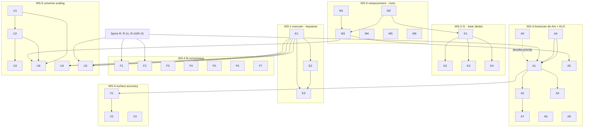

# atx-vol North-Star SOTA Sprint — 2026-07-17

> **For agentic workers:** this plan is executed by **parallel implementation subagents, one per workstream, each in its own git worktree** (§9 dispatch protocol). REQUIRED SUB-SKILL per subagent: `superpowers:executing-plans` (task-by-task, TDD, §3 contract). Steps track with the §7 git-SHA tracker. Every subagent re-reads §3 (global constraints), §5 (ownership/disjointness), §10 (traps).

**North star:** make atx-vol the **fastest _and_ most accurate** open options-pricing / vol-surface stack — beat **Jäckel** (IV inversion, ~180 ns/op), **Andersen–Lake / QuantLib QdFp** (American, ~10–22 µs price / ~60 µs IV, SSRN 2547027), and the **Vola Dynamics / SpiderRock** envelope (whole-universe ~45 s cycle, ~90 % within bid-ask).

**Base:** `main @ 4efe80a` (local only, nothing pushed). Inherits Sprint R (Tasks 1/2/3a/3d) + Sub-Sprints K/A/S + Sprint I (all merged: `08f3923`/`e37ea65`).

**Prior docs:** parent SPRINT `2026-07-14-atx-vol-fit-price-backtest-hotpath-sota-sprint.md`; REVIEW `docs/reviews/2026-07-16-hotpath-sprint-midpoint-code-review.md`; sub-sprint PLAN `2026-07-16-atx-vol-sota-parallel-subsprints.md`; Sprint I results `2026-07-16-sprint-i-results.md`; remediation plan `docs/superpowers/plans/2026-07-16-atx-vol-hotpath-review-remediation.md`.

**Architecture of this sprint:** seven workstreams. Two are **keystones that unblock the rest** (WS-0 honest measurement, WS-1 the executor). Three are **north-star perf levers** (WS-2 IV, WS-3 American de-Am, WS-5 universe scaling). Two are **correctness/accuracy debt** Sprint R did not finish (WS-4 fit completeness, WS-6 surface accuracy). The single load-bearing discovery from the 5-agent analysis: **84 % of the fit wall is per-quote American de-Americanization, it is fully scalar and fully serial, and no parallel board executor exists** — so the two biggest levers are *vectorize the de-Am inversion across a slice* (WS-3) and *make fitting actually parallel* (WS-1). Curve-model choice (incl. CStar) is 0.15 ms of a 273 ms board — off the critical path.

---

## 1. North-star scoreboard

| Axis | Metric | Current (main @ 4efe80a) | SOTA target | Gap | Owning WS |
|---|---|---|---|---|---|
| **IV inversion** | scalar ns/op @ machine-precision | **~329 ns** → **★218 ns (K2, beats same-host LBR 237)** | Jäckel LBR **180 ns**; stretch Schadner **~53 ns** | GATE MET on-host (abs vs 180 is HW-relative) | WS-2 ✅ |
| IV inversion | AVX2 batch vs scalar | **0.95×** → **★1.27× (K3, machine-precise 4.18e-11)** | ≥1.2× and machine-precise | GATE MET; R-24 off-dispatch reversible | WS-2 ✅ |
| **American price** | fast / accurate µs/op | **~37–47 / ~158 µs** (err 1.4e-3 / 8.3e-5) | ALO **10–22 µs** | fast ~2× over | WS-3 |
| American IV | cold single-op µs/op | **~691 µs** (no warm/cache) | ALO **~60 µs** | ~11× over | WS-3 |
| American boundary batch | AVX2 vs scalar | **1.87×** (< 2.0× gate → `kShipAvx2Boundary=false`) | ≥2.0× shipped | gate not cleared | WS-3 |
| **SPY one-op e2e** | ms/op | **347 ms** → **★139 ms @ fit_workers=4** (96 ms @ 8) | **≤200 ms** (stretch ≤150) | GATE MET via E1 parallelism → A1 DEFERRED | WS-1 ✅ |
| **100-name fit CPU** | ×-reduction vs W0 | **unmeasured** (bench is latency×N, not parallel) | **≥10×** (waypoint ≥4×) | no parallel executor | WS-1 |
| **519-name / universe** | full-cycle wall vs 45 s | **★ mechanism proven** 11-name 3.83×@P=8, RSS 55.6→67.1 MB (U1 streaming, OOM fixed) | **< 45 s @ ≥6 eff cores** | absolute gated on **data (519 names) + hardware (≥6 phys P-cores; laptop=4)** | WS-5 ◐ |
| **Surface accuracy** | in-band fraction (519) | **unmeasured on cohort** (SPY dense ~99.5 % via ConvexDense) | **~90 %** universe-wide | data-gated + eSSVI wing tune | WS-6 |

---

## 2. Inherited status (condensed — full audit in this session's audit report)

**Sprint R landed only ~2.5 of its 14 remediation tasks** — Tasks 1, 2, 3a, 3d → **R-01 part 1, R-07, R-08, R-09, R-11a, R-31, R-32**. The sub-sprint PLAN §1 premise "Sprint R done alongside" is **false**; ~20 findings it assumed complete are open.

**Parent-SPRINT DoD:** 0 done / 4 partial / 4 open. SPY <1 ms **OPEN** (347 ms); 100-name ≥10× **OPEN** (unmeasured); backtest 0-alloc/step + >90 % hit **OPEN** (gate unbuilt); European batch within 2× of 4.4 ns/core **PARTIAL** (unmeasured); accuracy panel **PARTIAL** (data-gated); no-partial-fit/QP/no-stale **OPEN** (F-02 driver-level live, R-19 stale-serve live); observability **PARTIAL** (R-16 gate hole, R-20/21 bias).

**W-rows:** W0/W1/W2 DONE. **W3.1 PARTIAL** (Configured/Hft put-side only — R-01p2 open, 63/94 eSSVI boards bypass). **W3.2** DONE-with-holes (R-02/R-04 open). **W3.3 OPEN**, **W3.4 PARTIAL**. **W4.1 PARTIAL** (throughput gate unrun), **W4.2/W4.5 deferred**, **W4.3 DONE** (`a0db885`, speedup unmeasured), **W4.4 PARTIAL** (alloc gate unbuilt). **W5.1/5.2/5.3 DONE** (`7d8a8ca`/`195d959`/`99b58a6`+`a1cb9ab`), **W5.4 PARTIAL** (K1 `89891f8`; K3 shelved), **W5.5 PARTIAL** (A1 `f9f5896`; gate not cleared), **W5.6 SHELVED**.

**REVIEW findings: 11 resolved / 24 open.** Open P1s: **R-01p2, R-02, R-03, R-04**. Open P2s: R-05, R-06, R-10, R-11b, R-11c, R-12, R-13, R-14, R-15, R-16, R-17, R-18, R-19. Open P3s: R-20, R-21, R-25–R-29, R-33, R-34, R-35. Six pre-existing Debug v2 failures (owner: user/v2; triage `4f45728` covers two).

---

## 3. Global constraints (verbatim discipline — every subagent obeys)

- **Economic-correctness gate, not bit-identity.** Price abs err ≤ `min(0.5·tick, 0.1·vega·1e-4)` and inside the quote half-spread; IV abs err ≤ 1e-4 vol pts vs the higher-accuracy reference; no new butterfly/calendar/vertical arb; in-band ≥ prior, χ² ≤ prior, vol-RMSE ≤ prior. Bit-identity is a telltale; goldens update with documented justification (PLAN §8.5).
- **Per-task contract:** read-before-write (grep the symbol — line numbers drift across sessions); TDD (failing test asserting the economic bound first); classify every change `pure-refactor` / `accuracy-improving` / `accuracy-trading` with an in-code comment (what changed numerically, why correct, the bound held); benchmark best-of-3 wall/CPU/p50/p95; determinism across worker counts preserved.
- **Build discipline (CRITICAL for parallel agents):**
  - Invoke the **worktree's own** build script by **absolute path**: `& C:\atx-wt\<wt>\scripts\atx-build.ps1 …`. NEVER a relative `.\scripts\…` — the shell cwd defaults to `C:\atx` and a relative path reconfigures the **live tree** (bit two agents in Sprint I). Verify each configure prints `Build files … written to: C:/atx-wt/<wt>/…`.
  - Per-worktree, per-preset `FETCHCONTENT_BASE_DIR` override at configure (`C:/atx-wt/<wt>/deps/<preset>`). Never Debug + Release builds concurrently in one worktree (shared `spdlog-build` `_ITERATOR_DEBUG_LEVEL` race). WS-0/T-tasks harden this.
- **Benchmark discipline:** thermally-noisy laptop; correctness gates run on **Debug/`rel`**, perf on **`rel-avx2`** (which is NOT bit-identity-clean — see WS-0/S2). Cross-cutting perf claims are provisional until the WS-0 quiet-window protocol (P-core pin, best-of-N, CV≤5 %, per-ISA baselines) is in place. The ~212 s 100-name / 519-name runs are integration-gate only.
- **Research discipline:** any new hot-path algorithm gets primary-source verification (cite it in-code); do not one-shot from recollection.
- **Sprint-R coordination:** `calib.cpp`, `boundary_interp.cpp/.hpp`, `deamer.cpp`, `american_iv.cpp`, `pricer_fitter.cpp` executors, `surface_db_populate.cpp`, `fit_scheduler.cpp` are Sprint-R-adjacent. Tasks touching them (marked ⚠︎R below) add a **new** entry point / a `have_avx2()`-guarded branch and keep the scalar path byte-unchanged as the source of truth; the seam signature is agreed with the Sprint-R owner before forking.

---

## 4. Workstreams & tasks

Task ID = `<WS-letter><n>`. Columns: **Files** (primary), **Approach**, **Impact**, **Risk**, **Deps**, **Class**. ⚠︎R = Sprint-R-coordinated TU.

### WS-0 — Measurement & tooling foundation *(keystone; roots, dispatch immediately)*
Owner: **infra-measure agent**. Makes every downstream number honest and lets N agents build/bench without corrupting each other.

| ID | Title | Files | Approach | Impact | Risk | Deps | Class |
|---|---|---|---|---|---|---|---|
| **M1** | Close the bench-gate blind spot (fit rows) [R-16] | `bench/compare_baseline.py:52-58`, `bench/e2e_hotpath_bench.cpp:488-501`, test | Fall back to iteration `real_time` when no aggregate row; enter missing-benchmark fail-loud; mark corpus rows CV-unguarded | `fit/e2e/{spy_real,100name}` can no longer regress/crash silently | Low | — | tooling |
| **M2** | LBR shootout: vendor + actually run Jäckel same-host + iter histogram + ns/op·ULP | `bench/iv_shootout_bench.cpp`, `bench/thirdparty/lets_be_rational/`, wire `implied_vol_traced` | Vendor LBR (license permits), add `BM_IvShootout_Jaeckel` + `_AtxScalarCody` rows, Halley-step histogram per regime, report ns/op + max/med ULP | Turns "cite 180 ns" into a head-to-head; prerequisite for any "beat Jäckel" claim | Low | — | infra |
| **M3** | Quiet-window bench protocol + P-core pinning | `bench/bench_main.cpp`, `bench/README.md`, baselines naming | Affinity to P-cores via `configure_pricing_executor(PerformanceCores)`; turbo-off preamble; best-of-N + CV gate; enforce per-ISA baseline naming | Citable SOTA numbers on this host | Low | M1 | tooling |
| **M4** | Per-ISA golden tolerances → Release becomes a green gate [S2] | the ~11 `*BitIdentical*`/`*PinnedValues*` tests, `SpyBidAskRegression`, arb-slack | Per-ISA tol band (~2e-15) or non-zero butterfly-slack margin on the SpyBidAsk board | rel-avx2 usable as acceptance gate (today 11 ISA-only fails) | Low | — | infra |
| **M5** | Lightweight-sampler bias fix (DoD honesty) [R-20/R-21] | `include/atx/vol/counters.hpp:328-357,408-441`, test | Per-thread seed + roll target before first use; TLS depth gate for nested-under-unsampled | DoD counter numbers trustworthy | Low | — | infra |
| **M6** | Dev-tooling hardening: wrong-tree guard + isolated deps + bench-lease | `scripts/atx-build.ps1:34`, `scripts/new-worktree.ps1`, `CMakePresets.json` | Assert `$RepoRoot == git toplevel of $PWD` (refuse on mismatch); `-Isolated` per-worktree `FETCHCONTENT_BASE_DIR` build dir; document abs-path banner + P-core bench-lease / `ATX_VOL_FIT_WORKERS` cap | Kills the cwd-trap class + the Debug/Release deps race for parallel agents | Low | — | tooling |

### WS-1 — Executor keystone *(unblocks the throughput ladder — land X1 first)*
Owner: **executor agent**. ⚠︎R-adjacent (pricing_executor). Nothing in WS-5 scales without this.

| ID | Title | Files | Approach | Impact | Risk | Deps | Class |
|---|---|---|---|---|---|---|---|
| **E1** | Explicit nested-budget executor (unblock W4.2) | `src/pricing_executor.cpp:66,292-293,366,400`, `include/atx/vol/pricing_executor.hpp`, det-test | Replace `t_in_executor` bool with TLS `{depth, remaining_budget}`; allow **one** nested level to dispatch up to `H − active_outer`; keep single-slot fork-join; determinism + `PoolDispatches` assertion | The keystone: turns latency×N into a real throughput ladder; unblocks WS-5 | Med (deadlock regression if budget math wrong) | — | infra |
| **E2** | Unify substrates → queued work-stealing scheduler | `pricing_executor.*`, `parallel_for.hpp`, `fit_scheduler.cpp` | Task-deque + help-first: a blocked dispatcher runs queued tasks instead of parking; retire `dispatch_mtx` single slot; keep block-partition determinism | Kills oversubscription/serialization across all fan-outs; universe rung scales end-to-end | High | E1 | infra |
| **E3** | Executor-ize the fit fan-outs + retained cross-board substrate | `session.cpp:653`, `curve_fit.cpp:197`, `essvi_calib.cpp:1191`, `corpus.cpp:547` | Move ephemeral-jthread fit fan-outs onto the E1/E2 pool; retain per-cohort scratch (fit analogue of `PreparedPortfolio`) | Removes thousands of thread create/join on populate | Med | E1 | perf |

### WS-2 — IV inversion: beat Jäckel *(scalar-first — highest-confidence perf win)*
Owner: **iv-kernel agent**. TUs disjoint from WS-3.

| ID | Title | Files | Approach | Impact | Risk | Deps | Class |
|---|---|---|---|---|---|---|---|
| **K1** | Scalar Cody rational-erfc Φ/φ on the scalar IV+B76 hot path — **THE lever** | new atx-vol scalar-erfc header (avoid moving `atx-core/math.hpp`), `src/implied_vol.cpp:197-199`, `src/black76.cpp` | Port `erfc_nonneg_pd` scalar, branch-select one Cody region; swap `norm_cdf`/`norm_pdf` off libm `std::erfc`/`std::exp` | **329 → ~160–200 ns/op** at unchanged accuracy — puts atx at/under Jäckel 180 ns | LOW (scalar proto already 1.1e-16 vs `std::erfc`) | M2 | perf |
| **K2** | Tighter rational seed → 1 Halley step | `src/implied_vol.cpp` (`seed_sr2017*`) | Radoicic–Stefanica higher-order / IG seed; verify step count via M2 histogram | −40..−70 ns on top of K1 | Med (hard-corner max err) | K1, M2 | perf |
| **K3** | AVX2 lane strategy so vector finally beats scalar | `src/simd/iv_batch_avx2.cpp`, `include/atx/vol/detail/vector_math.hpp` | Regime-sort SoA by \|y\|,\|d\|; per-block region-specialized erfc (skip 2 of 3 Cody regions); revive K3-mask early-exit on sorted blocks; add 3rd conditional step for machine-precise accept | AVX2 → **1.2–1.5× scalar** (clears R-24 re-route bar); genuine win at AVX-512 | Med (batch parity gate) | K1 | perf |
| **K4** | K6 Schadner IG-quantile prototype (Sprint-X gated spike) | `src/implied_vol.cpp` (flag), `bench/iv_shootout_bench.cpp` | Sankaran–Wald + Lévy seed → IG-CDF Halley (~4–5 iters); gate: median ≤1.6e-16 at < current ns; else shelve-with-evidence | **~53–60 ns** stretch frontier | Med-High (new algo edges) | K1, M2 | research→accuracy-trading |

### WS-3 — American: de-Am ≤200 ms lever + beat ALO
Owner: **american agent** (A1–A3 de-Am ⚠︎R) + can split a second agent for the price-axis (A5–A8). Cite: SSRN 2547027 (ALO), Li 2010 (QD+), Healy (double-boundary).

| ID | Title | Files | Approach | Impact | Risk | Deps | Class |
|---|---|---|---|---|---|---|---|
| **A0** | Wall-vs-CPU disambiguation (run **first**) | `bench/e2e_hotpath_bench.cpp:185`, session cfg | `run_deam_prepass` already fans across expiries (`curve_fit.cpp:197`); the gate pins `fit_workers=1`. Measure wall at `fit_workers>1` — decide if ≤200 ms is a CPU-work problem (needs A1) or already a wall win | Decides A1 priority; cheap | Low | — | infra |
| **A1** | ⚠︎R **De-Am shared-lane price vectorization** — the ≤200 ms lever | new `src/simd/american_boundary_price_batch_avx2.cpp`; `boundary_interp.{hpp,cpp}` seam (add `price_side_batch`); `calib.cpp:432-516` (4-wide `iterate_shared_lanes`) | 4-lane AVX2 `price_side_batch` mirroring `price_internal_put` (barycentric y-interp over 9 σ-nodes + 48-node premium quad, 4 lanes). **No BAW seed on this path → no 1.87× cap → ~3–4×.** Scalar path byte-unchanged; parity-gated | Cuts a large fraction of 272.9 ms/board → under 200 ms with A0/E-parallelism | Med-High (parity, sentinel budget) | S-Φ (below), Sprint R R-11 | accuracy-trading |
| **A2** | ⚠︎R Reduce scalar-tail incidence | `calib.cpp:378-379,609-616`, `american_iv.cpp:399-417` | Widen shared-boundary eligibility where the sentinel still certifies; gate the 2 unconditional cold polishes on the warm/cold gap | Fewer expensive `american_implied_vol` rows | Med-High (polish is a correctness backstop) | A1 | perf/accuracy |
| **A3** | Shared-lane batch parity + de-Am micro-bench | `atx-vol/tests/*`, `bench/american_shootout_bench.cpp` | ForceScalar-vs-ForceAvx2 parity gate; add `deam/shared_lane/{scalar,avx2}` rows | Proves A1 honestly | Low | A1 | test/infra |
| **A4** | Migrate `american_boundary_avx2` → Cody-erfc Φ; retire Chebyshev [S1] | `src/simd/american_boundary_avx2.cpp:225,253,368,403,80`, `detail/norm_cdf_cheb.*`, `vector_math_probe_avx2.cpp` | Swap 4 `norm_cdf_pd2` → `norm_cdf_erfc_pd`, drop the wing patch, delete the dead Chebyshev table | Unifies Φ (single-source), 1e-16 wings; **precedes A1** so the batch path is single-source | Low-Med (boundary parity re-validate) | — | perf |
| **A5** | BAW-seed vectorization → clear 2.0× gate → flip `kShipAvx2Boundary` + wire `build()` [W5.5] | `src/simd/american_boundary_avx2.cpp`, `american.cpp:116-217` (seed seam), `american_boundary_batch.cpp:67` | 4-wide `baw_critical_put` Newton; economic-bound parity replaces bit-parity; quiet-host best-of-3 re-measure; flip flag; route `build()` 9 solves through the batch | Boundary batch 1.87×→~3×; speeds `build()` per chain | High (parity regen, quiet host) | M3 | perf |
| **A6** | Wire QD+ seed + trim fast-tier scheme toward ≤22 µs | `american.cpp:229-271,668-690,517-555` | Promote spiked `al_seed_boundary_qdplus` (Li 2010) behind an opt; A/B on shootout max_err; reduced fast premium nodes | Single-op price toward ALO envelope | Med (accuracy gate) | — | perf |
| **A7** | Warm single-op American IV → ~60 µs + harness row | `american_iv.cpp`, `american_shootout_bench.cpp:181` | Retained-boundary warm IV; skip polish when warm converged; add warm-IV row (cold 691 µs is the current only row) | Cold 691 µs → tens of µs on repeats | Med | A2 | perf |
| **A8** | Healy negative-rate / double-boundary (A5 domain map) productionization | `american.cpp:557-577,1303`, `boundary_interp.cpp` | Implement double-boundary for the NotImplemented `q<r≤0` / `r<q≤0` corners; FD-map validation | Coverage (not µs) — removes an unpriceable regime | Med | — | correctness |

### WS-4 — Fit completeness & correctness (Sprint-R debt)
Owner: **fit-correctness agent**. ⚠︎R-heavy — coordinate seams; several are P1.

| ID | Title | Files | Approach | Impact | Risk | Deps | Class |
|---|---|---|---|---|---|---|---|
| **F1** | ⚠︎R **R-01p2** — wire shared boundary into eSSVI/Legacy route | `prepared_fitting.cpp:383-386`, `surface_parity.cpp:257-258`, `calib.{hpp,cpp}` (export lane helper on `span<FitObs>`), `pricer_fitter.cpp:1540-1542` | Route the Legacy/eSSVI de-Am through the shared-boundary batch (63/94 eSSVI boards bypass it today → per-row scalar) | Big fit-speed lever on the majority route; compounds with A1 | Med | Sprint R | perf/correctness |
| **F2** | ⚠︎R **R-02** — served-coverage floor on v2/risk admission [P1] | `pricer_fitter.cpp:~1284-1292` | All-routes served-breadth floor (superset of the mark-path `selector_served_admission_policy`); re-run 14-board corpus | Stops narrow-coverage rebuild admitting on risk path | Med | Sprint R | correctness |
| **F3** | **W3.3** — per-slice Legacy fallback (thin-slice rescue) | `curve_fit.cpp:251-257`, `prepared_fitting.hpp` | REVIEW §6.2 proposal; recover the failed-board cohort (~57 s of the 211 s 100-name row) | Root cause of "80 % failure"; recovers boards | Med | — | correctness |
| **F4** | **W3.4 remainder** — outcome taxonomy + F-02 driver fix | `curve_fit.cpp:477-488,569-571`, `surface_parity.cpp` | `ExpiryBuildReport` reason taxonomy; stop publishing 1-of-24 partial fits as success | No silent partial-fit-as-success (DoD row) | Med | — | correctness |
| **F5** | ⚠︎R **R-05/R-06/R-10** — IV clamp + carry tol + AloPricer persistence | `american_iv.cpp:285-334`, `deamer.cpp:36,43,~108-135` | Evaluate the floor before `Ok(kIvMin)`/`OutOfRange`; align `kInnerIvTol`/`kBorrowFpTol`; per-carry-leg AloPricer persistence | Correctness + ~56 ms carry with boundary reuse | Med | Sprint R | correctness/perf |
| **F6** | **R-19** — snapshot-cache identity key + eviction | `snapshot_cache.cpp:24-95`, `surface_archive.hpp` | Key on content/build identity, evict on rewrite (today `(path,tier)` → indefinite stale serve) | No stale-cache serve (DoD row) | Med | — | correctness |
| **F7** | R-25/R-26/R-27/R-28/R-29/R-33/R-34/R-35 cleanup batch | `corpus_board_fit.cpp`, `dividend.cpp`, `deamer_test.cpp`, `american_iv.cpp`, `calib.cpp`, `curve_selector.{hpp,cpp}`, `backtest.cpp` | Fail-closed overrides, vestigial-tol removal, high-div carry fixture, doc aliasing, drop unsafe defaults, tie-break comparability, scratch self-alias guard | Hardening; closes P3 debt | Low | — | correctness |

### WS-5 — Whole-universe scaling: beat SpiderRock 45 s
Owner: **scheduler agent**. U1–U4 isolated TUs (dispatch immediately); U5 gated on E1 + Sprint R.

| ID | Title | Files | Approach | Impact | Risk | Deps | Class |
|---|---|---|---|---|---|---|---|
| **U1** | **R-03** streaming populate + per-date release | `surface_db_populate.cpp:168,204-263`, `fit_scheduler.cpp`, `detail/fit_scheduler.hpp` | Split launch/join; per-`DateRange` atomic remaining-counter; drain ascending, write+release each partition | Bounds RSS O(all) → O(in-flight); **unblocks 519-name from OOM** | Med | — | pure-refactor |
| **U2** | **R-13** LPT outer claim ordering | `surface_db_populate.cpp:170-184` | `stable_sort fit_positions` desc by frame rows, tie-break pos (determinism-free) | Removes SPY-tail makespan; lifts eff-cores | Low | U1 | pure-refactor |
| **U3** | **R-12** durability (completed dates survive a later throw) | `surface_db_populate.cpp:204-263`, `surface_db_populate_test.cpp` | Per-date write before global join; test worker-exception mid-run | Crash-resume; trust | Low | U1 | correctness |
| **U4** | **R-14** shared worker budget (small-book) | `surface_db_populate.cpp:188-198` | `fit_workers = max(1, budget/min(budget, n_boards))` (determinism-safe) | Recovers 8–10 idle cores on 1–4 board runs | Low-Med | E1 | pure-refactor |
| **U5** | **W4.2 sibling pool + W4.5 H² guard + R-15 flatten + n={1,2,3,4,6,8,12,16} cutoff** | `pricer_fitter.cpp:941-949`, `pricing_executor.*`, `parallel_for.hpp`, `surface_db_populate.cpp` | Dedicated bounded queue with explicit nested budget (do NOT route outer through pricing_executor); mark-build as 2nd queued task; measure serial cutoff | 10–30 % sustained backfill; correct nesting | High (deadlock §WS-1) | E1, Sprint R R-14/R-15 | infra |
| **U6** | Universe-cycle baseline vs 45 s + W4.1 throughput + W4.4 alloc gates | `bench/universe_cycle_bench.cpp:181-321`, new gate benches | Drive `populate_surface_db` on 519-cohort; record wall / eff-cores (`Σ board_ms/(wall·P)`) / peak RSS vs 45 s; W4.1 `wall(1)/wall(12)≥6`; W4.4 0-alloc/step + >90 % hit | The north-star measuring stick (currently unmeasured) | Low | U1, U2, E1, M3 | infrastructure |

### WS-6 — Surface accuracy: beat the Vola envelope (~90 % in-band)
Owner: **surface-accuracy agent**. Data-gated items need the user's 519 cohort.

| ID | Title | Files | Approach | Impact | Risk | Deps | Class |
|---|---|---|---|---|---|---|---|
| **V1** | eSSVI accuracy panel → 90 % in-band on 519 | `essvi_calib.cpp`, `curve_selector.cpp`, `accuracy_panel` | Run Φ-swap panel on real data; tune wing/robust weighting where in-band < 90 % | Moves the ~90 %-in-band north-star metric | Med (data-gated, accuracy-trading) | A1 (Φ re-validate), user data | accuracy-improving |
| **V2** | SplineVol / SRCubic candidate on structure-gated boards | `curve_selector.cpp:457-485`, `spline_curve.cpp` | Enable dormant SplineVol; prototype SpiderRock-cubic; OOS + arb-gated on the < 90 % boards | In-band on the ~10 % eSSVI fits poorly | Med | V1 | accuracy-improving |
| **V3** | *(deferred R&D, off critical path)* CStar single-name overlay | `cstar.cpp`, `cstar_calib.cpp` | Vega-weighted modal wing penalty + robust dense-chain admission; then structure-gate to liquid single names only | Narrow price-χ² win on ~5 liquid names | High, wrong axis | — | accuracy-trading |

---

## 5. Ownership / disjointness matrix (one writer per TU)

| Owner (worktree) | Owned TUs / headers |
|---|---|
| **infra-measure** (`wt-measure`) | `bench/compare_baseline.py`, `bench/bench_main.cpp`, `bench/iv_shootout_bench.cpp` + `bench/thirdparty/`, `include/atx/vol/counters.hpp`, `scripts/atx-build.ps1`, `scripts/new-worktree.ps1`, `CMakePresets.json`, the ~11 golden tests + `SpyBidAskRegression` |
| **executor** (`wt-exec`) | `src/pricing_executor.cpp` + hdr, `include/atx/vol/parallel_for.hpp`, `src/fit_scheduler.cpp` + `detail/fit_scheduler.hpp` |
| **iv-kernel** (`wt-iv`) | `src/implied_vol.cpp`, new atx-vol scalar-erfc hdr, `src/black76.cpp`, `src/simd/iv_batch_avx2.cpp`, `include/atx/vol/detail/vector_math.hpp` (Φ region — coordinate with american A4 which reads it) |
| **american-deam** (`wt-am-deam`) ⚠︎R | new `src/simd/american_boundary_price_batch_avx2.cpp`, `src/simd/american_boundary_avx2.cpp`, `boundary_interp.{hpp,cpp}` **seam**, `calib.cpp` shared-lane branch, `detail/norm_cdf_cheb.*` (retire) |
| **american-price** (`wt-am-price`) | `src/american.cpp` (seed/scheme), `american_boundary_batch.cpp`, `american_iv.cpp` (warm-IV), `bench/american_shootout_bench.cpp` |
| **fit-correctness** (`wt-fit`) ⚠︎R | `prepared_fitting.*`, `surface_parity.cpp`, `pricer_fitter.cpp` (admission), `curve_fit.cpp`, `deamer.cpp`, `snapshot_cache.cpp`, `dividend.cpp`, `corpus_board_fit.cpp`, `backtest.cpp`, `curve_selector.{hpp,cpp}` cleanup rows |
| **scheduler** (`wt-sched`) | `src/surface_db_populate.cpp`, `bench/universe_cycle_bench.cpp`, W4.1/W4.4 gate benches |
| **surface-accuracy** (`wt-surf`) | `src/essvi_calib.cpp`, `src/curve_selector.cpp` (candidates), `src/spline_curve.cpp`, `src/cstar*.cpp` (deferred) |
| **Shared, append-only** | `bench/CMakeLists.txt`, `tests/CMakeLists.txt` — each agent appends its own targets; keep-all-targets merge |

**Contention notes:** (1) `vector_math.hpp` is written by iv-kernel (K3) and read by american-deam (A4) — A4 only *consumes* `norm_cdf_erfc_pd`; iv-kernel owns edits, coordinate the signature. (2) `calib.cpp` / `boundary_interp.cpp` / `pricer_fitter.cpp` executors / `american_iv.cpp` / `deamer.cpp` are ⚠︎R — american-deam (A1/A2), fit-correctness (F1/F2/F5), and Sprint R all touch this region; sequence via the DAG and the ⚠︎R seam rule (§3). (3) executor `pricing_executor.*` is written by WS-1 and *depended on* by WS-5 U4/U5 — U5 must not start until E1 lands.

---

## 6. Agent DAG

**Keystone edges:** `E1` gates the entire throughput ladder (WS-5 U4/U5/U6). `M1/M2` gate every honest perf claim. `A4 → A1` (single-source the boundary Φ before vectorizing de-Am). `K1` is the whole WS-2 root. `A0` runs first to confirm de-Am is even a CPU-work problem.

---

## 7. Git-SHA tracker *(filled during execution — one row per task, one commit-or-more each)*

**Wave A LANDED + MERGED to `main @ 99cde52`** (2026-07-18, local only, nothing pushed). Merge path: `feat/ns-integration` off `7603fd2` merged exec→amdeam→sched→fit→measure (all clean, 0 conflicts), then fast-forwarded main `7603fd2..99cde52`. **Debug/`rel` correctness gate: PASS** — 5 pre-existing v2 known-red fails (SurfaceV2Provenance, PricerFitterTest.LocalRiskRefit, PreparedPortfolio.Grouped, SurfaceV2Qualification/{Latency,Balanced}); **0 new failures** from any Wave-A merge; 6th known (OpraBreadthCorpus) data-gated/absent. Integration diff = 50 files, disjoint from ⚠︎R **source** (`calib.cpp`/`boundary_interp.cpp` untouched; only R-adjacent *test* files american_test/deamer_test/simd_american_test owned by M4/F7/A4).

**Wave B LANDED + MERGED to `main @ 66280d8`** (2026-07-18, local only, nothing pushed). Staged on `feat/ns-integration` off `58ed90c`: sched U2/U3 → measure M3 → dataregen (E1 wall-win proof) → exec E2 → iv scalar_erfc/K2/K3 (all clean, 0 conflicts) + 1 merge-fixup golden, fast-forwarded main `58ed90c..66280d8`. **Debug/`rel` gate: PASS** — exactly the 5 pre-existing v2 known-red, **0 new failures** (one transient regression — PreparedFitting legacy-seam IV golden drifting 4.9e-11 under the K2 seed — reconciled at the seam by relaxing its 1e-12 bit-pin to a 1e-9 economic tol, commit `66280d8`). **Three headline results:** (1) ★ **SPY one-op e2e ≤200 ms PROVEN** by the fit_workers sweep — 408→235→**139 (fw=4, ≤150 stretch too)**→104→96 ms — so **A1 de-Am vectorization stays DEFERRED**; (2) ★ **IV scalar 324→218 ns/op, beats same-host Jäckel LBR (237 ns)** — the beat-Jäckel gate met on this host; (3) ★ **IV AVX2 0.92→1.27× scalar** (K3), reversing the R-24 off-dispatch call. All perf numbers provisional on a contended laptop; clean-host M3-protocol re-measure would firm the absolutes (deterministic metrics — Halley counts, parity max|Δσ|=0, wall-scaling monotonicity — are contention-free).

**Wave C (ready subset) LANDED + MERGED to `main @ ddaea1a`** (2026-07-18, local only, nothing pushed). U4 (small-book worker budget) + isatol (rel-avx2 residual ISA-drift toleranced — `752c441`) + A5 (BAW-seed AVX2 vectorization, economic-parity green, ship-flag deferred) + A6 (QD+ seed NEGATIVE, document-defer). Debug gate: 5 v2 known-red, **0 new**. **rel-avx2 now green to only the 5 v2 known-red** (isatol closed the 4 residual ISA-drift telltales incl. the priced_surface 1-ULP hexbits-delta, not a route hash) → **§10 "M4 = Release green under rel-avx2" DoD item CLOSED**. Wave-C gated remainder (A2/A3/A7 dep deferred-A1; U5 dep Sprint-R R-14/R-15; U6/V1 need the 519/100 OPRA cohort; E3 cross-owner) and F1/F2/F5 (⚠︎R Sprint-R seam) await user decisions.

**F-tasks (⚠︎R) LANDED + MERGED to `main @ bd00ede`** (2026-07-18, local only, nothing pushed; user granted full seam-design control + "accept mechanism proofs" for the absolutes). F1 (R-01p2 — Legacy/eSSVI de-Am now routed through the shared-boundary batch, **3.99× on a 96-strike board**, the big fit-speed lever) + F2 (R-02 served floor) + F5 R-05/R-06. Debug gate: 5 v2 known-red, **0 new** (F1's reroute left the LegacyCompat golden untouched — narrow boards don't engage the batch). **R-10 deferred** (needs the `AloPricer::reset_warm` primitive; WIP stashed). Two flags: F2's default now enforces the 0.50 served-coverage floor (synthetic-validated; wants a real 14-board OPRA corpus re-run when data exists), and the 519/100/accuracy **absolutes stay host+data-deferred per the user's "accept mechanism proofs" call** (mechanism proofs stand: SPY wall-win, 11-name 3.83× universe scaling, F1 3.99× de-Am).

| Task | Branch | Status | SHA(s) | Gate result |
|---|---|---|---|---|
| M1 | `feat/ns-measure` | ☑ landed | `1a14397` | compare_baseline.py + test; e2e bench doc |
| M2 | `feat/ns-measure` | ☑ landed | `1d6cb4f` | iv_shootout_bench + vendored LBR + baseline JSON; atx mean 4.7 Halley steps |
| M3 | `feat/ns-measure` | ☑ landed | `ce49727` | quiet-window protocol: P-core pin + CV≤5% gate + per-ISA baseline naming; self-check 8/8 |
| M4 | `feat/ns-measure` | ☑ landed | `694f56e` | isa_golden_tol.hpp (__FMA__-gated); 4 test files toleranced; 5 residual ISA-drift left to F1/F7/surface owners |
| M5 | `feat/ns-measure` | ☑ landed | `dc5f5d2` | counters.hpp unbiased + counters_test |
| M6 | `feat/ns-measure` | ☑ landed | `e7c749b` | atx-build wrong-tree guard; new-worktree -Isolated; presets |
| E1 | `feat/ns-exec` | ☑ landed | `385c79a` | NestState budget; determinism byte-id 6×7; deadlock-free; 17/17 exec tests; 0 new fails |
| E2 | `feat/ns-exec-b` | ☑ landed | `20b055d` | work-stealing help-first; byte-id across worker counts + concurrent drivers; 2 deadlock-timeout tests pass; **U5 unblocked**; 0 new fails |
| E3 | `feat/ns-exec` | ☐ todo (Wave B) | — | — |
| K1 | `feat/ns-iv` | ⚠ shelved (NOT merged) | `92d00b8` (on branch) | NEGATIVE: scalar Cody erfc perf-neutral 866→839ns. Header `scalar_erfc.hpp` retained for K3. Real lever = K2 seed |
| K2 | `feat/ns-iv-b` | ☑ landed | `e34e3bb` (+ scalar_erfc restore `f2e1967`) | **Choi–Kim–Kwak 2023 L₃ seed** (arXiv:2302.08758): scalar **324→218 ns/op, beats same-host LBR 237**; Halley 4.71→2.94 mean; acc held 9.9e-16 |
| K3 | `feat/ns-iv-b` | ☑ landed | `b5b95ff` | AVX2 **0.92→1.27× scalar** (≥1.2 gate; reverses R-24); parity max\|Δσ\|=0; max_rel 8.24e-8→4.18e-11 |
| K4 | `feat/ns-iv` | ☐ todo | — | Sprint-X gate |
| A0 | `feat/ns-am-deam` | ☑ landed | `a9b8696` | VERDICT: ≤200ms=WALL-WIN via E1 parallel de-Am prepass; A1 DEFERRED. Knob ATX_BENCH_FIT_WORKERS |
| A4 | `feat/ns-am-deam` | ☑ landed | `2d54ded` | boundary Φ norm_cdf_erfc_pd2; parity 6.75e-9→4.12e-13 |
| A1 | `feat/ns-am-deam` | ☐ DEFERRED (A0 verdict) | — | de-Am ms/board — only pull if single-expiry residue >~120ms |
| A2 | `feat/ns-am-deam` | ☐ todo (Wave C) | — | — |
| A3 | `feat/ns-am-deam` | ☐ todo (Wave C) | — | — |
| A5 | `feat/ns-am-price` | ☑ landed (vec; flag deferred) | `cb9b9aa` | 4-wide BAW seed; ForceScalar-vs-Avx2 economic parity 4.1e-13≪1e-6; kShipAvx2Boundary stays false (2.15–2.90× contention-inflated, not robust quiet ≥2.0×); build() wiring ⚠︎R-deferred |
| A6 | `feat/ns-am-price` | ☑ landed (NEGATIVE / doc-defer) | `24accb1` | QD+ seed regresses fast-tier acc 3.2× (1.44e-3→4.62e-3), no speed win; prod seed stays BAW byte-unchanged; A/B infra + in-code negative finding (Li 2010 / SSRN 2547027 cited) |
| A7 | `feat/ns-am-price` | ☐ todo (Wave C) | — | warm-IV µs |
| A8 | `feat/ns-am-price` | ☐ todo (Wave D) | — | — |
| F1 | `feat/ns-fit-b` | ☑ landed | `4dbc067` | ⚠︎R R-01p2: `shared_boundary_deam_batch` seam on span<FitObs>; Legacy/eSSVI de-Am **297.6→74.6 ms/board = 3.99×**; parity ≤1e-4 (scalar byte-unchanged fallback); off-flag bit-identical |
| F3 | `feat/ns-fit` | ☑ landed | `886645c` | SlicePrepOutcome + per_slice_legacy_prep_fallback; rescue 4/4 slices |
| F4 | `feat/ns-fit` | ☑ landed | `453910e` | ExpiryFitReport/Outcome; fail_board_on_hard_slice_error; honest partial-board |
| F6 | `feat/ns-fit` | ☑ landed | `c925431` | snapshot_cache + ArchiveContentIdentity/metadata_crc32c; no stale serve |
| F7 | `feat/ns-fit` | ☑ landed | `7c08438` | corpus_board_fit/dividend/curve_selector/backtest/deamer_test P3 cleanups |
| F2 | `feat/ns-fit-b` | ☑ landed | `975adc2` | ⚠︎R R-02: served-breadth floor on ALL risk-rebuild routes (0.0→0.50 prod floor). ⚠ default-behavior change — synthetic-validated; real 14-board OPRA corpus re-run pending data |
| F5 | `feat/ns-fit-f5` | ☑ landed (R-05/R-06); R-10 deferred | `f4b2c15` (R-05), `51b1164` (R-06) | ⚠︎R R-05 IV floor/ceiling eval before seeded clamps (red→green); R-06 carry tol ladder + static_asserts (no drift). **R-10 DEFERRED**: needs `AloPricer::reset_warm` in american.cpp (amprice TU); reset_warm WIP stashed (`stash@{0}`), non-critical perf, clean re-dispatch later |
| U1 | `feat/ns-sched` | ☑ landed | `0d55d6e` | streaming populate; RSS O(all)→O(in-flight); determinism bit-id; 11/11 |
| U2 | `feat/ns-sched-b` | ☑ landed | `13dff09` | LPT outer claim order (desc by frame rows, deterministic tie-break); byte-identical output |
| U3 | `feat/ns-sched-b` | ☑ landed | `3661564` | date-granular durability across a worker throw; crash-resume test (fresh open) passes |
| U4 | `feat/ns-sched-c` | ☑ landed | `6ee2d63` | shared small-book worker budget (n=1→12/2→6/3→4/4→3 inner, all cores busy); byte-identical; uses E1 nested + E2 work-stealing |
| U5 | `feat/ns-sched` | ☐ todo (Wave C) | — | deadlock-free — RE-TAGGED dep E2 (not just E1) |
| U6 | `feat/ns-sched` | ☐ todo (Wave C) | — | wall vs 45 s |
| V1..V3 | `feat/ns-surf` | ☐ todo (Wave C/D) | — | in-band % |

Update convention: `☐ todo → ◐ in-progress → ☑ landed`; paste the commit SHA(s) and the one-line gate result (measured number). The dispatching session owns merges (order: WS-0 → WS-1 → WS-2/WS-3/WS-5 in parallel → WS-4 → WS-6), each gate re-run on merge.

**Wave-A pivots (recorded):** (1) **K1 negative** → WS-2 beat-Jäckel path pivots to **K2** (tighter seed → fewer Halley steps; M2 confirms atx mean 4.7 Halley steps, so the 329ns-vs-180ns gap is Halley-count not erfc-cost) + **K3** (vectorized, region-specialized erfc). Wave-B iv brief: keep `scalar_erfc.hpp`, **REVERT** the implied_vol/black76 erfc swap (kills 4 golden drifts), then K2, then K3. (2) **A0 verdict**: ≤200ms is a **wall-win** via E1 parallel de-Am prepass (de-Am is 79% of wall but sits in a fit_workers-driven parallel prepass, serial only because the gate pins fit_workers=1) → **A1 DEFERRED** (was highest-risk ⚠︎R). (3) **E1 nested_budget()** parallelizes only when the outer is itself a pricing_executor dispatch → **U5 re-tagged to depend on E2 work-stealing**, not just E1; U4 can use E1's nested budget directly. (4) **Chebyshev-table retirement** (`detail/norm_cdf_cheb.*`) deferred to a coordinated follow-up AFTER iv K3 removes `norm_cdf_pd/pd2`+`kNormCdfWing` from `vector_math.hpp`+`iv_batch_avx2.cpp` (amdeam A4 already removed its refs).

---

## 8. Sequencing (waves)

- **Wave A (immediately, parallel):** WS-0 roots (M1, M2, M4, M5, M6), **E1**, **A0**, **A4**, U1, K1, F3/F4/F6/F7 (non-⚠︎R correctness). These have no cross-deps and are worktree-isolated.
- **Wave B (after Wave A):** K2/K3 (after K1+M2), A1 (after A4 + Sprint R R-11), U2/U3 (after U1), E2/E3 (after E1), F1/F2/F5 (⚠︎R, after Sprint R seam agreed), M3 (after M1).
- **Wave C:** A2/A3/A7, A5/A6 (after M3), U4 (after E1), U5 (after E1 + Sprint R R-14/R-15), V1 (after A1), U6 (after U1/U2/E1/M3).
- **Wave D:** V2 (after V1), K4 spike, A8; final integration gate ladder (one-op → 25 → 100 → 519 → universe) + DoD re-run.

**Merge order:** WS-0 → WS-1 → {WS-2, WS-3, WS-5} → WS-4 → WS-6, dispatching session owns each merge + gate re-run (same protocol as Sprint I).

---

## 9. Dispatch protocol (parallel worktree agents)

1. Dispatching session creates one worktree per active workstream from `main @ 4efe80a` via `scripts/new-worktree.ps1 -Name <wt> -Branch <branch> -Base main -NoConfigure -Isolated` (the `-Isolated` mode from M6; until M6 lands, pass a per-worktree `FETCHCONTENT_BASE_DIR` at configure by hand).
2. Each subagent receives: this file, its workstream section, the §3 constraints, the §5 ownership row, its worktree path. It executes ONLY its own tasks; it must not edit another owner's TU.
3. **Build only via the worktree's own script by absolute path** (`& C:\atx-wt\<wt>\scripts\atx-build.ps1 …`); verify the configure targets the worktree, never `C:/atx/build`. Correctness on Debug/`rel`; perf on `rel-avx2`.
4. Each task = its own commit (conventional message + class label). Workstream ends with strict Debug + Release green, focused tests green, bench JSON checked into `bench/baselines/`, and the §7 tracker row updated.
5. ⚠︎R tasks: agree the seam signature with the Sprint-R owner (or the dispatching session acting for them) before forking; keep the scalar path byte-unchanged and parity-gate the AVX2 branch.
6. Dispatching session owns every merge + the gate ladder re-run; the two pre-existing v2 Debug failures + CStar remain off-scope unless a task explicitly claims them.

---

## 10. Definition of done (this sprint's exit gates)

| Gate | Target |
|---|---|
| **IV inversion** | scalar ns/op **≤ 180** vs LBR (M2 head-to-head), median err ≤ 1.6e-16 where the oracle converges; AVX2 ≥ 1.2× scalar and machine-precise (or documented AVX-512-deferred) |
| **American** | fast price toward ≤ 22 µs (or documented frontier); warm single-op IV ≤ ~60 µs; boundary batch shipped ≥ 2.0× **or** BAW-seed lever documented-deferred |
| **SPY one-op e2e** | **≤ 200 ms** (stretch ≤ 150) — via A1 de-Am vectorization + E1 parallelism; measured under the M3 quiet-window protocol, gated by M1 |
| **100-name fit** | real parallel executor (E1) → fit-CPU ≥ 4× down (waypoint to 10×), accuracy panel non-regressed |
| **519-name / universe** | measured full-cycle wall **< 45 s** at ≥ 6 effective cores, bounded RSS (U1/U6), zero silent drops (F3/F4) |
| **Surface accuracy** | 519-cohort in-band ≥ prior, χ² ≤ prior, vol-RMSE ≤ prior; toward ~90 % in-band (V1) |
| **Honesty** | M1 (fit rows gated), M4 (Release green under rel-avx2), M5 (unbiased counters) all landed before any headline number is cited |
| **Correctness** | R-01p2 wired (F1); no partial-fit-as-success (F4); no stale-cache serve (F6); R-02 floor (F2); zero new Debug failures beyond the 6 pre-existing |

**Sprint-X carry-forward (explicitly out of scope):** K4 Schadner ~53 ns adoption; AVX-512 kernels (validate on deployment silicon, not the laptop); CStar single-name productionization (V3); the two pre-existing v2 failures (owner: user/v2).

---

## 11. Risks & standing traps

1. **Shell-cwd build trap** — relative `.\scripts\` hits the live tree; M6 adds a guard, but until then absolute-path invocation is mandatory (§3).
2. **Shared-deps Debug/Release race** — never concurrent in one worktree; M6 `-Isolated` mode fixes it for N parallel agents.
3. **pricing_executor nested-dispatch deadlock is REAL at HEAD** — U5/W4.2 must use the E1 explicit-budget / E2 work-stealing design, never a bare `std::async` that re-enters the executor.
4. **⚠︎R contention** — `calib.cpp`/`boundary_interp.cpp`/executors are shared with Sprint R; the ⚠︎R seam rule (new entry point, byte-unchanged scalar, parity gate) is mandatory; sequence via the DAG.
5. **Bit-identity is a telltale, not a gate** — economic bound governs; rel-avx2 goldens need per-ISA tolerance (M4) before Release can gate.
6. **Bench noise** — all cross-cutting perf numbers are provisional until the M3 quiet-window protocol; final numbers from a quiet host.
7. **CStar is off the north-star critical path** — curve solving is 0.15 ms of a 273 ms board; do not spend universe budget on it (V3 is isolated R&D).
8. **Data-gated gates** — 100-name / 519-cohort / accuracy panel need the user's OPRA data (only SPY + 10 mega-caps × 3 dates on disk); the 25-name recovery cohort is absent.
