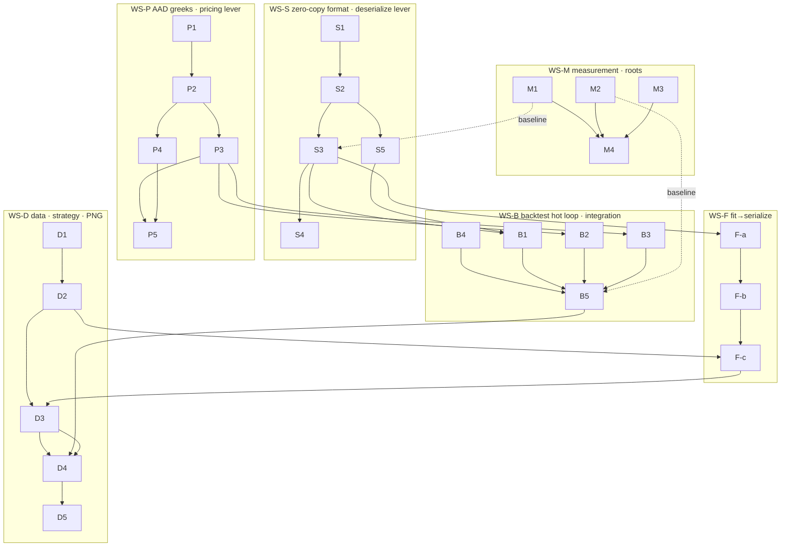

# atx-vol Backtest Hot-Path Throughput SOTA Sprint — 2026-07-18

> **For agentic workers:** executed by **parallel implementation subagents, one per workstream, each in its own git worktree** (§9 dispatch protocol). REQUIRED SUB-SKILL per subagent: `superpowers:executing-plans` (task-by-task, TDD, §3 contract). Progress tracks with the §7 git-SHA tracker. Every subagent re-reads §0 (clean-break mandate), §3 (global constraints), §5 (ownership/disjointness), §11 (traps) before touching a file.

**North star:** make atx-vol the **fastest _and_ most accurate** open options-pricing / vol-surface stack in the world. This sprint drives the **backtest hot path** — the loop **fit → serialize → deserialize → price/greeks** — to state-of-the-art throughput, and *proves it end-to-end* by producing a PNG of the PnL track of a vega-flat dispersion strategy on surfaces fit from **real OPRA data since 2026-01-01**.

**Base:** `main @ ede0e71` (local only, nothing pushed). Inherits the North-Star SOTA sprint (`2026-07-17`): executor **E1/E2** (nested-budget + work-stealing), IV **K2/K3** (218 ns scalar beats same-host LBR, AVX2 1.27×), American **A4/A5** (Cody-erfc boundary Φ, BAW-seed vectorized), fit **F1** (shared-boundary de-Am **3.99×**), **F2/F3/F4/F5/F6/F7**, scheduler **U1–U4** (streaming populate, RSS O(in-flight), small-book budget). The **batched `PortfolioPricer`** (dedup on `(uid,K,T,side)`, `evaluate_batch` per equal-T group, thread-fanned, allocation-free warmed workspace) already exists and is the substrate the pricing levers build on.

**Prior docs:** parent SPRINT `2026-07-17-atx-vol-north-star-sota-sprint.md`; the MAG7-dispersion goal `2026-07-11-atx-vol-mag7-dispersion-strangle-backtest-goal.md` (the strategy/PNG precedent this sprint generalizes); hot-path map (this session, 2026-07-18) — the load-bearing survey of the eight throughput bottlenecks below.

**Architecture of this sprint:** six workstreams. One **keystone that unblocks every honest number** (WS-M measurement — no serialize/deserialize bench exists today). Three **throughput levers on the pipeline stages** (WS-S zero-copy serialize/deserialize, WS-P AAD greeks + batch resolve, WS-F fit→serialize at scale). One **integration harness that composes them** (WS-B backtest hot loop). One **acceptance deliverable** (WS-D real-data pull + strategy + PNG). The single load-bearing discovery from the hot-path map: **the backtest deserializes the whole board every step even when the book references a subset of uids, re-CRCs and re-allocates every surface via `reconstruct`, prices some lifecycle events per-lot-scalar, and there is no serialize/deserialize benchmark at all** — so the two biggest levers are a *zero-copy mmap surface format with subset-map* (WS-S) and *AAD constant-cost portfolio greeks* (WS-P), measured by a *pipeline-stage-attribution harness* (WS-M) that lands the baseline first.

---

## 0. Clean-break mandate (pre-release — read first)

**atx-vol is pre-release. Break code API and surface binary ABI freely wherever it serves forward development.** This sprint takes that license on the hot path:

- **No dual-read, no v1 shim, no back-compat.** The v1 `.atxvsa` (ATXVSA v3 record format) write path is **deleted**. All readers (backtest, `SnapshotCache`, corpus, `SurfaceDb`) move to the v2 zero-copy format **in the same wave** — there is no window where both formats are live in the product.
- **Fixtures migrate once, then v1 is gone.** The `artifact-cache/*.atxvsa` fixtures and any committed test archives are **regenerated or one-shot-migrated** to v2 by a throwaway migrator (WS-S owns it); the migrator is the *only* place a v1 byte-layout struct survives, and it is deleted or archived after the cut.
- **Callers update, they do not adapt.** If a public API signature (`SurfaceArchive::open`, `map_all`, `load_surface`, `MarketSnapshot::load`, `PricedSurface` (de)serialization entry points) is wrong for zero-copy, change the signature and fix every call site. Do **not** preserve a compatibility overload.
- **The forcing question for every seam:** "what is the right shape for a mmap-first, zero-allocation deserialize?" — not "how do I keep the old callers compiling." Forward dev > compatibility, every time.

This mandate is a **global constraint** (it recurs in §3) and the reason WS-S is a clean cut rather than an additive format.

---

## 1. North-star scoreboard

Baselines are from the hot-path map (bench JSONs `bench/baselines/i7-1260p-clang18-sse2-*.json`). **Absolutes marked ★ratify are set by WS-M once the baseline harness lands** (M4); the *ratios* are the merge gates and hold regardless of host.

| Axis | Metric | Baseline (main @ ede0e71) | SOTA target | Gap | Owning WS |
|---|---|---|---|---|---|
| **Serialize** | µs/surface | **no bench exists** | ≤ ~1 µs/surface (memcpy-bound); partition write memcpy-throughput | ★ratify (M1) | WS-M→WS-S |
| **Deserialize** | µs to ready-to-price | full-file read + header/metadata CRC + per-blob `reconstruct` (whole-blob CRC + `make_unique`/slice), **whole board even for a subset** | **mmap + O(1) `PricedSurfaceView`; 50-surface partition ready < ~50 µs; subset-map 1 symbol < ~2 µs** (target ~100× vs reconstruct-all) | ★ratify (M1) | WS-S |
| **Price + greeks** | items/s (full greeks) | `american_greeks/fd_warm` **~682 items/s (~1.5 ms/solve)** | **≥5× via AAD**, all 8 greeks ~constant cost, machine-precise vs FD | 5× | WS-P |
| **Strike resolve** | delta-solves per 40Δ strike | per-contract iterative (1–2 boundary solves × bisection), **not batched across basket** | batched SoA delta-solve across the basket; ≥3× on N-name entry | 3× | WS-P |
| **Backtest** | steps/s | **~64 steps/s** (synthetic, 160 lots, threads:1) | **≥5–10×** on the real-universe config; full YTD (~135 days) run **< a few s wall** | ★ratify (M2) | WS-B |
| **Fit→serialize (universe)** | universe-date wall | 139 ms/board @ fw=4 (north-star); **universe unmeasured** | fit+serialize a universe-date **≤ 45 s** @ ≥6 eff cores (SpiderRock envelope; data-gated) | ★ratify (M2) | WS-F |
| **Acceptance** | PNG | none | **PnL-track PNG** renders end-to-end from the real-data pipeline (vega-flat dispersion, held to expiry) | deliverable | WS-D |

---

## 2. Inherited status (condensed)

**Landed from the North-Star sprint (`main @ ede0e71`):** executor E1 (nested-budget) + E2 (work-stealing help-first); IV K2 (Choi–Kim–Kwak L₃ seed, 324→218 ns, beats same-host LBR 237) + K3 (AVX2 1.27×); American A4 (Cody-erfc boundary Φ) + A5 (BAW-seed AVX2, ship-flag deferred); fit F1 (shared-boundary de-Am **297.6→74.6 ms/board = 3.99×**) + F2 (served-coverage floor) + F3/F4 (slice fallback + honest partial-board) + F6 (snapshot-cache content identity) + F5 R-05/R-06; scheduler U1 (streaming populate, RSS O(all)→O(in-flight)) + U2/U3/U4.

**Substrate that already exists (do not reinvent — the map confirmed):**
- **Batched portfolio pricer** — `PortfolioPricer` dedups `(uid,K,T,side)`, `solve_uniques` groups by `(uid,side)` → one `evaluate_batch` per equal-T group, fanned via `pricing_executor().run_ranges/run_blocks`, thread-count-invariant, allocation-free with a warmed `PortfolioWorkspace`/`PreparedPortfolio`. `price_totals`/`price_into`/`pnl_totals`/`pnl_totals_with_target_marks_into` are the batched entry points (`portfolio_pricer.hpp`, `portfolio_pricer.cpp:606`).
- **Constant-maturity projected pricing** — `PricedSurface::resolve(K,T)` (`priced_surface.hpp:217`) does one T-bracket + forward/carry interp + surface-IV lookup; `contract_projection.hpp` projects synthetic strikes/expiries (`ProjectedMaturitySpec`/`ProjectedStrikeSpec`), `PreparedOptionProjection::project_into` is the batched repeated path.
- **Backtest load-once invariant** — `run_backtest` (`backtest.cpp:1076`) opens each archive once; `SnapshotCache` (capacity-3 private + unbounded caller cache) with coalesced async prefetch of `refs[i+1]`.
- **Strategy DSL** — `DeclarativeStrategy` + `StrategySpec` (`StructureSpec::Strangle`, `SizeSpec::{TargetVega,TargetTheta}`, `CrossLegConstraint::{FlatVega,VegaNeutralBasket}`, `LifecycleSpec::{EveryStep,HoldToExpiry}`, `HedgeSpec::DeltaToZero`). `resolve_strike_by_delta_routed` (`strategy.cpp:72`).
- **Data tooling stubs** — `tools/build_spy_top50_universe.py`, `tools/pull_opra_universe_batch.py`, `tools/pull_opra_universe_snapshot.py`, `atx-core/examples/databento_bulk_opra.cpp` (623 lines), `examples/mag7_surfdb_populate.cpp` (212 lines). `tools/tearsheet.py` is the PNG-renderer precedent.

**The eight bottlenecks the map found (the work-list):**
1. Whole-board redundant deserialization per step (`MarketSnapshot::load` → `map_all_with_provenance` reconstructs every surface, `backtest.cpp:763-800`) → **WS-S subset-map + WS-B B1**.
2. `SurfaceDb::load_surface` has no cache — full read + full CRC + reconstruct every call (`surface_db.cpp:1143`) → **WS-S S5**.
3. Per-lot scalar residue in the hot loop — expiry settlement `fair_value` (`backtest.cpp:539`), roll-close `greeks_analytic`/`fair_value` (`backtest.cpp:1299-1322`) → **WS-B B2**.
4. Iterative per-strike delta solves, not batched across the basket (`strategy.cpp:72`, `contract_projection.cpp:168`) → **WS-P P4**.
5. Per-surface whole-blob CRC-32C + curve re-allocation on every `reconstruct` (`surface_archive.cpp:931`, `make_unique`/slice) → **WS-S S2 (zero-copy view avoids reconstruct)**.
6. 4096-byte blob alignment ⇒ ~4 KB/surface floor + read amplification (`surface_archive.hpp:83`) → **WS-S S1 (kill blob pad)**.
7. Linear-scan `shares` ledger + per-uid frame rescans in the hedge path (`backtest.cpp:1112-1135, 1354`) → **WS-B B3**.
8. No serialize/deserialize benchmark; backtest bench is threads:1 synthetic → **WS-M M1/M2**.

---

## 3. Global constraints (verbatim discipline — every subagent obeys)

- **§0 clean-break mandate governs.** Break API + binary ABI where it serves the zero-copy design. No dual-read, no v1 preservation. Update call sites; do not add compatibility overloads.
- **Research-first, cite in-code.** Any new hot-path algorithm / data structure / format gets **primary-source web research before implementation** (per the user's standing mandate — do not one-shot from recollection). Cite the source in an in-code comment at the point of use. This binds WS-S (zero-copy serialization: FlatBuffers / Cap'n Proto / Apache Arrow / mmap-arena patterns), WS-P (AAD: Giles–Glasserman pathwise adjoint, Savine AAD tape, adjoint American/PDE greeks), and any WS-B batching kernel.
- **Economic-correctness gate, not bit-identity** (for pricing/greeks). Price abs err ≤ `min(0.5·tick, 0.1·vega·1e-4)` and inside the quote half-spread; greeks abs err ≤ FD reference to the documented tolerance (AAD target: machine-precise vs central-difference); no new butterfly/calendar/vertical arb. Bit-identity is a telltale, not a gate; goldens update with documented justification. **Determinism across worker counts is preserved** (thread-count-invariant reductions).
- **Live/backtest primitive parity** (inherited from the north-star §3). Every pricing/greeks/hedge primitive the backtest uses is a **pure function over canonical types** so the *identical code runs live and inside `run_backtest`*. A live/replay divergence is a bug, not a modeling choice. WS-B lands last and its parity gate validates the loop.
- **Measurement honesty.** No headline throughput number is cited until (a) WS-M has captured the baseline for that stage, and (b) it is measured under the quiet-window protocol (reuse north-star M3: P-core pin via `configure_pricing_executor(PerformanceCores)`, best-of-N, CV ≤ 5 %, per-ISA baseline naming). Correctness gates run on Debug/`rel`; perf on `rel-avx2`.
- **Per-task contract.** Read-before-write (grep the symbol — line numbers drift); TDD (failing test asserting the economic/throughput bound first); classify every change `pure-refactor` / `accuracy-improving` / `accuracy-trading` / `abi-break` with an in-code comment; benchmark best-of-3 wall/CPU/p50/p95.
- **Build discipline (CRITICAL for parallel agents).** Invoke the **worktree's own** build script by **absolute path** (`& C:\atx-wt\<wt>\scripts\atx-build.ps1 …`); NEVER a relative `.\scripts\…` (reconfigures the live tree). Use `-Isolated` per-worktree `FETCHCONTENT_BASE_DIR` (north-star M6). Never Debug + Release concurrently in one worktree.
- **Data guardrails ($300 pull cap).** WS-D calls the Databento metadata cost-estimate **first** and logs it before any paid request. If the estimate exceeds **$300**, it does **not** ask every time — it keeps window/quality and **pulls the top-N-by-SPY-weight names (SPY + top-N single names) that fit under $300**, logs exactly which names were dropped, and reports N. One snapshot/symbol/trading day (1-min CBBO ~15:55 ET). Never re-pull data on disk. API key from env; never print or commit it.

---

## 4. Workstreams & tasks

Task ID = `<WS-letter><n>`. Columns: **Files** (primary), **Approach**, **Impact**, **Risk**, **Deps**, **Class**.

### WS-M — Pipeline measurement & attribution *(keystone; roots, dispatch immediately)*
Owner: **measure agent**. Makes every stage number honest and lands the baseline the scoreboard ★ratify rows depend on. No throughput claim ships until its stage has a baseline here.

| ID | Title | Files | Approach | Impact | Risk | Deps | Class |
|---|---|---|---|---|---|---|---|
| **M1** | `surface_archive_bench.cpp` (NEW) — the missing ser/deser bench | `bench/surface_archive_bench.cpp` (new), `bench/CMakeLists.txt` (append), `bench/baselines/` | Serialize µs/surface + partition write MB/s; deserialize µs (three modes: full-`reconstruct` v1 baseline / mmap-open / subset-`map_symbol`); surface-count sweep {1,4,16,50,100}; Essvi vs ConvexDense payloads. Capture **v1 baseline JSON first**, then the v2 rows land under WS-S | Turns "deserialize is slow" into a measured µs/surface; the ★ratify source for the serialize/deserialize scoreboard rows | Low | — | infra |
| **M2** | Real-universe backtest bench + steps/s baseline | `bench/backtest_throughput_bench.cpp` (reshape), `bench/baselines/` | Add a universe-shaped case: N names × **daily entry** × **held-to-expiry** × **daily delta-hedge** (the WS-D strategy shape), report steps/s + book size. Capture the baseline the ≥5–10× gate measures against | The backtest ★ratify baseline; today's bench is 20×4 synthetic threads:1 | Low | — | infra |
| **M3** | Per-stage attribution harness | `bench/e2e_hotpath_bench.cpp` (extend), scoped-timer counters in the pipeline, `include/atx/vol/counters.hpp` | Attribute backtest wall to **fit / serialize / deserialize / price** fractions (scoped timers or the unbiased sampler from north-star M5). Reuse the quiet-window protocol (P-core pin, CV≤5%) | Shows which stage dominates so effort lands on the real critical path; prevents optimizing a 5% stage | Low | M1, M2 | tooling |
| **M4** | Ratify scoreboard absolutes | this doc §1, `bench/README.md` | After M1–M3 baselines land, fill the ★ratify absolutes (serialize µs, deserialize µs, steps/s, universe-date wall) and freeze them as the merge gates | The scoreboard becomes gate-able | Low | M1, M2, M3 | infra |

### WS-S — Zero-copy surface format v2 *(root, isolated; the deserialize lever)*
Owner: **format agent**. Clean-break per §0 — v1 write path deleted, all readers moved to v2 in this workstream. Web-research zero-copy layout before designing (S1).

| ID | Title | Files | Approach | Impact | Risk | Deps | Class |
|---|---|---|---|---|---|---|---|
| **S1** | Design `.atxvsa2` mmap columnar layout | `docs/` design note, `include/atx/vol/surface_archive.hpp` (v2 structs) | **Research-first** (FlatBuffers / Cap'n Proto / Arrow / mmap-arena; cite in-code). Single mmap region; header → per-symbol directory (offsets, not pointers) → columnar slice arrays, naturally aligned, **no 4096-B blob pad** (page-align the *file*, pack surfaces). All internal refs are byte-offsets so mapping needs no pointer-fixup relocation | Kills bottleneck #6 (4 KB/surface floor); the layout that makes O(1) views possible | Med | (research) | abi-break |
| **S2** | `PricedSurfaceView` — zero-copy read view | `include/atx/vol/priced_surface_view.hpp` (new), `src/priced_surface_view.cpp`, `priced_surface.hpp` seam | A view over mapped bytes exposing `resolve/fair_value/delta/greeks` **without `reconstruct`/`make_unique`** (slice curves read in place). CRC becomes **lazy/optional** (validate-on-demand, not on every open) — kills bottleneck #5 | The deserialize win: ready-to-price with zero per-surface allocation | Med-High | S1 | abi-break |
| **S3** | v2 writer + **subset-map** API | `src/surface_archive.cpp` (rewrite write path), `surface_archive.hpp` | Serialize `PricedSurface` → v2 (memcpy-bound); `map_symbol(sym)` returns a `PricedSurfaceView` touching only that symbol's directory entry + slice bytes (**kills bottleneck #1** at the format layer); delete the v1 write path | Serialize target + the primitive B1 uses to stop reconstructing the whole board | Med | S1, S2 | abi-break |
| **S4** | Clean-break migration + reader cutover | one-shot `tools/migrate_atxvsa_v1_to_v2` (throwaway), `src/snapshot_cache.cpp`, `src/surface_db.cpp`, `src/corpus.cpp`, `src/surface_db_populate.cpp`, `artifact-cache/*.atxvsa` | Migrate/regenerate all committed fixtures to v2; move **every reader** (backtest via SnapshotCache, corpus, SurfaceDb) to v2-only; preserve `schema_hash` + validation semantics; delete v1 read except inside the migrator | §0 executed — one format live in the product | Med-High (blast radius) | S2, S3 | abi-break |
| **S5** | `SurfaceDb::load_surface` view cache | `src/surface_db.cpp:1143`, `surface_db.hpp` | Cache the mmap + `PricedSurfaceView` keyed by partition; share the mapping across cohorts/callers (**kills bottleneck #2**); eviction on partition rewrite (reuse F6 content identity) | Removes full-read+CRC+reconstruct per `load_surface` | Med | S2, S3 | perf |

### WS-P — AAD greeks + batched strike resolve *(root, isolated; the pricing lever)*
Owner: **greeks agent**. Web-research adjoint methods before implementing (P1). Integrates into the existing batched `PortfolioPricer` — does not fork it.

| ID | Title | Files | Approach | Impact | Risk | Deps | Class |
|---|---|---|---|---|---|---|---|
| **P1** | Research + design adjoint greeks | `docs/` design note, `include/atx/vol/detail/` (adjoint scaffolding) | **Research-first**: Giles–Glasserman pathwise adjoint, Savine AAD tape (operator-overload) vs hand-coded adjoint for the eSSVI + Andersen-Lake American hot path. Decide tape vs hand-adjoint (hot path favors hand-coded); cite | The design that makes constant-cost greeks correct | Med | (research) | research |
| **P2** | Adjoint greeks kernel | new `src/detail/adjoint_greeks.cpp` + hdr, `american.cpp` seam | Full greeks (delta/gamma/vega/vanna/volga/theta/rho/charm) at ~constant cost (one adjoint sweep), machine-precise vs central-difference. Scalar-first, then consider SIMD | ≥5× greeks throughput; replaces `fd_warm` cost | High (correctness of adjoint through the American boundary) | P1 | accuracy-improving |
| **P3** | Wire AAD into `PortfolioPricer` FullGreeks | `src/portfolio_pricer.cpp` (greeks path), `portfolio_pricer.hpp` | Route `price_totals`/`price_into` FullGreeks through P2; keep the allocation-free warmed workspace + thread-count-invariant reduction; A/B `fd_warm` vs `aad` | The portfolio-greeks throughput win, book-wide | Med | P2 | perf |
| **P4** | Batch 40Δ strike resolution across the basket | `src/strategy.cpp:72`, `contract_projection.cpp:168` seam | SoA batched delta-solve: resolve all N-name 40Δ strikes in one batched `delta`-wave instead of per-contract iterative (**kills bottleneck #4**); parity vs the scalar resolver | ≥3× on N-name daily entry (the WS-D hot path) | Med | P2 | perf |
| **P5** | Parity + micro-bench | `atx-vol/tests/*`, `bench/portfolio_throughput_bench.cpp` (append) | AAD-vs-FD parity gate (all 8 greeks); add `american_greeks/aad` + `strike_resolve/batch` bench rows | Proves P2/P3/P4 honestly | Low | P2, P3, P4 | test/infra |

### WS-F — Fit → serialize at universe scale *(Stage 1; needs the WS-S writer seam)*
Owner: **fit agent**. Reuses the north-star executor (E1/E2) + F1 shared-boundary de-Am + U1 streaming populate. New work is the v2 serialize wiring and the universe-scale driver.

| ID | Title | Files | Approach | Impact | Risk | Deps | Class |
|---|---|---|---|---|---|---|---|
| **F-a** | Fit output writes v2 directly | `src/corpus.cpp`, `src/corpus_board_fit.cpp`, `src/surface_db_populate.cpp` | Emit v2 partitions from the fit pipeline (via the S3 writer); drop the v1 write call sites | Fit→serialize on the fast format; no v1 anywhere in the fit path | Med | S3 | perf |
| **F-b** | Streaming fit→serialize into SurfaceDb | `src/surface_db_populate.cpp` (reuse U1 streaming), `bench/corpus_build_bench.cpp` | Fit→serialize→release per date on the E1/E2 pool; measure **surfaces/sec fit+serialized**; RSS O(in-flight) preserved | The universe-date ≤45 s target's mechanism | Med | F-a, S3 | perf |
| **F-c** | Universe-scale populate driver | `examples/mag7_surfdb_populate.cpp` (generalize) or new `examples/universe_surfdb_populate.cpp` | Populate a `SurfaceDb` root from the WS-D parquet hive for N names YTD; per-symbol `SymbolFitConfig`; determinism preserved (respect `ATX_VOL_FIT_WORKERS`) | Produces the db the backtest runs off | Med | F-b, WS-D D2 | infra |

### WS-B — Backtest hot loop *(Stage 2 integration; lands last of the engine WS)*
Owner: **backtest agent**. Consumes WS-S views + WS-P greeks. Enforces §3 live/backtest parity. Every task keeps determinism across worker counts.

| ID | Title | Files | Approach | Impact | Risk | Deps | Class |
|---|---|---|---|---|---|---|---|
| **B1** | Subset-deserialize referenced uids only | `src/backtest.cpp:750-800` (`MarketSnapshot::load`), `src/snapshot_cache.cpp` | Map only the uids the book references via the S3 subset-map; `SnapshotCache` over v2 `PricedSurfaceView`s; drop `map_all_with_provenance` on the hot path (**kills bottleneck #1**) | The deserialize win reaches the backtest | Med-High | S3, S5 | perf |
| **B2** | Kill per-lot scalar residue | `src/backtest.cpp:539` (expiry settlement), `:1299-1322` (roll-close) | Batch expiry-settlement marks + roll-close marks through `PortfolioPricer` instead of per-lot `fair_value`/`greeks_analytic` (**kills bottleneck #3**) | Removes the last scalar hot-loop cost | Med | P3 | perf |
| **B3** | Zero-alloc steps + O(1) hedge ledger | `src/backtest.cpp:1112-1135` (shares), `:1354` (per-uid rescan), `:1044,1516` (`erase_if`) | O(1) `shares` map; drop per-uid whole-frame rescans (index the risk frame by uid); daily delta-hedge from the batched portfolio delta (WS-P); pre-sized scratch, no per-step alloc (**kills bottleneck #7**) | Steps/s + determinism at scale | Med | P3 | perf |
| **B4** | Held-to-expiry daily-overlapping cohort lifecycle | `src/backtest.cpp` (strategy overload), `src/strategy.cpp` (DSL) | Verify `LifecycleSpec::{EveryStep entry, HoldToExpiry}` composes for ~135 daily overlapping cohorts × (N long strangles + 1 SPY strangle) legs; extend if the DSL gaps | The strategy shape runs correctly at YTD scale | Med | — | correctness |
| **B5** | Parity + determinism + steps/s gate | `atx-vol/tests/*`, `bench/backtest_throughput_bench.cpp` | Live/backtest primitive-parity gate (§3); bit-identical `BacktestResult` across `n_threads`; re-run the M2 universe steps/s gate | Validates the whole loop; the backtest ★ratify gate | Med | B1, B2, B3, B4, M2 | test/infra |

### WS-D — Data + strategy + PNG *(acceptance deliverable; long-running data root — dispatch the pull immediately)*
Owner: **data-strategy agent**. Kicks off the (slow, external) Databento pull in Stage 0; the strategy + PNG land in Stage 3 once the engine is ready.

| ID | Title | Files | Approach | Impact | Risk | Deps | Class |
|---|---|---|---|---|---|---|---|
| **D1** | Universe list — SPY top-N by weight | `tools/build_spy_top50_universe.py` (finish), committed `data/universe/spy_top50_2026-01-01.csv` | SPY + top-N S&P constituents by index weight as of 2026-01-01; commit as a fixture; document the source/asof | Deterministic, auditable universe | Low | — | infra |
| **D2** | Cost-gated Databento pull | `tools/pull_opra_universe_batch.py` (finish), `atx-core/examples/databento_bulk_opra.cpp` | **Metadata cost-estimate first, log it**; if > $300 → keep window/quality, pull **top-N-by-weight that fits**, log dropped names (§3 guardrail). YTD daily 1-snap CBBO ~15:55 ET → parquet hive (resumable, cached, never re-pull); key from env | Real OPRA on disk; bounded spend | Med (external API, cost) | D1 | infra |
| **D3** | Fit → SurfaceDb population | via WS-F F-c → `data/surfdb/spy_disp_ytd/` | Run the WS-F universe populate on the D2 parquet; per-symbol fit config; record fit success/in-band stats for the report | The db the backtest runs off | Med | D2, F-c | infra |
| **D4** | Vega-flat dispersion strangle strategy + example | `examples/spy_dispersion_pnl.cpp` (new, small ≤~300 lines), `src/dispersion_strangle.cpp` (extend), `tests/*` | Long top-N 40Δ 3M strangles + short SPY 40Δ 3M strangle sized **net-vega-zero at entry**; **new clip daily**, **delta-hedged daily**, **held to expiry**; strikes/expiries resolved off the **serialized surface** (projection path, no listed-contract snapping). Gate tests: 40Δ reprice, vega-flat@entry, held-to-expiry, determinism | The strategy the PNG shows | Med | B5, D3 | feature |
| **D5** | TSV emit + PNG renderer | `include/atx/vol/tearsheet.hpp` (emit), `tools/spy_dispersion_pnl_report.py` (new, reuse `tearsheet.py`) | C++ emits the `BacktestResult` PnL series + engine timing + surface stats as TSV (`# key=value` header); Python renders the **PnL-track PNG** (inline, matplotlib Agg, 150 dpi). Validate end-to-end on the real run | **The acceptance PNG** | Low | D4 | feature |

---

## 5. Ownership / disjointness matrix (one writer per TU)

| Owner (worktree) | Owned TUs / headers |
|---|---|
| **measure** (`wt-measure`) | `bench/surface_archive_bench.cpp` (new), `bench/backtest_throughput_bench.cpp`, `bench/e2e_hotpath_bench.cpp`, `bench/corpus_build_bench.cpp`, `include/atx/vol/counters.hpp` (attribution), `bench/baselines/`, `bench/README.md` |
| **format** (`wt-format`) | `src/surface_archive.cpp` + `include/atx/vol/surface_archive.hpp`, new `priced_surface_view.{hpp,cpp}`, `src/snapshot_cache.cpp` (v2 read seam), `src/surface_db.cpp` (S5 cache), `tools/migrate_atxvsa_v1_to_v2` (throwaway), `artifact-cache/*.atxvsa` (regen) |
| **greeks** (`wt-greeks`) | new `src/detail/adjoint_greeks.{hpp,cpp}`, `src/portfolio_pricer.cpp` (greeks path) + `portfolio_pricer.hpp`, `src/american.cpp` (adjoint seam), `src/strategy.cpp` (batch resolve), `contract_projection.cpp` (resolve seam) |
| **fit** (`wt-fit`) | `src/corpus.cpp`, `src/corpus_board_fit.cpp`, `src/surface_db_populate.cpp`, `examples/universe_surfdb_populate.cpp` (or generalized `mag7_surfdb_populate.cpp`) |
| **backtest** (`wt-backtest`) | `src/backtest.cpp` + `include/atx/vol/backtest.hpp`, `src/snapshot_cache.cpp` (hot-loop consumption — **seam-coordinated with format**) |
| **data-strategy** (`wt-data`) | `tools/build_spy_top50_universe.py`, `tools/pull_opra_universe_batch.py`, `tools/spy_dispersion_pnl_report.py` (new), `examples/spy_dispersion_pnl.cpp` (new), `src/dispersion_strangle.cpp`, `include/atx/vol/tearsheet.hpp` (emit) |
| **Shared, append-only** | `bench/CMakeLists.txt`, `tests/CMakeLists.txt`, `atx-vol/CMakeLists.txt` (examples) — each agent appends its own targets; keep-all-targets merge |

**Contention notes:** (1) `snapshot_cache.cpp` is written by **format** (S4 v2-read cutover) and consumed by **backtest** (B1 hot loop) — format lands the v2 read API first (merge order §8), backtest consumes it; agree the `PricedSurfaceView` seam signature before B1 forks. (2) `surface_db.cpp` — **format** owns S5 (load cache); **fit** owns `surface_db_populate.cpp` (disjoint TU). (3) `portfolio_pricer.cpp` greeks path is **greeks**-owned; **backtest** B2 only *consumes* the batched marks API. (4) `strategy.cpp` — **greeks** owns P4 (resolve batching), **data-strategy** owns the spec composition in `dispersion_strangle.cpp` (disjoint TU); coordinate if D4 needs a resolver signature change.

---

## 6. Agent DAG

**Keystone edges:** `M1/M2` gate every honest stage number (★ratify). `S1→S2→S3` is the deserialize root; `S3` unblocks both `F-a` (fit writes v2) and `B1` (subset-deser). `P2` roots the greeks lever; `P3` unblocks `B2/B3`. `D2` (the slow external pull) roots the acceptance chain and must start first. `B5` (parity + steps/s) gates `D4`.

---

## 7. Git-SHA tracker *(filled during execution — one row per task, one commit-or-more each)*

| Task | Branch | Status | SHA(s) | Gate result |
|---|---|---|---|---|
| M1 | `feat/bt-measure` | ☑ landed | 4176841, 0a00f4e (merge abd3632) | v1 baseline JSON: ser ~2–4.5 µs/surf; deser eSSVI ~3.5–4 µs/surf whole-board, ConvexDense ~3.5–4 ms/surf (~1000×); rows CV-stamped, provisional under load |
| M2 | `feat/bt-measure` | ☑ landed | 388bc0b, 9a3fed6 (merge abd3632) | universe_strangle_hedged 15.0 steps/s provisional (28 under lighter load); load-invariant universe:straddle ≈ 0.28 |
| M3 | `feat/bt-measure` | ☑ landed | 4c737a1, 0404b41 (merge abd3632) | fit 95.35 / price 4.65 / ser 0.005 / deser 0.004 % (CV 4.79%); board-level deser lever lives in M1 reconstruct_all×count |
| M4 | `feat/bt-measure` | ☐ todo (PM) | — | ratify from PM quiet-window re-capture, not shared-host numbers |
| S1 | `feat/bt-format` | ☑ landed | 31d1a78 (merge e1b30a2) | .atxvsa2 layout: single mmap, byte-offset dir, columnar SoA, 64B-packed, offsetof-pinned; research cited (Arrow/FlatBuffers/Cap'n Proto) |
| S2 | `feat/bt-format` | ☑ landed | 3eceff2, efa9a85 (merge e1b30a2) | PricedSurfaceView bit-exact all 6 kinds (SplineVol mult_cap/w_offset fix, kV2Salt bump); zero-heap parametric query path; ConvexDense/SplineVol one-time eager materialize |
| S3 | `feat/bt-format` | ☑ landed | 54ea9c8 (merge e1b30a2) | v2 writer + map_symbol subset-isolation (poisoned-sibling gate) + throwaway migrator (real SPY fixture); v2 additive until S4 |
| S4 | `feat/bt-format` | ☑ landed | 412ea5e (merge 3579ada) | clean-break: all product readers/writers v2, fixtures migrated, payload_crc32c gap fix. DEVIATION (adjudicated): v1 stays in-library for M1 bench ratios — no product path reaches it (grep-verified); link-isolation = DoD follow-up |
| S5 | `feat/bt-format` | ☑ landed | 91b3c3b, 3d5cdd3 (merge 3579ada) | partition view cache, LRU-bounded (default 16, opts knob), co-owning LoadedSurface eviction safety; subset-map ~10-14x v1 @ ~0.15us, mmap-open 4-12x (provisional, max CV 43.46%) |
| P1 | `feat/bt-greeks` | ☑ landed | e5d4a69 (merge 89b77fa) | hand-adjoint + IFT-through-boundary design; primary sources cited; σ̄ seed = surface chain-rule seam |
| P2 | `feat/bt-greeks` | ☑ landed | dad665e, ac30990, 0b8020e, 0bb9f54, cd742ce (merge 89b77fa) | puts adjoint, delta/gamma bit-identical fd; adjoint engages on well-converged subset (~1/12), FD fallback elsewhere — widening is wave-2 P3-pre (Christianson); 0.81× prototype disclosed |
| P3 | `feat/bt-greeks` | ☑ landed | b44b12f, bb20fa2, 3627b7b, 904731f (merge ca148ba) | Christianson through-iterations widening: engagement 8%→83.5%; fused mark+tape solve (one AL solve/contract) → ~1.21× vs cold-FD. ≥5× scalar gate = DOCUMENTED DEVIATION (reviewer: first_order_only ~2-2.5× ceiling; ≥5× needs SIMD follow-up sprint) |
| P4 | `feat/bt-greeks` | ☑ landed | 2f39600 (merge ca148ba) | batched 40Δ resolve, bit-identical to serial (tol 0.0); SoA work-reduction deferred (correction-cache delta precludes bit-identical SoA) |
| P5 | `feat/bt-greeks` | ☑ landed | fcf6ce1 (merge ca148ba) | parity gates green (delta/gamma bit-identical, took-floors >3/4 non-vacuous); both-scope bench rows provisional (busy host); seam batched-marks.md published |
| F-a | `feat/bt-fit` | ☑ landed | adc057c (merge eb48376) | write sites verified v2 (S4 cut them; corpus.cpp:698, surface_db.cpp:1092); gap closed: bit-exact fit-output→map_symbol/map_surface view parity tests, both families, 9 greeks + evaluate_batch |
| F-b | `feat/bt-fit` | ☑ landed | ea058e8, 2b9f332 (merge eb48376) | fit-owned fit_serialize_bench: ~24.2 surf/s fit+serialized @16-way (cv 4.2%), serial 9.50/s not-citable (cv 43.5%); all provisional pending quiet-window |
| F-c | `feat/bt-fit` | ☐ todo | — | universe populate driver |
| B1 | `feat/bt-backtest` | ☑ landed | fd05078 (merge 8fdaa41) | subset-deser: MarketSnapshot::load(referenced_uids) drops whole-board reconstruct; fixed-book private-subset cache; 2/4 loaded + fixed-book run bit-identical to whole-board. SEAM GAP: pricer SurfaceSet still `const PricedSurface*` (greeks §6), so subset is reconstructed-owned not zero-copy; deser ~0.004% of wall (M3), M2 refs all names ⇒ ~0% M2 impact |
| B2 | `feat/bt-backtest` | ☑ landed | cc09d4a (merge 8fdaa41) | batched expiry-settlement marks (one Marks pass/expiry, retained pricer); economic parity ~1e-9 (ExpirySettlement NEAR 1e-6), thread-invariant; no-expiry rows exactly 0.0 |
| B3 | `feat/bt-backtest` | ☑ landed | c869692 (merge 8fdaa41) | O(1) HedgeLedger (was O(book²) hedge rescan + per-step `uids` alloc); bit-identical refactor; alloc gate step-invariant (hedge allocs D=7,2D=7 → 0/step) |
| B4 | `feat/bt-backtest` | ☑ landed | 6f4009f (merge 8fdaa41) | HoldToExpiry+EveryStep composes at scale: 160 overlapping legs, aligned-tenor expiries settle mid-run (settle_rows=4), 1-vs-4-thread bit-identical; no DSL gap, no full-portfolio reprice on expiry |
| B5 | `feat/bt-backtest` | ☑ landed | 174f1cd, 241c24b (merge 8fdaa41) | REVIEW APPROVED (0C/1I/4Minor). Determinism split into exact-coverage gates: StrategyLoopHedgeAndCohorts (B3+B4) + FixedBookComposedSubsetAndSettlement (B1+B2: whole-board load fails on mismatched-ts control ⇒ subset path proven load-bearing; settle_rows=1 ⇒ B2 fired; 2-run + 1-vs-4-thread bit-identical). B-suite 206 pass/2 skip/0 fail. Steps/s **provisional** rel-avx2 busy host: universe_strangle_hedged median 18.9 (cv 14.95%>>5%) vs 15.0/28.0 (~1.26×, B3-driven); PM quiet-window re-capture. Adj: (A) B1 view re-point = DoD follow-up; (B) ≥5-10× Backtest = documented deviation (WS-P price-stage SIMD) |
| D1 | `feat/bt-data` | ☐ todo | — | universe list fixture |
| D2 | `feat/bt-data` | ☐ todo | — | pull ≤ $300; N names on disk |
| D3 | `feat/bt-data` | ☐ todo | — | SurfaceDb populated |
| D4 | `feat/bt-data` | ☐ todo | — | strategy + gate tests |
| D5 | `feat/bt-data` | ☐ todo | — | **PNG renders end-to-end** |

Update convention: `☐ todo → ◐ in-progress → ☑ landed`; paste the commit SHA(s) and the one-line gate result (measured number). The dispatching session owns merges (order §8), each gate re-run on merge.

---

## 8. Sequencing (waves / stages)

- **Stage 0 (immediately, parallel — disjoint worktrees):** WS-M (M1, M2, M3), WS-S (S1→S2), WS-P (P1→P2), **WS-D D1→D2 (kick off the pull first — slowest, external, cost-gated)**. No cross-deps.
- **Stage 1:** WS-S (S3, S4, S5), WS-P (P3, P4, P5), WS-F (F-a, F-b after S3), WS-B scaffolding (B4 lifecycle — no dep). M4 ratifies once M-baselines land.
- **Stage 2:** WS-B (B1 after S3/S5; B2/B3 after P3; then B5), WS-F (F-c after D2 parquet + F-b), WS-D (D3 after F-c).
- **Stage 3:** WS-D (D4 after B5 + D3; D5 PNG); final quiet-window throughput gate ladder re-run + DoD.

**Merge order:** WS-M → WS-S → WS-P → WS-F → WS-B → WS-D. Dispatching session owns each merge + gate re-run (north-star protocol). WS-S lands before WS-B (B1 consumes the v2 read seam); WS-P lands before WS-B (B2/B3 consume AAD marks); WS-D lands last (its D5 PNG proves the loop).

---

## 9. Dispatch protocol (parallel worktree agents)

1. Dispatching session creates one worktree per active workstream from `main @ ede0e71` via `scripts/new-worktree.ps1 -Name <wt> -Branch <branch> -Base main -NoConfigure -Isolated`.
2. Each subagent receives: this file, its workstream section, the §0 mandate, the §3 constraints, its §5 ownership row, its worktree path. It executes ONLY its own tasks; it must not edit another owner's TU.
3. **Build only via the worktree's own script by absolute path** (`& C:\atx-wt\<wt>\scripts\atx-build.ps1 …`); verify the configure targets the worktree, never `C:/atx/build`. Correctness on Debug/`rel`; perf on `rel-avx2` under the quiet-window protocol.
4. Each task = its own commit (conventional message + class label incl. `abi-break` where §0 applies). Workstream ends with Debug + Release green, focused tests green, bench JSON checked into `bench/baselines/`, and the §7 tracker row updated.
5. **Research-first tasks (S1, P1, and any new WS-B kernel):** do the web research, write the design note, cite the primary source in-code BEFORE implementing.
6. **Seam-coordinated tasks:** format agrees the `PricedSurfaceView` signature with backtest before B1 forks; greeks agrees the batched-marks API with backtest before B2.
7. Dispatching session owns every merge + the gate ladder re-run; the pre-existing v2 Debug known-reds remain off-scope unless a task explicitly claims them.

---

## 10. Definition of done (this sprint's exit gates)

| Gate | Target |
|---|---|
| **Serialize** | µs/surface at memcpy throughput; measured by M1; ≤ ★ratify absolute |
| **Deserialize** | mmap + O(1) `PricedSurfaceView`, zero per-surface allocation; subset-map one symbol without touching the board; 50-surface partition ready-to-price ≤ ★ratify (target ~100× vs v1 reconstruct-all) |
| **Price + greeks** | AAD full greeks ≥ 5× `fd_warm` items/s, machine-precise vs central-difference (all 8 greeks); batched 40Δ resolve ≥ 3× |
| **Backtest** | steps/s ≥ 5–10× the M2 baseline on the real-universe config; full YTD run < a few s wall; bit-identical `BacktestResult` across `n_threads`; live/backtest primitive parity gate green |
| **Fit→serialize** | fit output is v2; universe-date fit+serialize ≤ 45 s @ ≥6 eff cores (data-gated; mechanism ≥ prior scaling) |
| **Clean break (§0)** | v1 `.atxvsa` write path deleted; all readers v2-only; fixtures migrated; no dual-read anywhere in the product |
| **Acceptance** | **`spy_dispersion_pnl_report.py` renders the PnL-track PNG** from the real-data pipeline (vega-flat dispersion, 40Δ 3M strangles, SPY top-N vs SPY, daily clip, daily delta-hedge, held to expiry, strikes resolved off the serialized surface); gate tests (40Δ reprice, vega-flat@entry, held-to-expiry, determinism) green |
| **Honesty** | M1/M2/M3 baselines captured and M4 ratified before any headline number is cited; perf under the quiet-window protocol |

**Carry-forward (explicitly out of scope):** AVX-512 kernels (validate on deployment silicon, not the laptop); a full 50-name real pull if $300 caps it to top-N (mechanism proven, absolutes name-count-gated — document N); AAD SIMD-vectorization beyond the scalar adjoint (Sprint-X); listed-contract execution realism (separate `listed_dispersion` path).

---

## 11. Risks & standing traps

1. **Clean-break blast radius (S4).** v1 deletion touches every reader (backtest, SnapshotCache, corpus, SurfaceDb) + fixtures. Land S2/S3 and the migrator first, cut all readers in one wave, re-run the full `SurfaceArchive|SurfaceDb|Backtest|Corpus` suite on the merge. This is licensed by §0 — but it is the highest-coordination task.
2. **Adjoint correctness through the American boundary (P2).** The Andersen-Lake exercise boundary makes a naive adjoint wrong at the boundary. Parity-gate every greek vs central-difference before P3 wires it; keep the FD path as a `--force-fd` fallback until parity holds.
3. **Zero-copy alignment/UB (S2).** Reading POD out of mapped bytes must respect alignment and strict-aliasing; the v2 layout (S1) naturally-aligns every field and uses byte-offsets, not pointers. Validate on a big-surface fixture.
4. **Live/backtest parity (B5).** Any primitive the backtest calls that is not a pure function over canonical types will diverge live vs replay. B2/B3 must route through the *same* `PortfolioPricer` API the live path uses.
5. **Databento cost/coverage ($300 cap).** The metadata estimate governs; over-cap auto-degrades to top-N-by-weight (§3). If the estimate for even SPY + a few names is over $300, hard-stop and surface the number — do not pull blind.
6. **Bench noise.** All cross-cutting perf numbers are provisional until the quiet-window protocol (P-core pin, best-of-N, CV≤5%); deterministic metrics (allocation counts, parity max|Δ|, thread-count invariance) are contention-free and gate first.
7. **Seam races between format and backtest.** `snapshot_cache.cpp` is touched by both; the merge order (WS-S before WS-B) and the pre-agreed `PricedSurfaceView` signature (§9.6) prevent the conflict.
