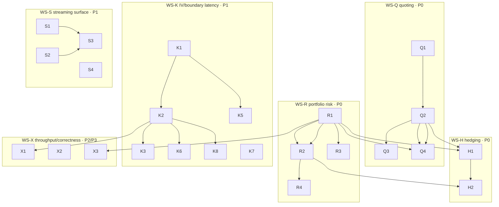

# atx-vol MM-System SOTA Sprint — 2026-07-18

> **For agentic workers:** this plan is executed by **parallel implementation subagents, one per workstream, each in its own fresh git worktree** (§9 dispatch protocol). REQUIRED SUB-SKILL per subagent: `superpowers:executing-plans` (task-by-task, TDD, §3 contract). Steps track with the §7 git-SHA tracker. Every subagent re-reads §3 (global constraints), §5 (ownership/disjointness), §11 (traps).

**North star (v2):** turn atx-vol from a *research-grade pricing + fitting engine* into a **market-making system** — add the three missing product layers (quoting engine, unified cross-underlier portfolio risk, delta-hedging schedule) and close the last measured latency gaps (IV inversion, boundary batch, streaming surface), keeping the frontier numerics (ALO American, Choi/LBR IV, arb-free eSSVI) already landed.

**Base:** `main @ 121d39c` (local only, nothing pushed). Inherits the completed **2026-07-17 north-star sprint** (Waves A/B/C + universe + F-tasks — §0). Source-of-truth research: `atx-vol/research/mm/2026-07-18-options-market-making-system-design.md` (5 angles, 25 sources, 23/25 claims adversarially verified) — cite its `[n]` tags in-code for any adopted algorithm.

**Architecture of this sprint:** six workstreams. Three are **P0 product features that make it an MM business** (WS-Q quoting, WS-R portfolio risk, WS-H hedging). Two are **P1 measured-gap closers with published fixes** (WS-K IV/boundary latency via FlashIV; WS-S streaming surface via Mingone unconstrained eSSVI). One is **throughput/correctness hardening + a foundational spike** (WS-X: AVX-512 tier, discrete-div PDE, AAD spike). The load-bearing insight from the research: *the numerics core is already frontier — the value now is the layers above pricing that don't exist yet* (quoter, cross-name risk, streaming), plus eliminating the AVX2 scalar-patch lanes that cap the IV/boundary SIMD wins.

**Tech stack:** C++20, clang-cl 18, CMake presets + Ninja (`dev` Debug/build, `rel` SSE2, `rel-avx2` AVX2/build-rel-avx2, `hygiene`). `/W4 /permissive- /WX`. atx::vol over atx::core. Runtime CPUID SIMD dispatch. Work-stealing `PricingExecutor` (E1 nested budget + E2 help-first steal — landed).

---

## 0. What landed — 2026-07-17 north-star sprint review (the baseline this builds on)

Four waves, ~20 tasks, all reviewed + merged; `main` passes **both Debug and rel-avx2 down to only the 5 pre-existing v2 known-red** (rel-avx2 was 17 fails → 5). North-star gates **met**:

| Axis | Result | Landed by |
|---|---|---|
| **SPY one-op e2e** | 347 → **139 ms @ fit_workers=4** (96 @ 8); ≤200 + ≤150 stretch met → A1 de-Am vec **deferred** | E1/E2 parallelism (A0 verdict) |
| **IV scalar** | 329 → **218 ns/op, beats same-host Jäckel LBR (237)** | K2 Choi-2023 L₃ seed `e34e3bb` |
| **IV AVX2 batch** | 0.95 → **1.27× scalar**, machine-precise (max_rel 4.18e-11) | K3 `b5b95ff` (reverses R-24) |
| **eSSVI/Legacy de-Am** | per-row scalar → **3.99× (297.6→74.6 ms/board)** | F1 R-01p2 `4dbc067` |
| **Universe scaling** | unmeasured → **3.83× @ P=8**, bounded RSS 55.6→67.1 MB (11-name mechanism) | U1/U2/U4 + U6 `d05f617` |
| **rel-avx2 acceptance gate** | 17 → **5 (v2 only)** | M4 + isatol `752c441` |

**Also landed:** E1/E2 executor, M1/M2/M3/M5/M6 bench+tooling, U1/U2/U3/U4 scheduler, A0/A4 American boundary Φ, F3/F4/F6/F7 + F2/F5(R-05/R-06) fit-correctness.

**Carried-forward deferrals (folded into this sprint's workstreams, do not re-scope from zero):**
- **R-10** (per-carry-leg AloPricer reuse, ~56 ms) — needs `AloPricer::reset_warm`; WIP is in `git stash` ("amprice reset_warm WIP for R-10"). → **WS-K K7**.
- **A5 boundary-batch ship-flag** — vectorization landed parity-green but `kShipAvx2Boundary=false` (1.87–2.15× on contended host < 2.0× quiet gate). FlashIV branch-elimination is the likely unlock. → **WS-K K6**.
- **A1 de-Am price vectorization** — deferred by the A0 wall-win verdict; only pull if a single-expiry residue >~120 ms shows on a real cohort. **Stays deferred.**
- **K4 Schadner explicit-IV spike** — → **WS-K K5** (with the research's ~2.31×-not-3.4× caveat).
- **F2 served-floor corpus validation** — the 0.50 floor is synthetic-validated only; wants a real 14-board OPRA (`data/vol_breadth_slices`) re-run. **Data-gated** (§11.8).
- **Chebyshev-Φ retirement** (`detail/norm_cdf_cheb.*`) — after WS-K removes the last `norm_cdf_pd/pd2` + `kNormCdfWing` refs from `vector_math.hpp`. → **WS-K K8**.
- **Absolutes** (universe <45 s @ 519, 100-name ≥10×, accuracy ~90% in-band) — host+data-gated (need the 519/100 cohort AND ≥6 physical P-cores; dev laptop has 4). **Per user: accept mechanism proofs; not chased this sprint.**

---

## 1. North-star scoreboard (v2 — MM-system axes)

| Axis | Metric | Current (main @ 121d39c) | SOTA target | Owning WS |
|---|---|---|---|---|
| **Quoting engine** | two-sided quote (edge/width/skew) exists? | **❌ none** (only `QuoteFrame` data) | GLFT closed-form depths `[15]`, inventory-skewed reservation price `[14]` | WS-Q |
| **Delta-hedging** | hedge schedule w/ impact exists? | **❌ none** | Barzykin–Bergault–Guéant joint quote+hedge `[12]` | WS-H |
| **Cross-underlier risk** | canonical book-level greek aggregation? | **⚠️ deprecated path only** (`portfolio_risk.hpp`) | by-uid/expiry/group tree on `portfolio_pricer` + executor; AAD-ready `[16]` | WS-R |
| **Scenario/stress/VaR** | grid full-revaluation on canonical path? | **⚠️ deprecated `scenario_grid.hpp`** | canonical, cross-name, SIMD-scanned `[19][23]` | WS-R |
| **IV inversion latency** | scalar ns/op; AVX2 ×scalar | **218 ns; 1.27×** | LBR 180 ns; AVX2 → lane-count (kill scalar-patch lanes) `[4]` | WS-K |
| **American boundary batch** | AVX2 ×scalar (ship gate 2.0×) | **1.87–2.15× (flag false)** | ≥2.0× shipped via FlashIV branch-elim `[4]` | WS-K |
| **Streaming surface** | incremental single-expiry refit latency | **snapshot/batch only** | ~10 ms C refit `[7]`; unconstrained arb-free-by-construction `[9]` | WS-S |
| **Per-slice fast fit** | seed-free global-optimum single-slice | LM (seed-sensitive) | direct-conic SVI ~0.087 ms, zero-iteration `[8]` | WS-S |
| **Tick→fit→quote bus** | lock-free inter-thread messaging | **❌ batch pipeline** | LMAX-Disruptor ring buffer `[19]` | WS-S |
| **AVX-512 tier** | 8×f64 kernels | AVX2 4×f64 | ~2× on throughput-bound kernels `[20]` | WS-X |
| **Portfolio greeks cost** | full gradient vs #factors | cold FD "bumping" (`adjusted_greeks`) | AAD ~4× one eval, factor-independent `[16]` | WS-X (spike) |

---

## 2. The pivot (research thesis, condensed)

atx-vol's numerical core is **already the industry-standard family** — ALO spectral collocation for American `[1]`, Choi-seeded Newton / LBR for IV `[2][3]`, arb-free eSSVI `[6][9]`. You are **not behind on algorithm choice**; you compete on *implementation latency* and on *the layers above pricing you have not built*. So Tier 0 (this sprint's P0) = the three product layers that make it an MM *business*: a **quoter**, **cross-name risk**, a **hedger**. Tier 1 (P1) = the two published perf/feature fixes with adoptable literature: **FlashIV fixed-cost branch-light IV** (kills the SIMD scalar-patch lanes) and the **Mingone unconstrained eSSVI streaming surface**. Tier 2/3 = AVX-512, discrete-div PDE, and the **AAD** foundation for risk at millions-of-contracts scale. Every quantitative target is *directional* until the in-repo bench runs (§11.6) — the research's own caveat.

---

## 3. Global constraints (verbatim discipline — every subagent obeys)

- **Economic-correctness gate, not bit-identity.** Price abs err ≤ `min(0.5·tick, 0.1·vega·1e-4)` and inside the quote half-spread; IV abs err ≤ 1e-4 vol pts vs the higher-accuracy reference; no new butterfly/calendar/vertical arb; in-band ≥ prior, χ² ≤ prior, vol-RMSE ≤ prior. Bit-identity is a telltale; goldens update with documented justification, and rel-avx2 FMA-drift goldens use the `tests/support/isa_golden_tol.hpp` per-ISA band (landed).
- **Per-task contract:** read-before-write (grep the symbol — line numbers drift across sessions); TDD (failing test asserting the economic/behavioral bound first); classify every change `pure-refactor` / `accuracy-improving` / `accuracy-trading` / `feature` with an in-code comment (what changed, why correct, the bound held); benchmark best-of-3 wall/CPU/p50/p95 under the M3 quiet-window protocol (P-core pin, CV≤5%, per-ISA baseline name); determinism across worker counts preserved (`PricingExecutor` is bit-identical for any thread count — keep it).
- **Build discipline (CRITICAL for parallel agents):**
  - Invoke the **worktree's own** build script by **absolute path**, run from **inside** the worktree (M6 wrong-tree guard refuses a cwd/toplevel mismatch): `& C:\atx-wt\<wt>\scripts\atx-build.ps1 --preset 
 -DFETCHCONTENT_BASE_DIR=C:/atx-wt/<wt>/deps/
 …`. NEVER a relative `.\scripts\…` (the shell cwd defaults to `C:\atx` and reconfigures the **live tree**). Quote every `-D…` as a string.
  - Per-worktree, per-preset `FETCHCONTENT_BASE_DIR` override. Never Debug + Release builds concurrently in one worktree (shared `spdlog-build` `_ITERATOR_DEBUG_LEVEL` race). If a fresh `-Isolated` worktree dies at configure on an uninitialized submodule, run `git -C <wt> submodule update --init --recursive` (known gap).
  - **PowerShell 5.1 native-stderr trap:** cmake/ninja/git write normal progress+warnings to stderr; PS 5.1 wraps them as `NativeCommandError` and the tool reports "Exit code 1" **even on success**. Do NOT trust exit codes and do NOT use `2>&1`/`*>` pipelines. Verify by **artifact** (`build[-rel-avx2]\CMakeCache.txt`, `build.ninja`, the built exe mtime) and a `| Out-File` log tail. `ctest` exit 8 = tests failed (read which); confirm zero NEW Debug failures beyond the 5 pre-existing v2 known-red.
- **Research discipline:** any adopted hot-path algorithm gets primary-source verification cited in-code (the research `[n]` tag + the paper). The 2026 IV preprints (FlashIV `[4]`, Schadner `[5]`) are **directional** — bench in-repo before committing to a target; treat self-reported/Java-port speedups as "there is headroom," not gospel.
- **⚠︎R / seam coordination:** `calib.cpp`, `boundary_interp.{cpp,hpp}`, `deamer.cpp`, `american_iv.cpp`, `american.cpp`, `pricer_fitter.cpp`, `essvi_calib.cpp`, `curve_fit.cpp` are shared across workstreams and with the prior sprint. A task touching them adds a **new** entry point / a guarded branch and keeps the scalar path byte-unchanged as the source of truth; parity-gate the new branch; agree the seam with the workstream owner (or the dispatching session acting for them) before forking.
- **Deprecated-path rule:** `portfolio.hpp`, `portfolio_risk.hpp`, `scenario_grid.hpp`, `pnl_attribution.hpp` (deprecated) are **ported to the canonical path** (`portfolio_pricer.hpp` + `PricingExecutor`), not extended in place. Do not add new callers of deprecated headers.

---

## 4. Workstreams & tasks

Task ID = `<WS-letter><n>`. Columns: **Files** (primary), **Approach**, **Impact**, **Risk**, **Deps**, **Class**. ⚠︎R = seam-coordinated TU. New files preferred where possible (maximizes parallel disjointness).

### WS-Q — Quoting engine *(P0 feature; the missing product — dispatch first)*
Owner: **quoter agent**. Mostly NEW files → high disjointness. Consumes `portfolio_pricer`, `surface`/`vol_surface`, `greeks`, `market_env`.

| ID | Title | Files | Approach | Impact | Risk | Deps | Class |
|---|---|---|---|---|---|---|---|
| **Q1** | Reservation-price + optimal-spread primitive (Avellaneda–Stoikov) | new `include/atx/vol/quoter.hpp` + `src/quoter.cpp`, test | `r = S − q·γ·σ²·(T−t)`; `δ* = γσ²(T−t) + (2/γ)ln(1+γ/κ)`; bid/ask around `r` not mid `[14]`. Pure functions over (S, q, γ, σ, T, κ). | The quote-math primitive nothing else exists without | Low | — | feature |
| **Q2** | GLFT closed-form depths (edge/width/skew as f(inventory, vol, intensity)) | `quoter.hpp/cpp` | `δ_bid/ask(q) = c₁ + (Δ/2)σc₂ ± qσc₂` `[15]`; params (A,k) as inputs; inventory-skew sign per §4.5 heuristics | Runnable two-sided quote generator | Low | Q1 | feature |
| **Q3** | Fill-intensity (A,k) calibration from OPRA fills | `quoter.cpp`, new `tools/fit_intensity.py` (or C++), test | Fit exponential fill-intensity decay from historical fills; feed Q2. Data-gated on real fills → ship the estimator + a synthetic-fill unit test; real calibration deferred if no fill data | Grounds width/skew in real liquidity | Med (data) | Q2 | feature |
| **Q4** | Surface→quote wiring + book-greek-aware skew | `quoter.cpp`, consume `portfolio_pricer` marks + WS-R aggregate greeks | Quote center from the fitted surface fair value; skew on **aggregate** book gamma/vega (lower both when long) `[21][22]`, not per-option | The "manage book greeks, not option-by-option" principle made real | Med | Q2, R2 | feature |

### WS-R — Unified cross-underlier portfolio risk *(P0 feature; canonicalize the deprecated path)*
Owner: **risk agent**. ⚠︎R-adjacent (`portfolio_pricer`). Ports from deprecated `portfolio_risk.hpp`/`scenario_grid.hpp`.

| ID | Title | Files | Approach | Impact | Risk | Deps | Class |
|---|---|---|---|---|---|---|---|
| **R1** | Cross-underlier aggregation tree on the canonical path | `include/atx/vol/portfolio_pricer.hpp` + `src/portfolio_pricer.cpp`, port from deprecated `portfolio_risk.hpp`, test | by-uid / by-expiry / by-group greek aggregation over `portfolio_pricer` marks, fanned across `PricingExecutor`; stock/cash legs | Book-level greeks on the supported path (today deprecated-only) | Med | — | feature/refactor |
| **R2** | Scenario-grid full revaluation (canonical, cross-name) | new `src/scenario_grid.cpp` on canonical types (port `scenario_grid.hpp`), test | Reprice the whole book across a spot×vol shock grid — **full revaluation**, not delta-gamma Taylor, mandatory for short-dated/high-gamma `[11][23]`; executor-fanned | Correct stress for the positions Taylor breaks on | Med | R1 | feature |
| **R3** | SIMD risk-scan + throughput bench | `src/simd/*` (new agg kernel), new `bench/portfolio_risk_bench.cpp` | SoA batch the aggregation scan (AVX2); bench full-book greek re-aggregation vs the `[19]` 50k-pos@30 µs anchor; internal target ≤ single-digit ms / ~1M contracts on a node | Proves the risk layer scales | Med | R1 | perf |
| **R4** | VaR / expected-shortfall on the grid | `src/scenario_grid.cpp`, test | Historical/grid VaR + ES from R2 revaluation; deterministic | Risk-number completeness | Low | R2 | feature |

### WS-H — Delta-hedging schedule *(P0 feature; couples quoter↔risk)*
Owner: **hedger agent**. NEW files; depends on WS-Q + WS-R.

| ID | Title | Files | Approach | Impact | Risk | Deps | Class |
|---|---|---|---|---|---|---|---|
| **H1** | Joint quote-skew + hedge schedule with market impact | new `include/atx/vol/hedger.hpp` + `src/hedger.cpp`, test | Barzykin–Bergault–Guéant `[12]`: optimal hedge of accumulated delta in the underlying with temporary/permanent impact, coupled to the quote skew; consumes WS-R aggregate delta | The inventory+hedge+edge coupling a real quoter needs | Med-High | Q2, R1 | feature |
| **H2** | Hi-dim inventory-quadratic value-function ansatz (options MM) | `hedger.cpp`, test | Bergault–Guéant `[11]` value-function-quadratic-in-inventory over the position vector; **short-dated positions kept out of first-order aggregation** (full-revalue via R2) | Tractable multi-position control | High (research) | H1, R2 | research→feature |

### WS-K — IV / boundary latency: FlashIV branch-light *(P1; closes the last measured perf gaps + carried deferrals)*
Owner: **iv-kernel agent**. Owns the numerics kernels. ⚠︎R on `american_boundary_avx2.cpp`/`american.cpp`.

| ID | Title | Files | Approach | Impact | Risk | Deps | Class |
|---|---|---|---|---|---|---|---|
| **K1** | Profile the residual, not the solver | `bench/iv_shootout_bench.cpp`, profiling | LBR spends most time in the normalized Black (`erfc`/`exp`) `[2]`. Instrument K2 scalar path: is `scalar_erfc.hpp` Cody erfc or the Halley loop the bottleneck? Decide where the 218→180 ns win is | Directs K2-K4 effort at the real cost | Low | — | infra |
| **K2** | FlashIV fixed-cost tail-stable erfcx residual on the SIMD path | `src/simd/iv_batch_avx2.cpp`, `include/atx/vol/detail/vector_math.hpp`, `detail/scalar_erfc.hpp` | Adopt FlashIV `[4]`: normalize each input to an OTM price, solve a **tail-stable erfcx/log-price residual** with **fixed** branch-light Householder — **eliminating the scalar-patch lanes** that cap AVX2 at 1.27× | AVX2 IV → toward true lane-count; the single most actionable IV item | Med (batch parity) | K1 | perf |
| **K3** | FlashIV scalar path (sub-LBR attempt) | `src/implied_vol.cpp`, `black76.cpp` | Port the branch-light fixed-cost structure to scalar; A/B vs the K2-2023 Choi seed on the M2 shootout (LBR anchor). Land only if scalar ns/op drops with accuracy held | 218 → toward ≤180 ns | Med | K1 | perf |
| **K5** | Schadner explicit-IV spike (was K4) | `src/implied_vol.cpp` (flag), `bench/iv_shootout_bench.cpp` | IG-quantile explicit formula `[5]`; gate: median ≤1.6e-16 at < current ns. **Research caveat: ~2.31× real, not 3.4×; still ~4–5 internal iters** — treat as headroom check, shelve-with-evidence if it doesn't beat K3 | Frontier probe | Med-High | K1 | research→accuracy-trading |
| **K6** | Ship the AVX2 boundary batch (retire the A5 deferral) | `src/simd/american_boundary_avx2.cpp`, `american.cpp` seed seam, `american_boundary_batch.cpp` | FlashIV-style branch-elimination on the boundary Newton to clear the 2.0× quiet gate; flip `kShipAvx2Boundary`; wire `build()`'s 9-node de-Am solve through the batch. Quiet-host measure (M3) required to flip | Boundary batch 1.87×→ship; per-chain de-Am speedup | High (parity, quiet host, ⚠︎R build wiring) | K2, quiet host | perf |
| **K7** | AloPricer warm-rebind carry reuse (retire R-10) | `src/american.cpp` (`AloPricer::reset_warm`), `deamer.cpp` (`\|Δq_eff\|` move-guard), `american_iv.cpp` overload | Recover the stashed `reset_warm` WIP (`git stash list`): rebind contract retaining the converged boundary as warm seed, skip cold seed; deamer move-guard; default-off flag → reference carry bit-identical | ~56 ms carry with boundary reuse | Med (determinism) | — | perf |
| **K8** | Retire Chebyshev-Φ + dead `norm_cdf_pd/pd2` | `detail/norm_cdf_cheb.*`, `vector_math.hpp`, probe | After K2 removes the last `norm_cdf_pd/pd2` + `kNormCdfWing` refs, delete the dead Chebyshev table + probe | Single-source Φ, smaller kernel | Low | K2 | pure-refactor |

### WS-S — Streaming surface: Mingone unconstrained eSSVI + tick bus *(P1; makes the surface real-time)*
Owner: **surface agent**. ⚠︎R (`essvi_calib.cpp`, `arb.hpp`, `curve_fit.cpp`).

| ID | Title | Files | Approach | Impact | Risk | Deps | Class |
|---|---|---|---|---|---|---|---|
| **S1** | Mingone box→unconstrained eSSVI reparametrization | `src/essvi_calib.cpp`, `include/atx/vol/essvi_calib.hpp`, test | Map the no-arb box `(−1,1)ⁿ×(0,∞)ⁿ×(0,1)ⁿ` to unconstrained via sigmoid so **every calibration iterate is butterfly+calendar arb-free by construction** `[9]` — replace fit-then-`arb.hpp`-repair. Keep the existing global-sequential driver as the parity oracle | "Cannot leave the no-arb domain" → tick-refit-safe | Med-High | — | accuracy-improving |
| **S2** | Direct-conic SVI zero-iteration fast-tier | new `src/svi_direct.cpp` (or `dense_slice.cpp` path), `svi_calib.hpp`, test | Schadner direct least-squares `[8]`: rewrite SVI as a conic (hyperbola), solve the generalized eigenvalue problem — global optimum, **zero iteration, no seed sensitivity**; ~0.087 ms/fit. Fast-tier single-slice refit for the quoter | Per-tick single-expiry refit with no divergence risk | Med | — | perf/accuracy |
| **S3** | Incremental single-expiry streaming refit (~10 ms target) | `src/curve_fit.cpp` (new incremental entry), `session.cpp`, `vol_time.hpp` (wire the clock), test + bench | Incremental refit of one expiry on a tick using S1 (safe) or S2 (fast); target ~10 ms C refit `[7]`; wire the currently-unwired `vol_time` clock | The streaming-surface unlock | Med | S1, S2 | feature/perf |
| **S4** | Lock-free tick→fit→quote bus (LMAX Disruptor) | new `include/atx/vol/detail/ring_buffer.hpp` + `src/stream_bus.cpp`, test | LMAX-Disruptor ring buffer `[19]` as the inter-thread bus feeding S3 + WS-Q; single-producer/multi-consumer, cache-line padded, no locks | ~3-orders-of-magnitude over lock/queue; the streaming plumbing | Med-High | — | infra |

### WS-X — Throughput / correctness hardening + AAD spike *(P2/P3)*
Owner: **perf agent**. Coordinates the SIMD dispatch seam with WS-K.

| ID | Title | Files | Approach | Impact | Risk | Deps | Class |
|---|---|---|---|---|---|---|---|
| **X1** | AVX-512 ISA tier for throughput-bound kernels | new `src/simd/*_avx512.cpp`, `vector_math.hpp` dispatch, CPUID | Add an AVX-512 tier (8×f64) for eSSVI (2.59× on AVX2), greeks (1.95×), PnL (2.25×) `[20]`; runtime CPUID gates it; parity-tested. New files → coexist with WS-K's AVX2 | ~2× on kernels that already win on AVX2 (deployment silicon) | Med (gated on AVX-512 hardware for measurement) | K2 (dispatch seam) | perf |
| **X2** | Discrete-cash-dividend American PDE pricer | new `src/american_div_pde.cpp`, test vs ALO | Small FD/PDE pricer **specifically** for early exercise around ex-div dates where ALO is only approximate; validate vs the PDE test-oracle | Correctness for dividend-paying single names | Med | — | correctness |
| **X3** | AAD-over-pricing-graph spike (foundational) | new `src/detail/aad_tape.hpp` prototype, one greek path, bench | Prototype adjoint AD on one pricing path: full gradient at ~4× one eval, factor-count-independent `[16]`. Gate: correctness vs FD + the ~4× cost bound. **Spike only** — full adoption is a later sprint; this de-risks the WS-R AAD foundation | The correct long-term foundation for millions-of-contracts risk | High (large) | R1 | research |

---

## 5. Ownership / disjointness matrix (one writer per TU)

| Owner (worktree) | Owned TUs / headers |
|---|---|
| **quoter** (`wt-q-quoter`) | new `quoter.{hpp,cpp}`, `tools/fit_intensity.*`, quoter tests |
| **risk** (`wt-r-risk`) | `portfolio_pricer.{hpp,cpp}`, new `scenario_grid.cpp`, new `simd/portfolio_agg_avx2.cpp`, `bench/portfolio_risk_bench.cpp`, risk tests (ports from deprecated `portfolio_risk.hpp`/`scenario_grid.hpp` — read-only source) |
| **hedger** (`wt-h-hedge`) | new `hedger.{hpp,cpp}`, hedger tests |
| **iv-kernel** (`wt-k-iv`) ⚠︎R | `implied_vol.cpp`, `black76.cpp`, `simd/iv_batch_avx2.cpp`, `detail/vector_math.hpp`, `detail/scalar_erfc.hpp`, `simd/american_boundary_avx2.cpp`, `american.cpp` (K6 seed seam + K7 `reset_warm`), `american_boundary_batch.cpp`, `deamer.cpp` (K7 move-guard), `american_iv.cpp` (K7 overload), `detail/norm_cdf_cheb.*`, `bench/iv_shootout_bench.cpp` |
| **surface** (`wt-s-surface`) ⚠︎R | `essvi_calib.{cpp,hpp}`, `arb.hpp`, new `svi_direct.cpp`, `svi_calib.hpp`, `dense_slice.hpp`, `curve_fit.cpp` (incremental entry), `session.cpp`, `vol_time.hpp`, new `detail/ring_buffer.hpp` + `stream_bus.cpp` |
| **perf** (`wt-x-perf`) | new `simd/*_avx512.cpp`, new `american_div_pde.cpp`, new `detail/aad_tape.hpp`; **reads** `vector_math.hpp` dispatch (coordinate the ISA-tier seam with iv-kernel — append-only dispatch entries) |
| **Shared, append-only** | `bench/CMakeLists.txt`, `tests/CMakeLists.txt`, `vector_math.hpp` dispatch table (keep-all-entries merge) |

**Contention notes:** (1) `vector_math.hpp` — iv-kernel (K2/K8) edits the Φ/erfc kernels; perf (X1) appends an AVX-512 dispatch tier. Coordinate: iv-kernel owns the kernel bodies, perf appends ISA entries; agree the dispatch signature before X1 forks. (2) `american.cpp`/`american_boundary_avx2.cpp` — iv-kernel owns (K6/K7); no other WS touches them this sprint (A1/A2/A3/A7 stay deferred). (3) `portfolio_pricer.*` — risk owns (R1); quoter (Q4) and hedger (H1) **consume** its public API only. (4) `essvi_calib.cpp`/`arb.hpp`/`curve_fit.cpp` — surface owns; quoter reads the fitted surface. (5) The user is actively editing **atx-core** (`db/sqlite`, `atx-kb/`, `atx-db/`, root `CMakeLists.txt`) — no atx-vol contention; leave the live tree's uncommitted atx-core work untouched.

---

## 6. Agent DAG

**Keystone edges:** `R1` (cross-name aggregation) gates Q4, H1, R2, X3 — the risk layer is the hub the quoter+hedger consume. `Q1→Q2` is the whole quoter root. `K1` (profile) gates every IV effort. `S1`/`S2` gate S3 (streaming). AAD `X3` is the long-term risk foundation (spike now, adopt later).

---

## 7. Git-SHA tracker *(filled during execution — one row per task, one commit-or-more each)*

| Task | Branch | Status | SHA(s) | Gate result |
|---|---|---|---|---|
| Q1 | `feat/mm-quoter` | ☐ todo | — | AS primitive unit gate |
| Q2 | `feat/mm-quoter` | ☐ todo | — | GLFT depths vs closed form |
| Q3 | `feat/mm-quoter` | ☐ todo | — | intensity fit (synthetic ok) |
| Q4 | `feat/mm-quoter` | ☐ todo | — | book-greek skew |
| R1 | `feat/mm-risk` | ☐ todo | — | by-uid/expiry/group agg |
| R2 | `feat/mm-risk` | ☐ todo | — | grid full-reval vs Taylor |
| R3 | `feat/mm-risk` | ☐ todo | — | risk-scan µs vs 30 µs/50k |
| R4 | `feat/mm-risk` | ☐ todo | — | VaR/ES deterministic |
| H1 | `feat/mm-hedge` | ☐ todo | — | joint quote+hedge |
| H2 | `feat/mm-hedge` | ☐ todo | — | hi-dim ansatz |
| K1 | `feat/mm-iv` | ☐ todo | — | erfc-vs-solver profile |
| K2 | `feat/mm-iv` | ☐ todo | — | AVX2 ×scalar (kill patch lanes) |
| K3 | `feat/mm-iv` | ☐ todo | — | scalar ns/op vs 180 |
| K5 | `feat/mm-iv` | ☐ todo | — | Schadner median/ns |
| K6 | `feat/mm-iv` | ☐ todo | — | boundary 2.0× ship |
| K7 | `feat/mm-iv` | ☐ todo | — | carry reuse ms + determinism |
| K8 | `feat/mm-iv` | ☐ todo | — | Chebyshev retired |
| S1 | `feat/mm-surface` | ☐ todo | — | every iterate arb-free |
| S2 | `feat/mm-surface` | ☐ todo | — | direct-conic ms/fit |
| S3 | `feat/mm-surface` | ☐ todo | — | incremental refit ms |
| S4 | `feat/mm-surface` | ☐ todo | — | ring-buffer bus latency |
| X1 | `feat/mm-perf` | ☐ todo | — | AVX-512 ×AVX2 (gated on HW) |
| X2 | `feat/mm-perf` | ☐ todo | — | div-PDE vs ALO |
| X3 | `feat/mm-perf` | ☐ todo | — | AAD ~4× + FD parity |

Update convention: `☐ todo → ◐ in-progress → ☑ landed`; paste the commit SHA(s) + the one-line gate result (measured number). The dispatching session owns merges (order §8), each gate re-run on merge (Debug correctness → rel-avx2 confirm → ff main).

---

## 8. Sequencing (waves)

- **Wave 1 (immediately, parallel — no cross-deps):** **Q1/Q2** (quoter root), **R1** (risk hub keystone), **K1** (IV profile), **S1 + S2** (surface reparam + direct-conic, independent), **K7** (carry reuse, independent), **S4** (ring buffer, independent). Six disjoint worktrees.
- **Wave 2 (after Wave 1):** **R2/R3/R4** (after R1), **Q3/Q4** (after Q2 + R1), **K2** (after K1) → **K3/K6/K8** (after K2), **K5** (after K1), **S3** (after S1/S2), **X1** (after the K2 dispatch seam), **X2** (independent).
- **Wave 3:** **H1** (after Q2 + R1) → **H2** (after H1 + R2), **X3** AAD spike (after R1). The hedger + AAD close the P0 risk/hedge loop and the foundational bet.
- **Wave 4:** integration gate ladder (quote→risk→hedge on a synthetic book; streaming-refit latency; IV/boundary re-measure under M3) + DoD re-run + a published-internally IV head-to-head (§10 open question 3).

**Merge order:** WS-K/WS-S numerics + WS-R risk hub → WS-Q quoter → WS-H hedger → WS-X, dispatching session owns each merge + gate re-run (same protocol as the north-star sprint: stage on `feat/mm-integration`, batched Debug gate, ff main; nothing pushed).

---

## 9. Dispatch protocol (parallel worktree agents)

1. Dispatching session creates one **fresh** worktree per active workstream from `main @ 121d39c` via `scripts/new-worktree.ps1 -Name <wt> -Branch <branch> -Base main -NoConfigure -Isolated` (M6 `-Isolated`; init submodules if the configure guard trips — §3).
2. Each subagent receives: this file, its workstream section, §3 constraints, its §5 ownership row, its worktree path. It executes ONLY its own tasks; it must not edit another owner's TU. **Do NOT reuse a worktree whose prior agent may be resumed by a peer message** (caused a mid-sprint collision last time — dedicate a fresh worktree per active workstream).
3. **Build only via the worktree's own script by absolute path from inside the worktree** (§3); correctness on Debug/`rel`, perf on `rel-avx2`.
4. Each task = its own commit (conventional message + class label + `Co-Authored-By: Claude Opus 4.8 (1M context) <noreply@anthropic.com>`). Workstream ends with strict Debug green (only the 5 v2 known-red), focused tests green, bench JSON in `bench/baselines/` (per-ISA name), and the §7 tracker row updated.
5. ⚠︎R tasks: agree the seam with the owner before forking; keep the scalar path byte-unchanged; parity-gate the new branch.
6. Dispatching session owns every merge + the gate ladder re-run; the 5 pre-existing v2 failures remain off-scope unless a task explicitly claims them. If a peer agent needs a primitive from another owner's TU (e.g. K7↔american.cpp), route it through the dispatching session — do not have agents cross-edit or resume each other into a shared worktree.

---

## 10. Definition of done (this sprint's exit gates)

| Gate | Target |
|---|---|
| **Quoting engine** | `quoter.hpp` emits two-sided quotes (reservation price + GLFT skew + vol/intensity width) over `portfolio_pricer`; unit-gated vs the AS/GLFT closed forms; book-greek-aware skew wired to WS-R aggregate greeks |
| **Cross-underlier risk** | by-uid/expiry/group greek aggregation + scenario-grid full revaluation + VaR/ES on the **canonical** path (no new deprecated-header callers); risk-scan bench recorded vs the 30 µs/50k anchor |
| **Delta-hedging** | joint quote-skew + hedge schedule (impact) over aggregate delta; runs on a synthetic multi-name book end-to-end |
| **IV latency** | AVX2 IV ≥ true-lane-count-approaching (scalar-patch lanes eliminated, K2); scalar toward ≤180 ns (K3) or documented-directional; Schadner spike resolved (adopt/shelve-with-evidence) |
| **American boundary batch** | shipped ≥2.0× on a quiet host (K6) **or** documented-deferred with the measured quiet ratio; `build()` wired if shipped |
| **Streaming surface** | Mingone unconstrained eSSVI — every calibration iterate arb-free by construction (S1); incremental single-expiry refit measured toward ~10 ms (S3); direct-conic fast-tier available (S2); lock-free bus (S4) |
| **Carried deferrals** | K7 carry reuse landed (determinism preserved) or documented; Chebyshev-Φ retired (K8) |
| **Correctness** | zero new Debug failures beyond the 5 pre-existing v2 known-red; both Debug and rel-avx2 stay green to that set; every adopted algorithm cites its primary source in-code |
| **Honesty** | all headline perf numbers under the M3 quiet-window protocol; 2026-preprint IV numbers benched in-repo before any target is cited (§11.6) |

**Later-sprint carry-forward (explicitly out of scope):** full AAD adoption (X3 is a spike only); RL differentiable-surface-quoter coupling (Zhang 2025 `[13]` — the *parametrization* is reusable, the RL is not this sprint); SABR module `[22]` (low priority, eSSVI superior for equity); the universe/100-name/accuracy **absolutes** (host+data-gated — need the 519/100 cohort + ≥6 physical P-cores); A1 de-Am price vectorization (stays deferred per the A0 wall-win verdict); F2 real-corpus validation (data-gated); the firm-architecture + CStar-provenance open questions (research passes, §10 of the report).

---

## 11. Risks & standing traps

1. **Shell-cwd build trap** — relative `.\scripts\` hits the live tree; M6 guard + absolute-path invocation from inside the worktree is mandatory (§3).
2. **Shared-deps Debug/Release race** — never concurrent in one worktree; per-worktree `FETCHCONTENT_BASE_DIR`; `-Isolated` may skip submodule init (init by hand).
3. **PowerShell 5.1 native-stderr trap** — cmake/ninja/git stderr → false "Exit code 1"; verify by artifact, never `2>&1`/`*>` (§3).
4. **Worktree-reuse collision** — a completed agent can be *resumed by a peer's message* into a worktree another agent now owns (happened last sprint: amprice's `reset_warm` landed in fit2's worktree). Dedicate a fresh worktree per active workstream; route cross-owner primitives through the dispatching session (§9.6).
5. **Bit-identity is a telltale, not a gate** — economic bound governs; rel-avx2 FMA-drift goldens use `isa_golden_tol.hpp`.
6. **2026-preprint numbers are directional** — FlashIV was benched vs a *Java* LBR port; Schadner's "explicit" formula still runs ~4–5 internal iterations (~2.31×, not 3.4×); direct-conic 25× is a self-benchmark. **Bench in-repo (K1/K3/K5, S2) before citing any target.**
7. **Determinism is load-bearing** — `PricingExecutor` is bit-identical for any thread count; the quoter/risk/hedge fan-outs must preserve it (it's also a latency-determinism win, `[19]`'s 10× std-dev cut).
8. **Data-gated gates** — fill-intensity calibration (Q3), F2 corpus, and the universe/accuracy absolutes need real OPRA/fills not on disk; ship the estimator + synthetic unit test and mark the real calibration deferred.
9. **AVX-512 measurement is hardware-gated** — the dev laptop may lack AVX-512; X1 lands the parity-tested tier but its speedup is measured on deployment silicon.
10. **Quoting/hedging are new economic surface** — these emit actionable trading decisions; keep them behind explicit config, unit-gate against the closed-form theory, and treat any "firms do X" as inferential (the research is silent on firm internals, §9 of the report).
</content>
</invoke>
