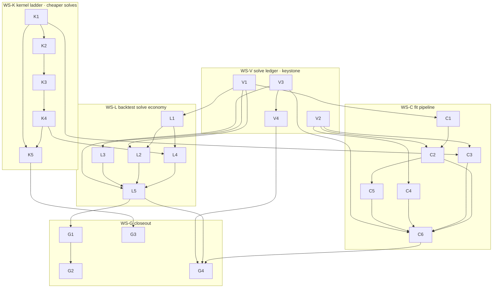

# atx-vol AL-Solve-Wall Throughput SOTA Sprint — 2026-07-18 (hot-path series #2)

> **For agentic workers:** executed by **parallel implementation subagents, one per workstream, each in its own git worktree** (§9 dispatch protocol). REQUIRED SUB-SKILL per subagent: `superpowers:executing-plans` (task-by-task, TDD, §3 contract). Progress tracks with the §7 git-SHA tracker. Every subagent re-reads §0 (count-then-cut mandate), §3 (global constraints), §5 (ownership/disjointness), §11 (traps + **do-not-relitigate dead-ends**) before touching a file.

**North star:** make atx-vol the **fastest _and_ most accurate** open options-pricing / vol-surface stack in the world. The previous hot-path sprint (2026-07-18 backtest-hotpath) landed the format, loop-structure, and lifecycle mechanics — and its reviews converged on one verdict, twice, as a **documented deviation**: *the remaining wall — in the backtest AND in the fit — is Andersen-Lake boundary solves.* This sprint attacks the solve wall from **both ends**: **fewer solves** (backtest solve economy, fit redundancy kill, cross-date warm-start) and **cheaper solves** (laned AVX2 kernel, preset ladder, first-order bundles) — and closes the two deviated gates (greeks ≥5×, backtest ≥5–10×) for real.

**Base:** `main @ 8fdaa41` (local only). Prior sprint Stage 3 (D4/D5 strategy+PNG on `wt-bt-data`, F-c populate driver on `wt-bt-fit`) may still be in flight — §5/§8 keep this sprint disjoint from those TUs until they merge.

**Prior docs:** `2026-07-18-atx-vol-backtest-hotpath-throughput-sprint.md` (parent; its §7 tracker + DoD follow-ups carry in), `2026-07-17-atx-vol-north-star-sota-sprint.md`, WS-B Stage-2 review (`.superpowers/sdd/bt-hotpath/reports/bt-backtest-stage2-review.md`), PM ledger (`.superpowers/sdd/bt-hotpath/progress.md`), and the **solve-wall deep-dive (this session, 2026-07-18)** — four code-anatomy reviews (backtest loop, AL kernel, fit pipeline, bench harvest) + two primary-source research sweeps. §2 is that deep-dive's findings list; every task in §4 cites its evidence.

**Architecture of this sprint:** five workstreams. One **keystone that makes solve-work countable** (WS-V — deterministic solve-ledger counters + fit-stage timing gaps + quiet-window ratification). Two **cheaper-solve levers** (WS-K kernel ladder + lanes; WS-C fit pipeline). One **fewer-solves lever** (WS-L backtest solve economy). One **closeout** (WS-G — carried DoD follow-ups + final real-universe capture). The load-bearing discovery of the deep-dive: **"1.5 ms/greeks" is not one solve — it is a ~7-boundary-solve FD bundle; the backtest re-buys that bundle up to 11×/unique/day through stamp-death and cross-stage re-marking; the fit re-buys boundary solves through a duplicate de-Am pass, per-date correction-cache rebuilds, and an unpinned scheduler that regresses past 8 workers — and a 4-lane AVX2 boundary kernel already exists in-tree, shipped dark behind a 2.0× gate it missed by 7%.**

---

## 0. Count-then-cut mandate (read first)

The parent sprint's clean-break license carries forward (pre-release; break API/ABI where it serves the design). This sprint adds its own discipline:

- **Every solve is accounted.** WS-V lands a deterministic **solve ledger** (AL boundary solves, premium quadratures, greeks bundles — counted, not timed) *before* the cut workstreams merge. Every fewer-solves task states its gate as a **counter delta** (e.g. "expiry-day steady state 11 → ≤6 solve-equivs/unique"), which is contention-free and bit-exact — timing gates ride on top under the quiet-window protocol.
- **No speculative optimization.** Every task in §4 cites the deep-dive evidence (file:line) for the cost it removes. If implementation reveals the evidence was wrong, the worker STOPS and reports — it does not pivot to a different optimization in the same lane.
- **Dead ends stay dead.** §11 lists levers that were already built, measured, and killed (in-solve SIMD, temporal boundary warm-start, optimizer replacement). Do not re-litigate them without new evidence; the burden is a measured counter/bench delta, not an argument.
- **Research-first, cite in-code** (§3) for every new kernel/algorithm — primary sources are pre-collected in the task rows; extend them, don't skip them.

---

## 1. North-star scoreboard

Baselines from `bench/baselines/*.json` @ 8fdaa41 (host i7-1260P, clang-cl 18; per-row status as stamped). **★ratify absolutes are re-set by WS-V quiet-window capture (V3); ratios are the merge gates.**

| Axis | Metric (bench row) | Baseline @ 8fdaa41 | SOTA target | Gap | Owning WS |
|---|---|---|---|---|---|
| **Greeks bundle** | `american_greeks/fd_warm` items/s | **673.7 (ratified, CV 2.9%)** | **≥5× (≥3,370)** via preset ladder + laned bundle + first-order tier | 5× | WS-K |
| **Portfolio greeks** | `port/floor/greeks/u64` uniq/s | 1,729 (citable) | **≥5×** book-level | 5× | WS-K→WS-L |
| **Solve economy** | AL solve-equivs per unique per expiry-day step (NEW deterministic ledger row) | **11** (5 pnl-base + 1 target + 5 exec; stamp dies on membership change) | **≤6** (L1 stamp survival) → **≤3** (L2 mark memo + L4 tier) | ~3.7× | WS-L |
| **Entry-day serial block** | strategy resolve+seed wall, 51-name entry day | **~0.75–4.5 s single-threaded** (serial loop; batched resolver exists unused) | **≤50 ms** (batched + fanned) | ~20–90× | WS-L |
| **Backtest** | `backtest/universe_strangle_hedged` steps/s | 14.97 **provisional** (CV 8.6%) | ★ratify then **≥8×**; real-universe YTD (51×~135d) **< 10 s wall** | 8× | WS-L (+K) |
| **Fit (single board)** | `fit/surface_cold/spy_real` ms/board | **25.17 ms (ratified, CV 3.2%)** | **≤8 ms (≥3×)** — dup-de-Am kill + preset tier + warm-start | 3× | WS-C |
| **Fit (populate)** | `fit_serialize/populate/threads:16` surf/s | 24.2 **provisional** (CV 4.2%); scaling 2.55× @16 workers | **≥75 surf/s ratified**; scaling **≥3.5× monotone @ 8 P-workers**; 51-name universe-date fit+serialize **≤5 s** | 3× | WS-C |
| **Cold marks (batch)** | AVX2 boundary-batch vs scalar | **1.87× — shipped DARK** (`kShipAvx2Boundary=false`, gate 2.0×) | **≥2.5× and Auto-ON** | flip+push | WS-K |

---

## 2. The deep-dive findings (this sprint's work-list)

Four read-only code reviews + bench harvest @ 8fdaa41. Solve unit **s** = 1 AL boundary solve (~37 µs fast / ~158 µs accurate); FD FullGreeks bundle ≈ 7 boundaries + 17 premium quads ≈ **1.5 ms**; analytic bundle = 5 s/unique (`backtest.hpp:306-308`).

**Backtest loop (why 15–19 steps/s):**
1. **Base-risk stamp dies on any book-membership change** (`Portfolio::create` mints a fresh logical id, `portfolio_pricer.hpp:150-151`; stamp key `portfolio_pricer.cpp:1523-1528`; `RetainedBookPricer::prepare` `backtest.cpp:74-92`). Daily held-to-expiry cohorts ⇒ every steady-state day IS an expiry day ⇒ **11 s/unique** (5 pnl-base re-solve + 1 target + 5 execute) vs 6 on a no-churn day. → **L1**
2. **No cross-stage per-(contract,date) mark memo**: settlement marks re-solve prices already in execute(i−1)'s frame (`backtest.cpp:740-768`); pnl target mark at T_t equals execute(i)'s mark at the same residual T *exactly* (`backtest.hpp:31`) yet both are computed, every contract, every day. → **L2**
3. **Strategy entry resolution is 100% serial**: `resolve_spec_impl` loops legs (`strategy.cpp:682-711`), each delta leg ≈ 10–25 s via Illinois iterations (`strategy.cpp:96-188`) + 5 s analytic seed (`strategy.cpp:450-451`). The bit-identical `resolve_strikes_by_delta_batched` (`strategy.cpp:322-348`) **exists and is unused**. 51-name entry day ≈ 0.75–4.5 s single-threaded — likely the #1 wall for delta-selector strangles. → **L3**
4. Adjoint route is compute-only — **no base-risk stamp support** (`portfolio_pricer.cpp:1074-1087`), so pairing lever 1 with the adjoint requires stamp plumbing. → **L4**
5. Sanity: 10-name/200-lot bench ≈ 200 uniques × ~6 s/u × 1.47 ms ≈ 53 ms/step — matches measured 18.9 steps/s. 51-name daily-clip predicts **multi-second steps** without L1–L3.

**AL kernel (why a bundle costs 1.5 ms):**
6. One solve = geometry bind (528 exp) + BAW seed (≤12 Newton root-finds) + **6 sweeps × ~550 Φ** (the dominant block: 11 nodes × 24 quad pts × barycentric-Chebyshev + 2Φ each, `american.cpp:833-929`) + premium quadrature (48 pts ≈ 100 Φ). Accurate ~158 µs, fast (`al_fast_opts` {7,16,4,1e-8}) ~37–47 µs. → **K1** preset ladder headroom: QuantLib's `QdFpAmericanEngine` fast scheme is (l=7, m=2, n=7, p=27) and the ALO paper reports ~10 µs/solve-class throughput at FD-grid accuracy.
7. **A 4-lane AVX2 boundary-batch kernel is already built and correct** (`american_boundary_avx2.cpp:110-279`: in-register SoA transpose, 4-wide BAW seed, lockstep sweeps with active-mask lane freezing) but ships dark: `kShipAvx2Boundary=false` because quiet-host 1.87× < 2.0 gate (`american_boundary_batch.cpp:31-73`). Marks route only; **the greeks route is strictly scalar per contract** (`american_batch.cpp:270-303` "scalar Greek stencil (honest)", `priced_surface.cpp:1009-1036`). → **K2/K3**
8. Adjoint ≈ 7 cold-solve-equivalents (taped generic solve + Christianson tangent sweeps + **volga's 2 cold σ± re-solves** `adjoint_greeks.cpp:374-403` + stencils) vs FD-warm ≈ 7 boundaries (1 cold + 6 warm) + 17 premiums — a wash ⇒ the measured 1.21×. Boundary is spot-independent ⇒ delta/gamma/theta/charm are **free per lane** once the boundary is laned. → **K3/K4**
9. A budget-tier ladder already exists below the solve: `al_fast_opts` marks 3–6× cheaper; `RepresentativeFast` correction-cache marks skip the boundary solve entirely (~6.5 µs, 15–75×, `priced_surface.cpp:604-617`). Which tier the backtest cold path actually resolves into `pricing_.al_opts` is unaudited. → **K1/L4**

**Fit pipeline (why fit = 95% of e2e wall):**
10. **Duplicate de-Am pass**: the eSSVI route runs a full second de-Americanization per expiry for certification/diagnostics (`session.cpp:1085` → `collect_input_diagnostics` `session.cpp:298` → `build_observations_european` `:385`) — the Configured route already fixed this exact duplication (`session.cpp:930-938`). De-Am is the post-F1 plurality of board wall. → **C1**
11. **Correction-cache rebuild tax**: ~192 AL boundary solves + 3072 slice prices per board per side pair (`session.cpp:816-817`, `correction.cpp:381`), serial, accurate-opts under the Robust default — rebuilt **every board, every date** for near-identical (r,q,σ)-boxes, and **invisible** to `FitTimings` (`surface_parity.cpp:448-474` stamps neither cache-build nor the diagnostics recompute). → **V2/C2**
12. **Zero cross-date warm-start in populate**: `fit_board` mints a fresh `PricerFitter` per board (`corpus_board_fit.cpp:265`); the eSSVI warm seed + Tikhonov prior seam **already exists** (`essvi_calib.cpp:721,753-785`) and is used only by refit paths — never by populate. No prev-date carry/IV seeds either. → **C2/C5**
13. **Parallel scaling 2.55× @16 is a hardware/scheduling artifact, not locks**: fit path is mutex-free; own baseline (`universe-cycle-11name.json`) shows near-linear scaling per **physical P-core**, a peak at 8 workers and **regression at 12/16** (E-core oversubscription); outer fit jthreads are unpinned while the executor's `Topology::PerformanceCores` pinning (`pricing_executor.cpp:149-186`) sits unused by the fit scheduler; 40 equal boards / 16 workers = half-idle last wave. → **C4**
14. The eSSVI LM optimizer is **not a lever**: ≤4 outer × ≤12 inner on 3 params, w-space objective, **0 AL/IV solves per eval**, ~2 ms/slice, SoA-batched kernels already (`essvi_calib.cpp:816-826`). → §11 dead-ends.
15. Robust preset governs populate (`surface_db.hpp:115`): accurate AL opts, `iv_tol 1e-7`, `n_atm=3`, MonotoneFit double-fit (`session.cpp:718-738`) — a Fast preset exists; no Populate tier was ever derived from measurement. → **C3**
16. Carry solve: ~56 ms/board recoverable via retained-AloPricer persistence (R-10/F5, deferred twice; `deamer.cpp:572`, fixed-point `:126-212`). → **C5**

**Primary-source research (pre-collected for the research-first tasks; extend, don't skip):** ALO paper (SSRN 2547027) + HPC-QuantLib preset analysis + QuantLib `QdFpAmericanEngine` source (fast (7,2,7,27) / accurate (25,5,13,1e-8)); Healy arXiv 2109.15157 (FP-A vs FP-B stability, |r−q| policy); SLEEF (sleef.org, arXiv 2001.09258) + SLEEF-vs-SVML data + mask-blend Cody-erfc vectorization; Intel SoA study (arXiv 2204.13740); masked-lane divergence practice (arXiv 2606.17065); Christianson 1994 fixed-point adjoint; Glau et al. dynamic Chebyshev (arXiv 1806.05579 — carry-forward, see §10); Mingone eSSVI box parametrization (arXiv 2204.00312 — **not** adopted this sprint, see finding 14); penalized recalibration λ‖p−p_prev‖² (arXiv 2512.19821); KTH warm-start thesis (DiVA 1445031); allocator/false-sharing diagnostics (arXiv 1502.07405, 1710.04094).

---

## 3. Global constraints (verbatim discipline — every subagent obeys)

- **§0 count-then-cut governs.** Fewer-solves tasks gate on solve-ledger counter deltas (deterministic) before timing. Cheaper-solve tasks gate on quiet-window bench ratios.
- **Research-first, cite in-code.** Any new hot-path algorithm / data structure / preset policy gets **primary-source web research before implementation** (sources pre-seeded in §2/§4 — verify and extend them). Cite the source in an in-code comment at the point of use. Binds K1/K2/K3/K4 (presets, vector Φ, laned bundles, first-order guard design), C2 (warm-start/penalized recalibration), C4 (topology scheduling), L1 (incremental identity / dirty-bit patterns).
- **Economic-correctness gate, not bit-identity** (for pricing/greeks accuracy changes). Price abs err ≤ `min(0.5·tick, 0.1·vega·1e-4)` and inside the quote half-spread; greeks vs FD reference to documented tolerance; no new butterfly/calendar/vertical arb. **Pure-refactor and fewer-solves tasks (C1, L1, L2, L3) additionally claim bit-identity or document the exact divergence** (e.g. summation-order) — the parent sprint's parity-gate style (B3 proof-by-construction) is the bar. **Determinism across worker counts is preserved everywhere**; C2's cross-date chain must document its determinism story explicitly (fixed per-symbol sharding; chain reproducible run-to-run).
- **Tier honesty.** Any accuracy-tier change (K1 marks preset, C3 populate preset, L4 tier wiring) lands with an explicit economic gate vs the accurate tier on real-OPRA fixtures and a documented policy of *where* the cheap tier is allowed. No silent global budget cuts.
- **Live/backtest primitive parity** (inherited). Everything the loop calls stays a pure function over canonical types; L1/L2/L4 route through the same `PortfolioPricer` APIs the live path uses.
- **Measurement honesty.** No headline number cited until WS-V has the baseline and the quiet-window protocol (P-core pin, best-of-N, CV ≤ 5%) has run. Deterministic counter gates are exempt (contention-free) and gate first. Correctness on Debug/`rel`; perf on `rel-avx2`.
- **Per-task contract.** Read-before-write (grep the symbol — deep-dive line numbers WILL have drifted); TDD (failing counter/parity/bench test first); classify every change `pure-refactor` / `accuracy-improving` / `accuracy-trading` / `abi-break` in-code; benchmark best-of-3.
- **Build discipline (CRITICAL for parallel agents).** Worktree's own `atx-build.ps1` by **absolute path**; `-Isolated` FETCHCONTENT per worktree; never Debug + Release concurrently in one worktree; `build` verb is hardwired to Debug — rel-avx2 needs raw `--build build-rel-avx2 --target …` (parent-sprint quirk, still true).

---

## 4. Workstreams & tasks

Task ID = `<WS-letter><n>`. Columns: **Files** (primary — re-grep, lines drift), **Approach**, **Impact**, **Risk**, **Deps**, **Class**.

### WS-V — Solve ledger & measurement v2 *(keystone; dispatch immediately)*
Owner: **verify agent**. Makes solve-work countable and closes the two instrumentation blind spots the deep-dive exposed. Counter taps land BEFORE WS-L forks (merge order §8) so L gates against them.

| ID | Title | Files | Approach | Impact | Risk | Deps | Class |
|---|---|---|---|---|---|---|---|
| **V1** | Deterministic solve ledger | `include/atx/vol/counters.hpp` (extend), thin taps in `src/american.cpp` (boundary-solve entry), `src/portfolio_pricer.cpp` (bundle entry), `src/backtest.cpp` (per-step scrape), test `tests/solve_ledger_test.cpp` (new) | Thread-safe (per-thread tally, merged at read) counters: `al_boundary_solves`, `al_premium_evals`, `greeks_bundles{fd,analytic,adjoint}`, `iv_newton_iters`. Backtest exposes per-step ledger deltas; fit exposes per-board. Gate tests assert the §2 cost model verbatim: steady-state expiry-day = 11 s/u, no-churn = 6 s/u, dup-mark counts — these become the regression baseline L1/L2/C1 gates move | Turns every fewer-solves claim into a bit-exact gate; catches regressions forever | Low | — | infra |
| **V2** | FitTimings blind-spot closure | `src/surface_parity.cpp:448-474` (FitTimings), `src/session.cpp` (cache-build + diagnostics stamps), bench attribution row | Stamp `correction_cache_ms` + `input_diagnostics_ms` (+ ledger counts) into FitTimings; extend the e2e attribution row so the fit fraction decomposes into carry/de-Am/cache/calib/diag/parity | The C-lane wins become attributable; today two of the biggest fit costs are invisible | Low | — | tooling |
| **V3** | Quiet-window re-capture + carry-over ratification (PM-assisted) | `bench/baselines/`, `bench/README.md` | Re-capture ALL provisional rows (backtest steps/s CV 8.6%, fit_serialize CV 43.5% serial) under quiet-window; ratify or re-stamp; execute the parent sprint's M4 carry-over | Honest ★ratify absolutes for §1 | Low | V1, V2 | infra |
| **V4** | Ratify scoreboard absolutes | this doc §1, `bench/README.md` | After V3 + each lever merge, freeze the §1 absolutes as merge gates | Scoreboard gate-able | Low | V3 | infra |

### WS-K — AL kernel ladder & laned greeks *(the cheaper-solve lever)*
Owner: **kernel agent**. Owns everything from the boundary solver down. The structurally-ready path to ≥5×: preset right-sizing × laned boundary kernel × laned greeks stencils × first-order tier. In-solve SIMD and temporal warm-start are DEAD (§11) — do not touch that axis.

| ID | Title | Files | Approach | Impact | Risk | Deps | Class |
|---|---|---|---|---|---|---|---|
| **K1** | Preset ladder — research + policy | `docs/` design note, `src/american.cpp:533-571` (scheme map), `american.hpp:67-74` (`al_fast_opts`), bench ladder row | **Research-first**: map our `AlScheme` onto QuantLib `QdFpAmericanEngine` presets — fast (l=7,m=2,n=7,p=27 all-Legendre), accurate (25,5,13, tanh-sinh 1e-8) — and Healy's FP-A/FP-B stability policy (FP-A only when |r−q| small). Build an accuracy×cost ladder bench on real-OPRA strike/T grids (price err vs µs/solve per preset); derive a **tier policy table**: marks-tier, greeks-tier, fit-de-Am-tier, cache-sampling-tier; audit what `pricing_.al_opts` the backtest cold path actually resolves to (`priced_surface.cpp:616-617,962`). Cite in-code | ALO paper runs ~10 µs-class solves at FD-grid accuracy; our fast is 37–47 µs, accurate 158 µs — likely ≥2× from preset right-sizing alone, and it multiplies every other lever | Low-Med (accuracy tiering) | (research) | accuracy-trading (gated) |
| **K2** | AVX2 boundary batch: push ≥2.5× and ship | `src/simd/american_boundary_avx2.cpp`, `american_boundary_batch.cpp:31-73` (gate), vector-math choice | Kernel is correct, misses its 2.0 ship-gate at 1.87×. **Research-first** vector Φ: mask-blend 3-region Cody-erfc + one vector exp (SLEEF u10 / hand FMA per SLEEF-vs-SVML data) vs current per-lane math; trim the fixed-16-iter 4-wide BAW seed per K1's ladder; sort pack membership by (T, moneyness) to cut mask-idle lanes (equal-T grouping already exists upstream). Re-gate on quiet window; flip `kShipAvx2Boundary` when ≥2.0 honest (target ≥2.5) | Cold marks ≥2×, and the laned substrate K3 rides on | Med | K1 | perf |
| **K3** | Laned greeks bundle (the ≥5× keystone) | `src/american_batch.cpp:199-303`, `src/priced_surface.cpp:948-1036` (batch arms), new laned stencil kernel | Extend the 4-lane pack from marks to **greeks**: one laned boundary solve per pack, then laned premium-quad stencils. Boundary is spot-independent ⇒ delta/gamma/speed/theta/charm ride FREE per lane (spot-stencil re-prices, no re-solve); vega/rho/vanna via laned bumped boundaries warm-seeded from the base lane (the scalar `al_solve_put_boundary_warm` pattern, laned); volga per K4 policy. Divergence policy per research: active masks + scalar patch-out for the ~16.5% guard-fallback lanes. Parity: economic gate vs scalar FD per §3, delta/gamma bit-identical where the scalar path claims it | Replaces the scalar-per-contract greeks loop — **2.5–3× on top of K1/K2**; composite K1×K2×K3 is the ≥5× greeks close | High (the sprint's hardest kernel work) | K1, K2 | perf |
| **K4** | First-order bundle + vega-guard redesign | `src/detail/adjoint_greeks.cpp:374-403` (volga σ± re-solves), `adjoint_greeks.hpp`, mask plumbing in `portfolio_pricer.cpp` | Build the `first_order_only` path the reviewer priced at ~2–2.5×: drop volga's 2 cold σ± re-solves + vanna's premiums when the caller's mask doesn't need them; **replace the vega self-consistency guard volga provided** (research: tangent-vs-Richardson cross-check or laned σ± at fast preset). Granular `PriceFieldMask` so hedge/risk callers request {delta[,vega]} only. Publish the tier seam for L4 | The hedge/risk path stops paying for 8 greeks when it consumes 1–2 | Med | K3 | perf |
| **K5** | Kernel parity + bench + gate flips | `atx-vol/tests/*`, `bench/portfolio_throughput_bench.cpp`, `american_greeks_reuse_bench.cpp` | A/B rows: `american_greeks/{fd_warm,laned,first_order}`, ladder rows per K1 preset; capture the missing `port/price/adjoint` baseline; economic-parity gates all lanes vs scalar; record every Auto-gate decision + quiet-window evidence | Proves K1–K4 honestly; closes the greeks ≥5× deviation with numbers | Low | K1–K4 | test/infra |

### WS-C — Fit pipeline: redundancy kill + warm-start + scheduler *(the fit lever — 95% of e2e wall)*
Owner: **fit agent**. §2 findings 10–16. The optimizer is off-limits (§11). Do not touch `examples/` populate drivers until the parent sprint's F-c merges (§8).

| ID | Title | Files | Approach | Impact | Risk | Deps | Class |
|---|---|---|---|---|---|---|---|
| **C1** | Kill the duplicate de-Am pass | `src/session.cpp:1085,298,385` (`collect_input_diagnostics`/`build_observations_european`), `surface_parity.cpp` seam | Reuse `prepare_legacy`'s de-Am rows/audit for the certification/diagnostics pass — the exact refactor the Configured route already shipped (`session.cpp:930-938`). Gate: fit outputs bit-identical (or documented ≤1e-12), V1 ledger shows de-Am passes 2→1 per expiry | De-Am is the post-F1 plurality; this halves its residual | Med (diagnostics semantics) | V1 | pure-refactor |
| **C2** | Cross-date warm-start chain | `src/corpus_board_fit.cpp:265` (fresh-PricerFitter), `src/surface_parity.cpp:326` (warm never passed), `essvi_calib.cpp:721,753-785` (existing seam), `src/deamer.cpp` (seed knobs), correction-cache persistence keyed (symbol, r/q/σ-box delta) | **Research-first** (penalized recalibration λ‖p−p_prev‖², prev-solution warm start). Populate iterates dates chronologically per symbol, **sharded by symbol across workers** (51 chains ≥ workers ⇒ no parallelism loss, determinism preserved); plumb prev-date `EssviParams` into the existing warm seam; seed carry/de-Am Newton from prev-date IVs; **persist correction caches across dates** with delta-gated invalidation + cold-start fallback. Gates: V1 ledger solves/board on dates 2+ down ≥40%; fit-quality parity in-band vs cold fit on every date; chain determinism run-to-run | The biggest CPU-work cut for the 51×135 backfill; caches alone are ~192 boundary solves/board/day of near-identical work | Med-High (correctness of stale-cache gating) | C1, V1, V2 | perf |
| **C3** | Populate preset tier | `surface_db.hpp:115` (Robust default), `session.cpp:718-738` (knobs), config plumb in `surface_db_populate.cpp` | Derive a **Populate tier** from K1's ladder: fast AL opts for cache sampling, measured `iv_tol`, single-fit vs MonotoneFit double-fit policy — each knob individually measured (V2 attribution) and economically gated (surface RMSE, arb checks, served-coverage vs Robust on real-OPRA fixtures) | Config-lane win on every board; Robust was never validated as the populate choice | Med (accuracy) | K1, V2 | accuracy-trading (gated) |
| **C4** | Topology-aware fit scheduler | `src/surface_db_populate.cpp:216-265` (budget+LPT), `src/fit_scheduler.cpp:59-118`, reuse `pricing_executor.cpp:149-186` pinning | Cap outer worker budget at **physical P-cores**, pin outer jthreads (reuse `Topology::PerformanceCores`); optional E-core small-board pool; fix wave quantization (LPT is a no-op on equal boards — schedule by measured per-board cost once V2 stamps it). Diagnostics first: scaling curve 1/2/4/8/12/16 with pinning on/off. Gate: monotone to 8, ≥3.5× vs serial on this host | Own baseline shows regression past 8 workers today; cheapest multiplier — makes every C win scale | Low-Med | V2 | perf |
| **C5** | Carry + pricer persistence (R-10 close) | `src/deamer.cpp:126-212,572`, retained-AloPricer seam | Land the twice-deferred retained-AloPricer persistence across expiries/boards (~56 ms/board per F5 evidence); compose with C2's cross-date seeds | Recovers a known, sized win | Med | C2 | perf |
| **C6** | Fit gates + universe-date bench | `bench/fit_serialize_bench.cpp`, new universe-date row, `tests/*` | 51-name universe-date fit+serialize wall row; re-capture surf/s + `fit/surface_cold/spy_real` after C1–C5; quality-parity suite (per-date RMSE/arb/coverage vs Robust cold) as the standing gate | Proves the fit axis honestly | Low | C1–C5 | test/infra |

### WS-L — Backtest solve economy *(the fewer-solves lever)*
Owner: **loop agent**. §2 findings 1–5. Every task gates on the V1 ledger first, timing second. Bit-identity or documented-divergence per §3. Consumes K seams; does not edit kernel TUs.

| ID | Title | Files | Approach | Impact | Risk | Deps | Class |
|---|---|---|---|---|---|---|---|
| **L1** | Base-risk stamp survives membership change | `src/backtest.cpp:74-92` (RetainedBookPricer), `src/portfolio_pricer.cpp:1523-1580` (stamp), `portfolio_pricer.hpp:150-184` (identity) | **Research-first** (dirty-bit/incremental-identity patterns — QuantLib LazyObject precedent). Either (a) incremental `Portfolio` membership: settle/append preserve logical id + stable per-contract rows, revision bump keyed to *composition delta* not wholesale re-create, or (b) frame subset-carryover: map surviving uniques' rows from execute(i−1)'s frame into pnl(i)'s base without re-solving. Gate: V1 ledger expiry-day steady state **11 → ≤6 s/u**; results bit-identical (same values, same order — B3-style proof) | ~1.8× on the solve wall of every steady-state day of the real config | Med-High (identity semantics) | V1 | perf |
| **L2** | Per-(contract,date) mark memo | `src/backtest.cpp:740-768` (settlement), `:1138-1156` (target seal), execute-frame price column, `backtest.hpp:31` (T identity) | One per-step mark table keyed by unique id; settlement, roll-close, pnl-target, and record-row marks all read it; the T-identity (`T_base − dt == T_shifted` exact) makes execute(i)'s mark == pnl(i)'s target mark by construction. Gate: V1 duplicate-mark counter == 0; bit-parity or documented ≤1e-15 story | Removes 1–2 s/u/day of pure re-computation | Med | V1, L1 | perf |
| **L3** | Batched + fanned entry resolution | `src/strategy.cpp:682-711` (serial loop), `:322-348` (existing batched resolver), `:450-451` (seeds) | Route `expand_leg` delta legs through `resolve_strikes_by_delta_batched` (already bit-identical to serial, tol 0.0) and fan the per-leg `full_greek_seed` through the batched pricer. Gate: identical entries (bit); entry-day resolve+seed wall ≤50 ms on the 51-name config (bench row) | Kills the 0.75–4.5 s serial block on every daily-clip entry day — possibly the single biggest real-config wall item | Med | V1 | perf |
| **L4** | Tier wiring: first-order risk, full explain | `src/backtest.cpp:1494-1505` (execute risk frame), `:905-906,1369-1370` (tier wiring), K4 seam | Hedge needs delta; entry frictions need vega; only the recorded pnl-explain row needs all 8. Wire K4's first-order mask into the execute risk frame; keep the full bundle for pnl columns; add adjoint/first-order **stamp support** so L1's reuse composes (`portfolio_pricer.cpp:1074-1087`). Document the tier policy in-code; economic gate on hedge/PnL parity vs full-bundle run | The residual per-step bundle cost drops toward ≤3 s/u composite | Med | K4, L1 | perf |
| **L5** | Composed loop gates + steps/s | `tests/backtest_exec_test.cpp`, `bench/backtest_throughput_bench.cpp` | Re-run the parent sprint's exact-coverage determinism gates (composed subset+settlement, hedge+cohorts) over L1–L4; 2-run + 1-vs-4-thread bit-identity; zero-alloc gate re-run; V1 ledger regression rows pinned; quiet-window steps/s vs the V3-ratified baseline — **the ≥8× gate** | Closes the deviated Backtest axis with numbers | Med | L1–L4, V3 | test/infra |

### WS-G — Closeout: carried DoD + final capture *(Stage 3; sequential, after K+L+C merge)*
Owner: **closeout agent** (fresh). Executes the parent sprint's carried follow-ups that were blocked on ownership seams, then the final honest capture.

| ID | Title | Files | Approach | Impact | Risk | Deps | Class |
|---|---|---|---|---|---|---|---|
| **G1** | SurfaceSet view re-point (zero-copy letter) | `portfolio_pricer.{hpp,cpp}` (~35 `const PricedSurface*` sites), `src/backtest.cpp` (`reconstruct_symbol`→`map_symbol`) | Template/re-point `SurfaceSet` on the v2 view per the format seam; flip B1's loader to `map_symbol`. Mechanical; ~0% wall (M3) but closes the deserialize DoD letter end-to-end | Parent-sprint DoD debt retired | Low-Med | K, L merged | abi-break |
| **G2** | v1 link isolation | `atx-vol/CMakeLists.txt`, bench/migrator TUs | v1 read/write out of `atx::vol.lib` into bench/migrator-only TU (parent adjudication A) | Clean product library | Low | G1 | infra |
| **G3** | Golden re-pin | `PreparedPortfolio` fingerprint test | Re-verify economics asserts green, then re-pin `kGoldenFingerprint` (stale since S4 fixture migration; PM-verified not-ours) | Known-red retired | Low | K, L merged | test |
| **G4** | Final real-universe capture + scoreboard close | `bench/baselines/`, this doc §1/§7, PNG re-render sanity | Quiet-window D-stage real-universe run (51-name YTD once data/populate complete): steps/s, fit universe-date wall, YTD total wall; V4 ratification; re-render the parent sprint's acceptance PNG against the faster engine (bit-compare PnL series vs pre-sprint run — economics unchanged) | The sprint's honest exit numbers | Low | everything | infra |

---

## 5. Ownership / disjointness matrix (one writer per TU)

| Owner (worktree) | Owned TUs / headers |
|---|---|
| **verify** (`wt-sw-verify`) | `include/atx/vol/counters.hpp`, `tests/solve_ledger_test.cpp`, `bench/baselines/`, `bench/README.md`, e2e attribution rows in `bench/e2e_hotpath_bench.cpp`; **thin counter taps** in `american.cpp`/`portfolio_pricer.cpp`/`backtest.cpp`/`surface_parity.cpp` land in V1/V2 BEFORE K/C/L fork (merge order §8) — after that, tap edits belong to the TU's owner |
| **kernel** (`wt-sw-kernel`) | `src/american.cpp`, `american.hpp`, `src/american_boundary.hpp`, `src/american_batch.cpp`, `src/simd/american_boundary_avx2.cpp`, `american_boundary_batch.cpp`, `src/detail/adjoint_greeks.{hpp,cpp}`, `src/priced_surface.cpp` (evaluate/batch arms), `bench/american_greeks_reuse_bench.cpp`, `bench/portfolio_throughput_bench.cpp` (append rows) |
| **fit** (`wt-sw-fit`) | `src/session.cpp`, `src/surface_parity.cpp`, `src/corpus_board_fit.cpp`, `src/corpus.cpp`, `src/deamer.cpp`, `src/prepared_fitting.cpp`, `src/calib.cpp`, `src/essvi_calib.cpp` (warm-seam plumb only — optimizer internals off-limits §11), `src/correction.cpp`, `src/surface_db_populate.cpp`, `src/fit_scheduler.cpp`, `surface_db.hpp` (preset), `bench/fit_serialize_bench.cpp` |
| **loop** (`wt-sw-loop`) | `src/backtest.cpp` + `include/atx/vol/backtest.hpp`, `src/portfolio_pricer.cpp` + `portfolio_pricer.hpp` (stamp/identity/memo/tier wiring — kernel publishes greeks entry points as a seam, loop wires them), `src/strategy.cpp` (batched-resolve wiring), `tests/backtest_exec_test.cpp`, `bench/backtest_throughput_bench.cpp` |
| **closeout** (`wt-sw-close`) | Stage-3 sequential — inherits `portfolio_pricer.{hpp,cpp}`/`backtest.cpp` AFTER loop merges (no concurrency), CMake link-isolation, fingerprint test |
| **Shared, append-only** | `bench/CMakeLists.txt`, `tests/CMakeLists.txt` — append own targets; keep-all-targets merge |

**Contention notes:** (1) `portfolio_pricer.cpp` is **loop-owned** this sprint (stamp/memo/tier are engine semantics); **kernel** exposes K3/K4 through `american*`/`adjoint_greeks*`/`priced_surface.cpp` batch arms + a published seam doc (`seams/laned-greeks.md`) — same pattern as the parent sprint's batched-marks seam. (2) `priced_surface.cpp` is kernel-owned; fit consumes it read-only. (3) `essvi_calib.cpp` warm-seam: fit may plumb parameters through the EXISTING seam (`:721,753`) but must not modify LM internals. (4) Parent-sprint Stage 3 in flight: `wt-bt-data` owns `examples/spy_dispersion_pnl.cpp`/`dispersion_strangle.cpp`/tools; `wt-bt-fit` F-c owns `examples/*populate*` drivers — **this sprint touches none of those**; C4's `surface_db_populate.cpp` edits sequence AFTER F-c merges (§8). (5) V1's taps predate every fork — no tap-vs-owner conflict.

---

## 6. Agent DAG

**Keystone edges:** V1/V2 gate every counter-based claim — they merge first. K1's ladder feeds both K2/K3 (kernel tiers) and C3 (populate tier). K4's first-order seam is L4's dependency — kernel merges before loop finishes. G is strictly sequential last.

---

## 7. Git-SHA tracker *(filled during execution — one row per task)*

| Task | Branch | Status | SHA(s) | Gate result |
|---|---|---|---|---|
| V1 | `feat/sw-verify` | ☐ todo | — | ledger rows match §2 cost model (11/6 s/u) |
| V2 | `feat/sw-verify` | ☐ todo | — | cache-build + diag stamped; attribution decomposed |
| V3 | `feat/sw-verify` | ☐ todo | — | provisional rows re-captured CV≤5% |
| V4 | `feat/sw-verify` | ☐ todo (PM) | — | absolutes frozen |
| K1 | `feat/sw-kernel` | ☑ landed | `033899f` | ladder bench + tier policy + al_opts audit (docs/al-preset-ladder.md) |
| K2 | `feat/sw-kernel` | ◐ prov. landed (flag OFF, PM quiet-window pending) | `f30abdf`, `b48d4e9`, `73bcaf3` | AlOpts l≠p + specialize (7,8) + ql_fast batch gate rows; ql_fast tier **2.4–3.8× PROVISIONAL** (clears ≥2.5×); accurate 1.4–2.7×; levers 1/5 dead, 4 deferred-to-caller; `kShipAvx2Boundary` left OFF for PM A/B (report kernel-stage1.md) |
| K3 | `feat/sw-kernel` | ◐ seam published | `2ffda57` | seam doc docs/seams/laned-greeks.md published for L4; laned bundle impl pending |
| K4 | `feat/sw-kernel` | ☐ todo | — | first-order path + new vega guard green |
| K5 | `feat/sw-kernel` | ☐ todo | — | `american_greeks/*` A/B rows; ≥5× composite |
| C1 | `feat/sw-fit` | ☐ todo | — | de-Am passes 2→1; outputs bit-identical |
| C2 | `feat/sw-fit` | ☐ todo | — | solves/board −≥40% dates 2+; quality in-band |
| C3 | `feat/sw-fit` | ☐ todo | — | Populate tier gated vs Robust |
| C4 | `feat/sw-fit` | ☐ todo | — | scaling monotone→8, ≥3.5× |
| C5 | `feat/sw-fit` | ☐ todo | — | carry persistence; ~56 ms/board recovered |
| C6 | `feat/sw-fit` | ☐ todo | — | universe-date ≤5 s; spy_real ≤8 ms |
| L1 | `feat/sw-loop` | ☐ todo | — | 11→≤6 s/u ledger gate; bit-identical |
| L2 | `feat/sw-loop` | ☐ todo | — | dup-mark counter 0 |
| L3 | `feat/sw-loop` | ☐ todo | — | entry-day resolve ≤50 ms; entries bit-identical |
| L4 | `feat/sw-loop` | ☐ todo | — | tier policy wired; ≤3 s/u composite |
| L5 | `feat/sw-loop` | ☐ todo | — | determinism gates + **≥8× steps/s** |
| G1 | `feat/sw-close` | ☐ todo | — | SurfaceSet on views; map_symbol live |
| G2 | `feat/sw-close` | ☐ todo | — | v1 out of product lib |
| G3 | `feat/sw-close` | ☐ todo | — | golden re-pinned green |
| G4 | `feat/sw-close` | ☐ todo | — | real-universe capture; scoreboard closed |

Update convention: `☐ todo → ◐ in-progress → ☑ landed`; paste SHA(s) + one-line gate result. Dispatching session owns merges (§8), each gate re-run on merge.

---

## 8. Sequencing (waves / stages)

- **Stage 0 (immediately, parallel — disjoint):** WS-V (V1→V2, fast — merge as soon as green), WS-K (K1 research + ladder). WS-C wave-1 (C1 + C4 diagnostics) may start in its worktree but rebases on V before merging. **Coordinate:** if parent-sprint F-c is still open, C4's `surface_db_populate.cpp` work waits for F-c's merge (disjoint TU but same subsystem — avoid semantic drift).
- **Stage 1:** merge WS-V. WS-K (K2→K3), WS-C (C2, C3 after K1's ladder), WS-L forks from post-V main (L1, L2, L3 — independent of K).
- **Stage 2:** WS-K (K4, K5) → merge WS-K. WS-L (L4 after K4 seam, L5). WS-C (C5, C6). V3 quiet-window re-capture as each lever merges.
- **Stage 3:** merge WS-L, WS-C. WS-G sequential (G1→G2, G3, G4 final capture + V4 ratification).

**Merge order:** WS-V → WS-K → WS-C → WS-L → WS-G. (C before L is arbitrary — fully disjoint TUs; swap if C6 waits on data.) Dispatching session owns every merge + gate ladder re-run.

---

## 9. Dispatch protocol (parallel worktree agents)

1. Dispatching session creates one worktree per workstream from `main @ 8fdaa41` via `scripts/new-worktree.ps1 -Name <wt> -Branch <branch> -Base main -NoConfigure -Isolated`.
2. Each subagent receives: this file, its workstream section, §0/§2 (its findings + evidence lines), §3 constraints, its §5 ownership row, its worktree path. It executes ONLY its own tasks; it must not edit another owner's TU.
3. **Build only via the worktree's own script by absolute path**; `build` verb = Debug only, rel-avx2 = raw `--build build-rel-avx2 --target …`; `-Isolated` FETCHCONTENT; never Debug+Release concurrently in one worktree. Correctness on Debug/`rel`; perf on `rel-avx2` quiet-window.
4. Each task = its own commit (conventional message + class label). Workstream ends: Debug + Release green, focused tests green, bench JSONs in `bench/baselines/`, §7 row updated, report to `.superpowers/sdd/sw-solve-wall/reports/<ws>-stage<N>.md`.
5. **Research-first tasks (K1, K2, K3, K4, C2, L1):** verify + extend the §2 pre-collected sources BEFORE implementing; write the design note; cite the primary source in-code at the point of use. If web research contradicts in-tree measured evidence (e.g. a paper recommends warm-starting but §11 shows it measured 1.04×), **in-tree measurement wins** — note the conflict in the design note.
6. **Seam-coordinated tasks:** kernel publishes `seams/laned-greeks.md` (K3/K4 entry points + mask semantics) before L4 forks its wiring; verify publishes the counter-tap API in V1 before anyone else merges.
7. **Per-worker brief (workstream-specific):**
   - *verify:* counters are per-thread tallies merged at read — zero contention on the hot path; a counter that perturbs the timing it measures is a bug.
   - *kernel:* the lane axis is CROSS-CONTRACT, never in-solve (§11); every accuracy-tier change carries its economic gate + the quiet-window A/B; keep the scalar path as the oracle and the fallback.
   - *fit:* determinism of the C2 chain is a gate, not a nice-to-have — fixed symbol-sharding, reproducible run-to-run, cold-start fallback path tested; quality-parity suite runs on EVERY date, not a sample.
   - *loop:* bit-identity proofs in the B3 style (same values, same order, by construction) — the parent sprint's review bar; V1 ledger gate BEFORE timing gate on every task.
   - *closeout:* G1 is mechanical but wide (~35 sites) — compile-driven, no semantic edits; G4 numbers only from quiet-window.
8. Dispatching session owns every merge + gate ladder re-run; pre-existing known-reds (§ parent ledger) stay off-scope unless a task claims them.

---

## 10. Definition of done (this sprint's exit gates)

| Gate | Target |
|---|---|
| **Greeks (closes parent deviation)** | `american_greeks` composite ≥5× vs the 673.7 items/s ratified baseline (K1×K2×K3 ladder), economically parity-gated; `port/floor/greeks` ≥5×; A/B rows + adjoint baseline captured |
| **Solve economy** | V1 ledger: expiry-day steady state ≤6 s/u (L1), duplicate marks 0 (L2), entry-day resolve ≤50 ms (L3), composite ≤3 s/u with tiering (L4) — all deterministic, all pinned as regression tests |
| **Backtest (closes parent deviation)** | quiet-window steps/s ≥8× the V3-ratified `universe_strangle_hedged` baseline; real-universe YTD < 10 s wall (G4); bit-identical across `n_threads`; parent determinism gates re-green |
| **Fit** | `fit/surface_cold/spy_real` ≤8 ms; populate ≥75 surf/s ratified; scaling monotone to 8 P-workers ≥3.5×; 51-name universe-date fit+serialize ≤5 s; quality parity in-band on every date (C6 suite) |
| **Kernel shipping** | AVX2 boundary batch Auto-ON at ≥2.0 honest (target ≥2.5); preset tier policy table documented + wired; no silent budget cuts (every tier change gated) |
| **Carried DoD retired** | SurfaceSet on views + `map_symbol` live (G1); v1 link-isolated (G2); golden re-pinned (G3); provisional rows ratified (V3/V4) |
| **Honesty** | every headline number quiet-window CV≤5%; counter gates green in CI; §7 tracker complete with SHAs |

**Carry-forward (explicitly out of scope):** Chebyshev/dynamic-Chebyshev parametric surrogate for backtest-amortized pricing (Glau et al. — the correction-cache fast tier already covers the mark path; a full surrogate-greeks tier is its own sprint once the direct solver is the validated oracle); AVX-512 (deployment silicon); GPU; eSSVI reparametrization (Mingone) — the optimizer is not a bottleneck (finding 14); listed-contract execution realism.

---

## 11. Risks & standing traps

1. **DO-NOT-RELITIGATE dead-ends (measured, in-tree):** (a) **in-solve SIMD** — xsimd on the 24-pt quad loop measured 6.6× SLOWER, SVML unavailable on clang-cl (`american.cpp:888-899` history); the lane axis is cross-contract only. (b) **Temporal boundary warm-start across dates** — probe built + measured ~1.04× (seed is not the dominant cost at fixed sweep budget; 07-09 sprint Task-12 kill). Only revisit if K1 cuts sweep budget on warm hits — and then only with a fresh A/B. (c) **eSSVI optimizer replacement** — LM is ~2 ms/slice, 0 AL solves/eval; not a lever. Any worker proposing these without new counter/bench evidence is off-plan.
2. **Accuracy-tier creep.** K1/C3/L4 all trade accuracy for speed under gates. The trap is composition: each tier individually in-band, the composition out-of-band. C6/L5/K5 gates run the COMPOSED pipeline against the accurate reference, not just per-stage checks.
3. **L1 identity semantics.** The stamp key is the correctness boundary between "reuse" and "stale risk". The B3 review bar applies: prove same-values-same-order by construction, and build a positive control (a run where reuse WOULD be wrong fails loudly — parent's composed-gate pattern).
4. **C2 chain determinism + state.** Cross-date warm-start introduces order dependence by design. Fixed per-symbol sharding, reproducible chains, delta-gated cache invalidation with a tested cold path — and the quality-parity suite on every date. A warm-started fit that drifts out of band silently is worse than slow.
5. **K3 divergence cliffs.** ~16.5% of contracts route to guard fallbacks; a 4-lane pack with 1 fallback lane must patch out without serializing the other 3. Sorting by (T, moneyness) reduces this; the scalar path remains the oracle.
6. **Seam races.** `portfolio_pricer.cpp` is loop-owned; kernel work stays behind the published seam. V1 taps land before all forks. G inherits only after L merges.
7. **Parent Stage-3 in flight.** `wt-bt-data` (D4/D5) and `wt-bt-fit` (F-c) may still be open — §5 keeps TUs disjoint; C4 sequences after F-c; G4's real-universe capture depends on their completion (D3 populate + PNG path).
8. **Bench noise.** Shared-host numbers are provisional; deterministic gates (counters, parity, thread-invariance, alloc counts) gate first; quiet-window protocol for every headline. Hazards carried: ninja restore-miss (touch + confirm rebuild), agents commit only their own files, never `git add -A`.
