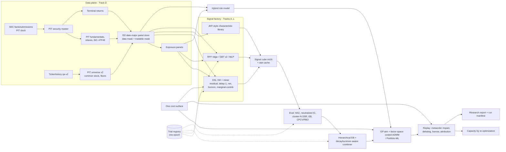

# atx alpha engine: engine and implementation sprint series (v2)

**Status (2026-09-26):** W0 implementations, D0 correctness approval and corrected L9 evidence are integrated. The owner deferred the long performance comparison. The pulled-forward IC screen passed 102 distinct focused checks under V2, but noisy-null rejection remains unqualified. Explicit EquivalenceV3 and W1 A1/E1 source are integrated and independently reviewed; bounded correctness report `123163e2` records 189 distinct passing checks. D1, A5, B1 core/calibration and E6 components have bounded integrated evidence at `16c96293`: 283 distinct C++ checks plus 22 Python checks passed. D5, remaining B1 models, date CPCV core and R1 now have bounded evidence at `dbb16af3`: 262 distinct C++ checks plus 7 Python checks passed. These overlapping batches are not additive counts. D6, CPCV callers and R2 passed bounded checks at clean source `2e398101`; six completed XMLs record 465 passes and one existing opt-in skip. I1 runtime fixture repair `70bfef58` passed its three-case rerun. Compiler/private-boundary report `a850d48f`, independently audited at `63e1ee26`, records 82 distinct focused passes, a 3.804s unchanged build and a 21.759s one-CPP cache-miss edit plus four links. L1, the pulled-forward R3 slice and delayed A4 execution now have bounded runtime evidence at clean source `2a3d5c2b`: report `ffa53664`, independently audited at `66099fa9` (source `493af0f6`), records 249 distinct passes, including all 28 new owning checks. E2 trial accounting and L2 GBT now have bounded runtime report `3718b266`: 41 distinct passes after test-only correction `42677f24`, including all 18 new checks. I2 exposures and the remaining A4 residual objective are in source development. W1–W5 are not complete.
**Version:** v2, 2026-09-24. It replaces the v1 content of this file, which covered production runtime and paper trading; those are now out of scope.
**Companion:** [`2026-09-24-alpha-engine-review-findings.md`](2026-09-24-alpha-engine-review-findings.md). It holds the defect register (IDs `A-xx`, `D-xx`, `E-xx`, `L-xx`, `R-xx`, `B-xx`, `I-xx`, each with file:line) and the research digest (§3). Every lane below cites those IDs. A lane brief is incomplete until it lists the IDs it closes.

**Scope:** `atx-engine` (library) and `atx-impl` (research pipeline stages), plus the minimum `atx-db` and tools work without which the engine cannot produce honest numbers. Out of scope:
- daily production runs, broker adapters, paper trading, scheduling, alerting
- licensed data procurement (see ruling R-3)

---

## Active objective pivot (2026-09-26)

The owner now prioritizes a combined multi-subalpha DSL strategy targeting net
Sharpe >= 1, low turnover and thousands of stocks using 2020+ data. This
supersedes full sprint completion as the immediate objective and the older
pre-2020-only data restriction. The [active strategy plan](2026-09-26-mega-alpha-strategy.md)
records priorities, date-role discipline and current work allocation. Unfinished
wave gates remain unfinished; strategy performance has not yet been measured.

## Execution record

This is the original DAG plan and its completion index. Fill implementation, integration,
and evidence SHAs here as each element finishes; a merged implementation is not a passed
wave gate. Each implementation is reachable through its recorded integration/import;
cherry-picked source SHAs remain listed alongside their resulting integration SHAs.

| Element | Implementation and integration SHAs | Completed evidence / remaining work |
|---|---|---|
| Recent strategy: strict gap diagnosis | `e2b97317` -> `32f074b3`; fixture `e53d13a3` -> `429bf26c`; reports `372e87e4`/`ba7df9de`; exact evidence `480af2d7`/`eb2559e8` | Supersedes initial attempt count below: two attempted, zero completed. Diagnostic build20.824s Jobs2; affected17/17 cases pass. Retry7.484s identifies MDCO39621; full pinned-source inspection confirms genuine archive end. No Sharpe result. |
| W2-D2 pulled forward: signed fixed-cash claims | Core `c0be402e` -> `eb67e4d5`; clock `1ef2524d` -> `8ae8294c`; locked-capital fix `440d538f` -> `963adbc0`; fixtures `25ff0a88` -> `a2fe3280`, `3d1ef20a` -> `9d8a718f`, `47696031` -> `f8d1062f`; review `eeb6dc03` -> `88f1e2c3` | Independently source-approved; seven focused native cases await root runtime. Explicit signed, nonspendable claims; unknown settlement and continued modeled short borrow. General corporate-action/type coverage remains open. |
| Recent strategy: claim-aware runner | `80ebf709` -> `1ab4a490`; decision mask `5e1fa849` -> `be2ce0ad`; fixtures `a86b274d` -> `010cc1a8`; report `1b62048e` -> `d52ed04b` | Strict pinned opt-in v2 recipe, source-to-role binding, causal VM/blend support and claim diagnostics. Three postimplementation cases await runtime; independent source review in progress. |
| Recent strategy: sourced cash rights / event forensics | Forensic `c20991e6` -> `6b270e8b`, batch `4921b170` -> `2a41477a`; primary evidence `7ae76e91` -> `14f20dd8`; config/evidence `ba58bab2` | Five sourced cash rights registered before a completed result. MDCO forensic8.938s; 38-ID batch10.5s/121MiB, not a price repair. Existing event/type warehouse tables empty. Claim config SHA256 recorded in active plan. |
| Recent strategy: actual calendar turnover | `779add70` -> `494ecc75`; fixture `91329304` -> `6a05ec3f`; include `b011e3c5` -> `bc294127`; report `cf4621e6` -> `10f3e98f` | Calendar-month actual fills/pretrade NAV, initial deployment included and disclosed, calendar-year net returns. One cross-month/year fixture awaits native qualification; no execution/selection arithmetic change. |
| Recent-data DSL strategy priority | Plan `469972f4`, admission `497f567e`; guard `257ffd3b`/`11afd431`; library `eeb76477` -> `cf252c5b`; cadence `54b4ec99` -> `34fcac6b` | Owner-confirmed $1bn NAV. Fixed24 candidates/six families/two variants. All19 focused native checks pass at497f567e, including DSL causal masking. Build88.873s Jobs3; fixture-only13.521s. First real rehearsal fails held-return validation in6.234s; one attempted/zero completed trials, no Sharpe result. Full sprint/wave completion is not the immediate goal. |
| Recent-data adapter | `5f3b6631` -> `c4a9f015`; fixes `70dd7213` -> `a304139f`, `7a67f15e` -> `8d4bdb61`, `76069fce` -> `8f3b4017`; review `fa1868ea` -> `427815bc` | Six producer and two owning native checks pass. Extraction39.203s; cached Q1/Q2 preparation6.391s/7.359s. TRAIN daily2872..3000 eligible; dated common-stock/source-vintage qualification remains open. Mask audit7a69b22a->3f9e1749 identifies potential gaps without altering membership. |
| Combined DSL execution runner | `7fa3c6ab` -> `b6223176`; fixes `97da349f` -> `ecca5a33`; fixtures `dbd50b14` -> `fc592913`; review `a48ef5e5` -> `ba29f2a3`, `5f03b4df` -> `e86a7bd0`; report `30f25f26` -> `53163fbd` | Three native runner cases, four cadence cases and nine shared execution cases pass within the19-case packet. TRAIN signs, fixed blend, netted actual fills/costs/borrow and durable attempts implemented. Real missing/guarded held return blocks first strategy result; diagnostics in progress. Detailed evidence: .superpowers/sdd/strategy/2026-09-26-native-and-first-rehearsal.md. |
| W0-O1 | L6 `1cf59cb7`; fixes `c339ead5`, `853d1dd9`; merge `14ce9172` | Approved at `3ccf012c`. Release binaries built; quiet benchmark comparison still pending. |
| W0-A0 | `cb3b4e78`, `3a1197b5`, `b74e27d3`; merge `1d78cc14` | Report `9a4e1f46`; owning targets green. A-18 production cache wiring remains W2-A4. |
| W0-D0 | Original `115cfb57`, `02d34323`, `be32d7ac`; merge `2bc9f034`. Raw VWAP correction `f54b55e5`, context `2a7194d5`, bounds `0f74a357`, legacy ordering `c1011024`; tests `58df3e29`, `c68b78a4`, `1e4ee053`, `efe57fd9` | Original report `822524f6`; final correctness report `932c1061`, approval `b131c3f4`, alpha qualification `033b89c2`, scope audit `f1620990`, integrated hygiene `63d28b5c`. **Affected targets: 1,683 passed, six documented skips, zero failures; independent N128 fixture oracle and nine independent focused checks passed.** Corrected L9 report `5c933ba6` closes the numerical rerun with zero admissions. Long performance comparison is owner-deferred. Raw daily-close proxy defaults to V2; adjusted typical-price V1 remains explicit. True intraday VWAP is unavailable; source shares remain W2-D3. |
| W0-E0a | `2f814fbe`, `a95df360`; merge `4ef916db`; follow-up `52b8c6ea` | Reports `33d9b2f3`, `c225b2cf`. Public V1 reproduction and overlap inference repaired; HAC coverage 94.5%. Bootstrap is a separate estimator. |
| W0-E0b | `d0a37e02`, `e0d157ee`; merge `1e0a7cf9` | Report `a0b06547`. Null FPR 5.45% qualifies `MonteCarloMaxV2`; the conservative default is a different rule. |
| W0-L0 | `67819c8f`, `3ec645a8`, `c962996a`; merge `1b766875` | Report `5b11f7cb`; whole learn target green. Autoencoder trial accounting remains W3-L4. |
| W0-R0 | `40e26729`, `bde13cc8`; merge `a5523e21`; native ASan `370f7af4` | Approval `bae90033`, ASan report `3e6886ce`. Five scoped bounds tests pass; final changed risk target 470 passed / one nightly skip. Production PIT exposure wiring remains W3-R4. |
| W0-B0 | `7fa44bc8`, `8421646f`; merge `79c120ed`; causal replay `8ba15b0e`; disclosure `1bdeed38` | Reports `3ddf5b46`, `47e5ef8e`, `d4b86cd2`, final closure `21ede21d`. Book 128/128 and whole impl 600 passed / five disclosed skips. Unevidenced liquidation stress remains ineligible alpha evidence. |
| W0-I0a | `6c31e0fe`, `38f64385`, `5559417c`; merge `9a20221f` | Report `9d10ec43`; lane checks and integrated target passed. |
| W0-I0b | `4b4a48c6`, `190c2fb4`; merge `42503d8e`; membership `af40186d`; replay `8ba15b0e`, `1bdeed38` | Reports `9d3eddb2`, `b09f45ce`, `47e5ef8e`, `d4b86cd2`, final closure `21ede21d`. Earlier Abort workaround `794d88da` superseded. Whole impl green; real terminal evidence remains W2-D2. |
| W0 integration fixup | `e8b1785d`; merge `2dc21315` | JSONL normalization and degenerate zoo fixture corrected. |
| W0 discovery resume identity | `0037c515` | Capacity settings now bind persisted configuration and fingerprint when augmentation is active. Source reviewed; owning runtime and no-PCH production build passed in `932c1061`. |
| G0 | Harness imports `b004d7c7`, `f19d522b`; report import `9225cb30`; D0 impact review `35c68fe6` | **Original frozen comparisons complete.** Old/new measurements and manifests verified; no alpha promoted. D0 corrected L9 completed at `5c933ba6`: 2,523 candidates, 2,293 scored, 47-family validation, zero admissions. L7, L10, cp21 and native replay evidence reused unchanged. |
| Priority IC search screen (subset of W2-A4, pulled forward) | Scaffold `bccaf187`; SIMD kernel `45682ec9` (source `84189abc`), maturity `0c9820d7`, coverage `ee24fa6d`, fixtures `3b834f89`; discover config/resume `d060cd81`, `f9a6be88`; search/admission `a9606e6d`, `8ad38bef`; V3 metadata-only trial accounting `561ed7bf`, `10dfdc80`; mine `d8f0968e`, train identity `4924341a`, fixture `52a67eb2`. | V2 source through `abe8fec6` passed 102 distinct focused checks; report `95d0773d`. Prepared-cache/resume fixes `d7729a35`, `9f25cd8f`, `e504a206`, `fbeb7064`; adaptive baseline `d65eec3b`; actual DSR report `7702ca1c`. Noisy null rejection was 0/18, so practical pruning remains unqualified. Independently reviewed EquivalenceV3 kernel `b9e55206` (source `fdacfc2f`), mine `d7b11bc5` (source `248888c6`) and discovery defaults `8ccf0982` plus rank reuse `7e9f6f4a` and fixture correction `e2aaea7e` are qualified by `123163e2` (64 IC +42 pipeline checks). Practical V3 pruning/general recall remain unqualified. Rejects remain durable without fake P&L; remaining W2-A4 requirements stay open. |
| W1-A1 | Source `f257bc91`, `667d386c`, `bc3e173c`, `ca8ea138`, `383f5c90`, `59728493`, `e0fffa1d`, `0906a4ee`; imports `aeea9b55`, `65a7210c`, `6cc30e5f`, `59e3e199`, `0bdec034`, `70ccafdc`, `acfae169`, `5a64fa2d`; report import `e7fa0e3c` | Block delay, SIMD sum/mean/delta and tiled shared sliding state implemented. Independent source review accepted after overflow recovery fixes. Bounded runtime/oracle/streaming parity passed in `123163e2` (83-check shared W1 target). Full performance and shared causality-harness gates remain open. |
| W1-E1 | Cube `45317e8d` → `0d7a45ec`; actual combiner/WF consumer `c898c7e8` → `4e49679e`; checks `ce879ea1` → `e2ea5e6d`; fixture fix `03dceb17` → `43d5ad98` | Bounded immutable chunks, original-value stat cache and causal cached GK/EWMA/WF consumer implemented. Exact-f64 mode preserves the intended parity contract; optional f32 is explicit. Independent source reviews accepted. Source-local JSON build fix `7e9f6f4a`; cube/consumer/legacy fit and WF checks passed in `123163e2`. Large-RSS acceptance remains pending. |
| W1 remainder | Working implementation base `7e16ed26`; root Lane0 registration and bounded targets `95d0773d` | Other W1 lanes and wave gates remain open. Large performance runs remain owner-deferred. |
| W1-D1 | Initial `a2f3f373` → `d458c0c9`; correction `59ca094a` → `b6e9d013`; prospective `30b6589a` → `637d4519`; expiry composition `54b777c5` → `592aa045`. Reviews `c7dd9e81`, `a5610cf0`. | Prospective issuer corroboration, independent expiry clocks and successor conflict retirement are source-approved. Explicit schema/TSV V3 preserves older no-retirement semantics. Integrated synthetic Python 22/22 and owning data C++ 19/19 passed in `16c96293`. Whole-interval evidence is retrospective-only. Original coverage/82 cases, acquisition and active file-loader integration remain open; no warehouse or real payload access. |
| W1-A5 | Source `d9925eec`, `10f0d46e`, `1aa13cc9`, `9cbbb963`, `e182094e`, `effa293e`, `46e07b1a`, `ac9d1de4`; imports `b6b78c5c`, `0f824eb6`, `a187e2fe`, `a4d833fa`, `21147f7f`, `9c721988`, `3676bbd5`, `5d37aa27`; report `c70fc874`/`0f44615c` | Compact V2 records, bound on-demand positions, immutable period slabs and durable signed-correlation recipes implemented. Independent review blockers (exclusive publication and catalog CRC) repaired; root reviewed final seed/slab-context fixes. Owning library 37/37 qualified in `16c96293`; test-only recipe-order fix `0f3ace26` follows initial 36/37. Scale/recall gates and production compact-format adoption remain open. |
| W1-B1 core/adapters | Source `a3ee26f0` → `e5f8ea8d`; checks `7cad09c9` → `a3aed92c`; report `3a9ae917` → `86e50ae8` | Independent source review approved core/shared fitness-optimizer-replay adapters; shared cost target 35/35 passed in `16c96293`. Calibration refit source is approved below. Spread estimators, borrow tiers and full consumer migration remain open. |
| W1-B1 calibration refit | Source `63ea1ef4`, checks `cdddaaab`, rank repair `cdde0a55`; imports `416961a3`, `168cb34c`, `b0ddb715`; report `514b1732` → `11268bb2` | Independent source review accepted after numerical-rank correction. Explicit legacy mode, applied-model diagnostics and fixed-delta fit implemented; shared cost target 35/35 passed in `16c96293`. |
| W1-E6 input validation | `84460488`, `e8adfe4a` | Ragged PBO matrices rejected before reshape; exhaustive enumeration bounded to S<=16; checked-result protection also active in Release. Independent source review accepted; bounded validation and cached-PBO checks passed in `16c96293`. Remaining E6 requirements stay open. |
| W1-E6 breadth | `a5bb66ac`; independent review `5ab7a1c7` | Default `PsdTraceV2` uses scaled compensated trace/Frobenius sums, O(K²) time and O(1) scratch on symmetric PSD input. Explicit clipped-eigen V1 retained; actual combine telemetry records its rule. Source approved; all ten owning breadth checks, including eigen reference, passed in `16c96293`. No measured speed claim. |
| W1-E6 cached PBO | Source `1b115813`, underflow fix `23e7a8b0`, checks `acb89b8e`; imports `20f22155`, `bcd96bfb`, `6fb9a51c`. Caller/recipe imports `bb86d9de`, `5fa51ef2`; reports `87654284`, `0cdfd93e`; review `8b57ef39`. | Cached block moments, O(N) winner ranking and reference fallbacks implemented; explicit V1 remains. Factory/NN callers carry the rule; discovery config/fingerprints bind V2, explicit V1 retains prior identities. Source approved; bounded kernel/caller/provenance checks passed in `16c96293`; 50x gate remains open. `4d88d86f` decouples CPCV from the larger PBO header to reduce later recompilation. |
| W1-E6 combined source (E-13) | `b17356ad`, weighted-scale repair `a53dbb63`, ownership guard `dce7312c` | Fixed-gross missing-neutral blend, tied ranks and current-date finite z-score implemented; legacy rule retained. Independent source review accepted after numerical/borrow repairs. Six new V2 checks and owning legacy cases passed in `16c96293`; review import `d9031039`. The engine API has no current stage constructor; application migration is not claimed. |
| W1-E6 causal regime cuts (E-14) | Source `20761395` → `6c4c9006`; finite-score fix `db7bf1b4` → `7c919551`; review `649b4102` | Expanding strictly prior cuts, finite coverage and score guards, actual factory consumers and active recipe digest implemented. Explicit V1 preserved. Source approved; 12 owning checks passed in `16c96293`. CPCV date embargo/path work and full E6 gate remain open. |
| W1-D5 | Source `a5250e25`, repair `ef0b56a9`; imports `abb466be`, `587808d1`; approval `da4d1575`; compile repair `6debcc10`, fixture repairs `c42eb524`/`402af294` | Versioned QA rescue, strict dated common-stock types, floors and membership artifacts implemented. Source approved after QA-count and unknown-clock repairs. Integrated synthetic Python 7/7 in 0.268s; owning C++ checks passed in `dbb16af3` (data60/60, application contracts69/69 after one fixture correction). Historical coverage/rebuild remains open. |
| W1-B1 modeled inputs | Source `f9f73d26`, fixtures `3f64bdaa`/`e92152da`; imports `f60b085e`, `86bcfcb7`, `f4674eac`; report `7954afd5`, approval `23c867fe` | Spread/FIM/borrow models implemented with explicit assumptions and missing states. Independent source review approved; cost target46/46 passed in `dbb16af3`. Absolute FIM example remains unqualified. |
| W1-E6 date CPCV core | `f7b51798`, fixtures `65834fa6`, approval `3f977e75` | Explicit date-ordinal embargo, equal-date grouping, merged-window purge, bounded allocation and C(K-1,k-1) paths implemented. Source approved; core/legacy13/13 passed in `dbb16af3`. Caller migration is integrated below; runtime qualification of the new callers remains pending. |
| W1-R1 | Sources `96aadfb8`, `42f781a0`, `fdc49642`, `b37283f2`, `454f8f97`, `760f28f7`, `fb4702b1`; imports `8864095b`, `3a535f66`, `83aca97f`, `0c5d415a`, `ede0e238`, `ea2b2d91`, `af7814d4`; fixtures `2308d27f` -> `613cdc26`; report `84342f42`, review `b11c6337`. | CSR/implicit boxes, hard dollar-ADV limits, relative economic checks and actual book rule/recipe implemented. Source approved; risk74/74 and owning application checks passed in `dbb16af3`. MPC/reference remain explicit legacy-only consumers. 5000-name performance/solve gate open. |
| W1-D6 | Sources `98ad63d5`, `97a00229`, `6e44a6da`, `8ec4abff`, `702524f1`; imports `fd0f5b50`, `29e94274`, `157c3479`, `585fe5ef`, `a100160c`; config/CMake `c54985b0`, aggregate defaults `d4185238`, CRT repair `ef2d900f`; independent review `6d5add74` | Chunked mmap panel, fixed membership union, original-f64 return endpoints, independent masks, captured source index and bounded actual stage/window consumers implemented. Root final source review resolves adapter hold; data86/86 and selected application97/97 passed at `2e398101`. Large RSS/rank-IC/overlap/data gates remain open. |
| W1-R2 | Sources `01d28812`, `5e228f45`, `6a0ebbbd`, `4592f467`, `c7c3c9cd`, `ab461e6b`, `a2d92b2d`, `80026ae6`; imports `4de4cb81`, `8f7c13c9`, `5467efc2`, `d59a0d5a`, `44d3a11f`, `2872cbdd`, `7585ff0c`, `727535b9`; formatting `cac29671`; fixtures `fce0c442`/`8385e784`; report `977a93ee` | Explicit effective-history covariance/eigen/specific estimators, observed-prior VRA, thin-name hybrid consumer and 21-session validation implemented. Review corrected whole-sample deviation mislabeled as rolling MRAD. Budget repair `57b4279d`, fixtures `8c246ebf`, independent closure `2cea3cb6`; selected risk34/34 (including 13 V2 cases) passed at `2e398101`. Empirical calibration remains pending. Application defaults/full artifact adoption remain open. |
| W1-E6 date CPCV callers | Sources `63352bc4`, `2217429c`, `6b1b5eb0`, `9eef109d`; imports `29531902`, `e4c32dd2`, `9af93612`, `dfa46dcd`; root review/guard `4d9ae5d9`, sequence fixture `bb32edcf` | Checked plans, cache/fidelity identities, search/resume refusal, actual discover/train/sequence consumers and bounded expanded date folds implemented. Legacy V1 remains explicit. Source reviewed; eval98/98, IC65/65 and application search85 passed/one existing opt-in skip at `2e398101`. |
| W1-I1 runtime declaration | Root `83f670c3`, `4427e3f4`; sources `bcfa5f65`, `5c5eb08a`, `0e39693a`, `86a5faff`; imports `4fa63128`, `6ce82d2a`, `723e6273`, `d1b7c82a`; reports `8afc05d3`/`8dfa36da`; fixture source `b464a5b8` -> `70bfef58` | Strict hashed runtime families/signs/horizons/lineage with conservative charging implemented. Six parser/guard cases passed in application97 at `2e398101`. Runtime fixture read a moved CSV row and aborted; test-only repair `70bfef58` passes all three actual-stage cases at `d59f4abd`, report `a850d48f`/audit `63e1ee26`. E2 reconciliation, every-stage manifests and full config reachability remain open. |
| W1-L1 | Frozen sources `603e7e9c`, `e672bcd8`, `6cf937f8`, `342563f6`, `3d199892`; independent approval `2be2645a`; imports `f0309cc1`, `d4715797`, `ffc010f4`, `f4ca20bf`, report `0a734575`; registration `c1fa14aa` | Streamed f32 date blocks, rank features/missing indicators, causal multi-horizon labels and bounded selected-window learner adapter. Source/import identity audited at `4238cf3b`; five owning dataset/learner checks pass at `2a3d5c2b`, report `ffa53664`. No full out-of-core fitting or exposure residualization claim. |
| W2-R3 pulled-forward source | Frozen sources `65bdf3da`, `ec6719b2`, fixtures `db36df91`, repair `fc80a5ee`, direct includes `6be7f67f`; report `09c05301` -> `567a1275`, review `eff75785` -> `2e88f2b7`; final reviewed eight-file source import `77a81833`, registration `c1fa14aa` | Per-name cost/borrow terms, hard trade/locate pins, explicit unsupported geometry and actual surface optimizer implemented. Independent review repaired an unchecked active-impact reference read. Source/import identity audited at `4238cf3b`; seven owning and 30 included legacy checks pass at `2a3d5c2b`, report `ffa53664`; M200 oracle, M3000 timing and full X1 gate remain open. |
| W2-A4 delayed execution objective | Core sources `343e4a2b`, `45957e45`, `3251e057`, `6cd17013`, `1448c7e0`, `2621ad07`, `0270b79c`, `80b231a5`, `8709f382`, `ba47b521`, `c0430524`; imports `a6ec27e9`, `8b7fddad`, `17670f94`, `5cde3ee9`, `61f737f2`, `ae2dca5c`, `f15d1a46`, `63481da9`, `507f6092`, `00d7543b`, `c61a4e17`. Mine `184ee024`/`b93263ea` -> `699197cf`/`1e7d8665`, report `5dff90d0`/`e297109c`; independent fixtures `c368ed98` -> `bcdfd208`, review `94e0abb0` -> `5acae159` | Source integrated and independently approved after presence, unsupported financing and signed-DSR overlay corrections. Actual fitness/search and programmatic mine/validation/blend/holdout use the shared delayed cost path. Nine core, five fitness/search and two actual-mine checks pass at `2a3d5c2b`, together with affected legacy consumers; report `ffa53664` records 249 distinct passes across this combined L1/R3/A4 batch. Legacy defaults retained; no CLI/data loader, unbound-pool/resume, residual/HAC/half-life, empirical alpha or full A4 claim. |
| W1-I1/E2 durable catalog | Source `ec918266` -> `5b0baa0f`; fixtures `9ee64458` -> `58dea366`; repairs `e79abf88`/`5bd681b5` -> `a44e56a9`/`a87ef787`; reports `87c909d5`/`93a059a1` -> `34719be9`/`b6b80d2b`; root config `a8d41b36`, guard cases `b5df42d0`, registration `2613c6ec`; review `6b495286` -> `c26b5230` | Integrated and source approved after exact failure-file hash and coexisting-index memory corrections. Private catalog, runtime preregistration lineage and actual stage reservation/finalization compiled in the seven-object leaf at `b6b80d2b` (51.445s Jobs2 including configure). Report `3718b266` qualifies catalog5, prereg8, actual-stage5 and config6 after test-only correction `42677f24`; no unresolved failure. Historical imports, compatible-PnL cluster-N and every-stage adoption remain open. |
| W2-L2 GBT | Production `2ca57542` -> `2b964d1e`; augmentation identity `71ac85dc` -> `1503b9f9`; fixtures `1c6ad62b` -> `ac1cd2df`; report `1b8013f5` -> `f65b9a17`; reviews `8473b307`/`975a8514` -> `dc95df37`/`7408c4f8`; registration `73761d29` | Integrated/source approved: compact column bins, deterministic feature-parallel histograms/subtraction and actual bounded dataset consumer. Production leaf compiled at `b6b80d2b`; all seven owning and ten included dataset/date-CPCV checks pass at `3e467fce`, report `3718b266`. Legacy body exact; missing-direction optimization, inner-purged early stopping and scale/OOS gates remain open. |
| W2-I2 dated exposure contract | Production `09d5ff95` -> `a4d62d0c`; fixtures `9e9a3b4c` -> `9412ed4a`; report `b53e45d7` -> `a8372b51`; registration `10ce39f8`; review `b4dc362f` -> `1eee7c95` | Immutable dated axes, strict prior evidence/membership clocks, seven continuous descriptors plus PIT cap/FF49, bounded normalization and checked original-slot extraction integrated. Six owning checks pass at `4816bb85`, report `52f5cbf1`. Actual six-price-descriptor producer is qualified below; D3/D4 adapters, stage/artifact and real coverage remain open. |
| W2-A4 residual IC kernel | Production `e5827cc4`/`0f97b2f3` -> `2579c40f`/`b333c586`; fixtures `0e0dcd98` -> `7d8ab4ad`; cancellation repair `5aeae845`/`8c8a02b7` -> `e04b1a49`/`99111bbc`; compile repair `f4c6ff38`; review `bc72cf00` -> `4816bb85`; reports `a461cbff`/`a3101a9c`; registration `10ce39f8`/`e5ea6918` | Private CPP owns causal sqrt-cap WLS, delayed mature h21/63/126 paired tied Spearman, calendar-gap-aware HAC and persistence/half-life diagnostics. Six owning checks pass at `4816bb85`, including near-collinear proxy/small-real-residual controls; report `52f5cbf1` qualifies 12 checks combined with I2. Actual Fitness/Search integration is qualified below; raw IC screening cannot reject residual-mode candidates on a different objective. Combined delayed-net objective, scale and full A4 remain open. |
| W2-D3 filing clock and true shares | Production `044185e9` -> `6fabb093`; finite-statistics/identity repairs `17fddf8e`/`3f45713b` -> `77bbd4ea`/`6b3818d9`; fixtures `6db088f6` -> `98eda926`; source report `6173acc6` -> `06f7ce20`; registration `f0ffc66d`; root review `08240b13` | Actual exporter and V4 decoder preserve explicit legacy24h reproduction and add exact modeled46h fallback, accession/publication grouping, independent clock/vintage admission and separate true DEI shares. Report `63e17294` qualifies25 C++ and19 Python checks, all16 new owning cases included. Build35.137s Jobs2 including configuration,3 CPPs/2 links. No split/class-qualified market-cap, SI identity, real coverage or full D3 claim. |
| W2-A4 residual Fitness/Search consumer | Production `9d01987b` -> `ed0f03c9`; worker admission `112a9506` -> `c994b4b2`; fixtures `9cf04ec5` -> `16c3d28b`; report `7a8f5425` -> `d128ad7d`; independent review `9ad60e55` -> `35cd241e` | Explicit signed mean of three residual HAC IRs using one context and worker scratch, no full backtest for this IC-only score. Raw-screen/unsupported overlays and Factory/library admission refuse; unavailable attempts retain distinct identities. Report `26378979` qualifies64 checks at `0bfac41e` (45 engine including3new,19 actual mine), independently audited at `8316939a`. Legacy default preserved. Combined delayed-net A4 and same-residual coarse gate remain open. |
| W2-I2 computed price exposures | Production `e396adcf` -> `2816c589`; constituent clocks `d88e8e2b` -> `114065f7`; metadata/syntax fixes `a2f64049` -> `6041a82b`; fixtures `94d6e80c` -> `ac68f65d`; report `1d14498c` -> `e0bbd297`; review `75ced60d` -> `244575d2`; registration `407155a6` | Actual six-descriptor producer returns a usable ExposurePanel from Panel or D6, with prior-known cap market, strict complete calendar windows, explicit missing support, original-f64 close and combined memory admission. Report `c1afb692` qualifies all five owning checks after test-only D6 parent repair `c0de617b` -> `cb9eda17`; first four pass plus corrected fifth, with all six executions retained. Production/configured `9f635f3e`; build45.889s Jobs3 (two new CPPs/two links including configure), fixture21.070s Jobs2 (one TU/one link), no existing caller/PCH/dependency rebuild. Real cap/classification adapters, disk stage/artifact and coverage remain open. |
| W2 | Priority IC subset pulled forward; full wave pending W1 gate | Remaining A4 cost/objective/exposure requirements and other W2 lanes remain open. |
| W3 | Pending W2 gate | Not started. |
| W4 | Pending W3 gate | Not started. |
| W5 | Pending W4 evidence protocol | Not started; owner-controlled 2020+ data remains sealed. |

Integrated correctness report `c040476d` qualifies source `b185d056`: **3,074 passed,
seven documented skips, zero failures** across nine whole targets. Later disclosure/ASan
changes passed the separate final target closure `21ede21d`; D0 correctness is approved at `b131c3f4`. Corrected L9 completed on 2026-09-26 and its report is integrated at `5c933ba6`; root independently verified all 31 final file bindings and the unchanged parent manifest. The long benchmark gate is explicitly deferred by the owner; it has not passed. Local `main` has not been fast-forwarded.

Compiler follow-up: worker limits, isolated hygiene configuration, and source-local Git
provenance are integrated at `e54602fe` (code through `0c5f87a0`). Stable test-PCH carriers
`3f2c25fb` are independently approved, compiled and integrated at `d3d04510` after the warm
final target closure. Final changed-target build passed in 158.15s; its unchanged repeat was a
6.72s no-op with zero cache calls. These are measured build receipts, not a controlled
compiler-speedup claim.

Compiler iteration follow-up (2026-09-26): QP private implementation `008fcdb9`, lightweight config headers `7ee0b04b`, application/test PCH source `f956586d` -> `6ea53ffd`, exposure extraction `2058f3a5` -> `d340caa0`, legacy factor extraction and registration `492ed134`. Source reviews `6defe305`, `58bedfe7`; PCH audit `40f82415`. The earlier 419.747s batch exposed header fan-out and absent application PCH, not a no-op rebuild loop: final resume55.927s and exact unchanged repeat3.562s with zero compiler/cache calls at `2e398101`. PCH compatibility repairs `56df1587` (tiny generated provenance CPP) and `d59f4abd` (six existing local CRT-policy exceptions) preserve warning/lock semantics. Report `a850d48f`, audit `63e1ee26`: 82 distinct focused passes at d59f4abd; exact no-op3.804s; actual private QP edit `817bd584`21.759s, one cache-miss object plus4links, no caller/PCH/dependency compilation. The two analytic/determinism checks pass again after that edit. Adoption required515.544s failed first pass,73.009s failed resume and177.817s successful resume; no cold-build or controlled speedup is claimed.

Next learning boundary source `de52e7c2` -> `4f27a8f9` moves three remaining non-template helpers (43 exact body lines) into existing CPPs and corrects stale header-only comments. Body hashes are retained; no numerical rewrite or large speedup claim. The extraction compiled at `3e467fce`; the included dataset/date-CPCV checks pass in `3718b266`, independently audited at `1eee7c95` together with the full 41-check E2/L2 packet.

Private I2/A4 adoption report `52f5cbf1`: four distinct new CPPs, five compiler attempts including one missing-brace failure, three links, no existing caller/PCH/dependency rebuild. Jobs2 build13.367s plus resume21.852s; configure21.252s separately. Exact unchanged repeat3.750s/no work. All12 focused checks pass. Independent audit `9403184a` -> `3da69c51` also validates the25 C++/19 Python D3 packet `63e17294`, retaining historical binary attribution. These bounded low-memory build receipts demonstrate localized iteration, not a controlled cold-build speedup.

The D0 owning-target build at `fcbcc9d1` passed in 991.797s (163 compiler actions,
six links); the native worker cap was one. This includes first-use stable test-PCH
carriers in the root tree. Its exact unchanged repeat took 5.047s, with no work and
zero cache calls. Sampled owned-tree peak RSS was 1,607.44MiB; no pressure stop occurred.
The separate warm alpha repeat took 3.106s with zero cache calls (`033b89c2`).

RAM adaptation for W0 timing: retain all 81 registered cases, three repetitions, unchanged
optimizer sizes and the 20% regression threshold. Freeze the same smaller synthetic WQ
width for baseline and current before either measurement. **N128 is now frozen**, selected
at 3.902GiB available before the first baseline process. Report the width and reduced
cache-pressure scope explicitly; this does not satisfy the later production-scale gates.

Current gate state and detailed receipts: [continuation checkpoint](../../.superpowers/sdd/alpha-engine-20260925/progress.md),
[integrated correctness](../../.superpowers/sdd/w0/integrated-correctness-report-codex.md),
[G0 report](../../.superpowers/sdd/w0/lane-g0-codex-report.md), and
[compiler evidence](../../.superpowers/sdd/w0/lane-build-incremental-report.md).

### Owner steering: build first, 2026-09-26

The owner wrote: "we should not be running anything that takes 25-45 minutes at this
stage. We are focused on building now." The planned 81-case performance comparison
is therefore **deferred, not passed**, with its frozen binaries/protocol preserved
(build evidence `151b92cb`). This supersedes the earlier requirement to wait for that
long run before further implementation. Use bounded, relevant checks after code is
implemented; no automatic full comparison or long mining rerun.

The same instruction prioritizes a vectorized multi-horizon forward-return IC screen
before full search fitness/backtests. Three disjoint lanes own kernel, search/admission,
and mine integration; root owns scaffold and global configuration/resume bindings.
Reject only with adequate evidence across every configured horizon; uncertainty passes
through. Measure weak/inverse/long-horizon alpha retention and null rejection on bounded
synthetic cohorts, retain all evaluated trials, and prevent downstream rescoring.
This is a scoped part of W2-A4 brought forward, not completion of W1 or all W2-A4.

## 0. What changed from v1

| v1 | v2 |
|---|---|
| S6 production runtime, S7 paper trading | **Removed.** The series ends when the engine produces a validated, capacity-aware research book (§8). |
| Sprints by theme | **Waves × module tracks.** Each module directory has exactly one owning track, which makes lanes disjoint by construction (§5). |
| "2017-18 validation, 2019 holdout" | **Burned.** 2019 has been read ≥ 4×, and 2013–19 was pooled under ≥ 570 trials. 2013–2019 is now **development only** (walk-forward + CPCV). Real OOS is 2020+ (ruling R-1). |
| Wiring the existing lanes together | A **W0 "truth" wave** comes first. The review found look-ahead, survivorship and selection-bias defects on the research path, so every current number must be re-measured before anything is built on it. |
| Generic "real alpha" lanes | The alpha thesis is driven by the literature (findings §3). Construction and combination are where money is made; single anomalies are about dead at scale. |

---

## 1. Target strategy (what the engine must be able to build and evaluate)

| Dimension | Specification (pre-registered defaults; ruling R-4) |
|---|---|
| Universe | US common stocks, point-in-time top-3000 by 63-day median dollar ADV. Price ≥ $5, ADV floor pre-registered (proposal: ≥ $5m). ETFs, ADRs, funds and preferreds excluded. The t1000 cut is kept as a robustness universe. |
| Signal themes | Quality/profitability (cash-based operating profitability, gross profitability, R&D-adjusted), investment/financing (net external financing, asset growth, issuance), value composite, seasonality (off-season / long-horizon seasonal momentum), residual/intermediate momentum, low-risk (risk-controlled), earnings (XBRL SUE), short interest (2018+ only), mined residual DSL signals, ML composites (findings §3.1–3.3). |
| Forecast horizon | 21–126 trading days. Signals with IC half-life τ < 21d are penalized, not banned. |
| Combination | Hierarchical: theme → cluster → horizon bucket. Empirical-Bayes shrinkage, KNS ridge across themes, GP decay weighting, turnover-aware (findings §3.4–3.5). |
| Risk | USE4-grade hybrid: market + FF49 PIT industries + fundamental and price styles + APCA residual block. Eigen-adjusted, VRA, structural and Bayesian specific risk. |
| Construction | Daily evaluation with partial trading toward a GP aim portfolio. Per-name trade speed from √-impact linearization. No-trade region via L1 costs. Hard constraints: dollar-, beta- and industry-neutral. Style exposures in soft bands. Trade box ≤ 5–10% ADV/day. Position ≤ 3–5 days ADV to liquidate. Gross ≤ 2× NAV. Name cap 0.5–1% NAV. |
| Costs | One cost surface shared by fitness, optimizer, replay and capacity: half-spread (daily OHLC estimators) + Y·σ·√(q/ADV) (Y≈0.6, FIM prior) + borrow tiers. Metaorder impact decay in replay. |
| Pre-registered evaluation bars (not promises) | One-way turnover ≤ 50%/month (target 30%). Walk-forward net SR at $1bn ≥ 0.8 on development (target ≥ 1.0). A_30% capacity ≥ $1bn. PBO < 0.3. Cluster-N DSR > 0. Size/liquidity \|corr\| of the combined alpha < 0.2. Optimized-book risk bias ∈ [0.85, 1.15]. |
| Literature anchors | JKMP Portfolio-ML net SR 1.38 at $10bn with 32%/month turnover (1981–2020). Combined anomalies ≈ 20 bp/month net versus ≈ 4–7 for single ones. A 7-year development window gives a wide CI: the §8 power study decides what can be claimed. |

### 1.1 Reference research architecture (the north star for every lane)

---

## 2. Current state in one screen (details in findings §1)

**Sound:**
- `FactorModel`, the L7 hybrid estimator, the augmented ADMM
- lane-6 factor-space ADMM, GP-Riccati and 3/2-cones
- multiple-testing math (BH/BY/Holm/RW/SPA/RC/PSR/DSR formulas)
- PIT universe builder, `asof_field`, panel manifests, trial ledger
- VM determinism and trailing-window causality
- cov_targets, elastic-net CD, CPCV purge

**Invalidates current numbers:**
- **Look-ahead**
  - year-union membership (D-12)
  - adjusted-price ADV/dollar_volume (D-01)
  - FINRA lag (D-02)
  - IC forward return from the signal close (E-09)
  - full-panel risk, ADV and capacity in atx-impl (I-03, I-04, R-12)
  - contemporaneous risk exposures (R-03)
- **Selection bias**
  - NN checkpoint chosen on the test fold (L-01)
  - label-maturity leak (L-02)
  - combine "OOS" reusing the discover lockbox (I-01)
  - conviction computed over the holdout (I-02)
- **Survivorship**
  - survivor-conditioned CIK bridge (D-10)
  - zero delisting returns (D-11)
  - replay aborts on delisting (B-04)

**Explains the size-proxy failure:**
- rank ties broken by index (A-01)
- no neutralization in the scorer (I-13)
- delay-0 frictionless search fitness (A-04)
- fidelity racing that changes the alpha (A-06)
- turnover floor above the target band (A-16)

**Cannot scale:**
- dense signal store (E-11), library storing positions (A-07), combine memory (I-05)
- 4096 caps (E-08)
- allocation bound at 2316 names (R-17)
- dense constraint matrix (R-11)
- O(d) and strided kernels (A-10, A-11)

**Wrong production path:**
- legacy risk builder with no market, industry or cap factors (R-01)
- "fast" optimizer that is not an MV optimum (R-02)
- flat-bps replay (B-07)
- capacity metric that charges holdings (R-19)

**Data reality:**
- No estimates.
- Standardized fundamentals are empty.
- The security master is a snapshot.
- No delisting, corporate-action or sector history.
- Short interest from 2018 only.
- Every fix must use free SEC data (findings §2).

---

## 3. Owner rulings required (before W1 starts; W0 does not need them)

| # | Ruling | Recommendation |
|---|---|---|
| R-1 | Re-declare **2013–2019 as development only** (walk-forward + CPCV + PBO). Retire the "2019 holdout" label. Pre-register a 2020+ split: **validation 2020-01..2022-12, final 2023-01..2025-12**, 2026 reserved. Each is opened exactly once. The older texts (universe `seal.json`, EQUITY_BOOK_BASELINE §6) already used 2020–22 / 2023–25. | Accept. The alternative (pretending 2019 is clean) makes every downstream claim unfalsifiable. |
| R-2 | Trial accounting epoch. Open a new registry epoch at W1 and import all prior trials (cp14–cp22 sidecars, L9 2065, L10 120). DSR uses cluster-N over the **cumulative** registry. Report epoch-only N beside it. | Accept. |
| R-3 | No licensed estimates or borrow data in this series. SUE comes from the XBRL seasonal random walk plus 8-K Item 2.02 timing. Borrow uses a tier model from public predictors. Buying IBES/Zacks/borrow feeds adds a data lane later. | Accept for now; revisit after W5. |
| R-4 | Target book parameters in §1 (AUM $1bn, gross ≤ 2×, neutrality set, universe floors) become the pre-registered defaults for W5. | Confirm or edit the numbers. |
| R-5 | **R16-8 is retired as the gate for combined books** (it is underpowered: n=74 gives about ±0.7 SR CI). For combined books use a walk-forward net SR with a HAC CI, plus PBO, plus cluster-N DSR, with bars from the W1-G1 power study. Keep R16-8 as a single-family screen only. | Accept. |

---

## 4. Definition of done for the series (engine level)

1. **Correctness.**
   - Every B/H defect in findings §1 is closed or explicitly deferred with owner sign-off.
   - The **causality harness** (W1-X1) covers every stage: perturbing any input dated after t leaves every output dated ≤ t bit-identical.
   - The learn stack passes label-mutation invariance.
2. **Scale** (quiet host, Release, `equity-bench`).
   - Workload: t3000 over 2012–2019 (plus a 3000×5000 synthetic), a 10k-signal cube, and the full pipeline.
   - Mining with 8 workers at RSS ≤ 10 GB.
   - Combine at K=5000.
   - Costed optimizer warm solve at M=3000, K≈80 in ≤ 120 ms.
   - Risk build ≤ 2 s/date.
   - One canonical walk-forward research run ≤ 3 h.
3. **Economics tooling.**
   - One cost surface.
   - GP and Portfolio-ML construction.
   - Capacity by re-optimization.
   - Turnover, holding period, cost breakdown and attribution in every report.
4. **Honest evidence** (W5).
   - A development-period report with an ablation matrix and a robustness battery.
   - A single registry epoch.
   - The validation unseal executed once under frozen pre-registration, or declined with a written post-mortem.

---

## 5. Swarm rules (all waves)

These inherit repo `CLAUDE.md`, `.agents/cpp/agent.md` and v1 wave-1 §0/§9. Rules marked **new** are specific to v2.

**Track ownership (new)**
- Each module directory belongs to exactly one track. Within a wave, each track runs at most one lane per file set.
- A lane may edit files outside its track only where its spec lists them explicitly. Anything else goes into an integration note in its report.

| Track | Owns |
|---|---|
| **A** alpha/factory/library | `atx-engine/{include,src}/…/{alpha,factory,parallel,library}/` |
| **D** data | `…/data/`, `atx-engine/tools/*.py`, `atx-db/`, `atx-impl/src/{stage_equity_universe,sector_groups,stage_panel,panel_*}` |
| **E** eval/combine | `…/{eval,combine}/` |
| **L** learn | `…/learn/` |
| **R** risk/portfolio | `…/{risk,portfolio}/`, `atx-impl/src/{stage_riskmodel,stage_optimize,equity_allocation}` |
| **B** book/cost | `…/{book,cost}/`, `atx-impl/src/{replay_report,stage_report}` |
| **I** atx-impl | all other `atx-impl/src/` |

**Base and worktrees**
- One frozen base SHA per wave. The wave's Lane 0 scaffold commit (new `.cpp` stubs, dispatch lines, preset edits) sits on top of it.
- Lease with: `lease-worktree.ps1 -Branch feat/w<N>-<lane>-<run> -Base <sha> -Agent <lane> -RunId <run> -HeartbeatId <unique>`.
- Never use raw `git worktree add`.
- No lane edits `CMakeLists.txt` after Lane 0.

**Build loop**
- Only through the `atx-build.ps1` wrapper: `check <file>` → `build <own test target>` → anchored `-Ctest -R <Suite>`.
- Never build all targets bare. Never run full labels inside a lane.

**Tests**
- New test files go into globbed directories. Helpers live in `namespace atx_test_w<N>_<lane>_<file>`.
- Suite names are lane-unique (listed per lane).
- **new:** each lane adds its component to the **causality harness** (from W1 onward) and to the golden-digest table if it changes outputs. A deliberate re-baseline records old→new digests in the lane report.

**Correctness first (new)**
- Any change to a numeric path must keep the old behavior reproducible behind a versioned enum (e.g. `BlockLenRule::V1`) so frozen artifacts can be re-derived.
- Defaults move to the corrected behavior.

**Data discipline (non-negotiable)**
- Never read data dated ≥ 2020-01-01 until the W5 gate.
- House rules R20-1 (never write to or kill a loader holding `warehouse.duckdb`) and R21-3 (strict `available_at < session`).
- Fresh artifact dirs `C:\atx\data\<name>_<date>/` with a hash-bound manifest published last.
- Every evaluation, including racing drop-outs and tuning evaluations, goes into the registry.
- Report nulls honestly.

**Host budget**
- 16 GB RAM, shared. At most **6 concurrent lanes**, at most **2 RAM:heavy** (real-panel or warehouse work).
- Heavy runs serialize through `C:\atx\data\.heavy-run.lock`.
- Benchmarks count only on `equity-bench` with ≤ 1 other lane running.

**Per-lane cycle**
1. Implementer builds.
2. A fresh adversarial reviewer checks the `.agents/cpp` checklist, the lane acceptance list, the cited defect IDs, and causality-harness coverage.
3. Fix pass.
4. Fix-only re-review.
5. Merge to `feat/w<N>-integration`.

Unmet acceptance items need a written owner waiver in `.superpowers/sdd/w<N>/progress.md`.

**Wave gate**
- All touched test targets green.
- The causality harness is green.
- `bench-gate.ps1` shows no regression > 20%.
- Ledger lines are appended **by the orchestrator only** (`atx-vol/docs/LEDGER.md`).
- Fast-forward `main`. Pushing is the owner's call.

---

## 6. Wave × track DAG

```mermaid
flowchart TB
  subgraph W0[W0 Truth - correctness blockers]
    O1[O1 merge L6 + bench preset + red test]
    A0[A0 kernel correctness]
    D0[D0 data PIT leaks]
    E0a[E0a HAC/delay/caps]
    E0b[E0b trial accounting]
    L0[L0 learn leakage]
    R0[R0 risk estimator blockers]
    B0[B0 replay correctness]
    I0a[I0a pipeline look-ahead]
    I0b[I0b equity stages + config]
  end
  G0{{G0 truth-delta report}}
  subgraph W1[W1 Foundations]
    A1[A1 date-major kernels]
    A5[A5 library 10k]
    D1[D1 PIT security master]
    D5[D5 qa-v2 + universe v2]
    D6[D6 panel store v2]
    E1[E1 signal cube]
    E6[E6 eval scale fixes]
    L1[L1 ML dataset v2]
    R1[R1 sparse constraints]
    R2[R2 risk estimator v2]
    B1[B1 one cost surface]
    I1[I1 prereg + registry + manifest]
    X1[X1 causality harness]
    G1{{G1 power study + OOS prereg}}
  end
  subgraph W2[W2 Capabilities]
    A3[A3 operators]
    A4[A4 residual low-TO objective]
    D2[D2 terminal returns]
    D3[D3 PIT shares/clock/SI]
    D4[D4 PIT classification]
    E2[E2 neutralized eval]
    E3[E3 scalable combiners]
    E7[E7 empirical Bayes]
    L2[L2 GBT v2]
    L3[L3 RFF ridge]
    R3[R3 factor-space costed solve]
    B2[B2 replay realism]
    I2[I2 exposure stage]
  end
  subgraph W3[W3 Integration]
    A2[A2 VM memory model]
    A7[A7 pool marginal objective]
    D7[D7 characteristic library]
    E4[E4 hierarchical EB combiner]
    E5[E5 decay/turnover combiner]
    L4[L4 MLP + utility training]
    R4[R4 production risk stage]
    R5[R5 optimizer integration]
    R6[R6 GP production policy]
    I6[I6 combine stage at scale]
  end
  subgraph W4[W4 End-to-end stages]
    A6[A6 universe/warm-up masks]
    I3[I3 mining stage v2]
    I5[I5 ML stage]
    I4[I4 equity-research stage]
    B3[B3 capacity sweep]
    L5[L5 Portfolio-ML]
    X2[X2 WF tuning layer]
  end
  W5{{W5 Evidence + unseal gate}}
  W0 --> G0 --> W1
  A0 --> A1 --> A3
  A0 --> A4
  D1 --> D2 & D3 & D4
  D3 & D4 --> I2
  D5 & D6 --> I2
  E1 --> E3 & E2
  E0a --> E2
  O1 --> R1 --> R3 --> R5 & R6
  R2 --> R4
  I2 --> R4 & I3
  B1 --> R3 & B2 & A4
  L1 --> L2 & L3 --> L4 & I5
  A4 --> A7 --> I3
  A1 --> A2
  E3 --> E4 & E5 --> I6 --> I4
  D1 & D3 --> D7 --> I3 & I5
  R5 & R6 & B2 --> B3
  R4 & R5 & R6 & B2 --> I4
  R6 & L3 --> L5
  I3 & I5 & I4 & B3 & L5 & X2 --> W5
```

**Critical path:** W0 → D1 → D3/D4 → I2 → R4 / I3 → I4 → W5.

The alpha, eval and risk tracks run beside it. Track D is the pacing track. Start D1 on day one of W1 and give it a heavy slot.

---

## 7. Lanes

Format for each lane:
- **Closes:** defect IDs.
- **Owns:** files (+ new files).
- **Build:** concrete changes.
- **Suites:** test suite names.
- **Accept:** measurable criteria.
- **Deps:** dependencies.
- **Load:** RAM:light or RAM:heavy.

### W0 · Truth: correctness blockers

**Base:** `main@2e0d738f`.

**Owner prerequisites:**
1. Delete the empty stray `atx-engine/tests/risk/risk_qp_factor_admm_test.cpp` in C:\atx. It blocks the L6 merge.
2. Release stale leases pool-2..pool-11. Run `-Status` first.

W0 needs no rulings. It has 10 lanes, all light, run at most 6 at a time.

#### W0-O1 · Integrate lane 6, bench preset, red test (orchestrator + 1 lane)
- **Build:**
  - Merge `feat/qps-l6-optim@1cf59cb7`.
  - Add the `equity-bench` preset (inherits `equity-rel`, `ATX_BUILD_BENCH=ON`, groups=all; check CRLF/LF, the root cause of the Lane-0 failure).
  - Fix `StageRunSyntheticSmoke` ("invalid stod argument"; use systematic-debugging; add a regression test with the malformed input).
  - Move `RiskQpAugment.MatchesDenseOracleAcrossBattery` to Nightly.
- **Accept:**
  - `atx-engine-risk-tests` green, with Nightly skipped.
  - `atx-impl-tests` 521/521.
  - Quiet-host baselines recorded for the L1 kernels, the L2 WQ101 battery, L3 search, and L6 modes 4/6/7.
  - Ledger line recording that the lane-6 58 ms figure **excludes costs and turnover** (R-14).

#### W0-A0 · Alpha kernel correctness
- **Closes:** A-01, A-02, A-03, A-09, A-13, A-18.
- **Owns:** `alpha/cs_ops.hpp`, `alpha/state_ops.hpp`, `src/alpha/typecheck.cpp`, `alpha/oracle.{hpp,cpp}`, `factory/crossover.hpp`, `factory/canonical.hpp`, and in `alpha/ts_ops.hpp` **only** the flat-window guard and the AuditExact ts_sum/ts_mean routing.
- **Build:**
  - Average-rank ties by default. Ordinal ties stay behind `RankTies::OrdinalV1` for old digests.
  - `hump`: a NaN prior takes x; a NaN x emits NaN (with a staleness cap).
  - Typecheck requires a `Literal` in the scalar slots (scale, winsorize, quantile, hump threshold). Crossover refuses non-literal splices there.
  - A relative cancellation guard on the batch path, applied identically in the oracle.
  - AuditExact ts_sum/ts_mean use windowed recompute (oracle-exact). ResearchFast keeps the online path, now Neumaier-compensated.
  - `CanonSet` stores the canonical string and compares it on a hash hit.
- **Suites:** `AlphaCsRankTies_*`, `AlphaHumpWarmup_*`, `AlphaTypecheckScalarLiteral_*`, `AlphaFlatWindow_*`, `AlphaAuditExactParity_*`, `FactoryCanonCollision_*`.
- **Accept:**
  - A tied row ranks to 0.5 for every name.
  - `hump(ts_mean(x,5),0.1)` is finite from t=4.
  - `winsorize(x, close)` returns Err.
  - A 10k-child crossover stress run produces no non-literal scalar slot.
  - `ts_zscore` over a constant 0.1 window gives NaN in both VM and oracle.
  - AuditExact VM output is bit-exact against the oracle for ts_sum and ts_mean.
  - The full VM↔oracle differential stays green.
  - Golden digests are re-baselined, with an old→new table.
- **Deps:** none. **Load:** light.

#### W0-D0 · Data-layer PIT leak fixes
- **Closes:** D-01, D-02 (engine side), D-03, D-04, D-05, D-06 (rebase part), D-08, D-09.
- **Owns:** `data/history_panel.{hpp,cpp}`, `alpha/augment.hpp` (the `dollar_volume` definition only), `data/finra_short.*`, `data/adjust.*`, `data/align.*`, `data/corporate_actions.*`, `data/context.*`, `data/universe.*`, `data/real_panel.*`.
- **Build:**
  - Build `dollar_volume`, `adv{d}` and `vwap` from `raw_close × volume`.
  - Tag every field with its level basis (`raw` / `adjusted_level` / `ratio`) in panel metadata, for the A3 lint.
  - FINRA publication lag counted in NYSE sessions, +1 for after-close publication.
  - The TRI gap uses the ratio `prev_tri·S_t/S_last`.
  - Event columns join on the exact date only, with a staleness cap, and fail when price dates exceed master coverage.
  - Shares are rebased by the cum_adj ratio. Same-filed-date ties use only rows dated ≤ d.
  - The DataContext as_of mismatch returns Err (it was a release-build no-op assert).
  - The NaN-floor semantics match the documentation.
  - real_panel O/H/L are scaled by TRI/raw.
  - The `si_publication_lag` default change is delivered through W0-I0b (integration note).
- **Suites:** `DataLevelBasis_*`, `DataFinraLag_*`, `DataAdjustGap_*`, `DataAlignEvent_*`, `DataCorpActRebase_*`, `DataContextAsOf_*`.
- **Accept:**
  - **Future-perturbation invariance:** mutating every row (factors included) dated after t leaves every history_panel output row ≤ t bit-identical, for all fields.
  - FINRA Thu/Fri/holiday fixtures land on the correct session.
  - A 3% payer shows no phantom drop across a gap.
- **Deps:** none. **Load:** light.

#### W0-E0a · Inference: HAC, block length, execution delay, caps
- **Closes:** E-02, E-03, E-08, E-09, E-15.
- **Owns:** new `eval/hac.hpp`, `eval/cross_section_ic.{hpp,cpp}`, `combine/signal_combiner.cpp` (t-stat sites only), `combine/orthogonalize.cpp` (the `marginal_ic` t-stat only), `combine/signal_store.hpp` (the winsor fix only).
- **Build:**
  - Newey-West and Hansen-Hodrick t-statistics, and Politis-White automatic block length.
  - Block length ≥ 2h, or a stationary bootstrap (`BlockLenRule::V1` keeps old streams).
  - `execution_delay` parameter, default 1. Forward returns start at t+delay, and the embargo becomes h+delay.
  - The 4096 caps become runtime sizing with a preflight (supports ≥ 16384), or per-date streaming.
  - HAC t-stats in ICIR-EWMA, `column_tstats` and `marginal_ic`.
  - Winsorize after standardizing. Pearson IC uses winsorized returns.
- **Suites:** `EvalHac_*`, `EvalIcCoverage_*`, `EvalIcDelay_*`, `EvalIcCaps_*`.
- **Accept:**
  - NW t matches a statsmodels fixture to 1e-8.
  - A simulated MA(20) IC series gives 95% CI coverage in [93%, 97%] over 2000 repetitions.
  - A same-day reversal signal's IC collapses at delay 1.
  - A panel of 6,624 ids × 1,750 dates is accepted.
  - Frozen streams reproduce under V1.
- **Deps:** none. **Load:** light.

#### W0-E0b · Trial accounting
- **Closes:** E-01, E-16, E-17, plus L-08 (trial counting).
- **Owns:** new `eval/trial_clusters.{hpp,cpp}`, `eval/deflated_sharpe.hpp`, `eval/trial_registry.{hpp,cpp}`, `eval/lockbox.hpp`.
- **Build:**
  - ONC-style clustering on the registry PnL Gram. DSR uses N = number of clusters and V = variance of the cluster-representative Sharpes. A Monte-Carlo E[max] under the estimated correlation is the cross-check.
  - Registry records per trial:
    - data window [start, end]
    - fidelity level
    - family and theme tags
    - variable `pnl_len`
    - the OOS/IS flag (the registry doc said OOS PnL, but equity-mine records train net PnL; findings E-16)
  - Lockbox embargo = maximum label horizon + delay.
  - Tamper-evident chain head exported outside the log, plus a multi-writer lock (the L4 gaps).
- **Suites:** `EvalTrialClusters_*`, `EvalRegistryWindows_*`, `EvalLockboxEmbargo_*`.
- **Accept:**
  - An equicorrelated null (ρ=0.5, N=2000) gives a Monte-Carlo false-positive rate of 5% ± 1%.
  - A G-block model gives N ≈ G ± 10%.
  - `RegistryFedDsrIsLessOverDeflatedOnCorrelatedTrials` is replaced by a test that asserts the correct behavior.
- **Deps:** none. **Load:** light.

#### W0-L0 · Learn leakage
- **Closes:** L-01, L-02, L-03, L-07, L-08 (IcLoss).
- **Owns:** `learn/tcn_alpha.cpp`, `learn/nn/trainer.{hpp,cpp}`, `learn/nn/loss*`, `learn/latent.cpp`, `learn/linear_alpha.cpp` and `learn/gbt.cpp` (fold-augmentation sites only), `learn/feature_matrix.hpp` (label-horizon metadata).
- **Build:**
  - Inner purged validation block carved from the train dates.
  - Label-maturity metadata, with the filter `r + H ≤ t − embargo`.
  - Fold-local augmentation fitting.
  - The deployed ensemble selects on inner validation.
  - `IcLoss` uses date-grouped batches.
  - Trial count = configurations, not folds × horizons.
- **Suites:** `LearnLabelMutationInvariance_*` (it fails today), `LearnLabelMaturity_*`, `LearnFoldLocalAug_*`, `LearnIcLossPerDate_*`.
- **Accept:**
  - Mutating test-fold labels leaves OOF predictions byte-identical.
  - A held-out-label perturbation leaves fold training artifacts unchanged.
- **Deps:** none. **Load:** light.

#### W0-R0 · Risk estimator blockers
- **Closes:** R-03, R-04, R-05, R-06.
- **Owns:** `risk/factor_model.{hpp,cpp}`, `risk/exposures.hpp`.
- **Build:**
  - Lag exposures: X at s−1 explains r_s. Vol, beta and resid-vol windows end at s−1.
  - Sector columns are mapped by group id per date.
  - Floor D with a structural fallback, never below 0.1·median(D), for names with fewer than min_obs observations.
  - Cap-weighted mean and ±3 winsorizing in the z-scores.
  - PIT cap and group per date.
- **Suites:** `RiskFactorModelPit_*`, `RiskSectorColumnsById_*`, `RiskThinNameFloor_*`.
- **Accept:**
  - Future-perturbation invariance of the model built at t.
  - A group missing at s > 0 builds with no out-of-bounds access (run the test under the UBSan/ASan config).
  - No D < 0.1·median.
- **Deps:** none. **Load:** light.

#### W0-B0 · Replay correctness
- **Closes:** B-02 (engine), B-03, B-04, B-05.
- **Owns:** `book/replay.{hpp,cpp}`, `book/borrow_schedule.hpp`, `book/report.hpp`, `atx-impl/src/stage_report.cpp`.
- **Build:**
  - Reject `execution_delay=0` unless `allow_same_close` is set.
  - New delisting policy `TerminalReturn` as the default. It uses a supplied terminal-return table, falling back to Shumway −30% (NYSE/AMEX) or −55% (Nasdaq), flagged. `Abort` remains available as an option.
  - A locate breach clips and reports; it no longer aborts.
  - Borrow fee and rebate are counted once.
  - Legacy report: delisted return applied, borrow charged per period length, horizon-correct annualization.
- **Suites:** `BookReplayDelay_*`, `BookReplayDelist_*`, `BookBorrowSingleCount_*`, `BookLegacyReport_*`.
- **Accept:**
  - The PCS 2013-05-01 fixture runs to the end.
  - A missing close without evidence yields −30%/−55% (flagged), never 0 and never an abort.
- **Deps:** none. **Load:** light.

#### W0-I0a · Pipeline look-ahead fixes: discover, combine, optimize, metabook
- **Closes:** I-01, I-02, I-03, I-04, I-06, I-07, I-08, R-12.
- **Owns:** `atx-impl/src/{stage_discover.cpp, stage_run.cpp, stage_combine.{hpp,cpp}, stage_optimize.cpp, stage_metabook.{hpp,cpp}, dead_alpha_wire.hpp, diag_risk.hpp}`.
- **Build:**
  - Nested splits: discover train < combine fit < final test. Lockbox ranges are stored in the library, and overlap is refused.
  - Conviction scoring window = fit window.
  - Capacity uses a trailing PIT window with a Δw-based cost.
  - The diagonal risk model is fitted per step, PIT.
  - The participation cap uses trailing PIT ADV per rebalance.
  - "Dead" means Dead/Decaying as of each step.
  - Metabook sleeves take their signals from the combo weights.
  - Walk-forward goes through the same fit dispatch as the shipped weights, with an h+delay embargo.
- **Suites:** `ImplNestedSplits_*`, `ImplCombineNoHoldoutRead_*`, `ImplOptimizePit_*`, `ImplDeadAlpha_*`, `ImplMetabookUsesCombo_*`.
- **Accept:**
  - Mutating holdout PnL leaves the shipped weights byte-identical.
  - Mutating future volumes or prices leaves past books byte-identical.
  - Walk-forward with `--method stack` runs.
- **Deps:** none. **Load:** light.
- Combine memory (I-05) is W3-I6.

#### W0-I0b · Equity stages and config hygiene
- **Closes:** D-12, I-10, I-11, I-12, I-15 (interface), I-16, I-17, I-23, E-18, B-02 (impl), D-02 (config default).
- **Owns:** `atx-impl/src/{config.{hpp,cpp}, dispatch.cpp, stage_equity_ic.{hpp,cpp}, equity_baseline_views.{hpp,cpp}, stage_equity_baseline.cpp, stage_equity_book.cpp, stage_equity_mine.{hpp,cpp}}` (mask, delay, recording and pending-order edits only).
- **Build:**
  - Boolean flag values are parsed (true/false). `--config` works in every stage or is rejected.
  - `isfinite` checks on every double flag.
  - Report costs are mandatory; no silent frictionless headline.
  - **As-of membership mask** in IC and baseline views. Cross-sectional ops are masked by as-of membership.
  - `--membership` is required in equity-mine.
  - delay < 1 is rejected without `--allow-same-close`.
  - `min_names_per_date` is a parameter, default 50.
  - Terminal-return table interface: data arrives in W2-D2. The 2013 audit is no longer mandatory.
  - Manifest written before `.pending` is released.
  - `nw_lags`, `ic_horizons` and `ppy` recorded in `gate_report`.
  - `si_publication_lag` default aligned with D0.
- **Suites:** `ImplConfigBool_*`, `ImplConfigFinite_*`, `ImplIcAsOfMembership_*`, `ImplMineRequiresMembership_*`, `ImplPendingOrder_*`, `ImplDelayGuard_*`.
- **Accept:**
  - A mid-year joiner is invisible before its effective session.
  - With constant membership, output is identical to the year-union path.
  - Output labels change to `as-of`.
- **Deps:** none. **Load:** light.

#### G0 · Truth-delta report (orchestrator, heavy, after the W0 merge)
- Re-run with the fixed code on the **same inputs**:
  - L9 guard mining (t1000)
  - L10 fundamental-zoo IC
  - the cp21 IC scorecard set
  - the L7 PIT scorecard
  - the equity-baseline 2013 cell
- Publish old vs new for every metric, attributing each delta to the defect IDs responsible where that can be separated.
- Correct `QUANT_PLATFORM_SWARM_STATUS.md` (I-24: family-blend validation was −1.22, not 0.6).
- Ledger lines.
- **Nothing is tuned.** This only measures how wrong the old numbers were.

---

### W1 · Foundations

**Base:** W0 gate SHA. **Rulings:** R-1, R-2 and R-5 are required. **Lane 0:** stubs for `prereg.cpp`, `run_manifest.cpp`, `signal_cube.cpp`, `panel_dataset.cpp`, `trial_clusters.cpp` (if W0 made it header-only, skip).

#### W1-A1 · Date-major vectorized time-series kernels
- **Closes:** A-10, A-11. Also covers the v1 "L1 pair ops into vm.hpp" item and the L2 3× cold target.
- **Owns:** `alpha/ts_ops.hpp`, `alpha/ts_sliding.hpp`, `alpha/ts_order_stat.hpp`, `alpha/vm.hpp` (time-series section, delay, pair routing), `alpha/streaming_engine.hpp`, `alpha/bytecode.*`.
- **Build:**
  - Date-outer / instrument-inner loops with per-instrument state arrays, SIMD across instruments (xsimd), tiled by 64.
  - `delay` becomes a block memmove.
  - O(1) `ts_decay_exp` recurrence: S_t = f·S_{t−1} + x_t − f^d·x_{t−d}, with a closed-form weight sum.
  - Route ResearchFast corr/cov/regression/slope/resid through the sliding co-moment.
  - Remove the O(d) NaN pre-scan (maintain a running NaN count).
- **Suites:** `AlphaTsDateMajor_*`, `AlphaDecayExpO1_*`, `AlphaPairRouting_*`.
- **Accept** (Release, quiet host, 3000×1750 and 3000×5000 synthetic):
  - Per-cell costs: delay ≤ 1 ns, ts_mean(250) ≤ 2 ns, ts_decay_exp(250) ≤ 3 ns, corr(60) ≤ 25 ns (ResearchFast).
  - The time-series battery scales ≥ 5× on 8 threads.
  - Correctness: conformance 1e-9; AuditExact bit-exact against the oracle; streaming equals batch.
  - WQ101 strategy B cold ≥ 3× strategy A.
- **Deps:** A0. **Load:** light.

#### W1-A5 · Library at 10k scale
- **Closes:** A-07, A-08, A-19.
- **Owns:** `library/{corr_index,record,store,library,lifecycle}.hpp` (+src).
- **Build:**
  - Records hold the expression, f32 PnL, an int16 signal sketch and metadata (theme, family, horizon, τ, residualization mode). Positions are recomputed on demand.
  - The correlation gate uses `SketchIndex` signed |corr|, or probes both sig and ~sig, with tuned bands.
  - T-extensible segments.
  - Lifecycle becomes a graph: Decaying↔Live, Admitted→Dead.
- **Suites:** `LibraryScale_*`, `LibraryCorrRecall_*`, `LibraryLifecycleGraph_*`.
- **Accept** (10k synthetic alphas, T=5000):
  - Recall ≥ 0.99 at |corr| ≥ 0.7, **including negative** correlations.
  - Query p99 ≤ 5 ms.
  - ≤ 1 MB on disk per alpha.
  - Period append works.
- **Deps:** none. **Load:** light.

#### W1-D1 · PIT security master (pacing lane)
- **Closes:** D-10, D-15; the ticker-map half of D-07.
- **Owns:** new `atx-db/src/atx_db/security_link.py` + migration; `atx-db/…/ticker_history.py`, `security_master.py`; `atx-engine/tools/export_fundamental_fields.py` (`load_id_bridge` only).
- **Build:**
  - Build a dated (CIK, ticker, valid_from, valid_to) table from:
    - SEC Insider Transactions `SUBMISSION.tsv` (ISSUERCIK, ISSUERTRADINGSYMBOL, FILING_DATE; 2006Q1+)
    - FSDS `sub.txt` (cik, sic, filed, accepted, instance ticker prefix; 2009Q2+)
    - `sec_submissions`
  - Join to the SpiderRock `securityID` × ticker-in-effect intervals.
  - Require the CIK to have filings on both sides of the trading interval (this kills recycled-ticker links).
  - Manual override CSV.
  - Publish as a new versioned table with real validity windows and `available_at` = acceptance time.
  - Bars and facts share one `security_id` space.
  - R20-1 applies: never write while a loader holds the DB.
- **Accept:**
  - ≥ 90% of t1000 and ≥ 80% of t3000 operating companies linked in every year 2013–2019. ETFs and funds are excluded from the denominator, and that list is published.
  - Non-survivor link rate ≥ survivor rate − 10 pp.
  - 0 recycled-ticker violations (the 82 known cases are resolved).
  - 0 facts joined outside their window.
  - The unresolved list is published.
- **Deps:** none. **Load:** heavy.

#### W1-D5 · Tickerhistory qa-v2 and universe v2
- **Closes:** D-17, D-18.
- **Owns:** `atx-engine/tools/prepare_tickerhistory.py`, `data/point_in_time_universe.{hpp,cpp}`, `atx-impl/src/stage_equity_universe.{hpp,cpp}`.
- **Build:**
  - Finish qa-v2: the 19 corrupt sessions get valid close/volume with NaN OHL.
  - Common-stock filter using instrument type (FSDS/SEC plus vendor type). The excluded list is published.
  - Pre-registered floors (price ≥ $5, ADV per R-4).
  - Membership v2 as a new dataset version.
- **Accept:**
  - 2013–2015 segments byte-identical to v1.
  - Churn and coverage report.
  - Identity with v1 where the new filters don't bind.
  - The rebuilt 2018 cell exists for 252-day families.
- **Deps:** none. **Load:** heavy.

#### W1-D6 · Panel store v2: multi-year f32, date-major, t3000
- **Closes:** scale gaps; the year-union compaction.
- **Owns:** new `data/panel_store.hpp`, `data/history_panel.*` (after D0), `atx-impl/src/{stage_panel.cpp, panel_artifact.*, panel_pipeline.*}`.
- **Build:**
  - A single 2012–2019 t3000 artifact: mmap f32 date-major columns with f64 accumulation at the consumer.
  - The **data mask** (present) and the **tradable mask** (as-of member) are separate.
  - Level-basis tags carried through.
  - No year-union compaction: columns = every id ever in the universe, with as-of masks.
- **Accept:**
  - The ≥ 6,624-id union opens with RSS < 1 GB.
  - f32 vs f64 rank-IC difference ≤ 1e-6.
  - Returns bit-identical to the per-year contexts on the overlap.
  - Causality adapter.
- **Deps:** D0; the final artifact is built after D5 merges. **Load:** heavy for the final build.

#### W1-E1 · Signal cube and stat cache
- **Closes:** E-11.
- **Owns:** new `combine/signal_cube.{hpp,cpp}`, `combine/signal_store.hpp` (adapter).
- **Build:**
  - Date-major chunks [t][k][i] holding int16 z-scores (f16 as an option).
  - Streaming writer fed by the VM `SignalSink` (full wiring in A2; a batch adapter now).
  - Per-date T×K f32 stat cache:
    - IC and rank IC at h ∈ {5, 21, 63, 126}
    - lag-1 cross-autocorrelation Ρ(1)
    - coverage
    - an empty factor-neutral IC slot (filled by E2)
- **Suites:** `CombineSignalCube_*`.
- **Accept:**
  - Quantization error ≤ 1e-3 z.
  - A 1000×2520×3000 build runs with RSS ≤ 4 GB.
  - Cached IC equals `ic_matrix` to 1e-6.
  - Walk-forward on the cache is byte-identical to the in-RAM path on a small store.
  - Projected footprint for 10k×1750×3000 recorded.
- **Deps:** none. **Load:** light.

#### W1-E6 · Eval scalability and small fixes
- **Closes:** E-12, E-13, E-14.
- **Owns:** `eval/pbo.*`, `eval/cpcv.*`, `eval/breadth.cpp`, `eval/regime_slice.hpp`, `combine/combined_source.hpp`.
- **Accept:**
  - PBO identical on small cases and ≥ 50× faster at N=2000, T=2520, S=16.
  - `perf.size() % n ≠ 0` returns Err.
  - breadth equals the eigendecomposition result to 1e-10.
  - CPCV path count = (k/K)·C(K,k); embargo in date units.
  - Combined score re-standardized per date.
  - Regime cuts use an expanding window.
- **Deps:** none. **Load:** light.

#### W1-L1 · ML panel dataset v2
- **Closes:** L-04, L-05.
- **Owns:** new `learn/panel_dataset.{hpp,cpp}`, `learn/feature_matrix.*`, `learn/linear_alpha.*` (consumer side).
- **Build:**
  - f32 column-major storage, out-of-core by date block.
  - Per-date rank standardization to [−0.5, 0.5] (the JKP recipe).
  - Missing values → 0, plus missing-indicator columns.
  - Residual labels at h ∈ {21, 63, 126}: per-date demeaned, vol-scaled, optionally residualized on exposures (fed later by I2).
  - Label-maturity metadata carried from L0.
- **Accept:**
  - Labels have per-date mean 0.
  - Row retention ≥ 95% with 40% missing features.
  - A 3000×1750×500 dataset streams with RSS ≤ 4 GB.
  - Truncation invariance holds.
- **Deps:** L0. **Load:** light.

#### W1-R1 · Sparse constraints
- **Closes:** R-11, R-13, R-17 (index bound and tolerance).
- **Owns:** `risk/constraints.hpp`, `risk/qp_augment.hpp`, `risk/qp_factor_admm.hpp`, `risk/discretize.hpp`, `atx-impl/src/equity_allocation.cpp`.
- **Build:**
  - CSR storage with implicit box rows.
  - New **trade box** descriptor: |Δw_i| ≤ ρ·ADV_i/NAV.
  - Position box from days-to-liquidate.
  - Replace the dense (10m+6)² bound with a sparse nnz bound, and use a relative feasibility tolerance.
  - The bench times materialization.
- **Accept:**
  - Books byte-identical on the existing risk suites.
  - M=5000 materializes in ≤ 5 ms with added RSS < 150 MB.
  - `equity_allocation` solves at M=5000.
- **Deps:** O1. **Load:** light.

#### W1-R2 · Risk estimator v2
- **Closes:** R-07, R-08, R-09, plus the R-18 cov/specific items.
- **Owns:** `risk/{eigen_adjust,vol_regime,specific_risk,cov_ewma}.hpp`, `risk/hybrid_factor_model.{hpp,cpp}`, `risk/model_validation.*`.
- **Build:**
  - Eigen-adjust simulates at the effective T, with a=1.4 by default.
  - VRA is out-of-sample (standardized by the forecast at t−1), applied to factor and specific risk separately.
  - Specific risk:
    - EWMA 84d + NW 5 lags
    - a structural model (ln σ on exposures, E0)
    - Bayesian shrinkage toward the cap-weighted size-decile mean, q=0.1
  - Hybrid model:
    - adds a Market factor, eigen-adjust, VRA and structural fallback
    - thin assets fall back to structural instead of being dropped
    - USE4 half-lives: vol 84/252, correlation 504, NW 5/2
  - Validation:
    - 21-day horizon
    - MRAD and QLIKE
    - bias for eigenfactors, ~100 min-risk portfolios, optimized books and specific-risk deciles
- **Suites:** `RiskEigenAdjustTeff_*`, `RiskVraOos_*`, `RiskSpecificStructural_*`, `RiskHybridV2_*`.
- **Accept:**
  - K=60, T=252: min-var bias within 1 ± √(2/T).
  - VRA regime-shift simulation: EW-book bias in band.
  - No asset dropped.
- **Deps:** R0. **Load:** light.

#### W1-B1 · One cost surface
- **Closes:** B-01, B-06, the core of B-07, the cost half of R-19.
- **Owns:** `cost/*`, `book/replay_cost.{hpp,cpp}`.
- **Build:**
  - A `CostSurface` object (hashed; one-way convention pinned) with per-name cost:
    c_i(z) = (s_i/2 + 1bp)|z| + Y·σ_i·|z|^{3/2}/√(ADV_i/NAV).
  - Y prior 0.6. FIM adjusters: ln ME and idiosyncratic vol.
  - Daily-OHLC spread estimators: Corwin–Schultz, Abdi–Ranaldo and EDGE, combined as an equal-weight composite. Document the post-2003 upward bias and expose a scale knob.
  - Refit the calibration intercept when δ is clamped.
  - Borrow tier model (GC 25–30 bp, warm 1–5%, special 5–50%) from public predictors: size, price < $5, SI/float, IPO age.
  - Annual ↔ bps adapter.
  - Test adapters for fitness, optimizer and replay; the consumers are wired in A4, R3 and B2.
- **Suites:** `CostSurface_*`, `CostSpreadEstimators_*`, `CostCalibrationRefit_*`, `CostBorrowTiers_*`.
- **Accept:**
  - The same trade costs the same in all three adapters to 1e-12.
  - Calibration recovers Y and δ within 5% on synthetic fills.
  - Spread estimators match the `bidask` reference fixtures to 1e-10.
  - The FIM example is reproduced: 2% ADV ≈ 13.7 bp, 10% ≈ 32 bp.
- **Deps:** none. **Load:** light.

#### W1-I1 · Pre-registration, one registry, run manifest
- **Closes:** I-09, I-18, I-19, I-20, I-22.
- **Owns:** `atx-impl/src/{config.*, dispatch.*, trial_ledger.*, equity_baseline_views.*, stage_equity_ic.cpp}`, new `prereg.{hpp,cpp}`, new `run_manifest.{hpp,cpp}`.
- **Build:**
  - A hashed **pre-registration file**: DSL list, signs, themes, horizons, declared N. It is read at runtime and its hash is bound into the manifest.
  - Registry epoch E2 (ruling R-2) with an import of every sidecar (cp14–cp22, L9, L10) under family tags.
  - DSR everywhere uses cluster-N from E0b.
  - A **run manifest** on every stage: config hash, git SHA, exe SHA, seeds, input artifact SHAs.
  - One shared no-override guard.
  - Stage-private configs reachable from the config file: MetaBook, Combiner, RiskModel, EquityAllocation, Mine.
- **Accept:**
  - Adding a family needs no rebuild.
  - The registry reproduces the declared totals.
  - A grep test confirms the guard has a single source.
  - Every stage emits a manifest.
- **Deps:** I0b. **Load:** light.

#### W1-X1 · Causality harness (cross-cutting, new)
- **Owns:** new `atx-engine/tests/common/causality_harness.hpp`, new `atx-impl/tests/causality_*_test.cpp`.
- **Build:**
  - Generic future perturbation: for a component and a cut t, perturb every input dated after t:
    - prices and adjustment factors
    - fundamentals and clocks
    - membership
    - labels
  - Rerun, then assert that outputs and decisions dated ≤ t are bit-identical.
  - Adapters: VM, cross_section_ic, WF combiner, risk build, optimizer path, replay, mine search fitness, learn CPCV.
- **Accept:**
  - The harness catches ≥ 8 planted leak types. Include: year-union mask, adjusted-level ADV, delay-0 return, full-panel variance, test-fold checkpoint, and last-date ADV.
  - Green on every W0-fixed component.
  - **Rule from here on:** every lane registers its component.
- **Deps:** W0. **Load:** light.

#### W1-G1 · Power study and OOS pre-registration (orchestrator/research)
- Simulate the power of the candidate gates at development-window sample sizes (monthly n ≈ 60–84 after burn-in): walk-forward net SR with a HAC CI, PBO, cluster-N DSR, and R16-8 for comparison.
- Fix the development protocol:
  - burn-in 2013–2014
  - walk-forward OOS-in-dev 2015–2019
  - monthly refit
  - CPCV on the train windows
- Pre-register the 2020+ split (ruling R-1) and the W5 gate bars. Hash both into the ledger.

---

### W2 · Capabilities

**Base:** W1 gate SHA. **Lane 0:** stubs for `objective_ic.cpp` (if needed), `stage_equity_exposures.cpp` + dispatch, `rff_ridge.cpp`, `empirical_bayes.cpp` (optional).

#### W2-A3 · Operator completeness
- **Closes:** A-20 and the operator gaps (findings §1.1).
- **Owns:** `alpha/registry.*`, `alpha/parser*` (variadic arguments), `src/alpha/typecheck.cpp`, `alpha/cs_ops.hpp`, `alpha/ts_ops.hpp` (new ops only), `alpha/oracle.*`, `alpha/vm.hpp` (dispatch only), `factory/generate.hpp`, `factory/op_catalog.*`.
- **Build — new operators:**
  - Variadic / record argument lists.
  - Multi-factor `residualize(x, e1..ek, group)`.
  - Group ops: `bucket(x,n)→Group`, `group_{median,max,min,sum,std,backfill}`.
  - Robust transforms: `robust_zscore` (median/MAD), `truncate`.
  - Sparse-data ops: `days_since_change`, `last_diff_value`, `ts_delta_event(x,k)`, `staleness`.
  - Recursive smoothers: `ts_ewm(x, halflife)`, `hump_decay`, `jump_decay`, `ts_quantile(x,d,q)`.
  - Elementwise: `exp`, `sqrt`, `inverse`, `is_nan`, `fill_nan`, `sumac`.
  - Alpha191: `SMA(n,m)`, `REGRESI`, `FILTER`.
- **Build — generator and lint:**
  - Log-uniform windows up to 252+.
  - Smoothing wrapper productions.
  - Fundamental, characteristic and short-interest fields in the grammar.
  - **Level-basis lint:** a cross-sectional op on an `adjusted_level` field is a typecheck error.
- **Accept:**
  - Oracle differential passes for every new op.
  - Alpha158: 158/158 expressible. Alpha191: ≥ 180/191.
  - A BRAIN coverage table is checked in.
  - The lint rejects `rank(close)` on an adjusted level.
- **Deps:** A0, A1. **Load:** light.

#### W2-A4 · Low-turnover residual objective (highest-leverage alpha lane)
- **Closes:** A-04, A-05, A-06, A-16, A-17, A-21 (fitness), I-14 (engine side).
- **Owns:** `alpha/streams.hpp`, `factory/fitness.{hpp,cpp}`, `factory/fitness_cost_selection.hpp`, new `factory/objective_ic.hpp`, `factory/search_driver.{hpp,cpp}`, `factory/fidelity.{hpp,cpp}`.
- **Build:**
  - `extract_streams` gets a `delay` (default 1) and consumes the `CostSurface` (B1).
  - Objective:
    - residualize each candidate per date (WLS √cap) against the exposure panel (size, liquidity, beta, vol, momentum, industry) **before scoring**
    - rank IC at h ∈ {21, 63, 126} with HAC IR
    - IC half-life τ from the IC(h) fit
    - rank autocorrelation / holding period
    - delay-1 net SR at target AUM ($1bn default)
    - penalty for τ < 21d
  - Turnover floor re-centred on the target band (≤ 2.5%/day one-way).
  - An in-search contiguous validation block, nested inside train. "OOS" fields renamed honestly.
  - Fidelity rungs become **contiguous time blocks** plus instrument striding.
  - Every fidelity evaluation, including racing drop-outs, goes to the registry with a fidelity tag.
- **Suites:** `FactoryResidualObjective_*`, `FactoryDelayNet_*`, `FactoryFidelityBlocks_*`, `FactoryRegistryComplete_*`.
- **Accept:**
  - Planted fixture (size proxy + residual alpha + bounce reversal): the residual alpha ranks first; the proxy and the reversal score ≈ 0.
  - Delay-1 net PnL matches the equity-mine evaluator to 1e-12.
  - At equal IC, `ts_mean(x,60)` beats `x`.
  - Rungs preserve 1-day semantics.
  - Registry rows = evaluations.
  - Causality adapter green.
- **Deps:** A0, B1, E0a (HAC). Exposures come through an interface: a synthetic fixture in tests, the real panel from I2. **Load:** light.

#### W2-D2 · Terminal / delisting returns
- **Closes:** D-11 (data), I-15 (data).
- **Owns:** new `atx-db/src/atx_db/delisting_returns.py` (new table version), new `data/terminal_returns.hpp`, and the forward-return helper in `data/panel_store.hpp`.
- **Build:**
  - Evidence:
    - 25-NSE and 15-12B/G filings from `sec_submissions`, via the D1 links
    - each ID's last bar
    - M&A payoffs where known (`security_transition` claims)
  - Policy: the known payoff if available; otherwise Shumway −30% (NYSE/AMEX) or −55% (Nasdaq), flagged, with the exchange taken from D5.
  - Consumers wired in E2 (IC), B2 (replay) and I3 (mine).
- **Accept:**
  - A planted delisting gets the payoff or −30%/−55%, never 0.
  - Coverage table: share of ended ever-members that have a terminal return.
- **Deps:** D1, D5. **Load:** heavy.

#### W2-D3 · PIT shares, market cap, filing clock, SI identity
- **Closes:** D-06 (tie), D-07, D-14, D-16.
- **Owns:** `atx-engine/tools/export_fundamental_fields.py`, `data/fundamental_fields.hpp`, `data/finra_short.*`, new `data/pit_shares.hpp`.
- **Build:**
  - `acceptance_datetime` clock (94.6% match; +46h fallback).
  - dei `EntityCommonStockSharesOutstanding`, rebased to the split basis, gives PIT market cap.
  - True shares kept separate from weighted-average diluted shares.
  - Short interest mapped through the time-sliced D1 map. `si_util` split into `si_float` and `si_dtc`.
  - Re-export the L10 fields with the new bridge and clock.
- **Accept:**
  - PIT market cap on ≥ 95% of t3000 name-days.
  - t1000 book-equity coverage ≥ 80% (it is about 47% today).
  - Causality adapter for the clock.
- **Deps:** D1. **Load:** heavy.

#### W2-D4 · PIT classification
- **Closes:** D-13.
- **Owns:** new atx-db classification history (FSDS `sub.txt` SIC per filing, effective at acceptance), new `data/classification.hpp` (date-indexed group map with FF49/FF12 maps from the existing seeds), `atx-impl/src/sector_groups.hpp` (delegates to the new map).
- **Build:** also report whether vendor GICS is constant per ID. If it is, it's a backfilled snapshot and must be banned for history.
- **Accept:**
  - A group change is honored on its effective date.
  - No 2019 code is applied in 2013.
  - ≥ 95% coverage of linked names.
- **Deps:** D1. **Load:** heavy (short).

#### W2-E2 · Neutralized evaluation and cached QR
- **Closes:** E-10, the D-11 consumer in IC, and the "neutralized evaluation" gap.
- **Owns:** `eval/cross_section_ic.{hpp,cpp}`, `combine/orthogonalize.{hpp,cpp}`, `combine/signal_store.hpp` (insert-time residualization), `combine/signal_cube.*` (factor-neutral slot).
- **Build:**
  - An exposure input. Both the signal and the forward return are residualized per date (WLS √cap).
  - IC by size bucket and by sector.
  - Terminal-return-aware forward returns.
  - A per-date cached QR of [exposures | pool].
- **Accept:**
  - A planted size-tilt signal has residual |IC| < 0.002.
  - The cached QR equals the COD result to 1e-10 and is ≥ 20× faster at P=200.
- **Deps:** E0a, E1. **Load:** light.

#### W2-E3 · Missing-aware, scalable combiners
- **Closes:** E-04, E-05, E-06, E-07.
- **Owns:** `combine/signal_combiner.{hpp,cpp}`, `combine/combiner.hpp`, `combine/walk_forward_combiner.hpp`.
- **Build:**
  - Pairwise-complete moments with PSD repair.
  - NaN-neutral FMB through an accumulated Gram.
  - O(TK) LW intensity.
  - Shrink μ̂ toward a prior, with optional non-negativity.
  - Walk-forward reads the per-date cube rows.
- **Accept:**
  - K=2000 at 40% coverage fits with no Err.
  - GK OOS IR ≥ 0.95× the full-coverage oracle.
  - The new LW intensity equals the old one to 1e-12 at K=50.
  - K=5000 ShrinkageMv runs in < 30 s and < 2 GB.
- **Deps:** E1. **Load:** light.

#### W2-E7 · Empirical-Bayes shrinkage
- **Closes:** research gap (findings §3.4).
- **Owns:** new `eval/empirical_bayes.hpp`.
- **Build:**
  - Hierarchical: α̃ = (1 − 1/Var(t))·α̂, composed as theme mean + shrunk idiosyncratic part (JKP style).
  - Posterior intervals.
  - Promotion API for the library and combiner.
- **Accept:**
  - At IC 0.015 signal-to-noise, shrinkage cuts MSE vs raw estimates by ≥ 30%.
  - A theme-hierarchy recovery test.
- **Deps:** none. **Load:** light.

#### W2-L2 · GBT v2
- **Closes:** L-06.
- **Owns:** `learn/gbt.{hpp,cpp}`.
- **Build:**
  - u8 column-major bins with histogram subtraction.
  - Deterministic threading.
  - A missing-value branch.
  - Early stopping on inner purged validation.
  - Gain importance.
  - Cross-sectionally demeaned loss.
- **Accept:**
  - Byte-identical output across thread counts.
  - A 1M×200 fit in ≤ 60 s on 8 threads.
  - OOS IC within 10% of a LightGBM fixture.
  - Importances sum to 1.
- **Deps:** L1. **Load:** light.

#### W2-L3 · Random-Fourier-feature ridge ensembles
- **Owns:** new `learn/rff_ridge.{hpp,cpp}`.
- **Build:**
  - Features [sin(s·w), cos(s·w)] with w ~ N(0, σ²I), P ∈ {2⁶ … 2¹²}.
  - Closed-form ridge along a λ path, via eigendecomposition of the Gram.
  - Seed and σ ensembles; multi-horizon heads.
- **Accept:**
  - Beats linear OOS IC on a nonlinear synthetic panel.
  - Deterministic.
  - P=4096 with 1M rows fits in ≤ 60 s.
- **Deps:** L1. **Load:** light.

#### W2-R3 · Factor-space costed solve (lane-6 fix-up)
- **Closes:** R-14, R-15.
- **Owns:** `risk/qp_factor_admm.hpp`, `risk/cost_terms.{hpp,cpp}`, `cost/optimizer_cost_terms.hpp`, `bench/optimizer_production_bench.cpp`.
- **Build:**
  - Per-name κ_i as a weighted soft-threshold.
  - The closed-form prox for κ|u| + t|u|^{3/2} (findings §3.8).
  - Asymmetric borrow holding cost.
  - Trade box (from R1).
  - Untradeable names have Δw=0, and `max_trade` is enforced.
  - Consume the `CostSurface`.
- **Accept:**
  - Matches the augmented-cone optimum to |Δw| ≤ 1e-6 and objective +1e-8 on an M=200 battery.
  - Warm M=3000, K=80 with κ_i + 3/2-power impact + borrow + turnover solves in ≤ 120 ms (Release).
  - Untradeable names: Δw == 0.
  - Large κ gives exact zero trades (no-trade region).
- **Deps:** R1, B1. **Load:** light.

#### W2-B2 · Replay realism
- **Closes:** B-07 (replay side), the D-11 consumer in replay.
- **Owns:** `book/replay.{hpp,cpp}`, `book/event_batch_builder.hpp`, `risk/attribution.hpp` (wiring only), `atx-impl/src/replay_report.cpp`.
- **Build:**
  - Consume the `CostSurface`.
  - **Metaorder aggregation** of consecutive same-direction slices, with an impact decay kernel (⅔ at the close → ½ plateau) and a permanent-impact carry.
  - Residual orders are cancelled when a name becomes ineligible.
  - Next-open and VWAP-proxy fill modes.
  - Terminal returns consumed.
  - Financing spread, which may be negative.
  - Exact daily factor / specific / cost attribution.
  - Optional short-recall hazard: 2%/month, scaled by the utilization proxy.
- **Accept:**
  - An n-day split order is charged as one √-law metaorder (no √n understatement).
  - Attribution sums to PnL within 1e-10.
  - A held delisted name uses its terminal return.
- **Deps:** B0, B1, D2 (interface first). **Load:** light.

#### W2-I2 · Exposure panel stage
- **Owns:** new `atx-impl/src/stage_equity_exposures.{hpp,cpp}`, new `data/exposure_panel.hpp` (schema; a Track-D file allowed here).
- **Build:**
  - Per-day exposures:
    - size (log PIT market cap)
    - liquidity (log ADV63, Amihud)
    - beta(252) vs the cap-weighted market
    - residual vol
    - momentum 12-1
    - short-term reversal
    - FF49 PIT industry
  - Cap-weighted mean, ±3 winsorizing.
  - A hash-bound artifact consumed by A4, E2, L1, R4 and I3.
- **Accept:**
  - Synthetic planted exposures are recovered.
  - A real 2012–2019 t3000 artifact is produced.
  - PIT sector test and causality adapter pass.
- **Deps:** D3, D4, D6. Synthetic development can start immediately. **Load:** heavy (real build).

---

### W3 · Integration

**Base:** W2 gate SHA.

#### W3-A2 · VM memory model
- **Closes:** A-14, A-15.
- **Owns:** `alpha/vm.hpp`, `alpha/panel.*`, `parallel/global_dag_eval.hpp`, `factory/fitness.cpp` (allocations only), `alpha/streams.hpp` (copies only).
- **Build:**
  - f32 storage with f64 accumulation.
  - `Engine::evaluate_into(span)`.
  - A per-date `SignalSink` feeding the cube writer (E1).
  - A byte-budgeted DAG scheduler.
  - Zero large allocations on a warm candidate.
- **Accept:**
  - An 8-worker search at 3000×1750 with 40 fields runs at RSS ≤ 10 GB; the 3000×5000 synthetic at ≤ 12 GB.
  - A warm candidate makes zero allocations ≥ 1 MB (allocation hook).
  - f32 changes rank IC by ≤ 1e-6.
- **Deps:** A1, A4. **Load:** light.

#### W3-A7 · Pool marginal-contribution objective
- **Owns:** new `factory/pool_objective.hpp`, `factory/search_driver.*`, `factory/behavior.hpp`.
- **Build:**
  - A pool of ≤ 200 residualized signals.
  - Candidate reward = the combined-model IC gain, computed from the cached pool Gram and the target ICs (AlphaGen Thm 3.1, O(K²)). Prune by |w|.
  - Added as an NSGA objective beside net SR and τ.
  - AST-originality and complexity regularizers (AlphaAgent).
- **Accept:**
  - On a planted complementary-alpha fixture, the pool-selected set reaches ≥ 1.3× the combined OOS IC of the set chosen by single-IC fitness.
  - An update at K=200 takes ≤ 1 ms.
- **Deps:** A4. **Load:** light.

#### W3-D7 · PIT characteristic library (JKP-style)
- **Owns:** new `atx-engine/tools/export_characteristics.py`, new `atx-impl/tests/fixtures/characteristics_jkp.txt` (DSL + theme labels + citations), `data/fundamental_fields.hpp` (field extensions).
- **Build:**
  - ≥ 100 characteristics computable from XBRL, prices and short interest, labelled with the JKP 13 themes.
  - Priority list:
    - cash-based operating profitability
    - R&D-adjusted operating profitability
    - gross profitability
    - net external financing
    - asset growth
    - issuance
    - off-season and long-horizon seasonal momentum
    - residual momentum (36-month FF3 residual, t−12..t−2, divided by residual vol)
    - value composite
    - accruals
    - SUE (XBRL seasonal random walk, timed by 8-K Item 2.02)
  - Coverage audit.
- **Accept:**
  - Each characteristic has a synthetic-filing unit test.
  - t3000 coverage report.
  - Causality adapter.
- **Deps:** D1, D3, D4. **Load:** heavy (export).

#### W3-E4 · Hierarchical EB combiner
- **Owns:** new `combine/hier_combiner.hpp`.
- **Build:**
  - Clusters seeded from the JKP theme labels, then data-driven clustering on residual IC / signal correlation.
  - Within each cluster: equal weights or EB-shrunk IC weights on neutralized signals.
  - Across clusters: KNS ridge b = (Σ̂ + γI)⁻¹μ̂ on cluster factor returns (γ by walk-forward CV), or the KY residual; LW2020 covariance.
  - Walk-forward, PIT.
- **Accept:**
  - 3000 signals in 60 families with IC 0.01–0.02 reach OOS IR ≥ 0.9× the oracle.
  - Beats flat GK and flat MV OOS.
  - PIT mutation test passes.
- **Deps:** E3, E7. **Load:** light.

#### W3-E5 · Decay-aware, turnover-aware combiner
- **Owns:** new `combine/cost_aware_combiner.hpp`, `combine/decay_fit.hpp` (wiring), `combine/walk_forward_combiner.hpp`.
- **Build:**
  - IC term structure IC(h) for h = 1..12 months, fitted to φ_k = ln2/τ.
  - Horizon buckets (< 1 month, 1–3 months, > 6 months), each composited, weighted by 1/(1 + φ_k·a/γ).
  - Turnover term: maximize w′IC̄ − λw′Ωw − κw′(2Ρ(0) − Ρ(1) − Ρ(1)′)w.
  - EWMA of the combined forecast at half-life ≈ τ.
  - Optional lagged-signal terms (Qian–Sorensen–Hua).
- **Accept:**
  - Combined-signal turnover drops ≥ 40% at ≤ 10% gross IR loss.
  - κ=0 reproduces GK byte-for-byte.
  - τ is recovered within 15% on an AR(1) synthetic.
- **Deps:** E3. **Load:** light.

#### W3-L4 · MLP ensemble and utility training
- **Closes:** the L-08 autoencoder item (rename or replace).
- **Owns:** new `learn/mlp_alpha.{hpp,cpp}`, new `learn/utility_train.{hpp,cpp}`, the `learn/nn/*` f32 path.
- **Build:**
  - GKX NN3 (32-16-8) with 5–10 seed ensembles and annual expanding refit.
  - Date-grouped batches with a per-date rank loss.
  - A utility-trained policy w_t = g(f_t, w_{t−1}) on net utility, with a smooth L1 turnover term.
- **Accept:**
  - NN3×5 beats elastic net on OOS rank IC (nonlinear synthetic).
  - The utility policy's net SR beats predict-then-rank at κ = 10 bp, with lower turnover.
  - Deterministic.
- **Deps:** L1, L0. **Load:** light.

#### W3-R4 · Production risk stage
- **Closes:** R-01, R-10.
- **Owns:** `atx-impl/src/stage_riskmodel.{hpp,cpp}`, new `risk/exposure_cache.hpp`, risk artifact I/O.
- **Build:**
  - The hybrid model (Market + FF49 industries + fundamental styles from D3/D7 + APCA) as per-date artifacts keyed by security id.
  - Exposures computed once with rolling kernels.
  - Optional alpha-alignment factor.
  - Crowding overlay report: valuation spread, SI spread, pairwise correlation.
- **Accept** (real 2014–2019 t3000 PIT scorecard):
  - Random-book bias mean in [0.9, 1.1], with ≥ 80% of books in band.
  - Optimized-book bias ≤ 1.15.
  - 21-day bias reported.
  - Build ≤ 2 s/date at M=3000, K≈80; incremental day ≤ 300 ms.
- **Deps:** R2, I2, D3. **Load:** heavy.

#### W3-R5 · Optimizer integration: retire the fast path, add elasticity
- **Closes:** R-02, R-16 (cost double count), R-18 (elasticity, discretize).
- **Owns:** `risk/optimizer.hpp`, `risk/multi_period.hpp`, `risk/elasticity.hpp`, `risk/discretize.hpp`, `portfolio/portfolio.hpp`, `atx-impl/src/stage_optimize.cpp`.
- **Build:**
  - `PortfolioOptimizer` defaults to the factor-space costed solve.
  - Vol targeting by bisection on λ.
  - Holdings-level robust ρ|w| penalty (Markowitz++).
  - Max-names with hysteresis. Discretize is neutrality-preserving and gradual.
  - Warm starts keyed by security id across universe changes.
  - An elasticity fallback that returns the closest feasible book plus a relaxation report.
  - One-way cost convention pinned.
- **Accept:**
  - The unconstrained dollar-neutral book equals V⁻¹(α − μ1)/2λ to 1e-8.
  - Turnover is monotone in κ.
  - Perturbing future volumes leaves books unchanged.
  - An infeasible sector+gross set returns the closest feasible book plus a report; hard rows are never violated.
- **Deps:** R3. **Load:** light.

#### W3-R6 · GP production policy
- **Closes:** R-16 (trade rate).
- **Owns:** `risk/gp_riccati.hpp`, `risk/multi_horizon.{hpp,cpp}`, `risk/garleanu_pedersen.{hpp,cpp}`, `risk/mpc_stack.hpp`.
- **Build:**
  - Per-name diagonal Λ_i, linearized from √-impact at the typical trade size, gives the trade-speed matrix m.
  - Aim built from the per-bucket φ_k (E5).
  - Riccati cost-to-go as the MPC terminal cost.
  - The constrained step solved with the R3 solver.
- **Accept:**
  - Trade rate equals the Prop. 4 closed form to 1e-12 (scalar case).
  - On a synthetic AR(1) zoo, GP net SR ≥ myopic net SR.
  - Illiquid names trade slower.
  - Turnover falls as Λ rises.
- **Deps:** R3; E5 (interface). **Load:** light.

#### W3-I6 · Combine stage at scale
- **Closes:** I-05.
- **Owns:** `atx-impl/src/stage_combine.{hpp,cpp}`, `atx-impl/src/stage_metabook.{hpp,cpp}`.
- **Build:**
  - Streams PnL only (no position copies) from the signal cube.
  - E3, E4 and E5 methods selectable.
  - O(n² log n) clustering (HRP linkage).
  - Time-varying walk-forward weights fed into `CombinedSignalSource`.
- **Accept:**
  - K=3000 × 1750 dates × 3000 names runs at RSS ≤ 6 GB.
  - Every method round-trips through the config.
  - Existing small tests unchanged.
- **Deps:** E3, E4, E5, E1. **Load:** light.

---

### W4 · End-to-end research stages

**Base:** W3 gate SHA. **Lane 0:** stubs for `stage_equity_research.cpp`, `stage_equity_ml.cpp`, `wf_tuning.cpp`, `capacity_sweep.cpp`, `portfolio_ml.cpp` + dispatch.

#### W4-A6 · Universe and warm-up semantics
- **Closes:** A-12.
- **Owns:** `alpha/panel.*`, `alpha/vm.hpp` (LoadField / output mask), `alpha/oracle.*`, `alpha/streams.hpp`.
- **Build:** the data mask and the tradable mask stay separate inside the VM, plus a `min_periods` fraction.
- **Accept:**
  - A name that leaves and re-enters keeps its ts_mean history.
  - With `min_periods=0.9`, one gap day still yields a value.
  - The L9 fixture is unchanged when the two masks are equal.
- **Deps:** A2. **Load:** light.

#### W4-I3 · Mining stage v2
- **Closes:** I-13, I-14, I-16, the D-11 consumer in mining.
- **Owns:** `atx-impl/src/stage_equity_mine.{hpp,cpp}`.
- **Build:**
  - Uses the A4/A7 objectives with the I2 exposures, the PIT as-of mask inside search, the `CostSurface` and terminal returns.
  - **Walk-forward mining** inside the development window: mine on data ≤ T, validate on (T, T+12 months], roll forward yearly.
  - Every fidelity evaluation is registered.
  - Output goes to the A5 library store (no orphan TSV), carrying τ, theme and horizon.
  - Characteristics and fundamental fields are in the grammar.
- **Accept:**
  - Planted fixture: the residual alpha is recovered and the size proxy rejected.
  - A null panel admits ≈ 0 after BY.
  - **Real run:** the top-20 winners have |corr| < 0.3 to log-mcap and ADV. OOS IC per walk-forward year is reported. The registry is complete.
- **Deps:** A4, A7, I2, D2, D7, A5. **Load:** heavy.

#### W4-I5 · ML stage
- **Owns:** new `atx-impl/src/stage_equity_ml.{hpp,cpp}`.
- **Build:**
  - Panel dataset v2 over characteristics plus mined signals.
  - Models: RFF ridge, GBT v2, MLP.
  - Expanding windows with ≥ 3-year burn-in, annual refit.
  - Purged CPCV plus inner validation.
  - Horizon-tagged signals written to the cube.
- **Accept:**
  - A shuffled-label null gives |t| < 2.
  - Label-mutation invariance holds.
  - Feature-importance stability (`weight_stability`) > 0.6.
  - Real OOS IC table.
- **Deps:** L2, L3, L4, D7, I2. **Load:** heavy.

#### W4-I4 · `equity-research` end-to-end stage
- **Closes:** I-21.
- **Owns:** new `atx-impl/src/stage_equity_research.{hpp,cpp}`, `atx-impl/src/stage_equity_book.cpp` (the slow-momentum gate is removed or delegated), `atx-impl/src/preference_source.*`.
- **Build:**
  - Pipeline: signal cube → combine (I6) → risk artifact (R4) → optimizer (R5 + R6 GP; the L5 Portfolio-ML mode is optional) → replay (B2) with the `CostSurface`.
  - Report:
    - net SR with HAC CI
    - turnover and holding period
    - cost breakdown
    - factor/specific/cost attribution
    - exposures
    - capacity hook
  - Nested walk-forward throughout. Run manifest.
- **Accept:**
  - A synthetic end-to-end run from cube to report produces a manifest.
  - The **causality harness passes on the whole stage.**
  - The old slow-momentum config reproduces its prior report byte-identically (regression anchor).
- **Deps:** I6, R4, R5, R6, B2. **Load:** heavy (real run).

#### W4-B3 · Capacity sweep by re-optimization
- **Closes:** R-19, A-21 (capacity).
- **Owns:** new `book/capacity_sweep.hpp`, `risk/capacity.hpp` (retire and redirect), `cost/capacity.hpp`.
- **Build:**
  - AUM grid {$10m, $100m, $300m, $1bn, $3bn, $10bn}, re-optimized with homotopy warm starts.
  - Report A_be, A* and A_30%, turnover vs AUM, and cost vs AUM.
  - Short-supply limits scale with AUM.
- **Accept:**
  - With fixed trades, cost/AUM ∝ AUM^0.5.
  - A fixed portfolio with 3/2-power cost gives A* = 4/9·A_be.
  - Turnover falls as AUM rises.
  - Integrated into I4.
- **Deps:** R5, R6, B2. **Load:** light.

#### W4-L5 · Portfolio-ML (JKMP)
- **Owns:** new `learn/portfolio_ml.{hpp,cpp}`.
- **Build:**
  - A_t = RF(s_t)′β with the closed form β = (E[Ω̃] + λI)⁻¹E[r̃], using the Riccati m (R6) and the `CostSurface` Λ.
  - Tuning layer, scored on walk-forward realized net utility: mean shrink u, cost multiplier k ∈ {1, 2, 3}, variance inflation.
- **Accept:**
  - Recovers a known GP aim on a synthetic panel.
  - Beats two-stage predict-then-optimize on net utility with costs.
- **Deps:** L3, R6, B1. **Load:** light.

#### W4-X2 · Walk-forward tuning layer
- **Owns:** new `atx-impl/src/wf_tuning.{hpp,cpp}`.
- **Build:**
  - Tune κ/impact multipliers, mean shrink, covariance inflation and turnover weight on realized net utility, strictly walk-forward (Markowitz++ / JKMP practice).
  - Every tuning evaluation is registered as a trial.
- **Accept:**
  - Tuning uses no data after each decision date (causality adapter).
  - Registry rows = tuning evaluations.
- **Deps:** I4 (interface). **Load:** light.

---

## 8. W5 · Evidence protocol and unseal gate (orchestrator; heavy, exclusive host)

1. **Freeze.** Pipeline SHA, config, pre-registration file and registry head are hashed into the ledger (the bars come from G1).
2. **Canonical development run.**
   - 2013–2019: burn-in 2013–14, walk-forward OOS 2015–19.
   - t3000 primary, t1000 robustness.
   - $1bn AUM, the §1 book parameters.
3. **Ablation matrix.** Every cell is registered as a trial. Each isolates one decision the literature says matters:
   - neutralization on/off
   - 1-day vs 21–126-day objective
   - EW vs GK vs hierarchical EB vs cost-aware combiner
   - myopic vs GP vs Portfolio-ML construction
   - flat vs surface costs
   - ML on/off
   - characteristics-only vs mined-only vs both
4. **Robustness battery.**
   - PBO (CPCV)
   - cluster-N DSR
   - regime slices (2015–16, 2018Q4)
   - delay 1/2/5
   - cost ×0.5/2/3
   - drop micro and mega caps
   - rebalance tranching (timing luck)
   - net SR excluding high-borrow-fee names
5. **Capacity curves.** A_be, A* and A_30% (B3).
6. **Unseal gate** (owner decision; each window can be opened only once).
   - **Preconditions:**
     - G1 bars met: PBO < 0.3; cluster-N DSR > 0; development walk-forward net SR ≥ the pre-registered bar; turnover ≤ 50%/month; A_30% ≥ $1bn.
     - The causality harness is green across `equity-research`.
     - Every B/H defect is closed.
   - **Action:** run the frozen pipeline **once** over 2020-01..2022-12 and record the result whatever it is. The 2023–25 final stays sealed for a later owner decision.
   - **If preconditions fail:** write a post-mortem and return to W3/W4. Trials accumulate in the registry; the seal stays closed.

---

## 9. Concurrency schedule (≤ 6 lanes, ≤ 2 heavy)

| Batch | Heavy slots | Light slots |
|---|---|---|
| W0a | — | A0, D0, E0a, E0b, L0, O1 |
| W0b | G0 (after merge) | R0, B0, I0a, I0b |
| W1a | D1, D5 | A1, E1, R1, B1 |
| W1b | D6 final build | A5, E6, L1, R2, I1, X1 (+G1 docs) |
| W2a | D2, D3 | A3, A4, E3, R3 |
| W2b | D4, I2 | E2, E7, L2, L3, B2 |
| W3a | R4, D7 | A2, E4, E5, R5 |
| W3b | — | A7, L4, R6, I6 |
| W4a | I3, I5 | A6, B3, L5, X2 |
| W4b | I4 (real) | — |
| W5 | exclusive | — |

Each wave gate runs between batches `b` and the next wave's `a`. D1 is the pacing item. If it slips, W2's D2/D3/D4/I2 slip and so does the critical path. Start it first and review its coverage table mid-wave.

## 10. Orchestrator checklist per wave

1. Freeze the base and commit Lane 0. Write `.superpowers/sdd/w<N>/progress.md` with lane, owner, owned files, cited defect IDs and suites.
2. Lease worktrees (`-RunId w<N>-<lane>`, unique `-HeartbeatId`) and respect the heavy lock.
3. Brief implementers with: this lane section, the cited findings rows, the host tag, and the causality-harness rule.
4. Run the fresh adversarial review, then a fix pass, then a fix-only re-review.
5. Merge in DAG order into `feat/w<N>-integration`. Run touched targets, the causality harness and the bench gate.
6. Append ledger lines (bench numbers, real-data results, registry N / cluster-N, decisions). Fast-forward `main`. Release leases.
7. Append a wave section to `atx-engine/docs/QUANT_PLATFORM_SWARM_STATUS.md` (a log; never rewrite history).

## 11. Risks

| Risk | Mitigation |
|---|---|
| **The G0 truth delta erases the existing weak positives** (e.g. `intraday_mom_252`, the family blend) | Expected and acceptable: the plan's alpha thesis doesn't rest on them. Record the deltas honestly. |
| **Seven development years limit statistical power** | G1 power study. Gate on walk-forward + PBO + cluster-DSR rather than R16-8. The 2020–22 validation unseal is the real test. |
| **Free-data limits:** no estimates, short interest only from 2018, SEC-based identity | R-3 accepted. D1 gates are strict. Characteristics are computed from XBRL. Short-interest signals are evaluated only on 2018–19 and labelled as such. |
| **Hot-file collisions** (`vm.hpp`, `ts_ops.hpp`, `search_driver`, `stage_equity_mine`, `optimizer.hpp`) | Track ownership plus a single owner per wave (A1→A3→A2→A6 for `vm.hpp`; A4→A7 for `search_driver`). Anything else goes in an integration note. |
| **Re-baselined digests hide regressions** | Versioned enums for old behavior. Old→new digest tables in lane reports. The reviewer checks every re-baseline against a cited defect ID. |
| **16 GB host thrash** | Heavy lock, ≤ 2 heavy lanes, mmap f32 stores, and D6/E1/A2 memory gates before any t3000 real run. |
| **Registry fragmentation returns** | I1 makes a single epoch the only write path. DSR everywhere reads cluster-N. Stages refuse to run without a registry handle. |
