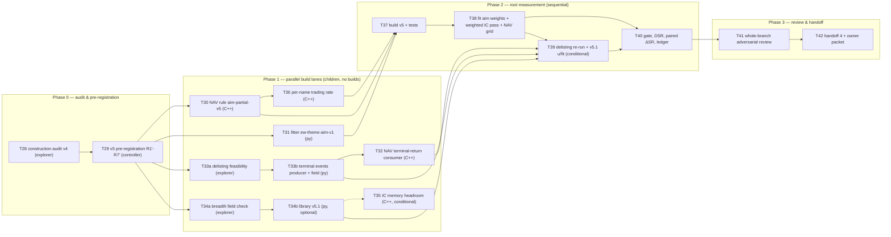

# Mega-alpha v5 — "deploy the book" DAG sprint plan

> **For agentic workers:** REQUIRED SUB-SKILL: Use superpowers:subagent-driven-development to execute this plan
> task-by-task (controller dispatches; children follow `.superpowers/sdd/mega-alpha-20260926/lane-contract.md`).
> Steps use checkbox (`- [ ]`) syntax. **Owner directive: no test-driven development** — implement, then write focused
> postimplementation fixtures. Tasks are accepted on **real-data measurements by root** (§5.4), never on green unit tests alone.
> **All explorer / research / review agents run on Claude Opus 5.5. Implementers run on Opus 5.5 (owner style).**

**Goal:** Measure, honestly, what the frozen v4 alpha library is worth when it is actually deployed as a $1bn
market-neutral book — then raise net Sharpe toward 1.0 with cost-aware (Gârleanu–Pedersen) composition and
construction, all selected on TRAIN 2020-2022, pre-registered, and disclosed.

**Architecture:** Three parallel build lanes (NAV construction rule v5 in C++; aim-weighted composition in the Python
fitter; delisting terminal returns as a data field + NAV plug), one optional breadth lane (library v5.1), and one
root-only measurement phase (build → fit → IC weighted pass → NAV grid → gate). The v4 IC runner, library, data path
(bridge r4-v1, events-v2, fields-v6) and the `v4-prior-v1` screen are **not** changed. Nothing touches 2023+ data.

**Tech Stack:** C++20 (`atx-impl` NAV replay `strategy_nav_replay.cpp`, target rules `strategy_target_replay.cpp`,
GoogleTest), Python 3.12 (`fit_composition_weights.py`, numpy, pytest), bounded runner
`scripts/run_bounded_research.py`, root build `build-equity/mega-build.ps1`, worktree pool `scripts/lease-worktree.ps1`.

**Spec / evidence:** this file is the spec. It was synthesized on 2026-09-27 from
`docs/plans/2026-09-27-mega-alpha-parent-handoff-3.md` (the parent handoff), a read-only code review of the v4 pipeline
(fitter, generator, NAV, IC runner, producers, DSL registry), a ledger/contract survey of
`.superpowers/sdd/mega-alpha-20260926/`, a web research memo (Gârleanu–Pedersen, cost mitigation, new anomalies,
delisting returns, small-sample gates), and a direct re-read of the existing TRAIN/VAL NAV outputs under
`build-equity/mega-nav-v4-*`. Every number a task needs is copied into this file.

---

## 0. TL;DR — what changed since handoff 3

1. **The v4.1 book was never deployed.** Re-reading `build-equity/mega-nav-v4-*/daily_modeled-1bn-stale5-v1+swap-fin-v1.csv`:

   | run | mean gross leverage | mean net leverage | held names | members banded per rebalance | net / gross SR |
   |---|---|---|---|---|---|
   | TRAIN b1 f1 | 0.81 | +0.025 | 2,717 | 2,840 / ~2,990 (95%) | 0.431 / 1.100 |
   | TRAIN b1 f.25 | 0.69 | +0.028 | 2,720 | 2,772 (93%) | 0.677 / 1.132 |
   | TRAIN b2 f1 | 0.36 | +0.016 | 1,366 | 2,958 (99%) | 0.643 / 0.929 |
   | **TRAIN b2 f.25 (frozen v4.1)** | **0.26** | **+0.041** | 1,369 | 2,959 (99%) | 0.687 / 0.815 |
   | **VAL b2 f.25 (validation trial #2)** | **0.24** | **+0.038** | 1,237 | 2,981 (99.7%) | 0.641 / 0.802 |

   Cause (`atx-impl/src/strategy_target_replay.cpp:133-195`): the tied-rank desired target has |w| ≤ 2/N with mean 1/N,
   and the no-trade band is `band_multiple / N_d`. So b1 = 1× the mean position and b2 = 1× the **maximum** position: an
   unheld name (current 0) can only enter when |desired| > band, which at b2 essentially never happens except through
   price-risk-v1 amplification (mean 1.22). Nothing re-grosses the book after banding or partial fill. The band was acting
   as an entry filter, not a no-trade zone, and the "$1bn S2 cost" was charged to a ~$240m book (impact ∝ √size, so
   per-dollar impact was roughly half of a full book's). Net leverage +4% on 24% gross is not market-neutral.
   **Validation trial #2 (+0.641) stands as recorded, but must be disclosed as a 24%-gross book result.**
2. **Lever 1 as written in the handoff is re-specified.** The handoff's `1/(1+τ_k/τ0)` aim weight is only the right form
   for filing-driven ("jump") signals; for rolling-window price signals the mapping is quadratic. The pre-registered v5 form
   uses measured TRAIN rank-autocorrelation ρ̄_k(j) of each candidate — second moments only, no means (§4.A).
   Global (not within-theme) normalization is required for the lever to bite: six members with τ > 0.07 carry 64% of Σwτ
   (0.0519) and `options_implied` is a one-member theme.
3. **Lever 2 (separate sleeves) is replaced** by one integrated aim with a **per-name trading rate**
   θ_i = clip(√(RRA·σ_i²·ADV_i / (0.2·NAV)), 0.01, 0.15): fast signals automatically concentrate in liquid names; separate
   order books would give up netting (§4.B).
4. **Lever 3 (breadth) is downgraded.** Research: 1-month industry momentum decayed (t≈0.6 in 2000-19 vs 2.5 in TRAIN —
   TRAIN flatters it); BAC needs 1,260-day correlation (> 314-bar DSL cap) and is mostly projected out by price-risk-v1;
   CHS distress needs 6 extras (> capacity 5) and is weak in large caps. Only operating leverage (`opex_at`) survives as a
   low-priority v5.1 addition.
5. **Delisting returns become a real lane** (η = 0 today in S1/S2: every write-off at last price). Rule: M&A → deal value;
   performance/unknown → −30% NYSE/AMEX, −55% Nasdaq, −35% if venue unknown; stress −100% on longs (§4.D).
6. **Gate policy changes.** With 3 TRAIN years the SE of an annual Sharpe is ≈0.58, so a "net ≥ 1.0" gate passes only
   ~27% of the time even at a true 0.64. Gate on **paired ΔSR vs a pre-registered reference cell** (SE ≈ 0.12-0.26) plus
   cost/gross/turnover mechanics; keep the owner's absolute ≥ 1.0 rule only for *proposing a freeze* (§4.E-F).

## 1. Where the project stands (2026-09-27, pool-2 HEAD `f6a4b7e4`, branch `feat/aes-codex-integration-20260925`)

- Tree clean; 45 commits ahead of `d63a7058` (last merge to main); main has moved to `4188f11c` (tier1-v2 session).
- Last task **T27**; next is **T28**. Sprint dir `.superpowers/sdd/mega-alpha-20260926/` (gitignored; `git add -f`).
- Frozen v4.1 pins: library `daa9663e` (37 candidates), TRAIN role v2 `210fff96`, TRAIN fields-v6 `32565c32`, orientations
  `11cfd3e4`, admission `880a0a6a`, weights ew-theme-v1 `9a9c949a` (31 admitted), TRAIN combined
  `build-equity/mega-v4w-train-1` `24a6cc76`, VAL combined `c50829be`.
- Binaries `build-equity/bin/atx-equity-strategy-ic.exe` `647c71a7`, `atx-equity-strategy-targets.exe` `4642dd37`.
  Tests: `atx-engine-alpha-tests.exe` 87 pass, `atx-impl-strategy-ic-tests.exe` 67 pass.
- IC runner plan 1.449 GB of the 1.5 GB cap (`--max-memory-mib 1536` == bounded-runner RSS cap, zero slack); capacity 5
  extra fields / 7 slots per candidate; `--min-names 1000`. Warm u pass 30 s / 964 MiB; cold 86 s / 1012 MiB.
- Fitter 30-98 s / ≤ 523 MiB; must run from `C:/atx-wt/pool-2` (relative cache paths); any edit re-keys its work cache
  (`SCRIPT_SHA256`); `v4_train.sh` fit phase passes no `--work-dir` so every retry recomputes.
- NAV: 14-33 s, 243-338 MiB, needs `--max-bytes 1073741824` with `--fields`. `banded_names` column exists.
- Trial accounting since v3 run #1 (TRAIN only): libraries v4 (37) + v4.2 (40); compositions 2; construction 1 + 5 + 2;
  studies 5 paper books + T16 post-mortem. Validation: run #1 (v3) book level; run #2 (v4.1). No per-candidate VAL stat read.
- Pools: 1 (other), **2 = root**, 6 (other, never use); 3,4,5,7,8,9 mega-reusable (clean; reset with
  `git checkout -B <branch> <pool-2 HEAD>` — leases are alive under older run ids); 10, 11 free. Free RAM ≈ 2.5 GiB of 16.

## 2. Definition of done (v5 sprint exit; all measured on TRAIN by root)

- D1. A v5 construction rule exists in which the reference cell deploys the book: TRAIN mean gross leverage ∈ [0.90, 1.05],
  |mean net leverage| ≤ 0.02, and ≥ 90% of members hold a non-zero weight on the average decision.
- D2. `baseline-v1` / `band-2` outputs are bit-identical to today (fixture + `sha256` of one re-run recipe/CSV).
- D3. `ew-theme-aim-v1` weights exist with provenance (θ, lag grid, ρ̄_k(j), g_k, coverage-effective theme weights);
  `ew-theme-v1` bytes unchanged (`test_fit_composition_weights.py::…byte_stability` green).
- D4. The pre-registered 10-cell construction grid (§T38) ran under the bounded runner; every cell's net/gross SR, τ mean/p95,
  gross/net leverage, cost per unit GMV turnover, netting ratio, paired ΔSR vs the reference cell and the DSR (N=10) are in
  `task-T40-report.md` and the ledger.
- D5. Delisting terminal returns: feasibility settled (T33a); if feasible, the field is produced, NAV S2 consumes it, and the
  reference cell is re-run once with it (disclosed as +1 construction trial).
- D6. Handoff 4 written with full trial disclosure, the v4.1-was-24%-gross ruling, and the owner decision packet.
- D7. No 2023+ data read anywhere (grep of every run receipt's `--train`/`--role` bindings shows only `*2020-2022*`).

## 3. Global constraints (binding on every task; verbatim from the owner goal / handoff / ledger)

- "Work only in the integration checkout `C:/atx-wt/pool-2`… Never mutate, build, switch or commit in `C:/atx`; read-only
  inspection is okay." The tier1-v2 session owns `C:/atx` and atx-db: read-only, no locks, never kill its processes.
- "Root alone builds, using `build-equity/mega-build.ps1`: RAM-admitted, Jobs 2-4, target-scoped."
  `powershell -File build-equity/mega-build.ps1 -Tag <new-unique-tag> -Targets "<t1,t2>"` (refuses a reused tag; Jobs auto).
- "Root alone runs real data, under `scripts/run_bounded_research.py` with Python312 … <= 180 s, RSS 1536 MiB, free floor 512 MiB."
  Exact: `"C:/Program Files/Python312/python.exe" scripts/run_bounded_research.py --seconds 180 --max-rss-mib 1536 --min-free-mib 512 --output build-equity/<new-dir> --bind <manifests> -- <cmd>`.
  The guard needs `git status --porcelain` empty (untracked files included): **commit docs, briefs, prereg and scripts before every run.**
- "Child agents implement in their own pool worktrees and never build." Children follow `lane-contract.md`; reviewers
  `reviewer-contract.md` / `re-review-contract.md`; ≤ 5 fix rounds; children never spawn subagents; commit trailer
  `Co-Authored-By: Claude Opus 5.5 <noreply@anthropic.com>`; reply < 15 lines with status, commits, tests, concerns, report path, root targets.
- "Select everything … on TRAIN 2020-2022 only. Validation 2023-2024 is used once, on the frozen daily mega-alpha. 2025+ stays reserved."
  2023-2024 has been used twice: any new test there is **validation trial #3**, disclosed, and requires the owner's ruling (U1).
- "No pushes, warehouse writes or broker actions. Do not kill other owners' processes."
- "Do not use test-driven development; write focused postimplementation fixtures." "Do not let RAM slow progress." Run limits stay
  180 s / 1536 MiB (a 300 s / 2048 MiB proposal was refused: "efficiency fix, not a longer cap").
- Targets (owner ruling 2026-09-27): S2 `modeled-1bn-stale5-v1` × `swap-fin-v1` net Sharpe ≥ 1; combined-book daily one-way
  turnover mean ≤ 20% GMV, p95 ≤ 30% GMV (deployment excluded); per-alpha τ_k ≤ 70%/day; netting ratio τ_book / Σ w_k τ_k reported.
- Validation flow (binding): "unweighted TRAIN-only run (orientations O) -> fitter -> weights W (provenance O) -> ledger W sha ->
  ONE validation-only runner run with O + W -> NAV on the validation-only combined output."
- Pre-register in `v4-prereg.md` (new `## v5 revision` section, R1'-R7') and commit **before any v5 TRAIN read**. Rulings:
  `Ruling: <decision> — <why> — cost if wrong: …`, declared before any measurement they could bias.
- IC runner ≤ 1.5 GB: run `--plan-only` before any library change; ≤ 5 extras and ≤ 10 VM slots per candidate.
- House C++ rules: read `.agents/cpp/agent.md` before any C++ edit (children: the pool-2 copy).

## 4. Research brief (numbers and formulas the tasks use; citations in Appendix B)

### 4.A Cost-aware aim (Gârleanu–Pedersen 2013)
- Optimal policy under quadratic cost Λ = λΣ: partial adjustment x_t = (1−θ)x_{t−1} + θ·aim_t; aim = Markowitz with each
  signal k scaled by 1/(1 + φ_k·a/γ), φ_k = signal mean-reversion rate. With discounting ≈ 0: a/γ = (1−θ)/θ, so
  **g_k = θ / (θ + φ_k(1−θ))** for an AR(1) signal, and for any signal
  **g_k = Σ_{j≥0} θ(1−θ)^j ρ_k(j)** where ρ_k(j) is the lag-j autocorrelation of the standardized signal (second moments only).
- GP's own calibration: θ ≈ 3-4.4%/day at $1bn; signals with half-lives 2.4 / 206 / 700 days get aim weights ≈ 0.15 / 0.93 / 0.98.
  The dynamic rule beat the best static partial-adjustment rule by ≈ 20% net Sharpe because it down-weights the fast signal.
- Turnover→decay is regime-dependent: diffusive (rolling price windows) τ ≈ √(2φ) ⇒ g = 1/(1+(τ/τ0)²), τ0 ≈ 0.25-0.32;
  jump-refresh (filings) τ = p√(2(1−c)) ⇒ g = 1/(1+τ/τ0), τ0 ≈ 0.10-0.17. **Hence measure ρ̄_k(j) directly** (T31) rather than map τ.
- Sanity: θ = 0.03-0.05 on a composite with φ ≈ 0.003-0.004 predicts ≈ 1.0-1.4%/day turnover — matches the observed 1.3%.
- Square-root impact (S2) is not quadratic; GP is a first-order guide. Partial adjustment + a small dust band is the practical rule
  (NMV 2019: banding beats less-frequent rebalancing; buy/hold spread 10%/20% for mid-turnover signals).

### 4.B Multi-speed: one integrated aim, per-name rate
- θ_i ≈ √(γ σ_i² ADV_i / 0.2) with γ = RRA/NAV (JKMP calibration Λ_i = 0.2/ADV_i: 0.1% impact at 1% ADV). In dollar-free form:
  **θ_i = clip( √( RRA · σ_i² · ADV_i / (0.2 · NAV) ), 0.01, 0.15 )**, RRA = 10, NAV = 1e9, σ_i daily, ADV_i dollars.
  Check: σ 1.5%/day, ADV $50m → 2.3%/day; $200m → 4.6%; $1bn → 10%.
- Fast signal weight in name i becomes θ_i/(θ_i+φ_k): reversal gets 0.5 in a $1bn-ADV name, 0.13 in a $20m one. Separate sleeve
  order books forgo netting (DeMiguel et al. 2020: with costs, characteristics worth holding rise from 6 to 15 because trades cancel).

### 4.C Breadth (what survives)
- Add (low priority, v5.1): `opex_at` operating leverage (Novy-Marx 2011; JKP mega 2010-24 +0.24%/mo t 1.8; large 2010-24 +0.39 t 2.9).
- Already held: net equity issuance (`net_payout`, `issuance_*`), `rd_me`, `noa`, `cfoa`.
- Reject: 1-month industry momentum (post-2000 t ≈ 0.6; TRAIN 2020-22 +1.79%/mo t 2.5 is an outlier that would flatter it),
  earnings persistence, O/Z/KZ scores, net debt issuance, SUE in mega caps. Defer: Hou 2007 lead-lag (weekly, mid-cap followers,
  ≈ 58% post-publication decay), BAC (1,260-day ρ window; projected out by price-risk-v1; corr factor +0.18%/mo t 1.3 in mega caps),
  CHS distress (needs 6 extras; raw spread 3× larger in the smallest quintile).

### 4.D Delisting returns
- Shumway 1997 / Shumway-Warther 1999: performance-related delistings average −30% (NYSE/AMEX) and −55% (Nasdaq); "reason
  unavailable" is treated as performance-related. OSAP convention: −35% NYSE/AMEX, −55% Nasdaq, cap −100%, compounded into the final return.
- Rule for this NAV: classify each terminal date from filings (8-K Item 2.01 = M&A; Item 3.01 / Form 25 / Item 1.03 = performance;
  unknown = performance). M&A: last close stands (η = 0). Performance/unknown: η = −0.30 NYSE/AMEX, −0.55 Nasdaq, −0.35 venue unknown.
  Stress: −1.0 on longs. Shorts must not be the main beneficiary (report long vs short write-off P&L).

### 4.E Small-sample gates and trial accounting
- Lo 2002: SE(ŜR_annual) ≈ √((1+SR²/2)/T) ≈ 0.58-0.71 at T = 3 years. P(pass "net ≥ 1" | true SR) ≈ 27% at 0.64, 37% at 0.8, 50% at 1.0.
- Paired: Var(ŜR_a − ŜR_b) ≈ 2(1−ρ)/T ⇒ SE ≈ 0.26 (ρ .9), 0.18 (.95), 0.12 (.98). Gate on ΔSR vs a frozen reference cell.
- Deflated Sharpe (Bailey & López de Prado 2014): DSR = Φ[(ŜR − SR₀)√(T−1) / √(1 − γ₃ŜR + (γ₄−1)ŜR²/4)],
  SR₀ = √V[ŜR_n]·[(1−γ)Φ⁻¹(1−1/N) + γΦ⁻¹(1−1/(Ne))], γ = 0.5772. Under the null the expected max annual SR over 3 years is
  0.69 (N=5), 0.91 (N=10), 1.10 (N=20). Harvey-Liu-Zhu: t > 3 for non-literature signals; one-sided tests for literature-signed themes.

## 5. Swarm operating model

### 5.1 Roles and models
- **Controller** (this session's parent): dispatches, keeps the ledger, packages `review-TN.diff`, rules on conflicts, **never implements**. Root-only duties: build, real-data runs, cherry-pick.
- **Explorers / researchers** (read-only; **Opus 5.5**): T28, T33a, T34a. No pool needed; they read pool-2 and (read-only) `C:/atx`.
- **Implementers** (**Opus 5.5**): one task each in their own pool worktree; never build; postimplementation fixtures; report file + < 15-line reply.
- **Reviewers** (**Opus 5.5**): one scoped review per task from the diff package; ≤ 5 fix rounds; verdict in `task-TN-review.md`.
- **Root/OPS** = controller: T37-T40 only.

### 5.2 Ownership tokens (one holder at a time)
| Token | Files |
|---|---|
| NAVRULE | `atx-impl/src/strategy_target_replay.{hpp,cpp}`, `strategy_target_replay_detail.hpp`, `atx-impl/tests/strategy_target_replay_test.cpp` |
| NAVSIM | `atx-impl/src/strategy_nav_replay.{hpp,cpp}`, `atx-impl/tests/strategy_nav_replay_test.cpp` |
| FIT | `atx-impl/tools/fit_composition_weights.py`, `atx-impl/tools/test_fit_composition_weights.py` |
| GEN | `atx-impl/strategies/generate_fund_ic_v5.py` (new), `fund_industry_ic_v5.json` (new) |
| FIELDS | `atx-engine/tools/prepare_research_fields.py`, `atx-engine/tools/build_terminal_events.py` (new), their tests |
| STUDIES | `.superpowers/sdd/mega-alpha-20260926/studies/*` (v5 scripts) |
| PREREG | `.superpowers/sdd/mega-alpha-20260926/v4-prereg.md`, `progress.md` (controller only) |
| CMAKE | `atx-impl/CMakeLists.txt`, `atx-impl/tests/CMakeLists.txt` (root applies diffs from reports) |

A task that needs a token's file but is not the holder writes the exact diff into its report; the holder applies it in its next task.
T30 and T36 both hold NAVRULE+NAVSIM and run **sequentially in the same pool** (pool-3).

### 5.3 Concurrency and memory
- ≤ 6 live agents. Children run only pure-Python synthetic pytest (≤ 300 MB) and never the IC runner, fitter on real data, or NAV.
- Root runs one bounded job at a time; build only when free ≥ 1000 MiB / commit ≥ 2500 MiB (script enforces).

### 5.4 Verification policy (no TDD)
- Every build task ends with (a) postimplementation fixtures the root builds and runs, and (b) a **root real-data acceptance run**
  whose measured numbers go into the task report and the ledger. Reviewers check that the numbers were really measured.
- Byte-stability fixtures are mandatory where the plan says "bit-identical".

### 5.5 Commit hygiene
- `git diff -- <owned files>` before every commit; never commit another lane's hunks; one task per commit series;
  `<type>(<scope>): <desc> (TN)` subjects; never commit `studies/.mypy_cache`.

### 5.6 Ledger and reports
- Ledger `.superpowers/sdd/mega-alpha-20260926/progress.md` (newest first). Every decision `Ruling: … — … — cost if wrong: …`.
- Per task: `task-TN-brief.md`, `task-TN-report.md`, `task-TN-review.md`, `task-TN-rereview-K.md`, `review-TN[-fixK].diff`.
- Trial accounting is appended to every result section (Appendix A template).

## 6. The DAG



### 6.1 Node table

| Node | Title | Lane / pool | Model | Depends on | Tokens | Root run? | Peak |
|---|---|---|---|---|---|---|---|
| T28 | Construction audit of v4 NAV outputs (read-only) | EXP / none | Opus 5.5 | — | — | no (reads existing CSVs) | 0.3 GiB |
| T29 | v5 pre-registration + rulings | CTL / pool-2 | controller | T28 | PREREG | no | — |
| T30 | `aim-partial-v5` target rule (θ, dust, L) | A / pool-3 | Opus 5.5 | T29 | NAVRULE, NAVSIM | fixtures via T37 | 0.3 |
| T36 | per-name rate `rate per-name-v1` | A / pool-3 | Opus 5.5 | T30 | NAVRULE, NAVSIM | fixtures via T37 | 0.3 |
| T31 | fitter `ew-theme-aim-v1` + `--work-dir` in pipeline + netting ratio in `nav_summ.py` | B / pool-4 | Opus 5.5 | T29 | FIT, STUDIES | T38 | 0.3 |
| T33a | Delisting-data feasibility (submissions 8-K items, Form 25, tickerhistory ends, venue) | EXP / none | Opus 5.5 | T29 | — | no (read-only C:/atx) | 0.6 |
| T33b | `build_terminal_events.py` + `terminal_*` fields | C / pool-5 | Opus 5.5 | T33a | FIELDS | T39 | 0.3 |
| T32 | NAV consumes terminal returns in `carry_absent` | C / pool-5 (after T33b) or pool-7 | Opus 5.5 | T33b (schema) | NAVSIM | T39 | 0.3 |
| T34a | Breadth field check (`opex`/`xsga`/`cogs` presence, plan-only cost) | EXP / none | Opus 5.5 | T29 | — | no | 0.3 |
| T34b | Library v5.1 = v4 + `opex_at` (+ optional lead-lag) | D / pool-8 | Opus 5.5 | T34a | GEN | T39 | 0.3 |
| T35 | IC runner headroom (workers/plan) — only if T34b `--plan-only` refuses | E / pool-9 | Opus 5.5 | T34b | — | T39 | 0.3 |
| T37 | Root build tag `v5-1` + test suites | ROOT | — | T30, T36, T31 | CMAKE | yes | build |
| T38 | Root: aim fit → weighted IC pass → 10-cell NAV grid | ROOT | — | T37 | — | yes | 1.0 GiB |
| T39 | Root: delisting re-run of reference cell; v5.1 u/fit/w/nav if T34b landed | ROOT | — | T38, T32/T33b, T34b | — | yes | 1.0 |
| T40 | Gate + DSR + paired ΔSR + ledger + trial accounting | CTL | controller | T38 (T39) | PREREG | no | — |
| T41 | Whole-branch adversarial review | REV | Opus 5.5 | T40 | — | no | 0.4 |
| T42 | Handoff 4 + owner packet | CTL | controller | T41 | — | no | — |

## 7. Critical path and schedule

**Critical path:** T28 → T29 → T30 → T36 → T37 → T38 → T40 → T41 → T42. T31 runs in parallel with T30/T36 and must land before T37.
T33a/T33b/T32 and T34a/T34b run in parallel and join at T39 (optional; T40 can close without them, with disclosure).

**Rough wall clock:** P0 half a day; P1 one to two days (lanes parallel; reviews included); P2 half a day (≈ 12 bounded runs of ≤ 3 min each
plus one build); P3 half a day.

## 8. Owner decision gates (do not block P0-P2; needed before any validation)

| Gate | Decision | Unblocks | If not granted |
|---|---|---|---|
| U1 | Holdout policy: disclosed validation trial #3 on 2023-2024, or release 2025+ | any OOS read of v5 | v5 stops at TRAIN report + freeze proposal |
| U2 | Pre-2020 history for selection/estimation (largest single lever) | longer TRAIN, ρ̄_k(j) with less noise | 3-year TRAIN, SE ≈ 0.58 stays |
| U3 | New data: analyst revisions, options skew, 8-K earnings dates, **delisting sources beyond EDGAR** | T33b beyond what EDGAR submissions give | T33b uses only `sec_submissions` + tickerhistory ends |
| U4 | Cost target revisit (S1 vs S2 primary) | — | S2 × swap-fin-v1 stays primary |
| U5 | Merge integration branch into main (real merge; main diverged) | — | branch stays unmerged |

## 9. Planning rulings (copy into the ledger at T29)

- **Ruling R-1 (disclosure):** validation trial #2 (+0.641) was produced by a book with mean gross leverage 0.24 and net +0.04; it is recorded as-is
  but is not a $1bn-deployment result. — The band `band_multiple/N_d` ≥ the position scale blocked entry. — cost if wrong: none (disclosure only).
- **Ruling R-2 (construction):** v5 replaces band+fraction with GP partial adjustment toward a gross-1 aim (θ) plus a dust band ≤ 0.1/N_d;
  the `band_multiple` path stays for reproduction only and is refused under v5. — Handoff lever 1 grid {band 1,2} would re-test a frozen book. —
  cost if wrong: one wasted C++ lane (~1 day).
- **Ruling R-3 (composition):** aim gain g_k = θ Σ_j (1−θ)^j ρ̄_k(j) on measured TRAIN rank-autocorrelation (lags 0..21, then 28..126 step 7,
  linear interpolation), global normalization, θ = 0.05 fixed (= reference construction θ). The τ-mapped form is **not** run (saves a trial family). —
  cost if wrong: aim weights mis-scaled for jump signals; bounded by g ∈ (0, 1].
- **Ruling R-4 (gate):** TRAIN acceptance is paired ΔSR(net) vs the reference cell (C_ew, θ .05, dust .1) with Memmel SE and a DSR at N = 10,
  plus mechanics (gross ∈ [0.9, 1.05], |net| ≤ 0.02, τ limits). The owner's absolute "TRAIN net ≥ 1.0" rule governs only whether a freeze is proposed. —
  cost if wrong: a freeze proposed on a lucky cell; the owner still rules.
- **Ruling R-5 (breadth):** no 10th theme in v5; v5.1 may add `opex_at` to `profitability_quality` only; industry momentum 1m, BAC, CHS are not built. —
  cost if wrong: forgone breadth, revisitable under U2.
- **Ruling R-6 (delisting):** η by kind (M&A 0; performance/unknown −0.30/−0.55/−0.35) replaces η = 0 in S1/S2 **only after** T33a shows ≥ 80% of TRAIN
  member terminations are classifiable; S3 keeps K = 1 adverse. — cost if wrong: a biased write-off haircut; the stress run bounds it.
- **Ruling R-7 (trial budget):** v5 TRAIN = 1 new composition + 10 construction cells (+1 delisting re-run, +v5.1 family if built). Anything else is a new
  disclosed revision in `v4-prereg.md` before it runs.

## 10. Risk register

| Risk | Signal | Mitigation |
|---|---|---|
| Full deployment doubles per-dollar impact; net SR falls below the 24%-gross figure | reference cell net < 0.64 | It is the honest number; report cost/GMV-turnover and the S1 stress; lever = aim weights + per-name rate |
| Partial adjustment leaves gross < 0.9 (aim churn) | D1 fails at L = 1 | pre-registered deterministic L = 1/mean_gross re-run (one extra cell), or accept and report |
| ρ̄_k(j) noisy on 754 days → g_k unstable | g_k differ > 0.3 between halves of TRAIN | report half-sample g_k; clip g ∈ [0.05, 1]; no re-tuning |
| Fitter recompute exceeds 180 s | bounded runner `time-limit` | T31 adds `--work-dir` + `--max-seconds 150`; multi-pass |
| NAV per-name rate needs ADV/σ for all members daily | runtime > 60 s | reuse `liquidity_row` window; compute once per decision; cap `--max-bytes` 1 GiB |
| Byte drift in baseline outputs | fixture or recipe SHA changes | T30/T36 byte-stability fixtures; T37 re-runs one v4.1 cell and diffs `recipe.json`/CSV SHAs |
| Delisting classification impossible from EDGAR alone | T33a < 80% classifiable | park lane; keep η = 0 primary + S3 stress; raise U3 |
| Selection leakage via VAL | any receipt binding a 2023+ role | D7 grep; children refuse roles past 2022-12-31 |

## 10.1 Out of scope for v5 (handoff §5 items deliberately not built; each is one line so the next parent does not re-derive)

- **gp_ttm coverage (0.36):** COGS is single-concept per period (goods-only for split filers; `build_fundamental_events.py:648-654`, seed rows 58-64) and `CostsAndExpenses` is mapped to `operating_expenses`, never loaded. A fix needs code in `_gross_profit_ttm`, CF-R re-staging and a new `DEFAULT_CF_MANIFEST_SHA256` (`:74`) → new events/fields family; deferred to a data sprint.
- **IFRS for ADRs:** us-gaap filtered at `build_fundamental_events.py:307,1050` and upstream `companyfacts_stage.py:70`; needs (taxonomy, concept) keys, FX, 6-K handling. Deferred (U3).
- **Identity bridge swap to atx-db 3.3:** the accepted artifact has not landed; r4-v1 stays pinned.
- **Delisting in admission/IC:** the fitter zero-fills invalid forward returns (`fit_composition_weights.py:690-691`) and IC labels need both endpoints (`strategy_ic_runner.cpp:247`); v5 fixes the NAV only. Nothing is *selected* on returns, so admission bias is limited to the veto t.
- **f32 panel fields / streamed labels:** engine `Panel` and `dsl_vm_sources` tripwire; invalidates the candidate cache. Only T35's cheap levers.
- **Netting telemetry from `atx-engine/include/atx/engine/fund/netting.hpp`:** the ratio is computed in `nav_summ.py` (T31); wiring the engine helper into the NAV is a later refactor.

## 11. Review Focus (failure modes no task's acceptance run exercises; each pinned to a fixture in the owning task)

1. **v5 with θ = 1, dust 0, L = 1 must reproduce `baseline-v1` band 0 fraction 1 bit-for-bit** (weights, turnover, recipe minus rule name). → T30 fixture `AimPartialV5_ThetaOne_MatchesBaseline`.
2. **Dust band must never block entry:** a member with current 0 and |L·desired| > dust/N_d trades on the first rebalance. → T30 fixture `AimPartialV5_DustDoesNotBlockEntry`.
3. **Per-name rate on names without liquidity (ADV 0 / absent / < 20 vol pairs) uses rate_min and never NaN.** → T36 fixture `PerNameRate_NoLiquidity_UsesMin`.
4. **Autocorrelation on a candidate that is flat or all-NaN for a stretch** yields finite ρ̄ and g ∈ [0.05, 1]; a constant candidate is `degenerate-zero-variance` with weight 0. → T31 fixture `test_aim_gain_degenerate_and_gappy`.
5. **A terminal event dated after a reprint, or a terminal event on a name never held, must not touch NAV;** a terminal event on a short must apply the *short* haircut (+0.30 loss convention as S3). → T32 fixture `TerminalReturn_ReprintAndShortSide`.
6. **`ew-theme-v1` bytes unchanged** after the fitter edit. → T31 existing `byte_stability` test + T38 SHA equality of a re-fit (`9a9c949a…`).

---

## Tasks

### Task T28: Construction audit of v4 NAV outputs (explorer, read-only)

**Lane:** EXP · **Model:** Opus 5.5 · **Depends on:** — · **Pool:** none (reads pool-2) · **Peak:** 0.3 GiB

**Files:**
- Create: `.superpowers/sdd/mega-alpha-20260926/construction-audit-v4.md`
- Create: `.superpowers/sdd/mega-alpha-20260926/studies/construction_audit.py`
- Read only: `build-equity/mega-nav-v4-*/daily_modeled-1bn-stale5-v1+swap-fin-v1.csv`, `recipe.json`, `atx-impl/src/strategy_target_replay.cpp:133-195`

**Interfaces:** Produces the table in §0 independently re-derived (gross/net leverage, held, banded share, entry rate), plus for v3
(`build-equity/mega-nav-v3-*` if present) the same columns, so the disclosure covers both validation trials.

- [ ] **Step 1:** Write `studies/construction_audit.py`:

```python
"""Construction audit: gross/net leverage, banded share and entry rate per NAV run (read-only)."""
import csv, glob, json, statistics as st, sys
SCEN = "daily_modeled-1bn-stale5-v1+swap-fin-v1.csv"
def audit(run: str) -> dict:
    rows = list(csv.DictReader(open(f"{run}/{SCEN}")))
    reb = [r for r in rows if r["rebalance"] in ("1", "true", "True")]
    col = lambda rs, k: [float(r[k]) for r in rs if r.get(k, "") not in ("", "nan")]
    recipe = json.load(open(f"{run}/recipe.json"))
    members = col(reb, "neutralize_used")  # used names ~ members (excluded share < 2%)
    banded = col(reb, "banded_names")
    return {"run": run, "rule": recipe["rule"], "band_multiple": recipe.get("band_multiple"),
            "trade_fraction": recipe.get("trade_fraction"),
            "gross_mean": st.mean(col(rows, "gross_leverage")), "net_mean": st.mean(col(rows, "net_leverage")),
            "held_mean": st.mean(col(rows, "held_names")),
            "banded_share": st.mean(b / m for b, m in zip(banded, members) if m > 0),
            "tau_gmv_mean": st.mean(col(rows, "one_way_turnover_gmv"))}
if __name__ == "__main__":
    out = [audit(r) for r in sorted(glob.glob("build-equity/mega-nav-v[34]*")) if glob.glob(f"{r}/{SCEN}")]
    json.dump(out, open(sys.argv[1], "w"), indent=1)
    for o in out: print(f"{o['run']:48s} gross {o['gross_mean']:.3f} net {o['net_mean']:+.3f} held {o['held_mean']:.0f} banded {o['banded_share']:.3f} tau {o['tau_gmv_mean']:.4f}")
```

- [ ] **Step 2:** Run it from `C:/atx-wt/pool-2` with `"C:/Program Files/Python312/python.exe" .superpowers/sdd/mega-alpha-20260926/studies/construction_audit.py .superpowers/sdd/mega-alpha-20260926/construction-audit-v4.json` (reads only; no bounded runner needed, < 5 s).
- [ ] **Step 3:** Write `construction-audit-v4.md`: the table, the mechanism (quote `strategy_target_replay.cpp:161-166` and `:175-184`), the desired-weight scale derivation (|w| ≤ 2/N, mean 1/N), and the sentence "validation trial #2 was a 24%-gross book".
- [ ] **Step 4:** Commit (`git add -f` the sprint-dir files): `docs(mega-alpha): construction audit of v4 NAV runs (T28)`.

**Acceptance:** numbers within ±0.01 of §0's table for the five v4 runs; v3 rows present if the v3 NAV dirs exist (else "absent" noted).

---

### Task T29: v5 pre-registration and rulings (controller)

**Lane:** CTL · **Depends on:** T28 · **Tokens:** PREREG

**Files:**
- Modify: `.superpowers/sdd/mega-alpha-20260926/v4-prereg.md` (append section)
- Modify: `.superpowers/sdd/mega-alpha-20260926/progress.md` (top section)

- [ ] **Step 1:** Append to `v4-prereg.md`:

```markdown
## v5 revision (declared 2026-09-27 after the construction audit T28; disclosed; before ANY v5 TRAIN read)

Evidence: T28 — v4.1 (band 2/N, fraction .25) held mean gross 0.26 TRAIN / 0.24 VAL; band ≥ position scale blocked entry.
Design rule: the literature carries the selection; TRAIN measures second moments (autocorrelation, turnover, liquidity) only.

R1' Library: unchanged, fund_industry_ic_v4 daa9663e (37). No new candidates in v5. (v5.1, if built, adds opex_at to profitability_quality: separate disclosed family.)
R2' Data: unchanged (bridge r4-v1 ddf97164, events-v2 74ed9a50, fields-v6 32565c32 TRAIN). Nothing >= 2023-01-01 is read.
R3' Admission: unchanged, v4-prior-v1 880a0a6a (31 admitted).
R4' Composition ew-theme-aim-v1: g_k = theta * sum_{j=0..126} (1-theta)^j * rho_k(j), theta = 0.05, rho_k(j) = mean over TRAIN
    decisions d of the cross-sectional correlation of per-day standardized ranks at d and d-j over names live on both days
    (lags 0..21 exact; 28,35,...,126 exact; others linear-interpolated), clipped g in [0.05, 1].
    w_k = (g_k / (T * n_theme(k))) / sum_m (g_m / (T * n_theme(m))) over admitted non-degenerate members. No means, no covariances.
    Reference composition for pairing: ew-theme-v1 9a9c949a (unchanged bytes).
R5' Construction aim-partial-v5: every decision (cadence 1): next_i = cur_i + theta_i (L * desired_i - cur_i) unless
    |L*desired_i - cur_i| <= dust / N_d; desired = tied-rank, price-risk-v1 neutralized, gross 1; non-members forced to 0.
    Grid (10 cells, 2 combined signals x 5): for C in {C_ew, C_aim}: (theta .03, dust .1), (theta .05, dust .1) [REFERENCE when C=C_ew],
    (theta .08, dust .1), (theta .05, dust 0), (rate per-name-v1 RRA 10 clip [.01,.15], dust .1). L = 1. If the reference cell's mean gross
    < 0.90, ONE extra cell per C with L = 1 / mean_gross(reference) (deterministic, disclosed).
    Limits: daily tau mean <= .20, p95 <= .30. Primary S2 modeled-1bn-stale5-v1 x swap-fin-v1; stresses S1, S3, flat-300, engine-tiers.
R6' Gate (TRAIN): mechanics — mean gross in [0.90, 1.05], |mean net| <= 0.02, tau limits met. Statistics — paired dSR(net) of each cell vs
    the reference cell with Memmel SE and a Ledoit-Wolf studentized bootstrap (2000 draws, block 21), DSR at N = 10 (skew/kurtosis from daily net).
    A freeze for validation is proposed ONLY if a cell's TRAIN net SR >= 1.0 (owner rule) or the owner says so; otherwise report.
    On failure: do NOT run validation; report; any revision is a new disclosed section here.
R7' Trial accounting: admission 37 (unchanged); composition +1 (ew-theme-aim-v1); construction +10 (+2 if L re-run; +1 delisting re-run);
    validation: none (trials #1, #2 disclosed; #3 needs U1).
```

- [ ] **Step 2:** Add the ledger section `## v5 sprint start (2026-09-27)` with rulings R-1…R-7 from §9 verbatim, the pool map, and "no process running".
- [ ] **Step 3:** Commit: `docs(mega-alpha): v5 pre-registration and rulings (T29)`. Record the prereg commit SHA in the ledger.

**Acceptance:** prereg committed before any T38 run receipt exists; ledger quotes its SHA.

---

### Task T30: `aim-partial-v5` target rule (C++)

**Lane:** A · **Pool:** pool-3 (`git checkout -B feat/mega-alpha-v5-construction-20260927 <pool-2 HEAD>`) · **Model:** Opus 5.5 · **Depends on:** T29 · **Tokens:** NAVRULE, NAVSIM · **Peak:** 0.3 GiB

**Files:**
- Modify: `atx-impl/src/strategy_target_replay.hpp:12-36` (enum, config fields)
- Modify: `atx-impl/src/strategy_target_replay.cpp:155-195` (update_weights), `:55-99` (validate_config), `:372-374` (rule_name), recipe writer near `:529-540`
- Modify: `atx-impl/src/strategy_target_replay_detail.hpp` (signature)
- Modify: `atx-impl/src/strategy_nav_replay.cpp:1745-1765` (CLI), `:603-634` (plan_decision call), recipe/summary writers
- Test: `atx-impl/tests/strategy_target_replay_test.cpp` (append), `atx-impl/tests/strategy_nav_replay_test.cpp` (append)

**Interfaces:**
- Consumes: `desired_target` / `form_desired` unchanged; `ConstructionDay.banded_names` reused for dust-banded count.
- Produces: `TargetReplayRule::AimPartialV5 = 3`; config fields `aim_leverage`, `dust_multiple`; `update_weights(..., std::span<const f64> per_name_rate = {})`;
  CLI `--rule aim-partial-v5 --trade-fraction <theta> --dust-multiple <d> --aim-leverage <L>`; recipe `rule = "aim-partial-v5"`, keys `theta`, `dust_multiple`, `aim_leverage`, `rate = "fixed"`;
  summary `construction.v5 = {theta, dust_multiple, aim_leverage, rate, mean_gross, mean_net, mean_held_share}`. T36 fills `per_name_rate`.

- [ ] **Step 1:** Header changes (`strategy_target_replay.hpp`):

```cpp
enum class TargetReplayRule : atx::u8 { BaselineTargetV1 = 1, MonthlyTargetBudgetV2 = 2, AimPartialV5 = 3 };
// ... inside TargetReplayConfig, after band_multiple:
  // aim-partial-v5 (pre-registered R5'): on every rebalance decision each member moves
  //   next_i = current_i + theta_i * (aim_leverage * desired_i - current_i)
  // unless |aim_leverage * desired_i - current_i| <= dust_multiple / N_d (dust band; 0 = off).
  // theta_i = trade_fraction, or the per-name rate span when one is supplied (T36).
  // Under this rule band_multiple must be 0 and monthly_budget is ignored. Non-members
  // are still forced to 0. The other rules are byte-for-byte unchanged.
  atx::f64 aim_leverage{1.0}, dust_multiple{};
```

- [ ] **Step 2:** `validate_config` (`strategy_target_replay.cpp:55-99`): add

```cpp
  if (cfg.rule == TargetReplayRule::AimPartialV5) {
    if (!(cfg.trade_fraction > 0 && cfg.trade_fraction <= 1)) return invalid("aim-partial-v5 needs trade_fraction in (0,1]");
    if (cfg.band_multiple != 0) return invalid("aim-partial-v5 refuses band_multiple (use dust_multiple)");
    if (!(cfg.dust_multiple >= 0 && cfg.dust_multiple <= 0.5)) return invalid("dust_multiple must be in [0, 0.5]");
    if (!(cfg.aim_leverage >= 1.0 && cfg.aim_leverage <= 2.0)) return invalid("aim_leverage must be in [1, 2]");
  } else if (cfg.aim_leverage != 1.0 || cfg.dust_multiple != 0) return invalid("aim_leverage/dust_multiple are aim-partial-v5 only");
```
(Use the file's existing error-return idiom in place of `invalid(...)`.)

- [ ] **Step 3:** `update_weights`: add the trailing parameter `std::span<const f64> per_name_rate = {}` in `strategy_target_replay_detail.hpp` and the definition, and branch at the top of the existing function:

```cpp
  if (cfg.rule == TargetReplayRule::AimPartialV5) {
    const f64 dust = rebalance && cfg.dust_multiple > 0 && members_at(in, d) > 0
                     ? cfg.dust_multiple / static_cast<f64>(members_at(in, d)) : -1;
    out.applied_fraction = rebalance ? cfg.trade_fraction : 0;
    f64 squared = 0;
    for (usize i = 0; i < in.instruments; ++i) {
      const bool live = in.member[offset + i] != 0;
      f64 next = 0;
      if (live) {
        const f64 aim = cfg.aim_leverage * desired[i];
        const f64 gap = aim - current[i];
        const bool dusted = rebalance && std::abs(gap) <= dust;
        if (dusted) ++out.construction.banded_names;
        const f64 theta = !rebalance ? 0 : per_name_rate.empty() ? cfg.trade_fraction : per_name_rate[i];
        next = dusted ? current[i] : current[i] + theta * gap;
      }
      const f64 trade = std::abs(next - current[i]);
      out.turnover += trade;
      if (!live) out.forced_turnover += trade; else out.discretionary_turnover += trade;
      current[i] = next;
      out.gross += std::abs(next); out.net += next;
      out.long_weight += std::max(0.0, next); out.short_weight += std::max(0.0, -next);
      out.max_abs_weight = std::max(out.max_abs_weight, std::abs(next));
      out.held_names += next != 0 ? 1U : 0U; squared += next * next;
    }
    out.effective_names = squared > 0 ? out.gross * out.gross / squared : 0;
    return;
  }
```
`members_at` is a tiny helper counting `in.member[offset+i]` (the existing loop at `:163-165` does the same; factor it).

- [ ] **Step 4:** `rule_name` → `"aim-partial-v5"`; recipe writer adds `{"theta", cfg.trade_fraction}, {"dust_multiple", …}, {"aim_leverage", …}, {"rate", "fixed"}` **only when rule == AimPartialV5** (keeps other recipes byte-identical). NAV CLI: `--rule aim-partial-v5`, `--dust-multiple`, `--aim-leverage`. NAV summary: `construction.v5` block (v5 only) with `mean_gross`, `mean_net`, `mean_held_share` = mean over decisions of held/members.
- [ ] **Step 5:** Fixtures (append to `strategy_target_replay_test.cpp`, reuse the file's `Fixture f` and `replay_targets` helpers as at `:495-530`):

```cpp
TEST(TargetReplayV5, AimPartialV5_ThetaOne_MatchesBaseline) {
  Fixture f; TargetReplayConfig base; base.rule = TargetReplayRule::BaselineTargetV1; base.cadence = 1; base.trade_fraction = 1;
  TargetReplayConfig v5 = base; v5.rule = TargetReplayRule::AimPartialV5; v5.dust_multiple = 0; v5.aim_leverage = 1;
  const auto a = replay_targets(f.input(), base), b = replay_targets(f.input(), v5);
  ASSERT_TRUE(a && b);
  for (usize d = 0; d < a->days.size(); ++d) {
    EXPECT_DOUBLE_EQ(a->days[d].turnover, b->days[d].turnover);
    EXPECT_DOUBLE_EQ(a->days[d].gross, b->days[d].gross);
    EXPECT_EQ(a->days[d].held_names, b->days[d].held_names);
  }
}
TEST(TargetReplayV5, AimPartialV5_DustDoesNotBlockEntry) {
  Fixture f; TargetReplayConfig v5; v5.rule = TargetReplayRule::AimPartialV5; v5.cadence = 1; v5.trade_fraction = 0.05; v5.dust_multiple = 0.1;
  const auto r = replay_targets(f.input(), v5); ASSERT_TRUE(r);
  // first rebalance: every member with |desired| > 0.1/N must be held (rank targets are spread over [-2/N, 2/N])
  EXPECT_GE(r->days[0].held_names, f.members_at(0) * 9 / 10);
  EXPECT_NEAR(r->days[0].gross, 0.05, 1e-12);  // theta * gross-1 aim on the first step
}
TEST(TargetReplayV5, AimPartialV5_ConvergesToAimGross) {
  Fixture f; TargetReplayConfig v5; v5.rule = TargetReplayRule::AimPartialV5; v5.cadence = 1; v5.trade_fraction = 0.25; v5.dust_multiple = 0;
  const auto r = replay_targets(f.constant_signal_input(), v5); ASSERT_TRUE(r);
  EXPECT_NEAR(r->days.back().gross, 1.0, 1e-6);   // constant aim: (1-(1-theta)^T) -> 1
}
TEST(TargetReplayV5, RefusesBandUnderV5) {
  TargetReplayConfig bad; bad.rule = TargetReplayRule::AimPartialV5; bad.band_multiple = 1; EXPECT_FALSE(validate_config(bad));
}
```
`f.members_at(d)` and `f.constant_signal_input()` (a role whose signal never changes, so the aim is constant) are helpers to add to the existing `Fixture` in this test file if absent; keep them test-local.
Add a NAV fixture `NavV5_RecipeAndSummaryKeys` asserting the recipe has `theta/dust_multiple/aim_leverage/rate` under v5 and **does not** have them under baseline, and that a baseline run's `recipe.json` bytes equal the pre-change fixture bytes (store the expected SHA-256 in the test).

- [ ] **Step 6:** Report `task-T30-report.md`: root targets `atx-impl-strategy-target-tests`, `atx-equity-strategy-targets`; test filter `TargetReplayV5.*:NavV5*`; CMake diff (none expected: no new TUs).
- [ ] **Step 7:** Commit: `feat(nav): aim-partial-v5 construction rule with dust band and aim leverage (T30)`.

**Acceptance (root, in T37/T38):** fixtures pass; re-run of `mega-nav-v4-train-b2-f.25` recipe (baseline band 2) yields identical `recipe.json` and daily CSV SHA-256; reference v5 cell mean gross ∈ [0.90, 1.05] on TRAIN.

---

### Task T36: per-name trading rate `rate per-name-v1` (C++)

**Lane:** A (same pool-3, after T30) · **Model:** Opus 5.5 · **Depends on:** T30 · **Tokens:** NAVRULE, NAVSIM · **Peak:** 0.3 GiB

**Files:**
- Modify: `atx-impl/src/strategy_nav_replay.hpp` (config: `enum class NavRateRule : u8 { Fixed = 0, PerNameV1 = 1 }; f64 rate_rra{10.0}, rate_min{0.01}, rate_max{0.15}, rate_lambda{0.2};`)
- Modify: `atx-impl/src/strategy_nav_replay.cpp:291-313` (`liquidity_row` reuse), `:603-634` (`plan_decision`: build the rate span), CLI, recipe, summary
- Test: `atx-impl/tests/strategy_nav_replay_test.cpp`

**Interfaces:**
- Consumes: `update_weights(..., per_name_rate)` from T30; `liquidity_row(i, t)` → `{adv_dollars, daily_vol, half_spread_bps}` (existing).
- Produces: CLI `--rate per-name-v1 --rate-rra 10 --rate-min .01 --rate-max .15`; recipe `rate = "per-name-v1"` + params; summary `construction.v5.rate_stats = {mean, p05, p50, p95, share_at_min, share_at_max}`.

- [ ] **Step 1:** In `plan_decision`, when `cfg.rate == PerNameV1` and rule is v5, fill `std::vector<f64> rate(n, cfg.rate_min)` for members:

```cpp
// theta_i = clip( sqrt( RRA * sigma_i^2 * ADV_i / (lambda * NAV_decision) ), rate_min, rate_max )   [JKMP: Lambda_i = lambda / ADV_i, lambda = 0.2]
for (usize i = 0; i < n; ++i) {
  if (!member[i]) continue;
  const auto L = liquidity_row(i, d);           // window [d-63, d); ADV in raw dollars; sigma daily; fallback flagged
  if (!(L.adv_dollars > 0) || !(L.daily_vol > 0) || L.fallback) { rate[i] = cfg.rate_min; ++stats.at_min; continue; }
  const f64 theta = std::sqrt(cfg.rate_rra * L.daily_vol * L.daily_vol * L.adv_dollars / (cfg.rate_lambda * nav_decision));
  rate[i] = std::clamp(theta, cfg.rate_min, cfg.rate_max);
}
```
Compute liquidity rows once per decision for all members (today they are computed only for names with active orders; under v5 every member has one anyway).

- [ ] **Step 2:** Expose the rate formula as a free function so it can be tested without a replay:
  `f64 per_name_rate_v1(f64 rra, f64 lambda, f64 nav, f64 daily_vol, f64 adv_dollars, f64 rate_min, f64 rate_max)` in `strategy_nav_replay.hpp`.
  Fixtures (append to `strategy_nav_replay_test.cpp`; reuse the file's synthetic role builder used by the existing K=5 write-off fixture):

```cpp
TEST(NavV5, PerNameRate_Formula) {
  EXPECT_NEAR(per_name_rate_v1(10, 0.2, 1e9, 0.015, 5e7, 0.01, 0.15), 0.0237, 2e-4);   // sigma 1.5%/day, ADV $50m
  EXPECT_NEAR(per_name_rate_v1(10, 0.2, 1e9, 0.015, 1e9, 0.01, 0.15), 0.106, 1e-3);    // ADV $1bn
  EXPECT_DOUBLE_EQ(per_name_rate_v1(10, 0.2, 1e9, 0.015, 1e6, 0.01, 0.15), 0.01);       // $1m ADV clips at rate_min
  EXPECT_DOUBLE_EQ(per_name_rate_v1(10, 0.2, 1e9, 0.05, 5e10, 0.01, 0.15), 0.15);       // clips at rate_max
}
TEST(NavV5, PerNameRate_NoLiquidity_UsesMin) {
  // synthetic role: name A has volume 0 for the whole window, name B is absent for the 63 sessions before d0; both are members at d0.
  auto in = SyntheticRole::three_names_one_zero_volume_one_absent_window();
  NavReplayConfig cfg = v5_config(/*theta*/0.05, /*dust*/0.1); cfg.rate = NavRateRule::PerNameV1;
  const auto r = replay_nav(in.view(), cfg); ASSERT_TRUE(r);
  EXPECT_DOUBLE_EQ(r->construction.rate_stats.min, cfg.rate_min);
  EXPECT_EQ(r->construction.rate_stats.share_at_min_count, 2U);           // A and B
  for (const auto& day : r->days) EXPECT_TRUE(std::isfinite(day.gross_leverage));
}
TEST(NavV5, PerNameRate_FixedEqualsTradeFraction) {
  auto in = SyntheticRole::default_role();
  NavReplayConfig a = v5_config(0.05, 0.1); a.rate = NavRateRule::Fixed;
  NavReplayConfig b = a; b.rate = NavRateRule::PerNameV1; b.rate_min = b.rate_max = 0.05;   // per-name clipped to a constant == fixed
  const auto ra = replay_nav(in.view(), a), rb = replay_nav(in.view(), b); ASSERT_TRUE(ra && rb);
  for (usize d = 0; d < ra->days.size(); ++d) EXPECT_DOUBLE_EQ(ra->days[d].net_return, rb->days[d].net_return);
}
```
`SyntheticRole::*` and `v5_config` are small test-local helpers the implementer adds next to the existing NAV fixture builders (the file already constructs synthetic saved blends for the K=5 write-off and budget-refusal fixtures; extend those builders rather than writing new loaders).

- [ ] **Step 3:** Report and commit: `feat(nav): per-name trading rate per-name-v1 for aim-partial-v5 (T36)`.

**Acceptance (root, T38):** the two per-name cells run < 60 s / < 400 MiB; `rate_stats.p50` ∈ [0.02, 0.06] on TRAIN; `share_at_min` < 0.25.

---

### Task T31: fitter `ew-theme-aim-v1`, pipeline `--work-dir`, netting ratio

**Lane:** B · **Pool:** pool-4 (`git checkout -B feat/mega-alpha-v5-aimfit-20260927 <pool-2 HEAD>`) · **Model:** Opus 5.5 · **Depends on:** T29 · **Tokens:** FIT, STUDIES · **Peak:** 0.3 GiB

**Files:**
- Modify: `atx-impl/tools/fit_composition_weights.py:110-123` (ids), `:1042-1049` (weights), `:1168-1173` (gating), `:1380-1381,1407-1411,1488-1491` (provenance pattern), `:1433-1462` (summary/provenance), `:1515-1523` (argparse)
- Modify: `atx-impl/tools/test_fit_composition_weights.py` (append)
- Create: `.superpowers/sdd/mega-alpha-20260926/studies/v5_train.sh`
- Modify: `.superpowers/sdd/mega-alpha-20260926/studies/nav_summ.py` (netting ratio, gross/net leverage, paired ΔSR)

**Interfaces:**
- Consumes: per-candidate cached VM payloads via `CacheLayout` (FIT:373-458), live mask and `Context.book` (FIT:754-767), `taus` (FIT:1197), `SCRIPT_SHA256` work records (FIT:159, 802).
- Produces: `--composition ew-theme-aim-v1` (schema unchanged, `provenance.rule = "ew-theme-aim-v1"`, `provenance.aim = {theta, lags, rho: {id: [...]}, gain: {id: g}, coverage_effective_theme_weight: {theme: x}}`), `weighted_standalone_turnover` unchanged; `nav_summ.py --weights <W> --reference <nav dir>` prints netting ratio and paired ΔSR.

- [ ] **Step 1:** Constants and gating:

```python
AIM_RULE_ID = "ew-theme-aim-v1"
AIM_THETA = 0.05                                   # R4': fixed, equals the reference construction theta
AIM_LAGS = list(range(0, 22)) + list(range(28, 127, 7))   # exact lags; others linearly interpolated
AIM_GAIN_MIN, AIM_MAX_LAG = 0.05, 126
PRIOR_COMPOSITIONS = (EW_THEME_RULE_ID, AIM_RULE_ID)
COMPOSITIONS = (RULE_ID, NETCOST_RULE_ID, EW_THEME_RULE_ID, AIM_RULE_ID)
# FIT:1170 becomes:
require(prior == (args.composition in PRIOR_COMPOSITIONS), "--composition ew-theme-v1|ew-theme-aim-v1 and --screen v4-prior-v1/v2 go together")
```

- [ ] **Step 2:** Autocorrelation and gain (pure numpy; per candidate; cached in the work record keyed by `SCRIPT_SHA256`):

```python
def standardized_ranks(signal: np.ndarray, live: np.ndarray, min_names: int = 50) -> np.ndarray:
    """Per-day centered, unit-variance ranks over live names; NaN elsewhere."""
    z = np.full(signal.shape, np.nan)
    for d in range(signal.shape[0]):
        m = live[d]
        if m.sum() < min_names: continue
        r = scipy.stats.rankdata(signal[d, m]).astype(float)
        s = r.std()
        if s > 0: z[d, m] = (r - r.mean()) / s
    return z

def rank_autocorrelation(z: np.ndarray, lags: list[int], min_names: int = 50) -> np.ndarray:
    """rho_bar(j) for j in lags: mean over days of the cross-sectional correlation of z_d and z_{d-j} over names finite on both days."""
    out = np.full(len(lags), np.nan)
    for n, j in enumerate(lags):
        a, b = (z, z) if j == 0 else (z[j:], z[:-j])
        both = np.isfinite(a) & np.isfinite(b)
        cnt = both.sum(axis=1); num = np.where(both, a * b, 0.0).sum(axis=1)
        ok = cnt >= min_names
        out[n] = float(np.mean(num[ok] / cnt[ok])) if ok.any() else np.nan
    return out

def aim_gain(rho_at_lags: np.ndarray, lags: list[int], theta: float = AIM_THETA, max_lag: int = AIM_MAX_LAG) -> float:
    """g = theta * sum_{j=0..max_lag} (1-theta)^j rho(j), rho interpolated linearly between exact lags; NaN lags -> 0."""
    rho = np.interp(np.arange(max_lag + 1), lags, np.nan_to_num(rho_at_lags, nan=0.0))
    g = theta * float(np.sum((1 - theta) ** np.arange(max_lag + 1) * rho))
    return float(min(1.0, max(AIM_GAIN_MIN, g)))

def ew_theme_aim_weights(themes: list[str], gains: list[float]) -> tuple[np.ndarray, dict]:
    present = sorted(set(themes)); counts = {t: themes.count(t) for t in present}
    raw = np.array([g / (len(present) * counts[t]) for t, g in zip(themes, gains)])
    weights = raw / raw.sum()
    table = {t: {"admitted_count": counts[t], "nominal_theme_weight": 1.0 / len(present),
                 "aim_theme_weight": float(sum(w for w, th in zip(weights, themes) if th == t))} for t in present}
    return weights, table
```
Coverage-effective theme weight (report only): mean over TRAIN decisions of Σ_{k∈theme} w_k·live_k(d) / Σ_k w_k·live_k(d).

- [ ] **Step 3:** Wire at FIT:1445: `weights, theme_table = ew_theme_aim_weights(...) if args.composition == AIM_RULE_ID else ew_theme_weights(...)`; replace the hard-coded `EW_THEME_RULE_ID` at `:1434` and `:1460-1462` by `args.composition`; add the `provenance.aim` block only for the aim rule (keeps ew-theme-v1 bytes). Store `rho`/`gain` in the per-candidate work record so passes resume.
- [ ] **Step 4:** Tests (append):

```python
def test_aim_gain_ar1_matches_closed_form():
    phi, theta = 0.02, 0.05; lags = AIM_LAGS
    rho = np.array([(1 - phi) ** j for j in lags])
    g = aim_gain(rho, lags, theta)
    closed = theta * sum((1 - theta) ** j * (1 - phi) ** j for j in range(AIM_MAX_LAG + 1))
    assert abs(g - closed) < 1e-9

def test_aim_gain_degenerate_and_gappy():
    z = np.full((300, 200), np.nan); z[:150] = standardized_ranks(np.random.default_rng(0).normal(size=(150, 200)), np.ones((150, 200), bool))
    rho = rank_autocorrelation(z, AIM_LAGS); assert np.isfinite(rho[0]) and abs(rho[0] - 1) < 1e-9
    assert AIM_GAIN_MIN <= aim_gain(rho, AIM_LAGS) <= 1.0
    const = np.ones((300, 200)); zc = standardized_ranks(const, np.ones((300, 200), bool)); assert np.isnan(zc).all()  # rankdata ties -> std 0 -> NaN -> degenerate

def test_aim_weights_global_normalization():
    w, t = ew_theme_aim_weights(["a", "a", "b"], [1.0, 1.0, 0.25])
    assert abs(w.sum() - 1) < 1e-12 and t["a"]["aim_theme_weight"] > t["b"]["aim_theme_weight"]

def test_ew_theme_v1_bytes_unchanged(tmp_path, v4_fixture):
    """The existing byte_stability fixture (test_fit_composition_weights.py:1473) already pins the ew-theme-v1 digest.
    Run the same fixture through the aim rule too and assert the v1 output is untouched by the new code path."""
    v1 = run_fitter(v4_fixture, composition="ew-theme-v1", out=tmp_path / "v1")
    aim = run_fitter(v4_fixture, composition="ew-theme-aim-v1", out=tmp_path / "aim")
    assert sha256(v1 / "composition_weights.json") == BYTE_STABILITY_V1_SHA256   # constant already in the test module
    assert json.load(open(aim / "composition_weights.json"))["provenance"]["rule"] == "ew-theme-aim-v1"
    assert "aim" not in json.load(open(v1 / "composition_weights.json"))["provenance"]
```
(`run_fitter`, `v4_fixture`, `BYTE_STABILITY_V1_SHA256` are the helpers/constants the byte-stability test already uses; reuse them, do not duplicate.)
`standardized_ranks` uses `scipy.stats.rankdata` only if scipy is already imported by the fitter; otherwise use the numpy tie-aware rank the fitter already has for its own tied ranks (`Context.book` path) — do not add a dependency.

- [ ] **Step 5:** `studies/v5_train.sh` = copy of `v4_train.sh` with: fit phase `--composition "$COMP"` (env `COMP=ew-theme-aim-v1|ew-theme-v1`), `--work-dir build-equity/mega-fit-work-v5 --max-seconds 150` and up to 3 retries, output prefixes `WA`/`NA-<cell>`; nav phase reads env `COMBINED` (`ew` → `build-equity/mega-v4w-train-1` sha `24a6cc76…`; `aim` → `build-equity/mega-v5w-train-aim` + its sha from the receipt), `THETA`, `DUST`, `RATE` (`fixed|per-name`), `LEV`, writes to `build-equity/mega-nav-v5-$COMBINED-t$THETA-d$DUST-$RATE`, and passes `--rule aim-partial-v5 --trade-fraction $THETA --dust-multiple $DUST --aim-leverage $LEV` plus, when `RATE=per-name`, `--rate per-name-v1 --rate-rra 10 --rate-min .01 --rate-max .15`. Never `--band-multiple`. Every SHA is passed explicitly (the tools refuse unpinned inputs).
- [ ] **Step 6:** `nav_summ.py`: add `--weights W` (reads `weighted_standalone_turnover`) → prints `netting_ratio = daily_turnover_mean / weighted_standalone_turnover`; add `--reference <nav dir>` → paired ΔSR(net), ρ of daily nets, Memmel SE, and a 2,000-draw circular block bootstrap (block 21) CI; add mean gross/net leverage and `held_share`.
- [ ] **Step 7:** Report (root command lines for the fit, expected ≤ 3 passes) and commit: `feat(fitter): ew-theme-aim-v1 aim gains from TRAIN rank autocorrelation; v5 pipeline; netting ratio (T31)`.

**Acceptance (root, T38):** fit completes within ≤ 3 bounded passes; `byte_stability` green and the re-fit of ew-theme-v1 reproduces `9a9c949a…`; all g_k ∈ [0.05, 1]; slow themes (value, profitability) have g ≥ 0.8 and reversal/IV members g ≤ 0.5 (sanity, not a gate).

---

### Task T33a: delisting-data feasibility (explorer, read-only)

**Lane:** EXP · **Model:** Opus 5.5 · **Depends on:** T29 · **Peak:** 0.6 GiB (DuckDB read-only ≤ 384 MB, ≤ 2 threads)

**Files:** Create `.superpowers/sdd/mega-alpha-20260926/delisting-feasibility.md`. Read-only: `C:/atx/atx-db/data/warehouse.duckdb` (`sec_submissions`: form, items, filing date, CIK), `build-equity/identity-bridge-r4-v1`, TRAIN role member ends, `exchange_listings` (0 venue rows per tier1 status — confirm).

- [ ] **Step 1:** For every TRAIN member instrument whose presence ends before 2022-12-31 (from the role's `present`), find via the bridge the CIK and list filings within [−60, +30] calendar days of the last present session: 8-K items (1.03, 2.01, 3.01), Form 25, 15-12G/15-15D, 10-K/10-Q continuation. Classify: `mna` (2.01 or acquirer-named 8-K), `performance` (3.01 / 25 / 1.03), `unknown`.
- [ ] **Step 2:** Report counts and shares by class for TRAIN (and, only as a count with no returns, VAL), venue availability, and the last-close vs any OTC continuation in tickerhistory.
- [ ] **Step 3:** Recommend GO/NO-GO: GO if ≥ 80% of TRAIN terminations are classifiable (`mna`+`performance`); else NO-GO (park lane, raise U3).
- [ ] **Step 4:** Commit doc: `docs(mega-alpha): delisting-return feasibility (T33a)`.

**Acceptance:** counts table + GO/NO-GO with the exact SQL used; no locks taken (open DuckDB `read_only=True`; abort if the file is locked, never wait).

---

### Task T33b: `build_terminal_events.py` + `terminal_*` fields (Python)

**Lane:** C · **Pool:** pool-5 (`git checkout -B feat/mega-alpha-v5-delisting-20260927 <pool-2 HEAD>`) · **Model:** Opus 5.5 · **Depends on:** T33a = GO · **Tokens:** FIELDS · **Peak:** 0.3 GiB

**Files:**
- Create: `atx-engine/tools/build_terminal_events.py`, `atx-engine/tools/terminal_events_schema.md`, `atx-engine/tools/test_build_terminal_events.py`
- Modify: `atx-engine/tools/prepare_research_fields.py:884` (`tickerhistory_fields`), `:1879-1905` (manifest), `:344-396` field list; `test_prepare_research_fields.py:1208-1211` (field count 40 → 42)

**Interfaces:**
- Produces: `build-equity/terminal-events-v1/{terminal_events.parquet, manifest.json}` with columns `cik, instrument_id, terminal_session, kind ∈ {mna, performance, unknown}, venue ∈ {nyse, amex, nasdaq, unknown}, replacement_return, source_accession, source_accepted_utc`; fields `terminal_kind` (0 none, 1 mna, 2 performance, 3 unknown) and `terminal_return` (η: 0 / −0.30 / −0.55 / −0.35; NaN when none) on the instrument's **last present session**, known only at/after `source_accepted_utc` + 1 session (PIT).
- CLI: `build_terminal_events.py --submissions <parquet|duckdb ro> --bridge <dir> --role <TRAIN role> --out <dir> --seal 2023-01-01` (refuses any role past 2022-12-31 for TRAIN builds; VAL build is a root-only, later, disclosed step).

- [ ] **Step 1:** Implement classification exactly as T33a's SQL; write the schema doc with the η table from §4.D.
- [ ] **Step 2:** In `prepare_research_fields.py`, add `--terminal-events <dir>` (optional; absent → fields NaN, manifest notes "terminal: none"); emit the two fields with the +1-session PIT lag; manifest records the events manifest SHA.
- [ ] **Step 3:** Fixtures: synthetic 3-name role with one M&A, one Form-25, one unknown termination → expected `terminal_kind`/`terminal_return` on the right sessions; a termination whose 8-K is accepted after the last session must appear one session after acceptance, never earlier.
- [ ] **Step 4:** Report (root command: rebuild TRAIN fields as `…-fields-v7` with the same 40 fields + 2; expect byte-identical 40 legacy columns) and commit: `feat(fields): terminal events producer and terminal_kind/terminal_return fields (T33b)`.

**Acceptance (root, T39):** fields-v7 TRAIN manifest lists 42 fields; the 40 v6 columns are SHA-identical; count of non-NaN `terminal_return` equals T33a's classifiable count.

---

### Task T32: NAV consumes terminal returns (C++)

**Lane:** C (same pool-5 after T33b, or pool-7) · **Model:** Opus 5.5 · **Depends on:** T33b schema · **Tokens:** NAVSIM · **Peak:** 0.3 GiB

**Files:** Modify `atx-impl/src/strategy_nav_replay.hpp:114-116` (`NavFinancingFields`-style loader → `NavTerminalFields`), `strategy_nav_replay.cpp:62, 1320-1340` (load), `:358-371` (`carry_absent`), `:1365-1378, 1421-1423` (scenario η), summary; test `strategy_nav_replay_test.cpp`.

**Interfaces:** Consumes `terminal_kind`/`terminal_return` from the fields manifest (optional; absent → today's behaviour). Produces: in S1/S2, `carry_absent` write-off uses `eta_i = terminal_return[i]` when `terminal_kind[i] != 0` and the terminal session ≤ write-off session, else the scenario η; S3 unchanged (K = 1 adverse); events CSV gains `kind` = `write-off-terminal-<mna|performance|unknown>`; summary adds `writeoff_by_kind {kind: {count, long_pnl, short_pnl}}` and a stress row `terminal-adverse-100` (η = −1 on longs) computed from the same run.

- [ ] **Step 1:** Loader mirrors `NavFinancingFields` (`:1320-1340`), validated against the manifest SHA; missing fields → `has_terminal = false`.
- [ ] **Step 2:** In `carry_absent`, replace `c.eta_long/eta_short` by a per-name lookup when available; short side uses the S3 convention (loss = +0.30 → for a short, η enters as the price move, so a −0.30 price move is a gain; keep the sign logic identical to S3's `assumed_missing_price_return(Unknown, side)`).
- [ ] **Step 3:** Fixtures: `TerminalReturn_ReprintAndShortSide` (a reprint after the terminal session is ignored; a short with a performance terminal gets the short haircut; a name never held produces no event) and `TerminalReturn_AbsentFields_BitIdentical` (no terminal fields → S2 outputs equal the pre-change SHA).
- [ ] **Step 4:** Report and commit: `feat(nav): per-name terminal returns in write-offs; write-off by kind; -100% stress (T32)`.

**Acceptance (root, T39):** reference cell re-run with fields-v7: S2 net SR change reported with its paired SE; `writeoff_by_kind` shows shorts are not the main beneficiary (|short_pnl| ≤ |long_pnl|) or the ledger explains why.

---

### Task T34a: breadth field check (explorer, read-only)

**Lane:** EXP · **Model:** Opus 5.5 · **Depends on:** T29 · **Peak:** 0.3 GiB

- [ ] **Step 1:** Confirm in `prepare_research_fields.py:344-376` / `build_fundamental_events.py` whether `opex_ttm` (or `xsga_ttm` + `cogs_ttm`) exists in fields-v6; if not, list the concept chain rows in `atx-db/src/atx_db/seeds/statement_map.csv` (operating_expenses row 65 `CostsAndExpenses`; SG&A) and the producer change needed (a new item in `FUND_ITEMS`, +1 field).
- [ ] **Step 2:** Write the candidate DSL(s) and count extras/slots: `opex_at`: `decay_linear(group_rank(((opex_ttm / at) + (0 * log(at))), grp_ff12), 21)`, sign +1 (Novy-Marx 2011 operating leverage), theme `profitability_quality`, tier B. Optional `ind_lead_lag_w` (Hou 2007, weekly): `decay_linear(rank(delay(group_mean(((close / delay(close, 5)) - 1) * sign(max(rank(me_company) - 0.7, 0)), grp_ff12) / group_mean(sign(max(rank(me_company) - 0.7, 0)), grp_ff12), 1)), 5)` — flag that s5 smoothing is an exemption from s21 and that followers should exclude leaders (not expressible without a comparison op → document, do not build unless the controller rules).
- [ ] **Step 3:** Report `breadth-check-v5.md` with GO/NO-GO for `opex_at` (GO iff the field exists or is a one-item producer addition) and the expected `--plan-only` delta (+1 extra field ≤ capacity 5).

---

### Task T34b: library v5.1 = v4 + `opex_at` (Python, optional)

**Lane:** D · **Pool:** pool-8 · **Model:** Opus 5.5 · **Depends on:** T34a = GO · **Tokens:** GEN (+FIELDS if the item is new) · **Peak:** 0.3 GiB

**Files:** Create `atx-impl/strategies/generate_fund_ic_v5.py` (copy the v4.2 pattern `generate_fund_ic_v42.py:66-84, 96-160, 219`: verify the frozen v4 copy against pinned SHAs, append Specs, assert ≤ 5 extras), `fund_industry_ic_v5.json`; fitter `V4_THEMES` unchanged (no new theme).

- [ ] **Step 1:** Add the Spec: id `opex_at`, theme `profitability_quality`, tier `B`, prior_sign +1, citation "Novy-Marx (2011, RF) operating leverage", DSL from T34a; `total == 38`.
- [ ] **Step 2:** `--check` byte comparison; `documents()` asserts; pytest for the added spec.
- [ ] **Step 3:** Report with the root `--plan-only` command; commit `feat(strategies): library v5.1 = frozen v4 + opex_at (T34b)`.

**Acceptance (root, T39):** `--plan-only` ≤ 1,536 MiB; else T35 opens. v5.1 is a separate disclosed family (admission 38; composition +1; construction: reference cell only, +1).

---

### Task T35: IC runner headroom (conditional)

**Lane:** E · **Pool:** pool-9 · **Model:** Opus 5.5 · **Depends on:** T34b `--plan-only` refusal · **Peak:** 0.3 GiB

Scope, in order of cost: (1) document `--workers 2` (−56 MiB measured in T7) and the exact plan bytes; (2) if still refused, add `--max-memory-mib` slack accounting so the runner's cap can be 1,400 with the RSS guard at 1,536 (today both are 1,536: zero slack); (3) **do not** attempt f32 panel fields (engine `Panel` tripwire; wipes the candidate cache). Report only; no real runs.

---

### Task T37: root build `v5-1` + tests

**Lane:** ROOT · **Depends on:** T30, T36, T31 cherry-picked into pool-2 (`git cherry-pick <shas>`; resolve nothing by hand — if a conflict appears, send it back to the lane).

- [ ] **Step 1:** `powershell -File build-equity/mega-build.ps1 -Tag v5-1 -Targets "atx-equity-strategy-targets,atx-impl-strategy-target-tests,atx-impl-strategy-ic-tests"` (Jobs auto 2-4; refuses below 1000 MiB free / 2500 MiB commit — wait, do not lower).
- [ ] **Step 2:** Run `build-equity/bin/atx-impl-strategy-target-tests.exe --gtest_filter=TargetReplayV5.*:NavV5*:*BitIdentical*` and the full `atx-impl-strategy-ic-tests.exe` (67 expected) — record pass counts.
- [ ] **Step 3:** Byte-stability on real data: re-run the frozen v4.1 TRAIN cell with the new binary under the bounded runner into `build-equity/mega-nav-v5-baseline-check` (same flags as `v4_validation_once.sh:41-42` but TRAIN role/combined) and assert `recipe.json` SHA and `daily_modeled-1bn-stale5-v1+swap-fin-v1.csv` SHA equal those in `build-equity/mega-nav-v4-train-b2-f.25`.
- [ ] **Step 4:** Python fixtures: `"C:/Program Files/Python312/python.exe" -m pytest -p no:cacheprovider atx-impl/tools/test_fit_composition_weights.py -q`.
- [ ] **Step 5:** Ledger: build receipt path, SHAs of both exes, test counts, byte-stability result. Commit docs.

---

### Task T38: root measurement — aim fit, weighted IC pass, 10-cell NAV grid

**Lane:** ROOT · **Depends on:** T37 · **Peak:** 1.0 GiB (IC pass 964-1012 MiB; fitter ≤ 523; NAV ≤ 340)

All commands from `C:/atx-wt/pool-2`, tree clean, via `scripts/run_bounded_research.py --seconds 180 --max-rss-mib 1536 --min-free-mib 512 --output build-equity/<dir> --bind <manifests> -- …`. Env for `v5_train.sh` as T31.

- [ ] **Step 1 (fit, ≤ 3 passes):** `COMP=ew-theme-aim-v1 bash studies/v5_train.sh fit` → `build-equity/mega-weights-v5-aim/composition_weights.json`; record SHA `W_aim`; print g_k table into the ledger. Also `COMP=ew-theme-v1 … fit` into a scratch dir and assert its SHA == `9a9c949a…` (then delete the scratch dir).
- [ ] **Step 2 (weighted IC pass):** `bash studies/v5_train.sh w` with `W_aim` → `build-equity/mega-v5w-train-aim` combined `C_aim` (record SHA). `C_ew` = existing `build-equity/mega-v4w-train-1` (`24a6cc76`).
- [ ] **Step 3 (NAV grid, 10 runs, one per bounded invocation):**

```bash
for C in ew aim; do
  for cell in "t.03 d.1 fixed" "t.05 d.1 fixed" "t.08 d.1 fixed" "t.05 d0 fixed" "t.05 d.1 per-name"; do
    set -- $cell; THETA=${1#t} DUST=${2#d} RATE=$3 LEV=1 COMBINED=$C bash studies/v5_train.sh nav   # -> build-equity/mega-nav-v5-$C-$1-$2-$3
  done
done
```
- [ ] **Step 4:** If reference (`ew t.05 d.1 fixed`) mean gross < 0.90: `LEV=$(python -c "print(round(1/<mean_gross>,3))")` re-run the reference cell for both C (+2 trials, disclosed).
- [ ] **Step 5:** `nav_summ.py --weights <W> --reference build-equity/mega-nav-v5-ew-t.05-d.1-fixed <each nav dir>` → table: net, gross, HAC t, τ mean/p95 (GMV), gross/net leverage, held share, cost per unit GMV turnover (trade_cost_return sum / Σ τ), netting ratio, ΔSR ± SE, bootstrap CI.
- [ ] **Step 6:** Commit the ledger section `## v5 TRAIN grid (2026-09-xx)` with the table and every receipt path.

**Acceptance:** 10 (or 12) receipts `completed`; D1 holds on the reference cell (or the L re-run); table complete.

---

### Task T39: root — delisting re-run and v5.1 (conditional)

- [ ] **Step 1 (if T33b/T32 landed):** rebuild TRAIN fields-v7 (`prepare_research_fields.py … --terminal-events build-equity/terminal-events-v1`; same flags as handoff §6 plus the new one) → NAV reference cell + best v5 cell with `--fields <v7 manifest>`; compare with/without via `nav_summ.py --reference`. +2 construction trials.
- [ ] **Step 2 (if T34b landed):** `--plan-only` → if admitted: u pass (cache warm; only `opex_at` is cold), fit (both compositions), w pass, NAV reference cell only. New family: admission 38, composition +2, construction +1.
- [ ] **Step 3:** Ledger.

---

### Task T40: gate, DSR, paired ΔSR, trial accounting (controller)

- [ ] **Step 1:** Compute for each cell: DSR with N = 10 (12/13 if extra cells ran), skew/kurtosis from daily net; paired ΔSR vs reference with SE and bootstrap CI; mechanics checks (gross, net, τ).
- [ ] **Step 2:** Apply R6': list cells passing mechanics; report the best by ΔSR; state whether any cell has TRAIN net ≥ 1.0 (freeze proposal) — otherwise "objective not met on TRAIN; no validation".
- [ ] **Step 3:** Write `task-T40-report.md` and the ledger section with the Appendix A trial-accounting block filled in.

---

### Task T41: whole-branch adversarial review (Opus 5.5)

Package `review-v5-branch.diff` = `git diff d63a7058..HEAD -- atx-impl atx-engine .superpowers/sdd/mega-alpha-20260926/studies`; reviewer contract applies; named risks to check: byte-stability of baseline rules, no VAL read anywhere (grep receipts), per-name rate units (ADV dollars vs shares), aim gain clipping, PIT of terminal fields, provenance completeness.

### Task T42: handoff 4 + owner packet (controller)

`docs/plans/2026-09-xx-mega-alpha-parent-handoff-4.md`: TL;DR (with the R-1 disclosure), what was done, v5 table, alphas/weights (aim gains), trial accounting, open items, owner decisions U1-U5 with the plan's recommendation (U2 pre-2020 history first; U1 only when a TRAIN cell clears the freeze rule), goal prompt for the next parent.

---

## 12. How to execute

1. Controller: T28 (explorer, Opus 5.5) → T29 (write prereg + rulings; commit; ledger).
2. Dispatch in one message: T30 (pool-3), T31 (pool-4), T33a (explorer), T34a (explorer). Each child gets: brief path, the Global Constraints of §3 verbatim, the interfaces block of its task, and the lane contract.
3. On T30 approval: dispatch T36 in pool-3. On T33a GO: T33b (pool-5) then T32. On T34a GO: T34b (pool-8).
4. Reviews: one Opus 5.5 reviewer per task from `review-TN.diff`; ≤ 5 fix rounds; ledger each verdict.
5. Root: cherry-pick approved lanes into pool-2 → T37 → T38 (→ T39) → T40.
6. T41 review → T42 handoff. Stop. No validation run without U1.

## Appendix A — trial-accounting block (append to every result section)

```
Trial accounting (TRAIN 2020-2022 only):
  v3 era: admission 48 + 121; composition 4 + 7; construction 14.
  since run #1: libraries v4 (37), v4.2 (40)[, v5.1 (38)]; compositions v4, v4.2[, ew-theme-aim-v1, v5.1 x2];
  construction v4 1 + v4.1 grid 5 + v4.2 2 + v5 grid 10 [+2 L re-run] [+2 delisting] [+1 v5.1]; studies T26 5 paper books, T16, T28 audit.
  validation: #1 (v3, book level), #2 (v4.1, 24%-gross book). Per-candidate VAL statistics: never read.
  DSR inputs: N = <n>, V[SR_n] = <v>, skew = <s>, kurtosis = <k>.
```

## Appendix B — citations used in §4

Gârleanu & Pedersen 2013 JF 68(6) "Dynamic Trading with Predictable Returns and Transaction Costs"; Gârleanu & Pedersen 2016 JET 165;
Jensen, Kelly, Malamud & Pedersen 2026 RFS "Machine Learning and the Implementable Efficient Frontier"; Qian, Sorensen & Hua 2007 JPM;
Frazzini, Israel & Moskowitz 2018 "Trading Costs" (SSRN 3229719); Novy-Marx & Velikov 2016 RFS 29(1); Novy-Marx & Velikov 2019 FAJ 75(1);
Chen & Velikov 2023 JFQA 58(3); DeMiguel, Martín-Utrera, Nogales & Uppal 2020 RFS 33(5); de Groot, Huij & Zhou 2012 JBF 36;
Hameed & Mian 2015 JFQA 50; Da, Liu & Schaumburg 2014 Mgmt Sci 60(3); Hou 2007 RFS 20(4); Moskowitz & Grinblatt 1999 JF 54(4);
Grobys & Kolari 2020 JFR 43(1); Asness, Frazzini, Gormsen & Pedersen 2020 JFE 135(3); Campbell, Hilscher & Szilagyi 2008 JF 63(6);
Hou, Xue & Zhang 2020 RFS 33(5); Jensen, Kelly & Pedersen 2023 JF 78(5) (+ jkpfactors.com); Novy-Marx 2011 RF "Operating leverage";
McLean & Pontiff 2016 JF 71(1); Shumway 1997 JF 52(1); Shumway & Warther 1999 JF 54(6); Beaver, McNichols & Price 2007 JAE 43;
Open Source Asset Pricing (Chen & Zimmermann) `11_ProcessCRSP.R`; Harvey, Liu & Zhu 2016 RFS 29(1); Bailey & López de Prado 2014 JPM 40(5);
Lo 2002 FAJ 58(4); Memmel 2003 Finance Letters 1; Ledoit & Wolf 2008 J. Empirical Finance 15(5); SEC Form 8-K items 1.03/2.01/3.01.

## 13. Goal prompt for a fresh parent agent

```
/goal Execute the mega-alpha v5 "deploy the book" DAG sprint from docs/plans/2026-09-27-mega-alpha-v5-dag-plan.md
(read it fully first; it is the spec), then docs/plans/2026-09-27-mega-alpha-parent-handoff-3.md and the top sections
of .superpowers/sdd/mega-alpha-20260926/progress.md. Trust the ledger and git log over memory.
Current state: validation trial #2 (frozen v4.1) read S2 x swap-fin-v1 net +0.641 on 2023-2024 (TRAIN .687), but plan §0
shows that book ran at mean gross leverage 0.24 (TRAIN 0.26), net +0.04: band_multiple/N_d >= the tied-rank position
scale blocked entry and nothing re-grosses. Disclose trial #2 as a 24%-gross book (ruling R-1). Objective (net >= 1 at
$1bn, daily turnover mean <= 20% / p95 <= 30% GMV, per-alpha tau <= 70%/day, netting ratio reported) NOT met; the
fully-deployed number is unknown.
Sprint: P0 T28 audit (Opus explorer) -> T29 pre-registration ("## v5 revision" R1'-R7' in v4-prereg.md + rulings R-1..R-7;
commit BEFORE any v5 TRAIN read). P1 parallel child lanes, none build: T30 aim-partial-v5 NAV rule then T36 per-name rate
(pool-3); T31 fitter ew-theme-aim-v1 + --work-dir + netting ratio/paired dSR (pool-4); T33a feasibility -> T33b terminal
events fields -> T32 NAV terminal returns (pool-5); T34a/T34b optional opex_at v5.1 (pool-8); T35 only if --plan-only
refuses. P2 root only: T37 build v5-1 + tests + byte-stability re-run of the frozen v4.1 cell; T38 aim fit -> weighted IC
pass -> the 10-cell grid exactly as R5' (reference = ew-theme-v1, theta .05, dust .1); T39 conditional re-runs; T40 gate
per R6' (mechanics + paired dSR + DSR N=10). Freeze proposal ONLY if TRAIN net >= 1.0 or the owner says so. P3 T41 Opus
whole-branch review, T42 handoff 4 with Appendix A trial accounting and owner packet U1-U5.
Subagent-driven development; Opus 5.5 for every explorer, research, implementer and reviewer; preserve your context
(artifacts as files; children get the brief path, plan §3 verbatim, their Interfaces block, lane-contract.md; reviewers get
review-TN.diff + reviewer-contract.md; <= 5 fix rounds). Tasks start at T28. Pools: 2 = root; reuse 3,4,5,7,8,9 via
git checkout -B <branch> <pool-2 HEAD>; 10, 11 free; never 1 or 6.
Rules (verbatim): work only in C:/atx-wt/pool-2 (feat/aes-codex-integration-20260925); never mutate/build/switch/commit in
C:/atx (read-only ok; tier1-v2 owns C:/atx and atx-db: no locks, never kill its processes). Root alone builds via
build-equity/mega-build.ps1 -Tag <new> -Targets "<t1,t2>". Root alone runs real data under
"C:/Program Files/Python312/python.exe" scripts/run_bounded_research.py --seconds 180 --max-rss-mib 1536 --min-free-mib 512
--output build-equity/<new-dir> --bind <manifests> -- <cmd>; clean tree required (commit docs/briefs/prereg/scripts before
every run). Children: own pool worktree, never build or run real data, never spawn subagents, Co-Authored-By: Claude Opus
5.5 <noreply@anthropic.com> trailer, task-TN-report.md, reply < 15 lines. TRAIN 2020-2022 only; 2023-2024 used twice (any
new test = disclosed trial #3, needs U1); 2025+ reserved; never read a per-candidate VAL statistic. No pushes, warehouse
writes or broker actions. No TDD; postimplementation fixtures; acceptance on root real-data measurements. RAM: limits stay
180 s / 1536 MiB, efficiency fixes not longer caps, --plan-only before any library change, <= 5 extras / <= 10 slots per
candidate. Rulings: "Ruling: <decision> -- <why> -- cost if wrong: ...", declared before any measurement they could bias.
First step: T28 then T29 (no owner questions needed; U1-U5 do not block P0-P2), then dispatch T30, T31, T33a, T34a in one
message. Stop after T42. Do not run validation.
```
