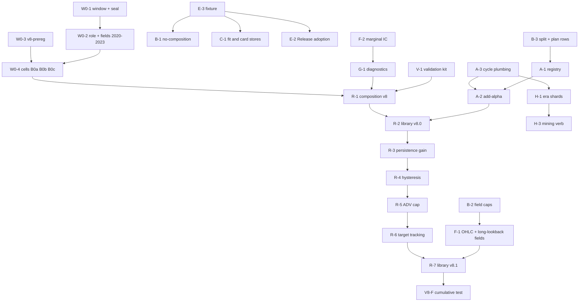

# atx-impl v8 (mega alpha v8) Sprint Plan

> **For agentic workers:** REQUIRED SUB-SKILL: use superpowers:subagent-driven-development to run this plan lane by lane.
> The parent agent is the project manager (PM, "root"). Steps use checkbox (`- [ ]`) syntax for tracking. Every lane gets a
> brief file `task-<ID>-brief.md` cut from the task block below, and answers with `task-<ID>-report.md`.

**Goal:** Raise the net Sharpe, capacity and holding period of the US equity long/short book (library v7.1, S2 net 1.405 on
2020-2022) by adding orthogonal slow alphas, repairing existing ones, fixing how they are combined and traded, while cutting
the research cycle from 134 s and a day of programming per library to under 60 s and one command.

**Architecture:** Three tracks run in parallel. Track P (platform) is identity work: it must leave every accepted output
byte-identical and costs no trials. Track R (research) is a short, ordered list of pre-registered bundles, each one construction
cell, judged on the new TRAIN window 2020-2023. Track H (history and mining) is gated by owner decisions and by Track P.

**Tech Stack:** C++20 (clang-cl 18, CMake presets, Ninja, LLD, GoogleTest), Python 3.12 drivers (numpy, pyarrow, pytest),
`scripts/research_cycle.py` specs, bounded runner `scripts/run_bounded_research.py`, worktree pool `scripts/lease-worktree.ps1`.

**Spec (inputs this plan argues from; executors read them with the plan):**

| input | path |
|---|---|
| v7 ledger (results, rulings, trial accounting) | `C:/atx-wt/pool-2/.superpowers/sdd/platform-20260928/progress.md` |
| code review, platform speed (P-1..P-15) | `.superpowers/sdd/platform-v8-20260929/code-review-v8-platform.md` |
| code review, signal-to-book path (S-1..S-13, C-1..C-9) | `.superpowers/sdd/platform-v8-20260929/code-review-v8-signal.md` |
| code review, atx-engine inventory (O1..O10, G1..G9) | `.superpowers/sdd/platform-v8-20260929/code-review-v8-engine.md` |
| literature review v8 (report) | `.superpowers/sdd/platform-v8-20260929/reports/Equity long short alpha v8.md` |
| literature notes (5 files, full citations) | `.superpowers/sdd/platform-v8-20260929/research_notes/Equity long short alpha v8/` |
| earlier reviews | `.superpowers/sdd/mega-alpha-20260926/v6-literature.md`, `.superpowers/sdd/platform-20260928/literature-v7.md` |

All effect sizes in this plan are estimates from the reviews, marked [est]. None is a measurement on the book.

---

## 1. Baseline

| item | value (TRAIN 2020-2022, scenario S2, $1bn) |
|---|---|
| accepted book | library v7.1 (48 candidates, 38 admitted, 10 themes), role lo1, `ew-theme-v1`, `aim-partial-v5`, L 1.247 |
| net / gross Sharpe | 1.405 / 1.809 |
| return, volatility | 5.80% / 4.13% per year |
| turnover, cost | tau .038 of gross per day; 13.5 bps per traded dollar (linear 6.0, impact 7.5) |
| cost drag | .404 Sharpe units: trading .277, financing .125 |
| names held | about 1,850 |
| capacity, net Sharpe at .5 / 1 / 2 / 4 / 8 x $1bn | 1.448 / 1.405 / 1.357 / 1.236 / 1.082 |
| integrity at N 37 | cell-count DSR .8247 (gate .95 unmet), effective-N DSR .9282, PBO .2051, MinTRL 382 sessions |
| accepted separately, not combined | role lo3 on library v7.0 (net 1.332); V7-F (v7.1 on lo3) registered, never run |
| rejected in v7 | aim-partial-v6 cost shrink (3 cells), spo-v1 (defect), spo-v2 (net .538) |
| research cycle, v7.1 | 133.8 s compute: ref 28.5, u 23.0, fit 21.9, card 19.5, w 14.9, nav 26.0 |
| code state | `C:/atx` main at `7fbfc379` holds all of v7; pool-2 is clean at `39926caa` |

What the three reviews and the literature agree on:

1. Every accepted v7 step is inside one standard error (paired SE .04 to .12). Statistical power is the binding constraint.
2. The book sizes nothing by evidence, volatility, liquidity or signal speed. Four fast members hold 22% of the weight
   and about 75% of raw rank turnover [est]. A one-member theme has 14.7% effective weight against 10% nominal [est].
3. Slower signals serve all three objectives. Capacity has elasticity 2 to signal persistence and 1 to liquidity.
4. No missing alpha family has grade A evidence after 2004 outside microcaps. Expect +.05 to +.15 net Sharpe from 10 to
   20 new slow members [est].
5. Only about 5 s of the 134 s cycle is the new alpha. The rest is repeated work.

---

## 2. Owner decisions

| id | decision | status | default used by this plan |
|---|---|---|---|
| OD-1 | TRAIN becomes 2020-01-01 to 2023-12-31. 2024 and later is hidden and out of sample | **decided by owner, 2026-09-29** | binding |
| OD-2 | Memory and time cap for the IC pass on the 4-year role. Today 1,481 of 1,536 MiB is admitted at 1,155 dates. The 4-year role has about 1,405 dates and needs about 1.9 GiB [est] | open | raise the IC-pass cap to 2,560 MiB and 300 s. Fallback if declined: task H-1 era shards first |
| OD-3 | Backward history extension to 2013-2019, read once on the frozen book | open | not run in v8 without a ruling. Track H builds the tooling only |
| OD-4 | Deflated Sharpe convention on the new window: N stays the full ledger count; cross-trial variance is re-estimated on cells re-run on 2020-2023 | open | as stated; the legacy variance is reported beside it |
| OD-5 | Report seal check matches date-shaped path parts only (v7 defect P6-F1) | open | fix as specified in task E-4 |
| OD-6 | Data asks to atx-db: XBRL current and deferred income tax; open, high, low in the price export; NT 10-K and NT 10-Q form rows | open | Wave B members that need them are withdrawn if data is absent at freeze |
| OD-7 | Mining campaign | open | not run in v8. Track H builds and self-tests the verb only |
| OD-8 | Implementer model and commit trailer for child lanes | open | same as v7; the trailer names the model that wrote the commit |

Consequences of OD-1 that the owner should know:

- 2023 and 2024 were read twice at book level as validation. 2023 enters TRAIN partly selected. TRAIN statistics on 2023
  flatter the incumbent by up to about .08 in a paired difference [est].
- 2024 stays hidden but is not pristine. Only 2025 and later has never been read.
- Four years cut every Sharpe standard error by 13% against three years. A true +.08 step has t .80. Single steps stay
  undetectable. This plan therefore tests bundles and one cumulative comparison.
- The standing rule "never read a per-candidate VAL statistic" no longer covers 2023. It covers 2024 and later.

---

## 3. Global Constraints

Every task inherits these. They restate the v7 standing rules with the OD-1 change.

- Root worktree is `C:/atx-wt/pool-2`, rebased on `C:/atx` main. Branch `feat/platform-v8-20260929`. Never build, switch or
  commit in `C:/atx`; the atx-db session owns it. Never touch `atx-db/` or kill its processes.
- Root alone builds and runs real data. Children own one pool worktree each (pools 3, 4, 7, 8, 9, 10, 11; never 1 or 6),
  leased with `scripts/lease-worktree.ps1`. Children never build, never run real data, never spawn subagents.
- Real data runs only through `scripts/run_bounded_research.py` or `scripts/research_cycle.py run`. Caps are 180 s and
  1,536 MiB unless OD-2 rules otherwise.
- TRAIN is `[2020-01-01, 2024-01-01)`. No tool, test, report or agent may open a session, file or statistic dated
  2024-01-01 or later. No validation statistic is quoted anywhere.
- Every ruling is written as "Ruling: decision -- why -- cost if wrong" before the measurement it could bias.
- Every new cell, library and field is pre-registered in `v8-prereg.md` before it runs. Every result carries the
  Appendix A trial accounting block.
- Track P tasks must reproduce named accepted outputs byte for byte. A task that cannot is not merged.
- C++ follows `.agents/cpp/agent.md`. Build through the tracked research build script (task E-1). `/W4 /WX` stays on.
- No pushes, warehouse writes or broker actions.
- The sprint directory is `.superpowers/sdd/platform-v8-20260929/`, committed with `git add -f` before every real-data run.
- One variant per hypothesis. Windows come from the house set {5, 21, 63, 126, 252}. No window, sign or parameter search.

---

## 4. Review Focus

Failure modes the inputs imply and that a single task's happy-path test would miss. Each line names the owning task's test.

| # | condition | expected behaviour | test |
|---|---|---|---|
| 1 | A role, field, cache sidecar or report path carries a session on or after 2024-01-01 | every tool refuses with a seal error; nothing is scored or rendered | W0-1 `test_seal_refuses_2024` (Python), `ResearchWindow.RefusesSealedSession` (gtest) |
| 2 | Extending the role to 2023 changes the 2020-2022 values (larger instrument union, summation order) | per (date, instrument id) values of 2020-2022 equal the 3-year run; any difference is reported and stops the re-base | W0-2 `compare_window_overlap` |
| 3 | The 4-year role exceeds the memory admission | `--plan-only` prints required bytes; the run refuses before loading; the driver hard-stops | W0-2 step 3; B-2 `AdmissionReportsRequiredBytes` |
| 4 | Two roles or two windows share one cache root | a payload from another role or window is a miss, never a hit | C-1 `test_fit_store_keyed_by_role_and_window`; B-1 `CacheMissOnRoleChange` |
| 5 | A child report lands in the sprint directory during a cycle; a second cell is ledgered between plan and run | the cycle continues; `dsr_n` resolves from the ledger at scoring time | A-3 `test_clean_check_pathspec`, `test_dsr_n_from_ledger` |
| 6 | A candidate has signal on fewer than 80% of eligible names, or an event field is empty for a whole year | it is scored with a coverage flag, never silently unscored | C-1 `test_card_low_coverage_reported` |
| 7 | A hex cache folder name contains "2024" | the report reads it; a date-shaped path part is still refused | E-4 `test_seal_regex_hex_vs_date` |

---

## 5. Decisions (code review x literature)

| id | decision | code evidence | literature evidence | track, task |
|---|---|---|---|---|
| D1 | Re-base the protocol on TRAIN 2020-2023 with one source of truth for the window and a 2024 seal | seal and TRAIN end are hard-coded in about 20 places (`strategy_data.cpp:21`, `fit_composition_weights.py:233`, `strategy_risk_verb.cpp:41`, `mega_report/data.py:23`) | the sample change must be logged and justified before any read (Arnott-Harvey-Markowitz 2019) | W0-1..W0-4 |
| D2 | Correct the baseline for terminal returns and the flat start before building on it | C-1: 300 write-offs, $180.6M gross, PnL 0; C-7: flat start on 2020-01-02 | capacity and Sharpe claims should hold under stress until live fills exist | W0-4 cell B0c |
| D3 | Alpha registry and one generator; `add-alpha` verb | P-1: 560-line generator for 4 alphas; 7-deep import chain | one specification in, one report out (Lopez de Prado 2018) | A-1, A-2 |
| D4 | Remove repeated work: fit and card stores, `--no-composition`, shared roots | P-2, P-3: fit computed 48 reused 0; u pass blends an unread book | expression cache saved 80% in Qlib's own benchmark | B-1, C-1, C-2 |
| D5 | Adopt Release research executables behind an identity canary | P-4: CPU stages -29% in existing receipts | none | E-1, E-2 |
| D6 | Lift field caps; add open, high, low | P-6, O1: row cap 63 of 64; role has close and volume only | overnight and intraday split needs the open | B-2, F-1 |
| D7 | Marginal IC read-out for every candidate | O4: `combine/orthogonalize.hpp` exists unused | include a signal iff S_i >= rho x S_book (Benhamou-Guez 2018) | F-2 |
| D8 | Zero-trial diagnostics before any construction trial | S-3, S-7, S-9: no statistic at the traded horizon; risk model unused | borrow fees overstate modelled net Sharpe by up to .1 [est] | G-1..G-3 |
| D9 | Composition v8: theme re-standardisation, member cap, evidence-tier weights | S-1, S-4: `strategy_ic_composition.cpp:191`; tier unused in weights | a bad TRAIN result keeps 47% of a prior at 4 years; tiers are a zero-parameter prior | R-1 |
| D10 | Library v8.0: definitional upgrades from existing fields | 2.6 of the signal review: sue, droe, chtax are one signal; ear is 28 sessions stale | 12-month announcement momentum t 2.94 in the top 1000 (Gerard-Jehl 2025); R&D add-back (Novy-Marx-Medhat 2025) | R-2 |
| D11 | Slow the aim: persistence gain, then rank hysteresis | S-2: `ew-theme-aim-v1` built, never run on a v6+ library | hysteresis: turnover -20 to -40% for gross -2 to -5% (Robeco 2022) | R-3, R-4 |
| D12 | ADV holding cap judged at 4x NAV | S-6: max holding about 27% of ADV at the floor | liquidity rules pay at $4-8bn, not at $1bn | R-5 |
| D13 | Target-tracking optimiser replaces the alpha-maximising one | S-8: alpha is one line, `strategy_spo.cpp:1020` | a binding gross cap is a soft threshold on alpha per dollar; joint regularisation fixes it (Boyd et al. 2024) | R-6 |
| D14 | Library v8.1: new slow families from new fields | O1, P-6 | tax-to-book, 5-year composite issuance, coskewness keep alpha after 2004 (researcher's own computation) | R-7 |
| D15 | Ex-ante risk target converts lower volatility into return | S-7; ledger P6-F2 | volatility targeting does not raise Sharpe; a risk target costs about .04 [est] | R-8 (optional) |
| D16 | History extension by era shards; date blocks only in AuditExact | P-5: a halo restart or a longer role changes ResearchFast bits | 10 years cut standard errors by nearly half | H-1, H-2 (gated) |
| D17 | Mining verb is built and self-tested, not run | O8: search exists, runs only on old panels | mined US large-cap ICs are .005 to .017; hurdles t 3.5 to 4.6 | H-3 (gated) |

---

## 6. Sprint shape

### 6.1 Waves

| wave | content | trials | exit gate |
|---|---|---|---|
| 0 | protocol re-base: window constants, 4-year role and fields, pre-registration, baseline cells | 3 (B0a, B0b, B0c) | baseline B0c ledgered; overlap identity reported |
| 1 | platform lanes A, B, C, D, E, F; validation kit V; diagnostics G | 0 | v7.1 cycle reproduced byte for byte in at most 60 s; diagnostics report written |
| 2 | R-1 composition v8, R-2 library v8.0, R-3 persistence gain | 3 | each judged by its registered rule |
| 3 | R-4 hysteresis, R-5 ADV cap, R-6 target-tracking optimiser | 3 | same |
| 4 | R-7 library v8.1, R-8 risk target (optional), R-9 capacity frontier (optional) | 1 to 5 | same |
| 5 | H-1 era shards, H-2 AuditExact measurement, H-3 mining verb self-test | 0 without OD-3 / OD-7 | tooling accepted on the fixture |
| 6 | V8-F cumulative test, scorecard v8, pitch, handoff | 0 (V8-F is the last accepted cell) | owner review |

Wave 1 starts on day 1 beside Wave 0. Waves 2 to 4 need Wave 0 and tasks A-3, B-1, C-1, V-1, G-1.

### 6.2 Lanes and owned files

Lanes own disjoint files. A lane that needs another lane's file asks the PM for a contract, not an edit.

| lane | tasks | owns | pool |
|---|---|---|---|
| W0 | W0-1 | `atx-impl/strategies/research_window.json`, `atx-engine/include/atx/engine/data/research_window.hpp`, `atx-engine/tools/research_window.py`, plus the one-line constant sites listed in W0-1 | root, first commit |
| A | A-1, A-2, A-3 | `atx-impl/strategies/alphas/`, `atx-impl/strategies/libraries/`, `atx-impl/strategies/generate_library.py`, `scripts/research_cycle.py`, `scripts/run_bounded_research.py`, `scripts/specs/v8/`, `scripts/tests/test_research_cycle.py` | 11 |
| B | B-1, B-2, B-3 | `atx-impl/src/strategy_ic_runner.{cpp,hpp}` and its split files, `atx-impl/tools/equity_strategy_ic.cpp`, `atx-impl/tests/strategy_ic_runner_test.cpp` | 10 |
| C | C-1, C-2, C-3 | `atx-impl/tools/fit_composition_weights.py`, `alpha_report_card.py`, `atx-engine/tools/prepare_research_fields.py`, `research_fields_sec.py`, `research_fields_holdings.py`, their tests | 9 |
| D | D-1, D-2 | `atx-impl/src/strategy_nav_replay.{cpp,hpp}`, `strategy_price_exposures.{cpp,hpp}`, `atx-impl/tools/equity_strategy_targets.cpp`, their tests | 4 |
| E | E-1..E-4 | `scripts/research-build.ps1`, `atx-impl/CMakeLists.txt`, `atx-impl/tests/CMakeLists.txt`, `scripts/tests/fixtures/tiny_world.py`, `scripts/tests/test_cycle_e2e.py`, `atx-impl/tools/mega_report/data.py` | root or 8 |
| F | F-1, F-2 | `atx-engine/tools/prepare_recent_research.py`, `atx-engine/tools/research_fields_price.py` (new), `atx-impl/src/strategy_marginal_ic.{cpp,hpp}` (new), `atx-impl/tests/strategy_marginal_ic_test.cpp` (new) | 7 |
| V | V-1, V-2 | `atx-impl/tools/nav_summ.py`, `atx-impl/tools/backtest_integrity.py` (moved), `atx-impl/tools/holdout_gate.py` (new), tests | 8 |
| G | G-1..G-3 | `atx-impl/tools/book_diagnostics.py` (new), `atx-impl/tools/test_book_diagnostics.py` (new) | 3 |
| R | R-1..R-9 | per task; construction code in `atx-impl/src/strategy_target_replay.{cpp,hpp}`, `strategy_ic_composition.{cpp,hpp}`, `strategy_spo.{cpp,hpp}`, `strategy_nav_v7.{cpp,hpp}` | 3, 4, 7 after Wave 1 |
| H | H-1..H-3 | `scripts/research_cycle.py` `roles:` loop (contract with A), `atx-impl/src/strategy_mine.{cpp,hpp}` (new) | 10, 11 after Wave 1 |

Shared files and their single owner: `strategy_ic_composition.{cpp,hpp}` belongs to B in Wave 1 and to R-1 after B merges.
`strategy_target_replay.{cpp,hpp}` belongs to D in Wave 1 (read only there) and to R-4, R-5 in sequence after D merges.

### 6.3 Cross-lane contracts (declared before dispatch)

| contract | writer | reader | content |
|---|---|---|---|
| K1 plan rows | B-3 | A-1 | `atx-equity-strategy-ic --plan-only` prints `candidates[]`: `{id, dsl_sha256, num_slots, required_lookback, extra_fields[], node_count}` |
| K2 exposures layout | D-2 | C (follow-up) | `atx-equity-strategy-targets exposures --role R --output DIR` writes `basis.f64` (decisions x names x 4) and `forward_returns.f64` plus `manifest.json` |
| K3 `--no-git` | A-3 | E-3 | accepted by `research_cycle.py` and `run_bounded_research.py` only when `--root` is outside the repository |
| K4 window | W0-1 | all | `research_window.json` schema `atx.research-window/v2`; nobody hard-codes a TRAIN or seal date again |
| K5 origin class | A-1 | V-1 | registry field `origin` in {`prior`, `grid`, `mined`}; copied into every ledger line |
| K6 marginal IC | F-2 | C-2, G-1 | `marginal_ic.json` per candidate: `{id, ic21, ic21_hac_t, marginal_ic21, marginal_hac_t, max_abs_rho, max_rho_member}` |

### 6.4 Merge order

W0-1 first. Then E-3 (fixture) and B-3 (move-only split). Then B -> C -> A -> F -> D -> V -> G -> E-2.
Research lanes merge one at a time in trial order, each rebased on the last accepted cell.

### 6.5 Dependency graph



---

## 7. Wave 0: protocol re-base

### Task W0-1: one source of truth for the research window; seal at 2024-01-01

**Files:**
- Create: `atx-impl/strategies/research_window.json`
- Create: `atx-engine/include/atx/engine/data/research_window.hpp`
- Create: `atx-engine/tools/research_window.py`
- Create: `atx-engine/tools/test_research_window.py`
- Create: `atx-engine/tests/data_research_window_test.cpp`
- Modify (constants only, each replaced by a read of the new source):
  `atx-engine/src/data/strategy_data.cpp:21,101,130`; `atx-impl/src/strategy_risk_verb.cpp:41,859-864,918,1005`;
  `atx-impl/src/strategy_live.hpp:44-49`, `strategy_live.cpp:343-347`; `atx-impl/tools/fit_composition_weights.py:225,233,409-418`;
  `atx-impl/tools/alpha_report_card.py` (seal docstring and check); `atx-engine/tools/prepare_recent_research.py:70,239,918`;
  `atx-engine/tools/prepare_research_fields.py:660,2560`; `atx-engine/tools/prepare_identity_bridge.py:585-594`;
  `atx-engine/tools/research_fields_sec.py:76`; `atx-engine/tools/research_fields_holdings.py` (seal constant);
  `atx-engine/tools/build_fundamental_events.py` (seal constant).
- Not modified: `atx-impl/src/stage_equity_*.cpp` and `trial_ledger.hpp:124` (old pipeline, not on the research path).

**Interfaces:**
- Produces `research_window.json`:

```json
{
  "schema": "atx.research-window/v2",
  "train_begin": "2020-01-01",
  "train_end_exclusive": "2024-01-01",
  "seal_begin": "2024-01-01",
  "hidden": {
    "read_twice_at_book_level": ["2024-01-01", "2025-01-01"],
    "never_read": ["2025-01-01", null]
  },
  "supersedes": {"schema": "research-seal-v1", "train_end_exclusive": "2023-01-01", "seal_begin": "2025-01-01"},
  "owner_ruling": {"date": "2026-09-29", "text": "expand TRAIN to include 2023; keep 2024+ hidden and out of sample"}
}
```

- Produces `research_window.hpp`:

```cpp
#pragma once
#include <cstdint>
#include <string_view>

namespace atx::engine::data {
// Generated values; the JSON file is the source and a test pins the two together.
inline constexpr std::int64_t kTrainBeginNs = 1'577'836'800'000'000'000LL;        // 2020-01-01T00:00Z
inline constexpr std::int64_t kTrainEndExclusiveNs = 1'704'067'200'000'000'000LL; // 2024-01-01T00:00Z
inline constexpr std::int64_t kSealBeginNs = 1'704'067'200'000'000'000LL;         // 2024-01-01T00:00Z
inline constexpr std::string_view kResearchWindowId = "research-window-v2";
[[nodiscard]] constexpr bool is_sealed(std::int64_t session_ns) noexcept { return session_ns >= kSealBeginNs; }
}  // namespace atx::engine::data
```

- Produces `research_window.py`: `load() -> dict`, `TRAIN_BEGIN_NS`, `TRAIN_END_NS`, `SEAL_NS`, `SEAL_DATE`, `is_sealed(ns: int) -> bool`.

- [ ] **Step 1: write the failing tests.** Python: `test_json_and_module_agree`, `test_seal_refuses_2024` (a role manifest whose
  last session is 2024-01-02 makes `prepare_research_fields`, `fit_composition_weights` and `alpha_report_card` raise
  `ValueError` naming the seal), `test_2023_session_is_train`. gtest: `ResearchWindow.HeaderMatchesJson` (parse the JSON at
  test time, compare three integers), `ResearchWindow.RefusesSealedSession` (`read_strategy_role` on a synthetic role ending
  2024-01-02 returns `InvalidArgument`), `ResearchWindow.Accepts2023`.
- [ ] **Step 2: run them and see them fail** (`pytest atx-engine/tools/test_research_window.py -q`; root builds
  `atx-engine-data-tests` and runs `--gtest_filter=ResearchWindow.*`).
- [ ] **Step 3: add the three new files; replace each listed constant by the shared value.** Error strings name
  `research-window-v2` and the date 2024-01-01.
- [ ] **Step 4: grep gate.** `grep -rn "2023-01-01\|2025-01-01\|1_672_531_200\|1'735'689'600" atx-engine/tools atx-engine/src/data
  atx-impl/src/strategy_*.cpp atx-impl/src/strategy_*.hpp atx-impl/tools` returns only comments that cite history and the
  `supersedes` block.
- [ ] **Step 5: run all Python tests and the C++ target tests; commit** `feat(protocol): research-window-v2, TRAIN 2020-2023, seal 2024-01-01`.

**Acceptance (root):** all tests green; the grep gate is empty; on the existing 3-year role every tool still runs (the role
ends before the new TRAIN end) and the v7.1 cycle outputs are byte-identical except manifest strings that name the window id.

### Task W0-2: role and fields for 2020-2023

**Files:**
- Create: `scripts/specs/v8/base-lo1.json`, `scripts/specs/v8/base-lo3.json`
- Create: `atx-impl/tools/compare_window_overlap.py`, `atx-impl/tools/test_compare_window_overlap.py`

**Interfaces:**
- Consumes: W0-1; A-3 stage inputs (if A-3 has not landed, root runs the builder commands by hand from the L9 report).
- Produces roles `build-equity/train-2020-2023-lo1`, `build-equity/train-2020-2023-lo3` and fields dirs
  `...-lo1-fields-v9`, `...-lo3-fields-v9` (63 fields, same list as `scripts/specs/v71.json` `fields.list`).
- Produces `compare_window_overlap.py --old DIR --new DIR --kind {signal,daily_ic,field} --out report.json`: aligns by
  (session, instrument id); prints max absolute difference, count of unequal cells, and `bit_identical: true|false`.

- [ ] **Step 1:** rebuild the identity bridge with `--seal 2024-01-01`; pin its manifest SHA in both specs.
- [ ] **Step 2:** build the roles: `prepare_recent_research.py role --start 2018-06-01 --score-start 2020-01-01 --end 2024-01-01`
  with the lo1 rule and the lo3 rule (`--universe linked-operating-v3`, `--sic-events`, `--delisting`). Keep the start date,
  so the panel's first date and every ResearchFast reseed point are unchanged.
- [ ] **Step 3:** `atx-equity-strategy-ic --plan-only` on each role. Record `required_bytes`. If it exceeds the cap in force,
  stop and apply the OD-2 ruling or switch to H-1.
- [ ] **Step 4:** build fields v9 on both roles through the bounded runner. Record seconds and peak MiB.
- [ ] **Step 5:** run the u pass of library v7.1 on the lo1 role, cold cache. Run `compare_window_overlap.py` against
  `mega-v71-train-u-1` for the cached signal payloads and `train_daily_ic.csv`, on sessions before 2022-09-30 (labels at
  h 63 mature in both).
- [ ] **Step 6:** write the result to the ledger under ruling W0-a (below), then commit the specs.

**Ruling W0-a (declare before step 5):** if the overlap is bit-identical, the 4-year cells continue the v7 ledger without
comment. If it differs by less than 1e-9, the difference is disclosed and the 4-year values are the reference from now on.
If it differs by more, the re-base stops and the cause is found -- a silent change in old values would make every paired
comparison uninterpretable -- cost if wrong: one day.

**Acceptance (root):** both roles admitted; fields v9 built with coverage on member cells within .02 of the 3-year build for
every field; overlap report committed.

### Task W0-3: pre-registration and ledger event

**Files:**
- Create: `.superpowers/sdd/platform-v8-20260929/v8-prereg.md` (text in Appendix A of this plan)
- Modify: `.superpowers/sdd/platform-v8-20260929/progress.md`

- [ ] **Step 1:** copy Appendix A into `v8-prereg.md`; fill the role and fields manifest SHAs from W0-2.
- [ ] **Step 2:** append one line of kind `protocol` to `build-equity/trials.jsonl`: window id, owner ruling text, date, the
  SHA of `research_window.json`. It does not raise N.
- [ ] **Step 3:** commit with `git add -f` before any B0 cell runs.

### Task W0-4: baseline cells

| cell | book | role | protocol | purpose | N after |
|---|---|---|---|---|---|
| B0a | v7.1, ew-theme-v1, aim-partial-v5, L 1.247 | lo1, 2020-2023 | as v7 | continuity: the accepted book on the new window | 38 |
| B0b | same | lo3, 2020-2023 | as v7 | V7-F restated on the new window | 39 |
| B0c | winner of B0a / B0b | same role rebuilt with `--delisting-returns` | delisting returns on; warm start from the role's pre-2020 sessions | protocol correction (C-1, C-7); the v8 baseline | 40 |

- [ ] **Step 1:** declare in `v8-prereg.md` that B0c is the baseline whatever its sign, and that B0b is accepted on paired
  S2 net dSR > 0 against B0a and mechanics.
- [ ] **Step 2:** lane D implements the warm start as its first commit (task D-0): NAV flag `--warm-start-sessions 60` in
  `strategy_nav_replay.cpp` (decide from session `score_begin - 60`, score from `score_begin`). Tests
  `NavWarmStart.FlagOffIsByteIdentical`, `NavWarmStart.GrossAtFirstScoredSessionWithin5PctOfSteadyState`. Root builds and merges it
  before B0c.
- [ ] **Step 3:** run B0a, B0b, B0c through `research_cycle.py run scripts/specs/v8/base-*.json`.
- [ ] **Step 4:** report each cell with a year table (2020, 2021, 2022, 2023: net Sharpe, return, volatility, turnover,
  cost per dollar) and the Appendix A block. Re-run on the 4-year role every ledgered v7 cell that is reproducible from a
  spec or from its recorded argv (v6.1, v7.0, v7.0-lo3, C1-C3, spo-v1, spo-v2), for the cross-trial variance of OD-4. These re-runs are the same trials on a longer
  window and do not raise N.

**Acceptance:** three cells ledgered; mechanics pass (gross, net, turnover limits as v7); B0c named as parent of R-1.

---

## 8. Wave 1: platform lanes (no trials)

Each task ends with a root identity run. Targets are from the platform review; "est." marks its estimates.

### Task E-3: tiny_world fixture and end-to-end test (lands first)

**Files:**
- Create: `scripts/tests/fixtures/tiny_world.py`, `scripts/tests/test_cycle_e2e.py`, `scripts/specs/tiny.json`
- Modify: `atx-impl/tests/CMakeLists.txt:54,84-111` (register the three strategy test executables with
  `gtest_discover_tests`, label `atx_equity_strategy`)

**Interfaces:**
- Produces `tiny_world.build(root: Path, seed: int = 7) -> dict`: writes a role of 448 dates x 64 names (score_begin 384),
  3 extra fields with a manifest, a 4-member library with 2 planted signals (true IC .05 at h 21), 1 noise member and 1 copy
  of a planted member, a registry and `tiny.json`. Returns the manifest SHAs.
- Consumes K3 (`--no-git`).

- [ ] **Step 1:** write `test_cycle_e2e.py`: skip unless `ATX_EQUITY_BIN` is set; run `research_cycle.py run tiny.json
  --root <tmp> --no-git`; assert exit 0, golden SHAs of `orientations.json`, `admission.json` and the primary daily CSV;
  assert the copy is rejected as redundant; assert a second run reports every phase as up to date.
- [ ] **Step 2:** run, see it fail (no fixture).
- [ ] **Step 3:** implement `tiny_world.py` with `numpy.random.Generator(PCG64(seed))`; returns are
  `r = 0.05 * z_planted / sqrt(21) + noise`, noise sd .02.
- [ ] **Step 4:** root runs the test with the Debug executables, records the golden SHAs, commits them.
- [ ] **Step 5:** commit `test(platform): tiny_world end-to-end fixture and ctest registration`.

**Acceptance:** under 15 s; same SHAs on a second machine-clean run; `ctest -L atx_equity_strategy` lists the 243 tests.

### Task B-3: move-only split of the IC runner and per-candidate plan rows

**Files:**
- Modify: `atx-impl/src/strategy_ic_runner.cpp` (2,568 lines) split at the seams in platform review P-13 into
  `strategy_ic_library.cpp` (library and field plan), `strategy_ic_admission.cpp`, `strategy_ic_signal_cache.cpp`,
  `strategy_ic_result_cache.cpp`, `strategy_ic_runner.cpp` (score_role and CLI); one header `strategy_ic_detail.hpp`
- Modify: `atx-impl/CMakeLists.txt` source list and the `/O2` list at `:87-94`

**Interfaces:** produces contract K1.

- [ ] **Step 1:** test `StrategyIcRunner.PlanOnlyPrintsCandidateRows`: a 3-candidate library yields 3 rows with the fields of K1.
- [ ] **Step 2:** move code without edits; update the `dsl_vm_sources` and `ic_result_sources` pins in the same commit.
- [ ] **Step 3:** add the `candidates[]` array to the `--plan-only` JSON.
- [ ] **Step 4:** root: build, 46 runner tests, e2e fixture SHAs unchanged, v7.1 u pass byte-identical.

### Task B-1: incremental u pass

**Files:** `atx-impl/src/strategy_ic_runner.cpp`, `atx-impl/tools/equity_strategy_ic.cpp`, `atx-impl/tests/strategy_ic_runner_test.cpp`

**Interfaces:** produces flag `--no-composition`; summary key `"composition": "skipped"`. Consumed by A-3 (`run --screen`).

- [ ] **Step 1:** tests `NoComposition.SkipsBlendAndCombinedRows`, `NoComposition.HitWithIcResultIsNotLoaded`,
  `NoComposition.MemberRowsByteIdenticalToDefault`, `StrategyIcRunner.CacheMissOnRoleChange`.
- [ ] **Step 2:** implement: skip `IcComposition`, `__combined__` rows, planned targets, `--save-combined`; refuse
  `--no-composition` together with `--composition-weights`.
- [ ] **Step 3:** root: v7.1 u pass with the flag; `orientations.json` and member rows of `train_daily_ic.csv`
  byte-identical to `mega-v71-train-u-1`.

**Target:** u 23.0 s -> about 6 s (est.).

### Task B-2: field caps and worker cap

**Files:** `atx-impl/src/strategy_ic_library.cpp` (after B-3), `atx-engine/src/factory/ic_screen.cpp:287`, tests

- [ ] **Step 1:** tests `FieldCaps.Admits200RowManifestWith40Referenced`, `FieldCaps.RefusesLibraryReferencing257Fields`,
  `FieldCaps.V71FieldPlanUnchanged`, `Workers.OutputsByteIdenticalAt4And8And16`,
  `StrategyIcRunner.AdmissionReportsRequiredBytes`.
- [ ] **Step 2:** manifest row cap 64 -> 1,024; `FieldPlan` masks from `u64` to `std::bitset<256>`; worker cap 4 -> 16 in
  the runner and in `ic_screen.cpp`; the admission envelope per worker stays as coded.
- [ ] **Step 3:** root: v7.1 u and w byte-identical at 4 and at 12 workers; record vm, ic, composition seconds.

### Task C-1: fit and card stores

**Files:** `atx-impl/tools/fit_composition_weights.py:184-192,242,926,1061`, `atx-impl/tools/alpha_report_card.py`, tests

**Interfaces:**
- Store root `build-equity/fit-work/<role_sha16>-<window_id>/`; record key = (signal payload SHA, producer fingerprint).
- `producer_fingerprint(funcs: tuple) -> str`: SHA-256 of the normalised AST of `factor_record`, `Context`, `PricePanel`,
  `neutralization_basis`, `centered_tied_ranks`, as `prepare_research_fields.py:2748-2780` does for field groups.
- Themes are read from the registry (A-1) when present, else from the in-file list.

- [ ] **Step 1:** tests `test_fit_store_reuses_across_libraries` (v7.0 then v7.1 prints `computed 4, reused 44`),
  `test_comment_edit_keeps_store`, `test_fit_store_keyed_by_role_and_window`, `test_card_invariant_block_reused`,
  `test_card_low_coverage_reported`.
- [ ] **Step 2:** implement the store key, the fingerprint and the card's invariant block (IC by year, decay curve, size and
  FF12 splits, coverage, book PnL); only the correlation block is recomputed.
- [ ] **Step 3:** root: admission.json byte-identical to `mega-weights-v71-ew`; cards byte-identical to `mega-cards-v71`.

**Target:** fit 21.9 -> about 8 s; card 19.5 -> about 5 s (est.).

### Task C-2: report-only columns at the traded horizon

**Files:** `atx-impl/tools/alpha_report_card.py`, `atx-impl/tools/fit_composition_weights.py`, tests

**Interfaces:** adds to each card `ic_theta = sum over h of theta (1 - theta)^(h-1) m(h)`, theta .05, h 1..63, m(h) the
lagged one-day rank IC already in the card; adds to the admission table the column `f_theta` (factor return of the
theta-averaged sleeve book, HAC t). Also copies the K6 marginal IC columns into the card. All report-only.

- [ ] **Step 1:** tests `test_ic_theta_matches_hand_value`, `test_f_theta_is_report_only` (admission verdicts unchanged
  with the column on).
- [ ] **Step 2:** implement; declare in `v8-prereg.md` before the first read that neither column gates or selects.

### Task C-3: reuse for SEC and holdings field modules

**Files:** `atx-engine/tools/prepare_research_fields.py:501-505,525-528,2917-2923`, `research_fields_sec.py`,
`research_fields_holdings.py`, tests

- [ ] **Step 1:** tests `test_reuse_self_reports_63_reused`, `test_one_producer_edit_recomputes_one_field` (an edit in
  `build_ftd` recomputes only `ftd_shares_ratio21`).
- [ ] **Step 2:** each module exports `PRODUCERS = {group: (entry functions,)}`; `producer_fingerprints` runs over that
  module's AST; the stage manifest SHA is the source check.

**Target:** a one-field build 59-121 s -> about 10 s (est.).

### Task A-1: alpha registry and one generator

**Files:**
- Create: `atx-impl/strategies/alphas/registry.json`, `atx-impl/strategies/libraries/v71.json`,
  `atx-impl/strategies/generate_library.py`, `atx-impl/strategies/test_generate_library.py`

**Interfaces:**
- `registry.json` schema `atx.alpha-registry/v1`: `alphas[]` of `{id, dsl, theme, tier, prior_sign, citation,
  prior_sign_source, form, origin, notes{formula, domain, deviation}, added_in}`; `fields{name: {formula_id, origin,
  producer, clock}}`; `themes{name: text}`; `tier_scores{"A": 1.0, "A-": 0.9, "B+": 0.8, "B": 0.7, "B-": 0.55, "C+": 0.4}`.
- `libraries/<name>.json`: `{id, parent, members[], budget_exceptions[], prereg}`.
- `generate_library.py --library NAME [--check] [--plan-json PATH]`: writes the library JSON and a slim recipe
  `atx.dsl-ic-experiment/v2`; static validation comes from the K1 plan rows, not from a Python parser.

- [ ] **Step 1:** tests `test_v71_library_byte_identical` (SHA `787c802e...`), `test_plan_rows_equal_static_validation` (48
  rows), `test_unknown_theme_refused`, `test_origin_required`.
- [ ] **Step 2:** seed the registry from `fund_industry_ic_v71.json` (48 entries, origin `prior`).
- [ ] **Step 3:** implement the generator. Generators v4 to v71 stay in the tree as frozen legacy with their tests.
- [ ] **Step 4:** root: the fitter on the slim recipe writes admission.json identical to `mega-weights-v71-ew` after
  dropping the recipe pin.

### Task A-3: research_cycle plumbing

**Files:** `scripts/research_cycle.py:100-102,591-635,936-952`, `scripts/run_bounded_research.py:91-93`, tests

- [ ] **Step 1:** tests `test_stage_inputs_map_to_flags` (the ten L9 inputs), `test_clean_check_pathspec` (a file written
  under `.superpowers/` mid-run does not stop the cycle; an edit under `atx-impl/` does), `test_dsr_n_from_ledger`,
  `test_every_phase_has_receipt`, `test_ref_skipped_when_fields_unchanged`, `test_no_git_only_outside_repo`,
  `test_build_key_resolves_exe_dir`.
- [ ] **Step 2:** implement: INPUT_KEYS `sec_identity_bridge`, `earnings_calendar`, `insider`, `sec_filings`, `thirteenf`,
  `ftd`, `regsho_threshold`, `security_master`, `short_volume_ext`, `reuse_fields`; clean check scoped to `atx-core`,
  `atx-tsdb`, `atx-engine`, `atx-impl`, `scripts`, CMake files; `dsr_n: "ledger+1"`; `build: "equity-rel" | "equity"`;
  cache and fit roots derived from the role SHA when the spec omits them; `out_root` spec key; the ledger copied into the
  sprint directory after each cycle.
- [ ] **Step 3:** root: `run scripts/specs/v71.json --suffix p8` reproduces the v7.1 cell's ten daily and events files.

### Task A-2: `add-alpha` and `run --screen`

**Files:** `scripts/research_cycle.py`, `scripts/tests/test_research_cycle.py`

**Interfaces:**
- `research_cycle.py add-alpha --id X --dsl "..." --theme T --tier B --prior-sign 1 --citation "..." --origin prior
  --parent v71 [--name v72]`: validates through K1, writes the registry entry, the library file, a pre-registration stub and a
  spec derived from the parent by name templates, then locks.
- `research_cycle.py run SPEC --screen`: u (new members only) -> fit -> card -> marginal IC -> gate. Prints the admission
  rows. Writes `cycle_verdict.json`: `{admission[], marginal[], paired{dsr, se, cbb_ci, lw_p}, dsr{n, cell_count,
  effective_n}, pbo, phases[{name, seconds, peak_mib}]}` (paired and dsr blocks only after a full `run`).

- [ ] **Step 1:** tests `test_add_alpha_entry_byte_identical_to_committed` (one v7.1 member on parent v70),
  `test_screen_stops_before_w`, `test_verdict_schema`.
- [ ] **Step 2:** implement. **Step 3:** root: on the fixture, `add-alpha` then `run --screen` in under 15 s.

### Task E-1: tracked research build script. Task E-2: Release adoption

**Files:** `scripts/research-build.ps1` (from the untracked `build-equity/mega-build.ps1`, root resolved from the script
path), `atx-impl/CMakeLists.txt:86-95`

- [ ] **E-1 step 1:** the script takes `-Tag`, `-Targets`, `-Preset equity|equity-rel`; refuses an existing tag receipt.
- [ ] **E-2 step 1:** root, on a quiet host: rebuild the three research executables under `equity-rel`; run u, w and NAV of
  the v7.1 cell with both builds. **Step 2:** adopt `build: "equity-rel"` as the spec default only if the daily CSVs,
  orientations and `train_combined` are byte-identical and CPU stages are at least 25% lower. gtests stay in the Debug tree.
- [ ] **E-2 step 3:** the e2e fixture runs after every build tag under both builds; the SHAs must agree (the canary).

### Task E-4: report seal check (needs OD-5)

**Files:** `atx-impl/tools/mega_report/data.py:23,49`, `atx-impl/tools/test_mega_report_seal.py`

```python
import re

_HEX = re.compile(r'^(?:fp_|ic1_)?[0-9a-f]{16,64}$')
_NAMED = re.compile(r'(validation|holdout|(?<![A-Za-z])VAL(?![A-Za-z]))')
_YEAR = re.compile(r'(?<!\d)(20\d\d)')

def path_is_sealed(rel_path: str, first_sealed_year: int = 2024) -> bool:
    """True when a path names hidden data. Hash-named parts are ignored; date-shaped parts are not."""
    if _NAMED.search(rel_path):
        return True
    for part in re.split(r'[\\/._-]', rel_path):
        if not part or _HEX.match(part):
            continue
        if any(int(y) >= first_sealed_year for y in _YEAR.findall(part)):
            return True
    return False
```

- [ ] **Step 1:** test `test_seal_regex_hex_vs_date`: `fp_2e2025f0aa11bb22/droe.f64` is read; `nav-2023-2024/x.csv`,
  `x_20250131.csv`, `nav-2026/y.csv`, `VAL/z.csv` are refused; `train-2020-2023-lo1/daily.csv` is read. Paths are taken
  relative to the research output root, so a run-date-stamped sprint folder never enters the check; the test
  `test_seal_paths_are_relative_to_out_root` pins that.
- [ ] **Step 2:** implement; `first_sealed_year` comes from `research_window.py`. **Step 3:** root re-renders the v7 pitch:
  0 unavailable blocks.

### Task D-1: NAV stage timers, log-return ring, construction grid. Task D-2: exposures verb

**Files:** `atx-impl/src/strategy_nav_replay.cpp:1014-1112`, `strategy_price_exposures.cpp:107-146`,
`atx-impl/tools/equity_strategy_targets.cpp`, tests

- [ ] **D-1 step 1:** tests `NavTimers.SumWithin5PctOfWall`, `LogRing.ExposuresBitIdenticalToWindowRecompute`,
  `ConstructionGrid.EachVariantEqualsItsStandaloneRun`.
- [ ] **D-1 step 2:** timers in `summary.json` (load, hash, exposures, construction, books, write); a per-session ring of log
  returns so each session is logged once; `--construction-grid grid.json` sharing loaded inputs and exposures across
  variants; books on a DetPool after the shared decision.
- [ ] **D-1 step 3:** root: the v7.1 cell's ten files byte-identical; timers reported.
- [ ] **D-2:** verb `exposures` per contract K2; test `Exposures.FitterFactorsEqualTo1e12`. The Python neutraliser is
  deleted only after the fitter reads the export and admission.json is unchanged.

### Task F-1: price fields and long-lookback fields

**Files:** `atx-engine/tools/prepare_recent_research.py:71`, create `atx-engine/tools/research_fields_price.py` and its test

**Interfaces (fields, all with clock `t-1 close`, point in time):**

| field | definition | note |
|---|---|---|
| `ret_overnight` | adjusted open(t) / adjusted close(t-1) - 1 | needs OD-6 (open in the export) |
| `ret_intraday` | adjusted close(t) / adjusted open(t) - 1 | same |
| `ceq_iss_5y` | log(ME(t) / ME(t-1260)) - log cumulative gross return over the same 1,260 sessions | Daniel-Titman 2006; needs price history from 2015 |
| `coskew_60m` | coskewness of monthly (21-session) returns with the equal-weight market over 60 months | Harvey-Siddique 2000 |
| `vol_126` | mean daily share volume over 126 sessions | optional denominator of `dtc_slow` if the DSL form is refused |
| `xrd0_ttm` | `xrd_ttm` with a missing value set to 0 when `sale_ttm` is finite | numerator of `op_rd` |

- [ ] **Step 1:** tests `test_field_at_t_unchanged_when_rows_after_t_mutate` (each field), `test_ceq_iss_split_invariant`,
  `test_coskew_matches_numpy_reference`. **Step 2:** implement with `PRODUCERS` as in C-3. **Step 3:** root builds fields
  v10 = v9 + these; v9 payloads byte-identical.

### Task F-2: marginal IC verb

**Files:** create `atx-impl/src/strategy_marginal_ic.{cpp,hpp}`, `atx-impl/tests/strategy_marginal_ic_test.cpp`; modify
`atx-impl/tools/equity_strategy_ic.cpp`

**Interfaces:** `atx-equity-strategy-ic marginal --candidate-cache DIR --library L --pool combined.json [--themes]
--output DIR` writes K6. For each date: residualise the candidate's centred rank on the library composite and the theme
composites (at most 11 regressors) with `combine/orthogonalize.hpp::residualize_signal`; rank IC of the residual against
the h 21 label; HAC t (Bartlett, lag 21).

- [ ] **Step 1:** tests `MarginalIc.PoolPlusNoiseHasZeroMarginalWithin2Se`, `MarginalIc.PlantedOrthogonalRecovered`,
  `MarginalIc.StreamsByDateUnder600MiB`.
- [ ] **Step 2:** implement, streaming by date over cached payloads. **Step 3:** root: run on the 48 v7.1 candidates; the
  file is an input to G-1.

### Task V-1: validation kit. Task V-2: hidden-block gate (tool only)

**Files:** move `.superpowers/sdd/mega-alpha-20260926/studies/{nav_summ,backtest_integrity}.py` to `atx-impl/tools/`;
create `atx-impl/tools/holdout_gate.py`; tests

- [ ] **V-1 step 1:** tests `test_legacy_n37_numbers_reproduced` (the moved scripts give `mega-nav-v71-summ-n37.json`
  byte for byte), `test_year_table`, `test_bundle_verdict`, `test_origin_class_in_ledger_line`,
  `test_variance_from_rerun_cells`.
- [ ] **V-1 step 2:** implement: window read from `research_window.py`; pre-registered bootstrap seed 20260929 and block
  21 for the existing circular block bootstrap and Ledoit-Wolf test; `--bundle BASE FINAL` cumulative paired test; year
  table per cell; ledger line fields `origin`, `window_id`; defect rule (Appendix A, rule 7).
- [ ] **V-2:** `holdout_gate.py --deploy MANIFEST --thresholds FILE --owner-ruling FILE` returns two bits, `pass_2024` and
  `pass_2025_onward`, and nothing else. It refuses without an owner ruling file. It is built and tested on the fixture.
  **It is not run on real data in this sprint.**

### Task G-1..G-3: zero-trial diagnostics

**Files:** create `atx-impl/tools/book_diagnostics.py`, `atx-impl/tools/test_book_diagnostics.py`

Declared in `v8-prereg.md` before any read: no diagnostic gates, selects or re-weights anything. Output is one file,
`diagnostics-v8.json`, plus a section in the scorecard.

| id | diagnostic | input | answers |
|---|---|---|---|
| G-1a | `ic_theta`, `f_theta`, marginal IC per member | cards, K6 | which members contribute at the traded horizon |
| G-1b | turnover attribution: planned turnover of each theme's own aim | NAV with `--emit-holdings` | whether the four fast members carry 75% of turnover |
| G-1c | netting ratio: combined-score turnover over weight-averaged sleeve turnover | same | how much trades cancel |
| G-2a | variance split of the accepted book: factor, industry, specific | `risk --book-weights` | whether name-level risk sizing can matter |
| G-2b | IC by volatility tercile and by ADV tercile; IC in the top 1,000 by size | cards | which alpha scaling holds; where capacity is |
| G-2c | holding over ADV distribution (p50, p95, max) | holdings | whether R-5 binds |
| G-3a | borrow stress `S2-FEE`: fee by decile of short interest over institutional ownership, schedule 25, 25, 25, 25, 25, 25, 30, 50, 150, 570 bps | `si_shares`, `shares_out`, `inst_own_share` | how much of net Sharpe is a flat-fee artefact |
| G-3b | low-risk members' IC before and after the beta and volatility projection | cards | whether the theme survives its own neutraliser |
| G-3c | signal-lag sensitivity: book net Sharpe with the combined signal delayed 1, 2, 3 sessions | NAV | cost of slower execution |
| G-3d | cluster map: hierarchical clusters of sleeve return correlations against the theme labels | cards | whether the 10 themes are 10 bets |

- [ ] **Step 1:** tests on the fixture for each function (planted fast member shows the highest turnover share; a planted
  fee schedule reproduces a hand-computed drag). **Step 2:** implement. **Step 3:** root runs on cell B0c and commits
  `diagnostics-v8.json`.

`S2-FEE` is a descriptive scenario like S2-KO. S2 stays primary.

---

## 9. Waves 2 to 4: research trials

Rules for every R task:

- Parent = the last accepted cell. Construction cells run at L 1.247 unless the task changes it.
- Primary statistic: paired S2 net dSR against the parent on 2020-2023, with the pre-registered bootstrap.
- Acceptance is always "dSR > 0 AND mechanics AND the named mechanical criterion". The mechanical criterion is declared
  in advance and is what gives a sign-level result some meaning.
- Every cell also reports net Sharpe at 4x NAV and the year table.
- A rejected cell is not retried with other parameters in v8.

### Task R-1: composition v8 (S-1 + S-4 + tier re-grade)

**Files:** `atx-impl/src/strategy_ic_composition.cpp:174-196,235-239`, `atx-impl/tools/fit_composition_weights.py:193,1366,1399-1406`, tests

**Rule `ew-theme-std-v1` (the registration):**
1. Per date and theme, take the weighted mean of the theme's signed member ranks. Within-theme weights are proportional to
   the tier score in the registry.
2. Re-rank that theme composite across names with at least one present member (centred tied rank in [-.5, +.5]).
3. Blend = sum over themes of (1 / T) x re-ranked composite. Missing stays neutral; no redistribution inside a theme.
4. Member cap: no member's weight above 1 / (2T); the excess goes pro rata to the other themes.
5. Tier re-grades from the v8 literature, declared before any read: `res_mom_12_1` B+ to B-; `ear` B+ to C+;
   `sue` C+ stays; `ins_opp` B- to C+. No other tier changes. No tier comes from a TRAIN statistic.

- [ ] **Step 1:** tests `CompositionV8.IdentityWithReRankAndCapOffIsEwThemeV1` (byte-identical blend),
  `CompositionV8.OneMemberThemeHasSameDispersionAsOthers`, `CompositionV8.MemberCapRedistributes`,
  `test_tier_weights_sum_to_theme_share`.
- [ ] **Step 2:** implement behind `--composition ew-theme-std-v1`; weights file schema v2 with key `theme_standardise`.
- [ ] **Step 3:** root: identity cell, then the trial.

**Acceptance:** dSR > 0 AND mechanics AND planned turnover per unit gross not higher than the parent's.
**Expected [est]:** net Sharpe 0 to +.05; turnover -5 to -10%. **Cost:** 1 cell (N 41).

### Task R-2: library v8.0, definitional upgrades from existing fields

**Files:** registry entries through `add-alpha`; `scripts/specs/v8/lib-v80.json`; read-only draft lane writes
`library-v8-draft.md` first

Draft DSL below states the semantics. The draft lane checks every string with `--plan-only` and against the field
manifests before the freeze. A string the checker refuses is rewritten mechanically if the semantics hold; otherwise the
candidate is withdrawn, which lowers the trial count.

| id | theme | tier | semantics (the registration) | draft DSL |
|---|---|---|---|---|
| `ear_mom_12m` | earnings_momentum | B+ | sum over 252 sessions of the market-adjusted return from close a-3 to close a+2 around each earnings date a | `rank(ts_mean_mp((((ea_days_since == 2) ? (((close / delay(close, 5)) - 1) - ts_sum(mkt_ret, 5)) : 0)), 252, 126))` |
| `earn_surprise_comp` | earnings_momentum | C+ | mean of the ranks of the three v7.1 members sue, droe and chtax, each taken before its outer rank; replaces the three as members | `rank(decay_linear((((rank(X_sue) + rank(X_droe)) + rank(X_chtax)) / 3), 21))`, where `X_m` is the inner expression of member m copied verbatim from `fund_industry_ic_v71.json` |
| `op_rd` | profitability_quality | A- | (operating income TTM + R&D TTM, missing R&D = 0) / total assets, within FF12 | `group_rank(decay_linear(((oi_ttm + xrd0_ttm) / at), 21), grp_ff12)`; `xrd0_ttm` is the zero-filled field of F-1 |
| `dtc_slow` | short_interest | B+ | short interest shares / mean daily volume over 126 sessions; short high | `rank(decay_linear((-1 * (si_shares / ts_mean(volume, 126))), 21))` |
| `pct_accruals` | profitability_quality | B- | (net income TTM - CFO TTM) / abs(net income TTM); long low | `rank(decay_linear((-1 * ((ni_ttm - cfo_ttm) / abs(ni_ttm))), 21))` |
| `fip_id` | price_momentum | B | share of positive days minus share of negative days over the 12-1 window (231 sessions ending 21 sessions ago): long names whose past return came in many small steps, short the mirror image | `rank(decay_linear(delay(ts_mean(sign(((close / delay(close, 1)) - 1)), 231), 21), 21))` |
| `si_low_io` | short_interest | B- | short interest over institutional ownership; short high; also the borrow proxy of G-3a | `rank(decay_linear((-1 * ((si_shares / shares_out) / inst_own_share)), 21))` |

Also in this revision, as registry edits that are part of the same cell: financial firms are ranked inside FF49 groups for
`ebit_ev`, `gpa`, `cbop`, `noa`, `accruals`, `opex_at`, `asset_growth`, `q5_eg` (signal review S-12).

- [ ] **Step 1:** draft lane writes `library-v8-draft.md` (definitions, deviations from the papers, expected correlations,
  priors with the class-specific haircuts of the literature report). Root appends it to `v8-prereg.md`.
- [ ] **Step 2:** `add-alpha` for each member; `run --screen`; read admission under `v4-prior-v1` (unchanged rule).
- [ ] **Step 3:** full `run`; judge the wave whole.

**Acceptance:** wave accepted whole: dSR > 0 AND mechanics AND book turnover not higher.
**Expected [est]:** net Sharpe +.02 to +.08; earnings-theme turnover down. **Cost:** 7 admission trials + 8 re-screens, 1 cell (N 42).

### Task R-3: persistence gain on the aim (S-2 option A)

**Files:** none (code exists: `fit_composition_weights.py:1180-1186,1409-1418`); `scripts/specs/v8/aim-gain.json`

Rule: `ew-theme-aim-v1` gains, g_k = theta x sum over j of (1 - theta)^j rho_k(j), from rank autocorrelation only, applied
on top of the R-1 weights; theta .05; gains clipped to [.05, 1] as coded.

- [ ] **Step 1:** test `test_aim_gain_composes_with_theme_std`. **Step 2:** root runs the cell.

**Acceptance:** dSR > 0 AND mechanics AND net Sharpe at 2x NAV not lower AND turnover lower.
**Expected [est]:** net -.05 to +.05 at 1x, positive at 2x and above; turnover -15 to -30%. **Cost:** 1 cell (N 43).

### Task R-4: rank hysteresis

**Files:** `atx-impl/src/strategy_target_replay.cpp:184-205,226-280`, `strategy_target_replay.hpp`, tests

**Rule `hold-band-v1` (the registration):** a name's desired weight moves only when its centred rank of the blend leaves a
band around the rank at which its current aim was set. Band half-width b = .10 in centred-rank units (rank range 1.0).
Inside the band the previous desired weight is kept. Names that leave the universe follow the exit rule unchanged.

```cpp
// desired_prev[i], rank_set[i]: state carried per name. rank_now[i] in [-0.5, +0.5].
for (usize i = 0; i < n; ++i) {
  const bool moved = !std::isfinite(rank_set[i]) || std::abs(rank_now[i] - rank_set[i]) > band;
  if (moved) { desired[i] = desired_fresh[i]; rank_set[i] = rank_now[i]; }
  else       { desired[i] = desired_prev[i]; }
}
// then the existing demean, neutralise and gross-1 rescale
```

- [ ] **Step 1:** tests `HoldBand.ZeroBandIsByteIdenticalToV5`, `HoldBand.NameInsideBandKeepsDesired`,
  `HoldBand.StateSurvivesMissingDay`, `HoldBand.DecideVerbCarriesState` (the daily decide path reads `rank_set` from the
  holdings file).
- [ ] **Step 2:** implement behind `--hold-band .10`. **Step 3:** root: identity cell with band 0, then the trial.

**Acceptance:** dSR > 0 AND mechanics AND turnover at least 15% lower.
**Expected [est]:** turnover -20 to -40%; gross Sharpe -2 to -5%. **Cost:** 1 cell (N 44).

### Task R-5: ADV holding cap (S-6)

**Files:** `atx-impl/src/strategy_target_replay.cpp:360-403`, tests

Rule: after the projection, clip `|desired_i| <= Q x ADV_i / (L x NAV)`, Q = .10; redistribute the clipped mass pro rata
inside the same side, one pass; report the residual breach.

- [ ] **Step 1:** tests `AdvHold.NoNameAboveCapAfterOnePassOrReported`, `AdvHold.SideGrossPreserved`,
  `AdvHold.LargeQIsByteIdentical`. **Step 2:** implement behind `--adv-hold-q .10`. **Step 3:** root runs the cell with
  `--capacity-curve`.

**Acceptance:** net Sharpe at 4x NAV higher AND net Sharpe at 1x not lower by more than one paired SE AND S3 not lower.
**Expected [est]:** -.02 to -.08 at 1x; +.05 to +.15 at 4x. **Cost:** 1 cell (N 45).

### Task R-6: target-tracking optimiser `spo-v3` (S-8)

**Files:** `atx-impl/src/strategy_spo.cpp:976-1050,1020,1164`, `strategy_spo.hpp:141`, `strategy_nav_v7.cpp:737-739`, tests

**Problem (the registration):** minimise over w
`(gamma / 2) (w - w_aim)' Sigma (w - w_aim) + sum_i [s_i |w_i - w0_i| + eta_i |w_i - w0_i|^(3/2)] / H + sum_i b_i max(-w_i, 0)`
subject to net and beta limits, the 1% ADV trade limit and the locate mask. `w_aim = L x desired` from the accepted rule.
Sigma is atx-risk-v1.1 on the 4-year role. `gamma = S_prior / sigma_aim`, `S_prior` = 1.0 declared, `sigma_aim` the aim's
ex-ante volatility at the first decision. H = 20. The gross cap is set to the sanity bound 2 x L so it is slack. No alpha
vector is fitted.

- [ ] **Step 1:** tests `SpoV3.ZeroCostNoLimitsReturnsAimTo1e8`, `SpoV3.GrossCapIsSlackOnFixture`,
  `SpoV3.V1AndV2DigestsUnchanged`, `SpoV3.ReportsTrackingErrorAndShareAtTradeLimit`.
- [ ] **Step 2:** implement `--rule spo-v3 --spo-alpha implied-aim`. **Step 3:** root: build the risk model on the 4-year
  role (risk verb, new pin); identities (flag off; spo-v1 and spo-v2 digests); read the tripwire before any return; run.

**Acceptance:** dSR > 0 AND mechanics AND cost per traded dollar not higher AND tripwire clear.
**Expected [est]:** net +.03 to +.08 at 1x, more at 4x; cost per dollar -10 to -20%. **Cost:** 1 cell (N 46). This is spo
trial 3; ruling spo-b of v7 closed the line for v7 only.

### Task R-7: library v8.1, new families from new fields

**Files:** registry entries; `scripts/specs/v8/lib-v81.json`; fields from F-1 and from the SEC module

| id | theme | tier | semantics | data |
|---|---|---|---|---|
| `comp_eq_iss_5y` | investment_issuance | B | 5-year composite equity issuance; long low | `ceq_iss_5y` (F-1) |
| `coskew_60m` | low_risk | B | coskewness on 60 monthly returns; long low | `coskew_60m` (F-1) |
| `tax_book` | profitability_quality | B | current tax expense TTM / (statutory rate x net income TTM); long high | new XBRL item (OD-6) |
| `gscore_lowbm` | profitability_quality | B- | Mohanram G-score, 7 of 8 components, inside the bottom book-to-market tercile | existing fields |
| `night_day` | reversal_seasonality | B- | 63-session overnight return minus intraday return | `ret_overnight`, `ret_intraday` (OD-6) |
| `nt_late` | new theme `filing_events` | B- | short for 126 sessions after a first NT 10-K or NT 10-Q | SEC filings stage form rows (OD-6) |
| `nonreliance_402` | `filing_events` | C+ | short for 63 sessions after an 8-K Item 4.02 | 8-K item codes |
| `earn_consistency` | earnings_momentum | C+ | 4-year mean of year-on-year EPS growth with same-sign filter | `ni_q`, `shrs_q` |

- [ ] **Step 1:** draft lane extends `library-v8-draft.md`; members whose data is absent at the freeze are withdrawn.
- [ ] **Step 2:** fields v11 = v10 + event fields. **Step 3:** `add-alpha` x members, `run`.

**Acceptance:** wave accepted whole: dSR > 0 AND mechanics AND turnover not higher AND at least half of the admitted new
members have marginal IC HAC t above 0 (K6).
**Expected [est]:** net +.03 to +.08. **Cost:** up to 8 admission trials, 1 cell (N 47).

### Task R-8 (optional): ex-ante risk target

Rule: `L_t = clip(sigma_star / (b x sigma_hat_t), .8 L, 1.25 L)`, sigma_star = 5.0%, b = 1.15 (declared bias),
sigma_hat from `book_variance` on the gross-1 current book, updated every 21 sessions. Files `strategy_nav_v7.cpp:312-384`.

**Acceptance:** realised volatility inside [.8, 1.2] x sigma_star in each year AND dSR not lower by more than one SE.
**Expected [est]:** Sharpe -.01 to -.04; net return up with the target. **Cost:** 1 cell (N 48).

### Task R-9 (optional): capacity frontier

Three cells at theta .03, .04, .05 with NAV 4x, on the final construction. Reported as a frontier. The $1bn book does not
change. **Cost:** 3 cells (N 49 to 51).

### Task V8-F: cumulative test and freeze

- [ ] **Step 1:** the last accepted cell is V8-F. Run `nav_summ.py --bundle B0c V8-F`.
- [ ] **Step 2:** freeze gate, declared now: S2 net Sharpe on 2020-2023 at least 1.0; mechanics; cumulative paired dSR
  against B0c above 0 with bootstrap p below .10; cell-count DSR at least .95 under OD-4. The effective-N DSR, PBO, PSR
  and MinTRL are reported beside it.
- [ ] **Step 3:** if the DSR gate is unmet, the scorecard says so and names OD-3 (history) as the lever.

---

## 10. Wave 5: history and mining (gated)

### Task H-1: era shards (needs OD-3 to read; tooling needs no ruling)

**Files:** `scripts/research_cycle.py` (`roles:` loop), `atx-impl/tools/nav_summ.py` (pooling), `fit_composition_weights.py` (pooled factor returns), tests

Roles E1 2014-2016 and E2 2017-2019, each with a 399-session warm-up and today's geometry. The 4-year role is E3.
Each era runs fields -> u -> w -> nav on shared, role-keyed caches. The fitter and `nav_summ` pool the eras in date order.
Memory per process stays at today's level. E3 stays byte-identical.

- [ ] **Step 1:** tests on the fixture split in two eras: `test_pooled_summary_over_one_era_equals_single`,
  `test_each_era_has_receipt_and_ledger_line`. **Step 2:** implement. **Step 3:** data audit without returns: coverage of
  every field by year 2014-2019, share of delisted names present, first valid date per signal. The audit opens no return.

**If OD-3 is granted:** one pre-registered read of frozen V8-F and of B0c on E1 + E2, with the registered expectation that
Sharpe is lower than on 2020-2023. The read costs 1 trial.

### Task H-2: AuditExact cost measurement

Root measures cold VM seconds of library v7.1 in AuditExact on E3 and the fixture. The date-blocked runner (platform
review P-5b) is planned only if AuditExact costs less than 3x ResearchFast.

### Task H-3: mining verb, built and self-tested (OD-7 to run)

**Files:** create `atx-impl/src/strategy_mine.{cpp,hpp}`, `atx-impl/tools/equity_strategy_mine.cpp`; modify
`atx-engine/src/factory/search_driver.cpp:321`, `op_catalog.cpp:83`, `fidelity.cpp:94`

Glue G1 to G8 of the engine review: role and fields panel adapter lifted from the IC runner; eligibility mask in the search
engines; fitness on the mega IC kernel with the K6 marginal term; literature operators in the catalogue; racing on
instrument strides only; registry persisted per campaign with its chain head copied to the cycle ledger; admission rule
`mined-v1`.

`mined-v1` (declared now, used only under OD-7): promotion needs marginal IC HAC t at or above the Bonferroni value for the
campaign's effective trial count (3.5 at 100, 4.1 at 1,000, 4.6 at 10,000); sign frozen from the discover window; one
confirm read at HAC t 2.0 with Benjamini-Yekutieli p at or below .10; `abs(rho)` at most .70 to every member; all mined
members share one theme.

- [ ] **Acceptance (fixture only):** 3 planted signals promoted, the planted copy rejected by the marginal term, no noise
  expression promoted in 5 seeds; same seed twice gives the same registry chain head at 1 and 4 workers; registry count
  equals evaluated + racing-rejected + screen-rejected.

---

## 11. Wave 6: scorecard, pitch, handoff

- [ ] `docs/plans/<date>-mega-alpha-scorecard-v8.md` in the format of scorecard v6: every cell, the year table, the
  diagnostics, the trial accounting, the OD-1 disclosure, the list of contradictions with v6 and v7 literature.
- [ ] Pitch config `docs/plans/mega-alpha-v8-pitch.config.json`; render; 0 unavailable blocks after E-4.
- [ ] Planning value stated in the pitch: live net Sharpe .7 to 1.0 [est] against the TRAIN figure.
- [ ] Handoff `docs/plans/<date>-platform-v8-handoff-1.md` and the next goal prompt; merge command for the owner.

---

## 12. Trial program and statistics

### 12.1 Order and budget

| order | cell | parent | N after | acceptance (besides dSR > 0 and mechanics) |
|---|---|---|---|---|
| 0 | diagnostics G-1..G-3; re-runs of ledgered cells on 4 years | - | 37 | none (descriptive) |
| 1 | B0a | - | 38 | none (re-base) |
| 2 | B0b | B0a | 39 | - |
| 3 | B0c | winner | 40 | none (protocol correction; baseline by declaration) |
| 4 | R-1 composition v8 | B0c | 41 | turnover per unit gross not higher |
| 5 | R-2 library v8.0 | last accepted | 42 | turnover not higher |
| 6 | R-3 persistence gain | last accepted | 43 | net at 2x not lower; turnover lower |
| 7 | R-4 hysteresis | last accepted | 44 | turnover at least 15% lower |
| 8 | R-5 ADV cap | last accepted | 45 | net at 4x higher; net at 1x within one SE |
| 9 | R-6 spo-v3 | last accepted | 46 | cost per dollar not higher |
| 10 | R-7 library v8.1 | last accepted | 47 | half of admitted new members with marginal t above 0 |
| 11 | R-8, R-9 (optional) | last accepted | up to 51 | as stated |

Hard budget: N at most 51 construction cells. Admission trials at most 15 (7 + 8). A withdrawn candidate before any read
lowers the count.

### 12.2 Power, stated before any result

| quantity | 3 years | 4 years | about 10 years |
|---|---|---|---|
| SE of annual Sharpe | .58 | .50 | .30 |
| SE of paired dSR at rho .98 | .116 | .100 | .061 |
| t of a true +.08 step at rho .98 | .69 | .80 | 1.32 |
| smallest detectable paired gain, one-sided 5% | .19 | .165 | .10 |

Single cells are sign-level evidence. The cumulative test V8-F against B0c is the only test with power, and only if the
total gain is about +.20 or more.

### 12.3 Expected effect budget [est]

| source | net Sharpe at $1bn | net Sharpe at $4bn | turnover |
|---|---|---|---|
| R-1 composition | 0 to +.05 | 0 to +.05 | -5 to -10% |
| R-2 library v8.0 | +.02 to +.08 | same | down |
| R-3 + R-4 slower aim | -.05 to +.05 | +.03 to +.10 | -25 to -45% |
| R-5 ADV cap | -.08 to -.02 | +.05 to +.15 | 0 |
| R-6 target tracking | +.03 to +.08 | more | cost per dollar -10 to -20% |
| R-7 library v8.1 | +.03 to +.08 | same | flat |
| borrow stress S2-FEE (realism, not a lever) | -.04 to -.12 | same | - |
| **sum of midpoints, levers only** | **about +.15** | **about +.35** | **about -35%** |

Sprint targets on 2020-2023, scenario S2: net Sharpe at $1bn at least the B0c value + .15; net Sharpe at $4bn at least
the B0c $1bn value; turnover tau at most .028 per day. These are targets, not forecasts.

---

## 13. Do not build in v8

| item | reason |
|---|---|
| fitted sleeve or theme weights; HRP; max diversification; IPCA; trees or neural nets | break-even 11.6 years for themes, 44 for sleeves [est] |
| theme timing, factor momentum overlay, value-spread timing | a timing signal of Sharpe .3 has t .6 on 4 years |
| volatility scaling to raise Sharpe | fails out of sample and after costs on 103 strategies |
| multi-lag same-month seasonality; Amihud, turnover, long-term reversal, price delay; XFIN; repurchase flags | dead or spanned after 2004 |
| more quality composites; intangible-adjusted book as a new value member | spanned by profitability |
| the alpha-maximising optimiser with a hard gross cap; cost-shrunk targets at $1bn | rejected on TRAIN for reasons the literature predicts |
| finer theta or dust grids; re-deriving L to raise Sharpe; industry projection again | each cell raises N; Sharpe is invariant to L |
| dropping or flipping a member on its TRAIN sign | at 4 years a wrong-signed result keeps 47% of the prior |
| a language model as judge of candidate alphas; free-form search over all 91 operators | judgement close to random; hurdles t 3.5 to 4.6 |
| float32 or reordered evaluation | breaks byte reproducibility |
| any read of 2024 or later outside `holdout_gate.py` under an owner ruling | OD-1 |

---

## 14. Risks

| risk | likelihood | effect | control |
|---|---|---|---|
| The 4-year role does not fit 1,536 MiB | high | Wave 0 blocked | OD-2 ruling on day 1; fallback H-1 era shards |
| 2023 changes old values | medium | paired tests lose their meaning | W0-2 overlap compare and ruling W0-a |
| Every cell lands inside one SE again | high | no single verdict is informative | mechanical criteria; cumulative test; bundles |
| 2023 flatters the incumbent | medium | gains look smaller than they are | year table on every cell; disclosure in the scorecard |
| Draft DSL does not compile or means something else | medium | candidates withdrawn | draft lane with `--plan-only` before the freeze |
| OD-6 data does not arrive | medium | R-7 shrinks to 4 members | withdrawal rule; R-7 is the last wave |
| Lanes collide on `strategy_target_replay.cpp` | medium | rebase work | R-4 and R-5 run in sequence, one owner at a time |
| Release build differs in bits | low | stay on Debug | E-2 adopts only on identity |
| Disk (78 GB free) fills with a second role and fields v10, v11 | medium | runs refused | A-3 `cache gc --keep-referenced-by`; delete 3-year caches after W0-4 re-runs |
| The freeze gate stays unmet | high | no frozen book | stated in advance; OD-3 is the lever |

---

## 15. Schedule

One PM session is about one working day of the v7 cadence (3 to 5 implementer lanes in parallel).

| session | root | lanes |
|---|---|---|
| 1 | W0-1, OD-2 ruling, W0-2 roles and fields, W0-3 | E-3, B-3, C-1, A-1 (seed), V-1, F-2 |
| 2 | W0-4 cells B0a-c, re-runs, merges B -> C -> A | B-1, B-2, A-3, C-2, C-3, D-1, G (code), draft lane for library v8.0 |
| 3 | diagnostics run, E-2 Release A/B, R-1 identity and cell, R-2 screen and cell | A-2, F-1, R-1 code, R-4 code, E-4 |
| 4 | R-3, R-4, R-5 cells; risk model on the 4-year role | R-5 code, R-6 code, D-2, H-1 tooling, draft lane for library v8.1 |
| 5 | R-6, R-7 cells; optional R-8, R-9; V8-F | H-3 self-test, H-2 measurement, scorecard and pitch lanes |
| 6 | scorecard v8, pitch, handoff, owner decisions OD-3 and OD-7 | read-only adversarial review of the whole branch |

Each wave ends with a read-only adversarial review lane (as R1 and R2 in v7). Findings rated I or M are fixed before the
next wave's cells run.

---

## Appendix A: text for `v8-prereg.md`

```
# v8 pre-registration (declared 2026-09-29, before any read on the 2020-2023 window)

1. Window. TRAIN is [2020-01-01, 2024-01-01). Hidden: 2024-01-01 and later. Owner ruling 2026-09-29.
   Disclosure: 2023 and 2024 were read twice at book level as validation in earlier sprints. 2023 statistics are
   therefore partly selected. 2025 and later has never been read.
2. Trial count. N continues from 37. Every construction cell adds 1. Re-runs of ledgered cells on the longer window add 0.
   The protocol line in the ledger adds 0.
3. DSR. N = ledger count. Cross-trial variance = variance of annualised Sharpe over the ledgered cells that were re-run
   on 2020-2023 plus the v8 cells. The legacy variance (all cells, 2020-2022) is reported beside it and gates nothing.
4. Paired test. Studentized circular block bootstrap, block 21 sessions, seed 20260929, 4,999 resamples, as coded in
   nav_summ.py. Memmel SE and Ledoit-Wolf p are reported beside it.
5. Acceptance of a cell: paired S2 net dSR > 0 against its parent AND mechanics AND the mechanical criterion named in
   its task. Rejected cells are not retried with other parameters in v8.
6. Baseline. B0c is the baseline whatever its sign. Delisting returns on; warm start 60 sessions.
7. Defects. An invalid cell is logged and excluded from N. A rerun decided without seeing returns replaces it with no
   new trial. A rerun decided because the returns looked wrong is a new trial.
8. Diagnostics G-1..G-3 and the report-only columns ic_theta, f_theta and marginal IC gate nothing and select nothing.
9. Freeze gate: S2 net >= 1.0 AND mechanics AND cumulative paired dSR (V8-F vs B0c) > 0 with bootstrap p < .10 AND
   cell-count DSR >= .95.
10. Origin classes. prior: literature sign and canonical definition, 1 trial. grid: every cell counts. mined: rule
    mined-v1, campaign budget fixed in advance. v8 runs no mined campaign.
11. Cells, in order: B0a, B0b, B0c, R-1, R-2, R-3, R-4, R-5, R-6, R-7, optional R-8, R-9. Parameters as in the sprint plan
    docs/plans/2026-09-29-atx-impl-v8-sprint-plan.md sections 7 and 9, which are part of this registration.

Appendix A block (on every result):
TRAIN construction cells <N>; admission trials this sprint <k>; window research-window-v2 (2020-2023);
hidden 2024+ unread in this sprint; validation reads before v8: 2 (2023-2024); 2025+ never read.
```

## Appendix B: commands (root, pool-2; `PY="C:/Program Files/Python312/python.exe"`)

```powershell
# lease a lane
powershell scripts\lease-worktree.ps1 -Branch feat/platform-v8-<lane>-20260929 -Base <frozen-sha> -Agent <lane> -RunId v8-<lane> -HeartbeatId v8-<lane>-hb -MaxPool 20
powershell scripts\lease-worktree.ps1 -Status
# build (after E-1; before it, build-equity\mega-build.ps1 with the same arguments)
powershell -File scripts\research-build.ps1 -Tag v8-1 -Targets "atx-impl-strategy-target-tests,atx-equity-strategy-targets" -Preset equity
```

```bash
# cycle
"$PY" scripts/research_cycle.py plan scripts/specs/v8/base-lo1.json
git add -f .superpowers/sdd/platform-v8-20260929 && git commit -m "docs(platform): v8 ledger"
"$PY" scripts/research_cycle.py run scripts/specs/v8/base-lo1.json
# screen one new alpha
"$PY" scripts/research_cycle.py add-alpha --id dtc_slow --dsl "rank(decay_linear((-1 * (si_shares / ts_mean(volume, 126))), 21))" --theme short_interest --tier B+ --prior-sign 1 --citation "Hong et al. 2015" --origin prior --parent v71 --name v80
"$PY" scripts/research_cycle.py run scripts/specs/v8/lib-v80.json --screen
# tests
"$PY" -m pytest -q -p no:cacheprovider scripts/tests atx-impl/tools atx-engine/tools atx-impl/strategies
build-equity/bin/atx-impl-strategy-target-tests.exe --gtest_filter='HoldBand.*:AdvHold.*:SpoV3.*:NavWarmStart.*:CompositionV8.*'
```

## Appendix C: what this plan does not contain

- Line-level code for the C++ changes in R-4, R-5, R-6, D-1 and H-3. The rules, interfaces, test names and acceptance
  runs are fixed here; each lane brief adds the code after reading the owning file, as in v7.
- Final DSL strings. Section 9 gives semantics and drafts; the draft lane freezes them.
- Any result. Nothing was built or run to write this plan.
