# atx P9 Sprint Plan: finish v8, then build the research core that makes the next alpha a spec entry

> **For agentic workers:** the parent agent is the PM; root (`C:/atx-wt/pool-2`) is the only integrator. Lanes are
> Opus 5.5 implementers in leased pool worktrees, dispatched from `docs/plans/2026-10-03-p9-lane-briefs.md` (one brief
> per lane, paste-ready). Lanes never build C++, never run real data, never dispatch subagents. Every lane gets a
> read-only adversarial review before merge. Steps use checkbox (`- [ ]`) syntax.

**Goal (owner, verbatim):** "Combine the progress report + a code review + a literature review and build a detailed DAG
sprint plan designed for parallel sub agent opus 5.5 implementers to continue building atx-engine and atx-impl to reach
production quality. Focus on 1. High Sharpe 2. High gross returns 3. High Capacity 4. Significance all in that order.
Prioritize building out a reusable, modular, and high performance infrastructure to support faster iterative research
instead of hacking on and rewriting scripts every time we want to test something new."

**Standing directive PM8-12** (`progress.md` "PM session 8"): core logic in the C++ engine as reusable modules; Python a
thin wrapper; no versioned script copies; a Python mirror of a C++ rule is duplication to retire.

**Architecture.** Phase 0 finishes v8 serially on root (two blocker fixes, the X-5 identity, Y-S..Y-1, the adoption
print, the final v8 report) while wave-1 lanes write code in parallel against a frozen base. Phases 1-3 are three
lane waves (8 / 8 / up to 6 pools) that move the research core into atx-engine behind registries (fields, composition
rules, NAV / cost / leverage rules, statistics of record), make the wave driver robust and fast, and produce the P9
alpha registrations blind. Phase 3 ends with at most 6 hypothesis cells + 1 protocol cell, the P9 adoption print, the
one OD-3 history read and the P9 freeze gate.

**Tech stack.** C++20 (clang-cl 18, CMake presets, Ninja, LLD, GoogleTest), Python 3.12 orchestration
(`scripts/research_cycle.py`, the wave driver, `scripts/run_bounded_research.py`), build via
`scripts/research-build.ps1` (target-scoped, single-use tags), worktree pool `scripts/lease-worktree.ps1` (max 20).

**Inputs (read by the planner at head `d7c1c520`, 2026-10-02; nothing built, nothing run, no 2020-2023 return / IC / NAV
output and nothing dated 2024-01-01 or later opened):**

| input | path | cited as |
|---|---|---|
| status 7 / status 6 | `docs/plans/2026-10-02-platform-v8-status-7.md`, `-status-6.md` | st7:line, st6:line |
| ledger, PM session 8 (PM8-1..PM8-18) | `.superpowers/sdd/platform-v8-20260929/progress.md:2138-2221` | PM8-n |
| Y pre-registration | `.superpowers/sdd/platform-v8-20260929/v8y-prereg.md` sections 5-6, 12-14 | v8y §n |
| code review, main | `docs/plans/2026-10-02-p9-code-review.md` | F-1..F-15, P9-R1..R10 |
| code review, NAV stage | `docs/plans/2026-10-02-p9-code-review-nav.md` §6 rows 1-6 | NV-1..NV-6 |
| code review, orchestration | `docs/plans/2026-10-02-p9-code-review-orchestration.md` §7 items 1-6 | OR-1..OR-6 |
| code review, fields | `docs/plans/2026-10-02-p9-code-review-fields.md` §7 items 1-5 | FD-1..FD-5 |
| code review, composition | `docs/plans/2026-10-02-p9-code-review-composition.md` §6 items 1-6 | CM-1..CM-6 |
| code review, DSL / VM / IC | `docs/plans/2026-10-02-p9-code-review-dsl-ic.md` §7 items 1-5 (written while this plan was drafted; read in full before the INFRA-F and S2 text was finalised) | DS-1..DS-5 |
| YARCH audit + migration | `docs/plans/2026-10-02-platform-core-audit.md`, `-core-migration.md` | audit:line, mig:line |
| v8y research loop | `docs/plans/2026-10-02-v8y-research-loop.md` | loop:line |
| literature review | `docs/plans/2026-10-02-p9-literature-review.md` | lit §n, [n] (its bibliography), F1..F18 (its §3.1 families) |
| conventions | `docs/plans/2026-09-29-atx-impl-v8-sprint-plan.md`, `.agents/pm/agent.md`, `.agents/harness/TEMPLATES.md`, `lane-rules.md`, `integrator-rules.md`, `global-constraints.md`, `.agents/cpp/agent.md`, `C:/atx/CLAUDE.md` | |

DS ids: DS-1 Release IC exe (u / w proven byte-identical; Debug CRT + checked iterators cost ~2-5x CPU per cold pass),
with a build token in `vm_identity` / `ic_identity` (today Debug and Release share one cache directory,
`strategy_ic_signal_cache.cpp:93-95`); DS-2 the serial VM kernels (W2 Ts / Cs, as-of, element-wise; VM = 65% of a cold
pass, `vm.hpp:1348-1372, 1399-1443, 1450-1495, 1528-1535`) band-split by the declared `chunk_axis`; DS-3 IC labels
conditioned on survival (no label when a name delists or moves > 1.5 log-return inside [d+1, d+1+h],
`ic_screen.cpp:341-345`); DS-4 the hard-coded 80% coverage gate (`ic_screen.cpp:63,242-260`) becomes an
`IcScreenConfig` field; DS-5 op behaviour in parallel tables (17 edits in 9 files per op; silent-default predicates
already differ, streaming `is_cs_op` omits CsBucket / CsResidOn) becomes one constexpr `OpSig` table. Also from that
review: AuditExact costs 1.18x (`integration-log.md:5436-5441`) and should become the default; the Y-S IC memory
estimate (~3,200 MiB, st7:64) used the wrong model (peak = worst candidate + theme planes, read from `--plan-only`;
admission over-estimates ~35%); the IC runner's HAC (Bartlett lag max(2h, NW), `ic_screen.cpp:203`) and `eval/hac.hpp`'s
(uniform kernel, `:309-313`) give t-stats that are not comparable; Release compiles out `ATX_ASSERT` bounds checks.

Every effect size below is an estimate from the literature review or planner arithmetic, marked [est] or [arith].
None is a measurement on the book.

---

## 0. Purpose, priorities, and what "production quality" means

### 0.1 Where we start (public numbers only)

| item | value | source |
|---|---|---|
| accepted book | X-5 `theme-erc-v1`: S2 net Sharpe 1.7695, net 5.08%/yr, gross of cost 6.45%, 4x net Sharpe 1.655, tau .0268/day, max DD 2.06%, L 1.172, vol ~2.9% | st7:11, lit header |
| significance | X-5 vs R-2 cumulative paired dSR +.5135 (SE .184, p one-sided .003); DSR at N 56 .731; N_tot 212 | st7:14-16 |
| decomposition | X-5's +.349: lower vol +.311, gross alpha +.080, cost -.042; out-of-sample expectation ~+.15 | st7:14-15 |
| state | return-starved, not risk-starved; Y cells registered and unread; X-10 / Y-1 leverage pair last | st7:17-18, PM8-3, PM8-10 |
| platform | wave driver built, never run on a real wave; marginal verb 56-73% of wave wall; statistics of record only in Python; 6 composition mirrors; field builders still growing in Python (+2,050 lines after PM8-12) | F-1, F-6, CM-1, OR-6, loop:7-9 |

### 0.2 The owner's priority order, and how each maps to work

| priority | what moves it | P9 levers (in order) | evidence |
|---|---|---|---|
| 1 Sharpe | risk-side levers first: at SR 1.77 one new signal adds at most ~+.045 (SR_c .4, rho 0) | theme-cov-hedge (DMRS), Y-5 / info-clock trade rate, momentum-sleeve vol management; then the P9 signal wave | lit §0.1, §3.0 table, §1.1 [21] |
| 2 gross return | leverage (L cap 2.0 in the exe), gross per unit gross (Y-3), front-loaded capture of new information | X-10 / Y-1 (Phase 0), info-clock-rate, L > 2 only by owner decision | lit §2 intro, §2.3 [28][29]; NV table "leverage L ... > 2 = code change" |
| 3 capacity | slow additions raise it; hedge and clock lower it 5-15% [est]; capacity curve printed on every cell | slow fields (13F skill, text), cost per traded dollar | lit §4.3 |
| 4 significance | few, large, mechanism-predicting cells; cumulative test; one clean history read; walk-forward weights | P9 cap 6+1 cells / 10 strings; OD-3 once with contamination flags; winner's-curse print | lit §5.2, §5.3 |
| infra (cross-cutting) | a new idea = a registry row + at most one C++ kernel + a spec; a wave in one command under 5 min | INFRA-A..F, T | PM8-12; P9-R1..R10 |

### 0.3 Production gates: the book (decided at the P9 adoption print; printed every cell)

| gate | measure (TRAIN 2020-2023, S2, $1bn) | floor (fail = not production) | P9 target | rule |
|---|---|---|---|---|
| G-B1 | S2 net Sharpe, deployable unlevered book (P9-F0) | >= 1.0 (registered minimum, v8y §7) | >= 1.85 | PM7-34 (2) |
| G-B2 | S2 net annual return, deployable levered book (P9-F) | >= the owner's hurdle (OD-P9-1); placeholder 8.0% until stated | >= hurdle | st7 §6.3 |
| G-B3 | gross-of-cost annual return; and per unit of all-rows gross | printed; per unit gross not below X-5's 6.54% (6.45 / .986) | levered >= 10% | v8y §6 Y-3 row |
| G-B4 | net Sharpe at 4x NAV | >= 1.50 and not lower than the parent's by more than .10 | >= 1.70 | PM7-10 printed |
| G-B5 | DSR_tot at the ledger's N_tot (and DSR_hand, DSR_v8) | printed, gates nothing (PM7-34 (2)) | >= .80 | v8y §4 |
| G-B6 | cumulative paired dSR P9-F0 vs R-2 (block 21, seed 20260929, 4,999) | one-sided p < .05 | p < .01 | v8y §7 |
| G-B7 | winner's-curse-adjusted cumulative gain (conditional inference [73]) | printed beside the raw sum | > 0 | lit §5.2 (a) |
| G-B8 | OD-3 history read, once, on the frozen book with predictions and contamination flags | S2 net Sharpe on history > 0 AND paired dSR vs R-2 > 0 | registered predictions met | section 5.3 |
| G-B9 | mechanics | all-rows gross [.90, 1.05] (x L / L_P for leverage cells), abs mean net <= .02, tau mean <= .20, p95 <= .30 | - | v8y §6 |

### 0.4 Production gates: the platform (decided at the P9 freeze; each has a test or a count)

| gate | measure | how it is checked |
|---|---|---|
| G-P1 one-command wave | a Y-S-sized add-alpha wave (73 members) runs `wave run` end to end: 0 hand scripts, 0 spec edits on a retry, phase-wall sum <= 300 s target / <= 600 s hard on the Release IC exe | `scoreboard --timings` on the first P9 wave; receipts |
| G-P2 spec-only experiments | each of the 10 kinds of OR §6 (new signal, replaced signal, new field, new combination rule, new NAV rule, leverage change, new cost model, new universe, new horizon / holding period, walk-forward refit) has a committed fixture manifest under `scripts/specs/p9/kinds/` that `wave plan` accepts and the tiny-world canary runs; a new composition rule from an existing kernel touches <= 3 files (registry row, spec, test) against 16-23 today (CM-4) | T1 / E2 tests; root canary per build tag |
| G-P3 Release adopted | IC exe (u, w, marginal) and NAV run on the Release build; each build tag passes the identity canary or carries a ruled re-pin | DS-1, NV-3, P9-R1; build-tag log rows |
| G-P4 CTest | every research and strategy gtest target registered with CTest labels (`atx_research`, `atx_equity_strategy`), the research-fields tests included (today unregistered: `atx-engine/tests/CMakeLists.txt:364-367`, fields review §1) | `ctest -N -L atx_research` count in the T1 report |
| G-P5 no Python mirror | 0 Python modules compute a rule a C++ module decides, for the P9 list (composition fit mirrors CM table rows 1-5b, statistics of record F-1, NW t CM row 7, gross-match rule `wave_rules.py:110-119`, `horizon_stats.py`) | guard test `test_no_python_mirror.py` over a committed allowlist with an expiry column |
| G-P6 no versioned script | no new `*_v<digits>.py` or `generate_*_v*` file outside a frozen allowlist; the 11 class-C generators deleted after root's slice-2 `--check` (audit §4) | guard test `test_no_versioned_scripts.py` |
| G-P7 statistics of record | DSR / PSR / MinTRL / PBO / ONC / paired dSR printed by one engine `eval` verb, tied to the old Python values by a golden fixture before the Python is deleted | F-1, OR-6; B2 tests |
| G-P8 canary | tiny-world end-to-end cycle on the real exes, u / fit / w / NAV SHA-256 pinned, green on every build tag | F-14, P9-R10; `research-build.ps1` post-step |
| G-P9 seal | every field consumer and `load_prior` refuses `seal.exclusive_end != kSealBeginDate`; tools tests run under the repository window (conftest bind removed) | FD-5 |
| G-P10 artifact store (amended: SQL; printed at the freeze with its evidence; gates nothing, ruling SQL-8) | (a) the catalog of the integration head indexes every pin of every v8 / P9 spec, template, wave manifest, receipt and fields manifest: `atx-research-store verify --pins` prints counts by kind and state (`ok`, `declared`, `stale`, `missing`, `unresolved`); (b) the render-identity checker re-renders every receipt, start receipt, stage receipt, binding, verdict, wave result and candidate from its rows: mismatches of N printed; (c) two catalogs built from scratch on one tree: both catalog digests printed; (d) caches: X-5 fit / card byte-identical with no index, cold and warm index; X-5 u / w byte-identical with and without `--candidate-cache-index sqlite` (summary block and cache / timing-only files ruled before the run); root's identity runs only, no P9 cell uses an index (SQL-11); (e) every `atx.*/vN` record schema written by Python or C++ is registered in `atx-engine/schemas/research_store/classes.json` | root's store step at each P9-B0 (§4.2 "store"); SQL1-SQL4 tests; guard test `test_research_store_classes.py`; the freeze report prints (a)-(e) with what landed and what slipped to P10 |

### 0.5 Decisions (code review x literature; the PM records each as "Ruling: decision -- why -- cost if wrong")

| id | decision | code evidence | literature / ledger evidence | where |
|---|---|---|---|---|
| DEC-1 | Blocker 1: amend `y-s.json` marginal cap 720 -> 600 s (the runner's hard maximum) before preflight; add one `RUNNER_MAX_SECONDS` constant checked at manifest and spec load | `y-s.json:41` (720) vs `run_bounded_research.py:92-94` (<= 600); validators accept any positive value (`wave_manifest.py:225-229`, `research_cycle.py:369-376`, `wave_steps.py:181-183`); OR-1 | X-7's pool-only marginal took 331.5 s at 70 members (main review table 1.2); Y-S has 58 + 15 = 73, so ~360 s [arith, K^2 scaling, CM §5]; X-7's 360.5 s failure was host load (F-5) | P0-FIX, R0-2 |
| DEC-2 | Blocker 2: the admission budget counts a list of cycle prefixes; Y-S budget amended to `["v8x", "v8ys"]` | `wave_stage_preflight.py:72` counts one prefix; `y-s.json:13` library `v8ys`, `:27` prefix `v8x`; OR §4 | the hand count is "X hand-written 25 + Y 15" (v8y §3) | P0-FIX, R0-2 |
| DEC-3 | OD-3 is not read at the end of v8; it is read once at the P9 freeze on the frozen P9-F0 with Y-F0 beside it (owner decision OD-P9-2) | `holdout_gate.py` (one-shot) | the history block is single-use; reading Y-F0 now leaves P9 with no clean test (lit §5.2 (b), §5.3); PM8-10 (e)'s order may change before a read at no cost | R0-13, section 5.3 |
| DEC-4 | Before the Y cells only Python fixes that move no exe output byte land; anything that moves NAV, IC, fit, weights or manifest bytes waits for the P9 re-base | NV-4 (Python half), OR-2 (rows), OR-5, F-7, F-9 are byte-neutral; NV-1..NV-3, CM-5, CM-6, DS-3, FD-1, FD-5 are not | identity discipline (main review §4); PM8-12 (e) | section 1.2 |
| DEC-5 | Freeze new Python field builders now; a new field is a JSON registry row naming a C++ builder kind | four registration mechanisms (FD-4); +2,050 Python lines after the directive (F-6); shims (F-12) | PM8-12 (a), (b) | A1, A2 |
| DEC-6 | Statistics of record move to one engine `eval` verb called by `nav_summ.py`; the cross-language tie test lands first | two DSR definitions, tests tie Python to Python only (OR §3; F-1); engine `eval/deflated_sharpe.hpp`, `min_trl.hpp`, `pbo.hpp`, `trial_clusters.hpp` exist | DSR / PBO / ONC [70][74]; main review §2.5 moves YARCH rank 4 to 2 | T1 (tie), B2 |
| DEC-7 | Admission in C++: a `factors` verb beside the exposures verb, then `screen_v4` on `eval::hac` in `research/admission` | admission exists only in Python (audit:127-129; CM table row 7, NW t tied by "none"); CM-3 | - | B1 |
| DEC-8 | Composition rule registry (`CompositionRule` table, ordered stage list, `--list-rules --json`) and one theme table read from `registry.json` | 16-23 files per rule (CM §3); theme list in 4 places (F-13, CM row 8); CM-4, F-8 | - | D1 |
| DEC-9 | Walk-forward refit is a spec kind: time-indexed weights (`atx.composition-weights/v2`, rows keyed by decision date, fit on decisions <= d-2) | no per-date weights (F-2); theme-tsmom degenerates out of sample (CM-2); `combine/walk_forward_combiner.hpp` unused | X-5 +.35 in sample vs ~+.15 expected out (st7:14-15); lit §5.2 (a) | D3 |
| DEC-10 | The leverage rule becomes a per-book member of the NAV config; capacity books join the main lockstep; `--calibrate-gross` moves into C++ | thread-local hook `strategy_nav_v7.cpp:103` blocks grid and book workers (NV-1); capacity re-dispatch (NV-2); gm rule in Python (NV-5) | PM6-6 binds every construction cell | C1, C2 |
| DEC-11 | Release: IC exe now (u / w byte-identical, 59-82% less CPU); NAV after `sqrt` replaces `std::pow(x, .5)`, with one ruled re-pin | `replay_cost.cpp:92` (NV-3); DS-1; P9-R1 | loop:163-164 (log 3344-3358) | S1, C1 |
| DEC-12 | Marginal verb: `--candidates` subset, member compaction, pair cache by content hash, skip re-hash, theme-regressor cap 33, DetPool bands, timers | CM-1 (K^2 pairs over ~5,627 names), CM-6 (cap 10 < 13 themes), P9-R2 | - | S1 |
| DEC-13 | Wave driver hardening: argv binding in every bounded run dir, attempt sub-dirs, waiting launch admission, memory semaphore for parallel phases, exe-SHA pins, complete timings | OR-2, OR-3, OR-4, F-5, P9-R4; OR §5 timings | - | E1 |
| DEC-14 | ALPHA lanes deliver blind registrations into the candidate queue; no P9 cell reads until the infra it needs is merged and `p9-prereg.md` is ruled | - | lit §6 "suggested P9 order"; v8y §3 closed list | AL-*, PRE |
| DEC-15 | The first P9 hypothesis cell is `theme-cov-hedge-v1` | 66% of variance is style (lit G-2a); theme-resid / price-risk do not hedge a theme's loading on its own factor (lit §1.1) | DMRS 2020 [21]: SR^2 1.31 -> 2.29; book +.05 to +.15 [est] | AL-COMB, P9-H |
| DEC-16 | `info-clock-rate-v1` runs only if the PM rules it distinct from Y-5, and after Y-5 reads; `mom-volman-v1` after Y-2 reads | Y-5 buckets themes, the clock buckets name-days (lit §2.3) | [28][29] (clock); [18][19] (momentum sleeve); restatement risk lit §7 | AL-CLOCK, AL-COMB |
| DEC-17 | The survival-conditioned IC label fix (DS-3) is a flag; adopting it for the book is one protocol cell (B0c precedent), counted | DS-3; terminal-return protocol precedent B0c (st6 table) | - | S2, P9-L |
| DEC-18 | P9 caps: <= 8 hypothesis cells (amended: COV; was 6: P9-V and P9-MV added by COV-6 / COV-7 / COV-8; P9-MV dropped at 0 if COV-MV is not merged and APPROVE before the P9 cells start) + <= 1 protocol cell; <= 10 hand-written admission strings; 0 mined campaigns | - | lit §5.2 (c): <= 6 cells / <= 10 strings keeps E[max] growth under ~2% | section 5 |
| DEC-19 | Pools: 12-16 released at wave-1 dispatch (all merged by SHA, st7:88); 7 and 8 recovered after `-Status` shows the owner dead; 17-20 leased fresh; never 1, 2 (root), 6, 10 | lease status at plan time: 7, 8, 10 owner=dead; 12-16 alive | `global-constraints.md` (never 1 or 6); X briefs rule 4 (pool 10) | section 3 |
| DEC-20 | Re-base P9-B0: after each wave that moves output bytes, root re-runs the current parent under the new build at 0 trials with a ruled substitution list; paired tests use the re-based reference | identity today is "all bytes but script_sha256" by hand (CM-5) | v8 prereg item 2: re-runs of ledgered cells add 0 | section 4.2 |
| DEC-21 (amended: COV) | Covariance of record: recipe `atx-cov-v1` = atx-risk-v1.1 unchanged + Menchero-Wang-Orr eigenfactor adjustment (USE4's simulated form, a = 1, per-session seed) on the fully observed factor block, then VRA; written by the `risk` verb into an `atx.cov-container` file beside the legacy files (`--emit-container`); NAV rules read it through the unchanged `--risk-model` pin (a manifest `container` key switches `spo::RiskStore`); the default recipe and every existing store stay byte-identical; statistical factors, dense shrinkage and DCC-NL are P10 | the model of record has no eigen adjustment although the engine kernel exists (`strategy_risk_model.cpp`, `eigen_adjust.hpp:89-92`); no producer truncation test (`strategy_risk_model_test.cpp`); store read by seek-per-row and hashed whole per open (`strategy_spo.cpp:648-769`) | USE4 §4.2 (lowest-vol eigenfactors realise ~40% above forecast; shipped milder adjustment), MWO 2011; ELW 2019 GMV test and its forward-looking-universe caveat; Boyd et al. 2017 O(nk^2); cov-design §2; rulings COV-1..COV-8 | COV, D-COV, P9-V |
| DEC-22 (amended: SQL; the amendment's DEC-21, renumbered because COV holds DEC-21) | Artifacts: JSON stays the authority for every pinned or chained class through the freeze; a SQLite catalog indexes them (path, SHA-256 verified or declared, typed keys, pins) and proves byte regeneration; unpinned caches move to SQLite (record store by recorded file presence, IC caches by explicit flag; in P9 only root's identity runs use an index, SQL-11); tables are compile-time C++ descriptors (no generated file, no Python generator, SQL-5) over the vendored `atx_sqlite3` (no new dependency, SQL-4); the trial ledger stays hash-chained JSONL (SQL-9); human-authored inputs stay text in git through P9 (P10: the owner's call) | SQLite vendored and wrapped (`atx-core/CMakeLists.txt:1-27`, `atx/core/db/sqlite.hpp`); receipts / bindings written in text mode (CRLF) vs stage receipts / verdicts / ledger LF (`run_bounded_research.py@e1:434, 497`; `stage_chain.py@e1:273`); record store content-keyed and absent from fitter / card outputs (`record_store.py:1-13`; `fit_composition_weights.py:1293-1325`); IC summary and marginal output record cache state (`strategy_ic_runner.cpp:583-596`; `strategy_marginal_ic.cpp@s1:1001-1048`) | rulings SQL-1..SQL-12, SQL1-EARLY; sqlite.org wal / howtocorrupt / intern-v-extern-blob / stricttables | SQL1-SQL4 |

### 0.6 Global constraints for P9 (every lane and root inherit them)

- Root is `C:/atx-wt/pool-2`. v8 closes on `feat/platform-v8-20260929`; P9 integrates on `feat/platform-p9-20261003`, cut by
  root from the final v8 commit. Never build, switch or commit in `C:/atx`; never touch `atx-db/`; no push.
- Root alone builds (target-scoped `scripts/research-build.ps1`, single-use tags `p9-<wave><letter>`) and runs real data
  (only through `run_bounded_research.py`, `research_cycle.py` or the wave driver; <= 600 s, <= 8,192 MiB per process).
  Host: 16,068 MiB shared, ~3.5 GB free; one build or one real run at a time (main review §4).
- Lanes: one leased pool each; never build C++, run real data or spawn subagents; C++ compiles first time under
  `/W4 /permissive- /WX` (read `.agents/cpp/agent.md` first); pytest on synthetic data only.
- TRAIN `[2020-01-01, 2024-01-01)` from `research_window.json` / `research_window.hpp`; nothing dated 2024-01-01 or later
  is opened by anyone or by code they run. Lanes are blind: no 2020-2023 return, IC, Sharpe, turnover or NAV output.
- Identity: every change is behind a flag or provably value-preserving; flag absent = byte-identical; a Python copy is
  deleted only after fixture identity (pytest + gtest) and root's TRAIN identity run (mig §3); never edit an expected hash.
- Registration before read: every P9 cell, string and field is in `p9-prereg.md` (ruled) before it runs; every trial is
  counted; voids keep their count; one variant per hypothesis; windows from {5, 21, 63, 126, 252}.
- Rulings are "decision -- why -- cost if wrong", written to `progress.md` before the measurement they could bias.
- Commit trailer `Co-Authored-By: Claude Opus 5.5 <noreply@anthropic.com>`. Sprint dir
  `.superpowers/sdd/platform-p9-20261003/` (committed with `git add -f`).

---

## 1. Phase 0: finish v8 (carry-over, serial on root)

Phase 0 is root's. It runs the registered Y program unchanged (PM8-10 (e) order, v8y §6, §13 preconditions), after two
blocker fixes and a small set of byte-neutral fixes. Wave-1 lanes are dispatched at R0-1 and code in parallel against
the frozen base (`d7c1c520` + P0-FIX); they merge only after R0-14 (PM8-12 (e): migration lands after the Y cells).

### 1.1 Root's steps, in order

| step | what | evidence / precondition | stop if |
|---|---|---|---|
| R0-0 | PM rules DEC-1..DEC-4 and DEC-19 into `progress.md` (blind; no Y statistic exists). Also records PM8-16 and PM8-18 verbatim: status 7 names them (st7:57-58) but `progress.md` holds no text for either (planner grep) | st7:56-58 | - |
| R0-1 | dispatch the eight wave-1 lanes (section 3.3); lane E1 delivers P0-FIX first as its task 0 (Python only, ~3 h) | briefs file | - |
| R0-2 | merge P0-FIX by SHA; `scripts/tests` under `PYTHONHASHSEED` 0 and 1, `atx-engine/tools`, `atx-impl/tools` 0 failed; amend `y-s.json` / `y-s.head.json` (marginal 600 s; budget prefixes `["v8x", "v8ys"]`) as a new pre-registration commit; `wave plan y-s.json` exits 0 | DEC-1, DEC-2 | a validator refuses |
| R0-3 | X-5 identity under v8-16d: run dirs `build-equity/v8-i16d-x5-{fit,w,nav}` exist on disk, but the log at `d7c1c520` ends with the plan (integration-log "Y integration" §3) and no result row; root writes the SHA comparison (fit with the PM7-30 substitutions, w cold cache, NAV 27 / 27) | v8y §13 P5 | any mismatch (PM8-4 (b)) |
| R0-4 | fields v15: `train-2020-2023-lo3-fields-v15` exists and its manifest `26fee5ce...` is pinned in `y-s.json`; root logs the 83 reused / 1 computed counts, the seal and P8 (the parent's ref on v15 reproduces X-F0's S2 daily SHA-256) | v8y §9, §13 P8 | P8 fails (rule-7 stop) |
| R0-5 | IC memory re-probe for the Y-S screen library from `--plan-only` admission bytes (DS relay: the ~3,200 MiB estimate used the wrong model; admission over-estimates ~35%); a cap ruling only if the plan exceeds 2,560 MiB (w already runs at 3,072) | v8y §13 P10; YP-12 | plan > 3,072 MiB |
| R0-6 | Y-S by `wave run --until <stage>` stage by stage; the first stage compared with a hand plan; b-reuse of screen marginal rows verified byte-equal once; scoreboard 4x row checked on one real `capacity_curve.csv` (P12). Marginal fallback, pre-ruled: a time-cap failure (nothing written) gets one blind re-run on a quiet host (no compiler, free >= peak + 1,536 MiB); a second failure moves the marginal to the Release IC exe under v8y P6 after its u / w identity (0 trials) | v8y §13 P9-P12; DEC-1 | gate exit 10 = no cell (logged, 0) |
| R0-7 | Y-3 norm-score (gm template) | v8y §6 | mechanics fail = rejected, counted |
| R0-8 | Y-2 theme-tsmom (dSR SE with its 2021-2023 window printed). CM-2: its sleeves use the parent's full-TRAIN weights and the rule is a frozen mask out of sample; the registration stands (PM8-12 (e)); the report says so | v8y §6; CM-2 | - |
| R0-9 | Y-5 two-speed (P13: flag-absent reproduce; w combined signal byte for byte) | v8y §13 P13 | P13 fails |
| R0-10 | X-10, L 2.0 on Y-F0 (mechanics scaled by 2.0 / L_P, written before the run) | v8y §8 | L_P >= 2.0: undefined, 0 |
| R0-11 | Y-1 vol-target on Y-F0, child of X-10 (P14 risk-store role pin) | v8y §8, §13 P14 | - |
| R0-12 | adoption print (v8y §7): Y-F0 deployable iff S2 net Sharpe >= 1.0 AND mechanics; DSR_tot / hand / v8, PBO, both p, 4x, year table; bundles R-2 vs Y-F0, X-F0 vs Y-F0, B0c vs Y-F0 | v8y §7 | - |
| R0-13 | OD-3: per DEC-3 / OD-P9-2, not read now (default); if the owner rules "read now", v8x §10's runbook on Y-F0 only (YP-11) | DEC-3 | - |
| R0-14 | final v8 report (status 8): Y-F0, X-10, Y-1 side by side (net, 1x and 4x Sharpe, vol, max DD, mean L_t); the leverage decision for the owner; ledger N_c, K_a, M, N_tot; then root cuts `feat/platform-p9-20261003` | v8y §8 "Report" | - |

### 1.2 Code fixes before the Y runs vs after (DEC-4)

| fix | finding | lands | why |
|---|---|---|---|
| `RUNNER_MAX_SECONDS` in `research_tree.py`, checked by `wave_manifest.py`, `research_cycle.py` spec load and `wave_steps.py` | OR-1 | **before** (P0-FIX) | blocker; no output byte moves |
| admission budget prefix list (`admission_cycle_prefixes`; the string form stays valid) | OR §4 | **before** (P0-FIX) | blocker |
| capacity completeness: a NAV phase whose argv carries `--capacity-curve` is done only when `summary.json`, `capacity_curve.csv` and `v7_extras.json` exist; the capacity reader refuses None when the curve is expected | NV-4 Python half (`research_cycle.py:1176`, `wave_readers.py:79-81`) | **before** (P0-FIX) | closes "a crashed capacity pass reads as done"; NAV bytes unchanged |
| `executable_sha256` kept in wave phase rows and wave-result; verify records parent vs cell NAV exe SHA and forces the ref pass when they differ | OR-2 (`wave_stage_util.py:58-68`, `research_cycle.py:1015-1019`) | **before** (P0-FIX) | receipts only |
| ledger append under an `O_EXCL` lock around verify-and-append | OR-5 half (`backtest_integrity.py:1094-1118`) | **before** (P0-FIX) | appended bytes unchanged |
| `test_research_spec.py` derives expected null pins from the spec's kind, not a file list | F-9 (`:60-91`) | **before** (P0-FIX) | removes the tests-only commit after each cell |
| `scripts/tests` under two hash seeds | F-7 | **before** (P0-FIX) | tests only |
| argv_sha256 binding + resume check; attempt sub-dirs | OR-3, OR-4 | after (E1) | changes resume semantics and the run-dir naming the seal scan re-derives (OR §4 coupling) |
| `sqrt` for `pow(x, .5)`; capacity in the main lockstep; `summary.json` binds the extras; exe identity and argv inside NAV outputs; adv-hold capacity fix | NV-1..NV-4, NV §6 "Also" | after (C1) | moves NAV bytes: one re-pin |
| fitter SHA out of output bytes | CM-5 | after (D2) | moves fit bytes |
| marginal theme cap 33 | CM-6 | after (S1) | Y-S is registered pool-only (PM8-15 (b)) |
| survival labels; coverage gate as config | DS-3, DS-4 | after (S2) | moves IC bytes (DS-4 only if the value changes) |
| manifest producer identity; seal stats key rename | FD-1, FD-5 | after (A1, A2) | moves manifest bytes |
| Release IC adoption | DS-1, P9-R1 | after (S1), unless R0-6's fallback triggers it under P6 | st7:48 keeps Debug for v8 |

P0-FIX is not a separate pool: it is **task 0 of lane E1** (E1 owns every file it touches in wave 1), committed first on
E1's branch so root merges exactly that commit's SHA in R0-2 while E1 continues with its wave-1 tasks.

---

## 2. Phases 1-3: the lanes

Phase 1 = wave 1 (platform core, 0 trials). Phase 2 = wave 2 (platform completion + blind alpha registrations, 0
trials). Phase 3 = wave 3 (registries finished, walk-forward, the clock rule, pre-registration) followed by root's P9
cells, the adoption print, the OD-3 read and the freeze. No lane runs a trial; every trial is root's (section 5).

### 2.1 Lane catalogue

Effort: S <= 3 lane-hours, M one lane-session (~6-8 h), L two sessions. Priority: Sh Sharpe, G gross, C capacity,
Sig significance, I infrastructure (velocity). Branch `feat/p9-<id>-20261003`, run id `p9-<id>-20261003`, heartbeat
`p9-<id>-hb`, base = the frozen SHA root names at dispatch (wave 1: `d7c1c520`; waves 2-3: the P9 integration head
after the previous wave's merges and re-base).

| lane | group | goal (one line) | serves | wave | pool | effort | needs |
|---|---|---|---|---|---|---|---|
| E1 | INFRA-E | task 0 = P0-FIX; then runner / driver hardening | I | 1 | 17 | M | - |
| A1 | INFRA-A | JSON field registry, one builder entry, freeze on Python builders, seal fixes (Python side) | I, Sig | 1 | 12 | M | - |
| A2 | INFRA-A | C++ field registry + builder kinds, producer identity, publish-last manifest + reuse in the exe | I | 1 | 13 | L | K-P9-1 (A1) |
| B1 | INFRA-B | C++ `factors` verb + `research/admission` (screen_v4 on `eval::hac`, greedy redundancy, traded-horizon print) | Sig, I | 1 | 14 | L | - |
| C1 | INFRA-C | leverage rule per book, capacity books in the main lockstep, `sqrt` Release fix, NAV receipt completeness | G, C, I | 1 | 15 | L | - |
| D1 | INFRA-D | `CompositionRule` table, ordered stage list, `--list-rules`, one theme table, Python plugin list | Sh, I | 1 | 16 | M | - |
| S1 | INFRA-F | marginal verb speed + Release IC build token | I | 1 | 18 | M | - |
| T1 | INFRA-T | tiny-world canary on real exes, CTest registration, statistics tie fixture, guard tests | Sig, I | 1 | 19 | M | - |
| A3 | INFRA-A | one shared vendor-panel (TickerHistory3) source in C++ with seal push-down; price / ohlc builder kinds | I | 2 | 12 | L | A2 |
| B2 | INFRA-B | one engine `eval` verb (DSR / PSR / MinTRL / PBO / ONC / paired / conditional) + `research/ledger`; delete Python copies | Sig | 2 | 14 | L | T1 |
| C2 | INFRA-C | `--calibrate-gross` in C++; retire the Python gm rule | I, G | 2 | 15 | M | C1 |
| D2 | INFRA-D | C++ fit verbs on the factor series; delete the composition mirrors; fitter SHA out of output bytes | I, Sig | 2 | 16 | L | D1, B1 |
| E2 | INFRA-E | split `research_cycle.py`; manifest kinds: `rules:`, field, role, horizon | I | 2 | 17 | L | E1, D1, C1, A1 |
| S2 | INFRA-F | parallel VM kernels, one `OpSig` table, coverage gate config, survival-label flag, AuditExact flag | I, Sig | 2 | 18 | L | S1 |
| AL-COMB | ALPHA | `theme-cov-hedge-v1` and `mom-volman-v1` as registry rules + templates (blind) | Sh | 2 | 19 | M | D1 |
| AL-SIG | ALPHA | P9 signal set (<= 10 strings): `gia_13f`, `russell_recon` as C++ builder kinds + registrations (blind) | Sh, C | 2 | 20 | L | A2 (A3 by contract) |
| COV (amended: COV) | INFRA-R | covariance of record without look-ahead: recipe `atx-cov-v1` (eigen adjustment), `atx.cov-container` mmap file + `RiskStore` read path, producer truncation suite, extended bias families, container bench | Sh, I | 2 | 22 (fresh, `-MaxPool 22`; COV-3) | L | C1, T1 |
| C3 | INFRA-C | typed NavSpec JSON, cost-law and leverage-rule registries, split the NAV god-file, split `atx-impl-core` | I, G | 3 | 15 | L | C2 |
| D3 | INFRA-D | walk-forward refit: weights v2 + C++ fold driver + manifest kind; theme-tsmom sleeves at apply time | Sig, Sh | 3 | 16 | L | D2, E2 |
| AL-CLOCK | ALPHA | `info-clock-rate-v1` as a trade-rate registry rule + template (blind; DEC-16) | G, Sh | 3b | 19 | M | C3 |
| COV-MV (amended: COV) | INFRA-R | `mv-aim-v1` NAV target rule (gross-normalised P V^-1 P alpha from the pinned store) for cell P9-MV; funded in P9 (COV-7); P9-MV dropped at 0 if this lane is not merged and APPROVE before the P9 cells start | Sh | 3b | at dispatch | M | COV, C3 |
| AL-DATA | ALPHA | gated: text (Lazy Prices), Form ADV crowding, SG&A intangible value, option-implied borrow; builder kinds + registrations only for data that landed | Sh, Sig | 3 | 20 | M | A3, owner OD-P9-4..6 |
| PRE | ALPHA | `p9-prereg.md`: cells, budget, predictions, contamination flags, OD-3 runbook | Sig | 3 | 13 | M | AL-COMB, AL-SIG, B2, E2 |
| A4 | INFRA-A | stretch: SEC / holdings sources and builders to C++ (migration slice 5) | I | 3 | 12 | L | A3 |
| SQL1 (amended: SQL) | INFRA-SQL | SQLite store core: `atx/core/db` wrapper over the vendored `atx_sqlite3` fixed in place + policy open; compile-time C++ table descriptors (DDL, bind / read, digest, schema JSON); `research/store` library (create, migrate, catalog digest); generic Python accessor; record-store cache on SQLite | I | 2 | 23 | L | none to start: coded from `20443022` before wave 1 closed (SQL1-EARLY); merges onto the wave-1 head |
| SQL2 (amended: SQL) | INFRA-SQL | artifact catalog + `atx-research-store` (seal-safe walk from pins, verified / declared SHA-256, ingest, pins, query, `schema --json`, `cache init`), render-identity checker, class registry guard | I, Sig | 2 | 24 | L | SQL1 task 1 (K-P9-13); the wave-1 head (SQL1-EARLY) |
| SQL3 (amended: SQL) | INFRA-SQL | dual-write: Python record writers ingest what they write into the catalog with a per-write render check; the receipt `store` block recording the catalog hook and cache-index selection | I | 3 | 17 | M | SQL2, E2 merged |
| SQL4 (amended: SQL) | INFRA-SQL | IC signal / IC-result / pair cache indexes on SQLite behind explicit flags (payload files stay); ledger index head through B2's `research/ledger` | I | 3b | 18 | L | SQL3, S2, B2, C3, D3 merged; else P10 (SQL-12) |

Reviews: one fresh read-only adversarial reviewer per lane head before merge (TEMPLATES "Review"; it found 7 + 2 MAJOR in
YINFRA / YCOMB, st7:39-40). Reviewers read the lane SHA through `git show` from root's tree; they need no pool.

### 2.2 Owned files (disjoint per wave; a lane that needs another lane's file asks for a contract)

| lane | owns (create / modify) |
|---|---|
| E1 | `scripts/run_bounded_research.py`, `scripts/research_tree.py`, `scripts/wave_*.py`, `scripts/research_wave.py`, `scripts/cycle_resume.py`, `scripts/cycle_verdict.py`, `atx-engine/tools/stage_chain.py`, their tests; task 0 only: `backtest_integrity.py` (append lock), `scripts/tests/test_research_spec.py` |
| A1 | `atx-engine/tools/prepare_research_fields*.py`, registration blocks of `research_fields_*.py` (no builder arithmetic), `code_fingerprint.py`, `atx-engine/tools/conftest.py`, new `atx-engine/tools/field_registry.{py,json}`, tests |
| A2 | `atx-engine/include/atx/engine/research/fields/**`, `atx-engine/src/research/fields/**` (new `registry`, `manifest`, `reuse`, `producer`), the fields block of `atx-engine/CMakeLists.txt` (:266-282), `atx-engine/tests/research_fields/**` |
| B1 | new `atx-engine/{include/atx/engine,src}/research/admission/**`, new `atx-impl/src/strategy_factors_verb.{cpp,hpp}`, the dispatch line in `atx-impl/tools/equity_strategy_targets.cpp`, tests, a comparator pytest that calls `fit_composition_weights.screen_v4` as a library (no edit of the fitter) |
| C1 | `atx-impl/src/strategy_nav_replay.{cpp,hpp}`, `strategy_nav_v7.{cpp,hpp}`, `strategy_vol_target.*`, `strategy_risk_target.*`, `atx-engine/src/book/replay_cost.cpp`, `atx-impl/src/strategy_cost_v2.{cpp,hpp}`, their tests |
| D1 | `atx-impl/src/strategy_ic_admission.cpp`, `strategy_ic_composition.{cpp,hpp}`, `strategy_ic_detail.hpp`, `strategy_ic_runner.{cpp,hpp}`, `strategy_ic_theme_*.{cpp,hpp}`, `strategy_ic_two_speed.cpp`, `strategy_two_speed.hpp`, new `strategy_ic_rules.{cpp,hpp}`, `atx-impl/tools/fit_composition_weights.py` (dispatch and theme list only), `composition_rules.py`, tests |
| S1 | `atx-impl/src/strategy_marginal_ic.{cpp,hpp}`, `atx-engine/.../combine/marginal_rank_ic.*`, `orthogonalize.*`, `atx-impl/src/strategy_ic_signal_cache.cpp`, `strategy_ic_result_cache.cpp` (identity token), `CMakePresets.json` (Release equity preset), tests |
| T1 | `atx-impl/tests/CMakeLists.txt`, `atx-engine/tests/CMakeLists.txt` (CTest registration lines), `scripts/research-build.ps1` (canary post-step), `scripts/tests/fixtures/tiny_world.py`, `scripts/tests/test_cycle_e2e.py`, new guard tests, new `atx-engine/tests/fixtures/eval_tie/**`, the class-C deletion commit (audit §4 list) |
| wave 2-3 | A3 `research/fields/sources/**` + builder kinds; B2 new `research/ledger/**`, `research/eval` exe, `atx-impl/tools/{nav_summ,backtest_integrity,dsr_total}.py`, `scripts/research_ledger.py`; C2 / C3 the C1 files + `atx-impl/src/config.*`, `scripts/wave_rules.py:110-119`, `atx-impl/CMakeLists.txt`; D2 / D3 the fitter, `composition_*.py`, new `research/composition/**`; E2 `scripts/research_cycle.py` (split into `scripts/cycle/`), `research_spec.py`, `research_add_alpha.py`, `cycle_admission.py`; S2 `atx-engine/include/atx/engine/alpha/**`, `src/factory/{ic_screen,op_catalog}.cpp`, `ic_screen_config.hpp`; AL-* new files plus append-only rows in the registries; PRE the sprint dir only |
| COV (wave 2; amended: COV) | new `atx-engine/include/atx/engine/risk/cov_container.hpp`, `atx-engine/src/risk/cov_container.cpp`, `atx-engine/tests/risk/risk_cov_container_test.cpp`, `atx-engine/bench/risk_cov_container_bench.cpp`, `atx-impl/tests/strategy_cov_{fixture.hpp,model_test.cpp,store_test.cpp}`; modified `atx-impl/src/strategy_risk_model.{hpp,cpp}`, `strategy_risk_verb.cpp`, `atx-impl/tools/equity_strategy_risk.cpp`, the RiskStore section of `strategy_spo.{hpp,cpp}` (`.hpp:221-266`, `.cpp:629-777`), `strategy_risk_model_test.cpp` (fixture extraction only), `atx-engine/include/atx/engine/risk/README.md`; cross-lane one line in `atx-engine/CMakeLists.txt` (risk source list) and two lines in `atx-impl/tests/CMakeLists.txt` (`atx-impl-strategy-target-tests`, shared with C2). In wave 3 C3 inherits `strategy_spo.*` (its core split moves it) |
| COV-MV (wave 3b; amended: COV) | new `atx-engine/{include/atx/engine,src}/book/mv_target.*`, `atx-engine/tests/book/book_mv_target_test.cpp`, template `scripts/specs/p9/templates/mv-aim.json` and its rule file; one registry row and one parser entry in C3's files (cross-lane) |
| SQL1 (wave 2; amended: SQL) | `atx-core/{include/atx/core,src}/db/sqlite.*`, `atx-core/tests/db_sqlite_test.cpp` (ruling SQL-4); new `atx-core/{include/atx/core,src}/db/connection.*`, `atx-core/tests/db_connection_test.cpp`; one source line in `atx-core/CMakeLists.txt` and one line in `atx-core/tests/CMakeLists.txt`; new `atx-engine/include/atx/engine/research/store/{store,digest,rows_core,rows_cache,ops_core,ops_cache}.hpp`, `atx-engine/src/research/store/{detail/table.hpp,detail/table_ops.hpp,tables_core.hpp,tables_cache.hpp,core_ops.cpp,cache_ops.cpp,store.cpp,digest.cpp}`; `atx-engine/tools/research_store.py` (new), `atx-engine/tools/record_store.py`, `test_record_store.py` (ruling SQL-4); new tests `atx-engine/tests/research/research_store_*`, fixtures `atx-engine/tests/fixtures/research_store/{schema/catalog_core.json,schema/cache.json,make_store.py,digest_oracle.py,golden_*.json,make_py_fixture.py,py_created.sqlite}`, pytests `atx-engine/tools/test_research_store*.py`, `test_record_store_sqlite.py`; one appended block each in `atx-engine/CMakeLists.txt` and `atx-engine/tests/CMakeLists.txt` |
| SQL2 (wave 2; amended: SQL) | new `atx-engine/include/atx/engine/research/store/catalog/**`, `atx-engine/src/research/store/catalog/**` (incl. `tables_records.hpp`, `records_ops.cpp`), `atx-engine/schemas/research_store/classes.json`, `atx-engine/tools/research_store_identity.py`, tests `atx-engine/tests/research/research_catalog_*`, `atx-engine/tools/test_research_store_{identity,classes,blind}.py`, fixtures `atx-engine/tests/fixtures/research_store/{schema/catalog_records.json,make_store_tree.py,tree/**}`; one appended block each in `atx-engine/CMakeLists.txt` and `atx-engine/tests/CMakeLists.txt` |
| SQL3 (wave 3; amended: SQL) | new `scripts/research_store_hook.py` + test; `scripts/run_bounded_research.py` (the `store` block), `atx-engine/tools/stage_chain.py`, `scripts/wave_context.py`, `scripts/cycle_resume.py`, `scripts/cycle_verdict.py`, `scripts/wave_stage_record.py`, `scripts/wave_queue.py` (or the `scripts/cycle/` file E2 moved a writer into, named by the PM) and their tests; no spec keys for the index flags in P9 (SQL-11) |
| SQL4 (wave 3b; amended: SQL) | `atx-impl/src/strategy_ic_signal_cache.cpp`, `strategy_ic_result_cache.cpp`, `strategy_marginal_pair_cache.{cpp,hpp}`, `strategy_marginal_ic.{cpp,hpp}` (flag + `pair_cache` key), `strategy_ic_runner.cpp` (flag + `candidate_cache` key), `strategy_ic_detail.hpp` (one field), new `atx-impl/src/strategy_ic_cache_index.*` + test (one line in `atx-impl/tests/CMakeLists.txt`), one link line in `atx-impl/CMakeLists.txt`; SQL2's `ingest_ledger.cpp` and catalog CMake block; SQL1's cache-group files if a v2 is needed |

CMake: lanes that add a target append one block at the end of the owning list; root resolves textual conflicts at merge.

(amended: COV) `strategy_risk_model.*`, `strategy_risk_verb.cpp`, `tools/equity_strategy_risk.cpp` and `strategy_spo.*`
were owned by no lane before COV; the COV row assigns them (ruling COV-3).

(amended: SQL) SQL lanes never touch `vcpkg.json`, `CMakePresets.json` or any dependency line (SQL-4), `pch.hpp`,
`atx-engine/include/atx/engine/store/**`, `wave_manifest.py`, `scripts/cycle/**` beyond a file the PM names (E2 / D3),
`backtest_integrity.py`, `research_ledger.py` (B2) or the fitter; no SQL lane adds a generated file or a
code-generation step (SQL-5).

### 2.3 Cross-lane contracts (declared now, before dispatch)

| id | writer | readers | content |
|---|---|---|---|
| K-P9-1 field registry | A1 | A2, A3, AL-SIG, E2 | `atx-engine/tools/field_registry.json`, schema `atx.field-registry/v1`: rows `{name, kind: "python" \| "engine", builder, dtype: "f64" \| "group", point_in_time, spec_text, formula_sha256, requires[], options{}, sources[], first_session, owner}`; registration order = manifest order; `dtype` declared, not inferred from a `grp_` name prefix (DS §2: a classifier not named `grp_*` is silently F64) |
| K-P9-2 builder kind + source | A2 (kind), A3 (source) | AL-SIG, AL-DATA, A4 | `research/fields/registry.hpp`: `struct BuilderKind {std::string_view id; ParseFn parse; BuildFn build;}`; `sources/vendor_panel.hpp`: one hashed, seal-filtered column scan per run, shared through the build context |
| K-P9-3 producer identity | A2 | A1 (manifest writer), E2 | manifest entry `producer: {kind, exe_sha256, git_sha, build_type, receipt_sha256}`; reuse of an engine entry keyed on it (FD-1) |
| K-P9-4 factor series | B1 | D2, B1 admission | `atx-equity-strategy-targets factors --role R --signals DIR --output DIR`: `factor.f64` (decisions x candidates, f = q . r(d+2)), `tau.f64`, `manifest.json`; equal to the fitter's `factor_record` (`fit:1130-1170`) at tolerance 0 where reduction order allows, else 1e-12 |
| K-P9-5 eval verb | B2 (T1 pins the fixture first) | `nav_summ.py`, PRE | `atx-research-eval --daily ... [--paired ...] --ledger L --json`: `{psr, dsr: {house_v1, ...}, min_trl, pbo, onc, paired: {dsr, se, p_one, p_two, memmel_se}, conditional: {...}}`; `house_v1` = the registered definition (N = construction count, V = window cell variance; OR §3) |
| K-P9-6 composition rules | D1 | E2, AL-COMB, D2, D3 | `atx-equity-strategy-ic --list-rules --json`: `[{id, version, block_key, stage, params_schema, incompatible[], recipe_sha256}]`; themes from `registry.json` only |
| K-P9-7 NAV rules | C1 (leverage part), C3 (cost laws, trade rates) | E2, AL-CLOCK | `atx-equity-strategy-targets nav --list-rules --json`: `[{id, kind: leverage \| trade-rate \| cost-law \| target, params_schema, incompatible[]}]` |
| K-P9-8 weights v2 | D3 | runner, E2 | `atx.composition-weights/v2`: rows keyed by decision date, each fitted on decisions <= d-2; v1 = one row (byte-identical to today's file when the kind is absent) |
| K-P9-9 manifest kinds | E2 | PRE, root | `atx.research-wave/v2`: `kind` in {add, replace, rule, field, role, horizon, walk-forward, leverage}; `rules: [{name, params}]` validated against K-P9-6 / K-P9-7 |
| K-P9-10 run receipts | E1 | E2, scoreboard | every bounded run dir: `receipt.json` carries `argv_sha256`, `attempt`, `executable_sha256`, `build_type`; a resume refuses a mismatched argv |
| K-P9-11 registrations | E1 (`wave_queue.py` schema) | AL-*, PRE | candidate / rule file gains `source_sample_end` (YYYY), `predicted_mechanism` (one line), `data_class` (H / W / P / N, lit §3.1) |
| K-P9-12 covariance container (amended: COV) | COV | `spo::RiskStore` (vol-target-v1, risk-target-v1, spo-v1/2/3 through `--risk-model`), D-COV, PRE, AL-COMB's §8 Q5 diagnostic (may read either store), COV-MV (funded, COV-7) | `<store dir>/model.atxcov`, format `atx.cov-container` 1.0 (cov-design §4): magic `89 43 4F 56 0D 0A 1A 0A`, little-endian, 4 KiB header {major 1, minor, endian tag, flags (complete, f32 exposures), D, K = 1 + G + S, first / last session, recipe / role / inputs SHA-256, root}, 4 KiB-aligned per-session blocks with 64-byte-aligned arrays {ids u64, role_index u32, group u32 (1..G, 0 none), exposures f32 or f64 N x S, specific f64 (priced rows first, finite > 0), factor_cov f64 K x K, optional factor_return, factor / row flags, diag, eigen gammas}, date index {as_of, data_cutoff, history_first, offset, bytes, rows, priced_rows, flags}, per-block SHA-256 under `root_sha256`, trailer; the store's `manifest.json` (`atx.risk-model/v1`) gains `container: {file, format, bytes, file_sha256, root_sha256}` only when written; invariant: block t reads data at sessions <= t only and is stamped as_of = cutoff = session t; a decision at d reads block d (kept as today's consumers have it, COV-4); readers refuse a cutoff after the request, a role / axis / recipe / root mismatch, an unfinished file and unknown required sections (cov-design §3.2) |
| K-P9-13 artifact store schema (amended: SQL) | SQL1 (descriptor API and DDL grammar, policy, digests, schema JSON, groups `catalog_core` and `cache`), SQL2 (group `catalog_records`, the `atx-research-store` CLI, `classes.json`), SQL3 (receipt key `store`), SQL4 (two index flags and their output keys) | SQL2, SQL3, SQL4, root, PRE (pins report), D3 (cache tables, optional) | one `constexpr` descriptor per record type (`store::table<Row>(name, opts, store::col<Sql::T>(name, &Row::m, flags)...)`; nullability = `std::optional`; flags key / indexed / volatile; `since` per table and column) from which templates produce the DDL (exact grammar, sql-design §3.6), bind / read, the record digest and the schema; instantiated only in `core_ops.cpp`, `cache_ops.cpp`, `records_ops.cpp`; consumers see plain row structs and non-template operations; schema document `atx.store-schema/v1` printed by `atx-research-store schema --json --db catalog\|cache` and stored in `store_info('schema_json')`, read from that row (no subprocess, SQL-10) by one generic Python accessor (`research_store.py`); catalog `build-equity/research-store/catalog.sqlite` (`application_id` 0x41545843, `user_version` 1), every cache index `<dir>/index.sqlite` (0x4154584B, 1), created and migrated only by C++; WAL, `BEGIN IMMEDIATE`, busy 30 s, `synchronous` FULL (catalog) / NORMAL (caches), `page_size` 8192 before WAL, STRICT + WITHOUT ROWID tables with natural keys, every read ordered by key; `artifact.sha_source` `verified` (hashed by the catalog) or `declared` (stated by a manifest, file not opened); record digest `atx.record-digest/v1` (typed TLV, reals as IEEE bit hex, volatile columns excluded) and catalog digest `atx.catalog-digest/v1`; values <= 1 MiB inline, payloads always files by SHA-256; typed columns hold no return / IC / Sharpe / turnover / NAV statistic; receipt `store` block `atx.run-store/v1` (absent when no catalog and no index); flags `--candidate-cache-index`, `--pair-cache-index` `{files,sqlite}` (default `files`; in P9 passed only by root's identity runs by direct argv, no spec key, SQL-11); CLI `atx-research-store {init, catalog, ingest, verify, query, digest, dump, cache init, cache prune, schema, quick-check}`, exit 0 / 2 / 3 / 4 |

### 2.4 Lane blocks

Each block: inputs (finding and literature ids) -> deliverables -> what root builds and verifies -> trial rule ->
merge slot. The paste-ready briefs (files in scope, done criteria, out of scope) are in the briefs file.

**INFRA-A: the engine research layer for fields**

- **A1 field registry (wave 1).** Inputs: FD-4, FD-5, FD-2 (Python half), F-12, P9-R8, mig §4 slice 3 ("one source for
  spec text"), fields review §2 (four shims with byte-identical `register()` / `main()`). Deliverables: K-P9-1 registry
  JSON generated once from today's four registration mechanisms (inline dicts, `FIELD_MODULES`, holdings wrap, engine
  shim) in today's manifest order; one builder entry `prepare_research_fields.py --registry field_registry.json
  --fields <list|all>` that replaces the shim one-liners; holdings moved onto `FIELD_MODULES` (its reuse interface
  exists, holdings:1216-1245); the four shims reduced to deprecated wrappers that call the entry; guard test
  `test_no_new_python_builder.py` (a new `research_fields_*.py` or `prepare_research_fields_*.py` outside the allowlist
  fails); library and interpreter versions (numpy, pyarrow, duckdb, python) recorded in the manifest and the reuse key;
  a test that every producer closure's cross-module names are in `IMPORTS`; seal: conftest bind to 2025 removed and
  fixtures regenerated under the repository window, `load_prior` and readers refuse a seal mismatch, the key
  `rows_available_on_or_after_2025_dropped` renamed `rows_sealed_dropped` (FD-5). Root: pytest `atx-engine/tools`; fields
  v15 rebuilt through the entry with `--reuse` into a new dir: 84 payload SHA-256 equal to v15's; manifest bytes differ
  only in the documented keys (versions, renamed key) -> one re-pin ruling. Trials 0. Merge slot 3.
- **A2 C++ field registry and exe (wave 1).** Inputs: FD-1, FD-3 (interface only), mig §1 tree, mig §3, fields review §5
  ("planned `registry.hpp` does not exist"; real-exe test skipped). Deliverables: `research/fields/registry.hpp` with
  `BuilderKind` (K-P9-2) and the three ported builders registered as kinds (`vol_126`, `si_shares`, `si_dtc`) instead of
  name dispatch (`research_fields_cli.cpp:28,124-133`); `atx-research-fields build --registry R --spec S` reading
  K-P9-1; publish-last manifest and the reuse decision in the exe (mig §4 slice 3, not implemented per fields review
  §1); producer identity K-P9-3 in every engine entry and reuse keyed on it (FD-1: today the engine path records C++
  payloads as Python-produced); the engine shim `prepare_research_fields_engine.py` becomes a registry `kind: engine`
  row. Root: builds `atx-engine-research-fields`, `atx-engine-research-fields-tests`, `atx-research-fields`; fixture
  identity (8 x 300, `fixture_test.cpp:141-200`); TRAIN identity of the three engine fields against v15 payload SHAs;
  then the Python builders of those three are deleted one slice later (mig §3.3). Trials 0. Merge slot 4.
- **A3 shared vendor panel (wave 2).** Inputs: FD-3, FD-5 (push the `tradingDate < seal` filter down), fields review §6
  (TickerHistory3: up to 7 full SHA-256 passes and ~10 parquet scans per build; factor_breaks re-run per call), mig §4
  slice 4. Deliverables: `research/fields/sources/vendor_panel.{hpp,cpp}` over vcpkg arrow/parquet: hash once, one scan
  over the union of requested columns, seal filter pushed down, factor-break-v1 once per run (C++; replaces the two
  Python copies, audit §3 row 2); builder kinds for the price and ohlc fields on it. Root: builds the fields targets;
  TRAIN identity per moved field (payload SHA = v15 pins); wall time of a fields build logged before / after. Trials 0.
- **A4 SEC / holdings sources (wave 3, stretch).** Inputs: mig §4 slice 5, audit §2 rows `research_fields_sec.py`,
  `_holdings.py`. Deliverables: Calendar / Latest / Windowed clock primitives and the 13F / FTD / RegSHO readers in C++;
  planted-leak probes with teeth for every moved builder (fields review §3: 8 Python groups lack them). Same identity
  rule. Trials 0. If wave 3 is short of pools, A4 moves to P10.

**INFRA-B: the evaluation core**

- **B1 factors + admission in C++ (wave 1).** Inputs: CM-3 (the missing core: every estimate derives from the Python
  factor series), CM table rows 6-7 (price-risk Context; NW t untied), F-3 (gate at a one-day horizon the book does
  not trade), audit:127-129, mig §1 `admission/`. Deliverables: `factors` verb (K-P9-4) beside the exposures verb
  (`strategy_exposures_verb.cpp`, contract K2 of v8), using the C++ exposures basis instead of the fitter's Context;
  `research/admission`: `screen_v4` (no_prior, < 250 live days, tau > .70, NW HAC t < -2.0 with Bartlett lag 5, /n, no
  small-sample correction: `fit:1572-1583`; first failure wins) on `eval::hac::mean_inference` (`hac.hpp:171`) with a
  method flag that reproduces the fitter's arithmetic, greedy redundancy (|rho| > .90 over >= 250 common days, (tier,
  roster) order), PM7-35 sign rule as one predicate (CM §4: the gate and `wave_rules.py:50-51` disagree on runner sign
  0; the PM rules which predicate is the rule before B1 merges); the traded-horizon columns (IC / HAC t at 21-session
  overlap) printed beside the gate, deciding nothing (F-3). Root: builds `atx-equity-strategy-targets`, the new
  admission library and tests; factor series of X-5's library equal the fitter's records; `admission.csv` of X-5 and of
  the Y-S screen reproduced byte for byte by the C++ screen. The fitter is wired to it in D2. Trials 0. Merge slot 6.
- **B2 one `eval` verb and the ledger library (wave 2).** Inputs: F-1, OR-6, OR-5 (git-anchored head), audit §3 rows 4-5,
  mig §4 slice 8, lit §5.2 (a) [73] (conditional inference), lit §5.1 [74] (ONC). Deliverables: `atx-research-eval`
  (K-P9-5) over `eval/deflated_sharpe`, `min_trl`, `pbo`, `trial_clusters`, `perf_metrics` plus the paired CBB dSR (block
  21, seed 20260929, 4,999) and Memmel SE moved from `nav_summ.py`; the house DSR definition as named method
  `house_v1` beside the engine's calibrated methods (`deflated_sharpe.hpp:193-211, 247-300`); the winner's-curse-adjusted
  cumulative estimate, printed only; `research/ledger` (trial_counts, N_tot, era pooling) with `trial_ledger.cpp` moved
  down; the record stage commits the ledger head into the sprint dir. `nav_summ.py` calls the verb behind
  `--engine-stats`; after root's identity the Python statistics (`backtest_integrity.py:160-486`, `dsr_total.py`,
  `nav_summ.py:420-463`) are deleted one slice later. Root: builds the eval and ledger targets; T1's tie fixture green;
  `nav_summ --protocol v8` on X-5 and Y-F0 prints identical values with and without the flag. Trials 0.

**INFRA-C: the NAV / leverage core**

- **C1 per-book NAV config (wave 1).** Inputs: NV-1, NV-2, NV-3, NV-4 (C++ half), NV §4 (vol-target truncation test
  missing; adv-hold capacity reads the initial NAV at every multiple, nav:800), OR-2 (exe identity), P9-R1. Deliverables:
  the leverage rule (fixed L, vol-target-v1, risk-target-v1) as a per-book member of `NavReplayConfig` with per-book
  state, replacing the thread-local hook (`strategy_nav_v7.cpp:103`), so `--book-workers` and the leverage grid key work
  under the scalers (today refused, nav:2299-2304, 3220-3221); capacity books run in the main lockstep (book cap 8 ->
  16, identified by `capacity_multiple(id)`, v7:503, 535) instead of the argv re-dispatch (v7:1121-1133); `sqrt(x)` when
  delta == .5 (`replay_cost.cpp:92`; `strategy_cost_v2.cpp:45,138,196,231` keep `pow` for other deltas) with a probe
  test of `cost_fraction` bits; `summary.json` written last and binding `v7_extras.json` and the capacity summary;
  exe identity (git SHA, build type) and argv SHA in the recipe; adv-hold capacity at each multiple's NAV; a
  truncation / look-ahead test on the scaler path; the leverage part of K-P9-7. Root: builds
  `atx-equity-strategy-targets`, `atx-impl-strategy-target-tests`, the engine book group; Debug NAV of X-5 re-run: every
  file byte-identical except the ruled list (summary keys added; cost columns only if `sqrt` moves a bit), then the
  Release NAV build compared to Debug bit for bit (G-P3). The two reviews disagree on the cause of the 1-ULP NAV
  difference (NV-3: `std::pow` is the only non-exact op; DS-1: "until its reordered sum is found"): the probe decides,
  and if Release still differs after `sqrt`, NAV stays Debug and G-P3's NAV half is reported unmet. One re-pin ruling
  (DEC-11, DEC-20). Trials 0. Merge slot 8
  (last of wave 1: it moves NAV bytes).
- **C2 calibrate-gross in C++ (wave 2).** Inputs: NV-5, P9-R3, loop:158-162 design note, NV §5 (G(L) not linear in L;
  NAV scale the only exactly rescalable dimension). Deliverables: `--calibrate-gross TARGET --calibrate-tolerance .005`:
  pass 1 S2 only with cached desired targets and no capacity books, PM6-6's one correction L' = L x G_P / G (4
  decimals), pass 2 at L' in the same process; the matched replay recorded with both L; the wave's match stage calls it
  and `wave_rules.py:110-119` is deleted (G-P5). Root: identity on X-5's gm pair (the matched NAV byte-identical to the
  two-process result); wall time before / after. Trials 0.
- **C3 NavSpec and registries (wave 3).** Inputs: NV-6, F-8, F-10, F-11, NV §2 (67 flags in two parsers; costs and
  constants compiled), NV §3 (Y-1 took 12 files / +861 lines). Deliverables: move-only split of
  `strategy_nav_replay.cpp` at the reviewed seams (NV §1 layout) into `book/` TUs, byte-identical; typed NavSpec JSON
  (`--spec`) with the flag parser kept as a thin adapter; cost-law registry (FlatBps, SqrtImpact, the two v2 laws) and
  trade-rate registry (aim-partial-v5, per-name-v1, two-speed) completing K-P9-7; the L range a NavSpec field (the
  exe's [1, 2] check, tr:129-134, becomes the registry's default range; > 2 only by OD-P9-3); `atx-impl-core` split
  into `atx-impl-strategy` and `atx-impl-pipeline` (F-10: 17 `stage_*` files the research exes never call). Root: full
  NAV identity of X-5 and Y-F0 via `--spec` vs argv. Trials 0.

**INFRA-D: the composition registry**

- **D1 rule table (wave 1).** Inputs: CM-4, F-8, F-13, CM table row 8 (theme list in 4 copies), CM §3 (touch points),
  CM §2 C++-internal duplicates (centred tied rank in 3 places). Deliverables: `strategy_ic_rules.{hpp,cpp}`: a
  `CompositionRule` table `{id, block_key, parse, verify, apply_stage, recipe_text, working_bytes}` replacing the 4-row
  `theme_standardise` table (`admission.cpp:500-526`) and key-presence dispatch (`:814-835`); `IcComposition` takes an
  ordered stage list instead of the 20-parameter `score_role` signature (`runner.cpp:282-289`); `--list-rules --json`
  (K-P9-6); one theme table read from `registry.json` and passed to the exe (replaces `strategy_ic_theme_resid.hpp:24-29`
  and the theme column of `strategy_two_speed.hpp:27-32`; the fitter's `V7_APPENDED_THEMES` reads the registry);
  a Python rule plugin list replacing the fitter's if / elif (`fit:2337-2473`); one centred-tied-rank helper; the
  memory admission (`strategy_ic_admission.cpp:246-285`) prints `required_bytes` from `--plan-only` even when over the
  cap (`:283-285`) and its model states the worst-candidate + theme-plane peak (DS §3 "Memory"). Root:
  builds `atx-equity-strategy-ic`, `atx-impl-strategy-ic-tests`; X-5's fit, u and w byte-identical (recipe text pinned);
  list-rules output pinned. Trials 0. Merge slot 7.
- **D2 C++ fit verbs (wave 2).** Inputs: CM-3, CM-5, CM table rows 1-5b (5b: ew-theme-std tier weights have no check
  at all), audit rank 3 (amended to 4 with F-2, main review §2.5), mig §1 `composition/`. Deliverables: library
  `atx-engine-research-composition` (the `strategy_ic_*` rules relocated down, atx-impl files become thin includes, mig
  §1) and `atx-research-composition fit` computing ic-shrink, the ERC covariance, theme-resid and the tsmom sleeves from
  K-P9-4; the fitter calls `fit` and `admission` (B1) behind `--engine-fit`; `composition_*.py` (1,535 lines) deleted
  after root's identity; the fitter SHA leaves output bytes (CM-5: producer fingerprint of the writing functions, or
  the receipt). Root: X-5 fit byte-identical with the flag; the PM7-30 substitution list shrinks to empty. Trials 0.
- **D3 walk-forward refit (wave 3).** Inputs: F-2, CM-2, P9-R7, OR §6 row "walk-forward refit", engine O7
  (`walk_forward_combiner.hpp` unused). Deliverables: K-P9-8 weights v2 and the runner applying per-date weights
  (the `theme_schedule` mechanism, `composition.cpp:409-420`, generalised); `fit --walk-forward expanding --lag 2 --step
  21` producing it from cached factor series; theme-tsmom sleeves computed in C++ at apply time from the C++ factor
  series (CM-2 long-term fix); manifest kind `walk-forward` (K-P9-9 with E2). Root: v1 weights byte-identical when the
  kind is absent; a walk-forward fixture on tiny-world with an analytic expanding-mean answer. Trials 0 (the P9-W cell is
  root's, section 5).

**INFRA-E: the wave driver**

- **E1 runner and driver hardening (wave 1; task 0 = P0-FIX).** Inputs: OR-1..OR-5, F-5, P9-R4, OR §3 (receipt digests
  embed `started_utc`; queue history uses today's date; reader reuse without the reader code SHA; `cycle_verdict.json`
  overwritten), OR §5 (timings miss screen u / fit / card / marginal, register, readers, bundle, git). Deliverables: task
  0 as section 1.2's "before" rows; then K-P9-10 (`argv_sha256`, attempt, exe SHA, build type in every bounded receipt;
  resume refuses a mismatch: OR-3); attempt sub-dirs `<output>/attempt-k/` with auto-advance on a runner refusal whose
  output is absent (OR-4; no spec edit per retry, `run_bounded_research.py:120`); launch-time admission that waits,
  bounded, for free >= declared peak + floor and for no `cl.exe` / `clang-cl` / `ninja` process (F-5 (a)); a host
  memory semaphore over declared caps so card || marginal, ref || u and the judge's summ || bundle || reader run in
  parallel (OR §5, peaks 968 / 252 MiB); `lock` writes `exes_sha256` and verify compares parent vs cell (OR-2); receipt
  digests over content keys only (time fields excluded from chain hashes); complete timings in `wave-result.json` and
  `scoreboard --timings`; K-P9-11 schema keys; `candidates pin --by` checked against a role list. Root: `scripts/tests`
  under 2 seeds; a tiny-world wave end to end with a planted floor kill resumes to completion. Trials 0. Merge slot 1.
- **E2 cycle split and manifest kinds (wave 2).** Inputs: OR §1 (`research_cycle.py` ranges), OR §4 copy-paste list (sha256
  helpers x6, `fmt_argv`, execute, ledger readers x3, run-dir allocation x2), OR §6 table, F-11, K-P9-6 / -7 / -1.
  Deliverables: move-only split of `research_cycle.py` into `scripts/cycle/{spec,resolver,phases,gate,compare,lock,cli}.py`
  with one `scripts/research_common.py` for the duplicated helpers; `atx.research-wave/v2` (K-P9-9): `rules:` blocks
  validated against the exes' printed rule tables (no raw `change.flags` for registered rules, F-8); a `field` kind
  whose stage builds the fields dir from registry rows (closing OR §6 "new field: NO"); a `role` kind chaining role ->
  fields -> cycle (the role builder stays Python, migration slice 9 is P10); a `horizon` kind that renames u / fit / w
  outputs (OR §6 row "horizon": today silently reused); capabilities read from the exes' `--list-rules --json` instead
  of probing `--help` and rewriting the spec's flags (`research_cycle.py:676-687, 950-952`; OR §3, DS §4);
  `scripts/specs/p9/kinds/*.json` fixtures for the 10 kinds (G-P2).
  Root: every existing v8 spec and wave manifest plans byte-identical argv (`wave plan` / `research_cycle.py plan` diff
  empty); the kinds fixtures pass on tiny-world. Trials 0.

**INFRA-F: speed of the IC exe (lane ids S1, S2)**

- **S1 marginal verb speed + Release IC (wave 1).** Inputs: CM-1, CM-6, P9-R2, P9-R9 (candidate-only u pass on cached
  parent payloads), DS-1, F-6 (build type not in the cache key), CM §2 (marginal re-implements the return guard,
  `strategy_marginal_ic.cpp:359-407`; copies `hash_valid`, `safe_id`, `pinned_json` at `:52-92`), CM §4 (member rows
  residualised on a composite that contains the member). Deliverables: `--candidates ID,...` (residualise only listed
  ids; rho only for pairs with a listed id; the parent members' rows come from the parent's wave, loop:152-157); rows
  compacted to the role's decision members (~1,850 of ~5,627); a pair cache keyed by (role SHA, payload_a, payload_b,
  min_names, method version) reused across waves on a role; no re-hash of payloads the u pass verified (pass the
  verified digests); theme-regressor cap 10 -> 33 (`marginal_rank_ic.hpp:45`); DetPool date bands with lane-owned
  writes; stage timers (hash / kernel / pairwise); the engine `research_return_guard` reused; a token for build type,
  NDEBUG, CRT flavour and xsimd version in `vm_identity` / `ic_identity` (DS §3 "cache-key completeness": all four
  missing; `ic_identity` takes its FP flavour from the impl TU, `strategy_ic_result_cache.cpp:45-48`) so Debug and
  Release never share cache entries; the Release equity preset target for `atx-equity-strategy-ic`, adopted only after
  the alpha oracle and conformance suites pass under Release (NDEBUG removes the `ATX_ASSERT` slot / panel bounds
  checks, `macro.hpp:126-131`); `--candidates` added to `MARGINAL_SPEC_FLAGS` (contract with E2; E1 owns the
  wave call site). The member-row bias is fixed only behind a flag (rows are report-only). Root: builds Debug and
  Release IC; flag-absent marginal rows byte-identical; `--candidates` rows equal the full run's rows for those ids;
  Release u / w byte-identical to Debug on X-5; wall per marginal pass logged (target <= 30 s, CM §5 estimate). Trials 0.
  Merge slot 5.
- **S2 VM and IC core (wave 2).** Inputs: DS-2, DS-3, DS-4, DS-5, AuditExact 1.18x (`integration-log.md:5436-5441`),
  dsl-ic "previous findings" (O2 worker cap kept at 4 because the serial kernels slow down at 12, `progress.md:324-325`;
  O3 no sharing across candidates). Deliverables: band-split of the serial kernels (W2 Ts / Cs, as-of, element-wise) by
  the declared `chunk_axis`, byte-identical at 1 / 4 / 16 workers; one constexpr `OpSig` table (family, axis,
  needs_group, stateful) replacing the 4 parallel tables, with a per-opcode truncation sweep test; `kMinCoverage` as an
  `IcScreenConfig` field, default .8; `--label-terminal imputed-v1` (a label-only price column with imputed terminal
  returns; absent = today's labels; the missing-exit share and IC under both rules reported); `--eval-mode audit-exact`
  allowed with the cache under its own identity token (the default switch is a ruling at P9-B0); the IC runner's HAC
  rule named and selectable beside `eval/hac.hpp`'s (`ic_screen.cpp:203` vs `hac.hpp:309-313`; default unchanged, both
  printed); tests: a per-opcode truncation-invariance and slot-reuse sweep over all opcodes including
  `formulaic_ops()` (DS §3: `lookahead_safe` is hand-set and tested on 6 names; the slot sweep omits the formulaic ops),
  `lookahead_safe` derived from the `OpSig` row. Root: builds the alpha / factory test groups and the IC exe; golden
  `0x889874a3b9b29c55` at 1 and 4 workers and `AlphaVmSlotReuse.*` (st6 §5); X-5 u / w byte-identical with every flag
  absent; cold u-pass wall before / after. Trials 0 (adopting the label flag is the protocol cell P9-L).

**INFRA-T: tests and canary**

- **T1 (wave 1).** Inputs: F-14, F-9 (done in P0-FIX), F-10 (moved to C3), F-1 (tie test S), P9-R10, G-P4..G-P6,
  fields review §1 ("deliberately not registered with CTest"), OR §1 (all wave tests are fakes; live e2e optional),
  audit §4 (class-C deletion after root's `--check`). Deliverables: tiny-world end-to-end canary on the real exes
  (u / fit / w / NAV SHA-256 pinned; goldens recorded by root; the planted members' mean IC and HAC t checked within one
  SE of the planted value, DS §6 "missing") wired as a post-step of `research-build.ps1`; CTest
  registration with labels for `atx-engine-research-fields-tests` and every strategy / research test exe; a statistics
  tie fixture (`eval_tie/`): committed daily series + the Python values of PSR, DSR (house_v1), MinTRL, PBO, ONC,
  paired dSR, and a gtest that reproduces them from the engine headers (tolerance 0 where the reduction order allows,
  else 1e-12); guard tests G-P5 (`test_no_python_mirror.py`, allowlist with expiry lane) and G-P6
  (`test_no_versioned_scripts.py`); the class-C deletion as a separate prepared commit (merged after root's
  `generate_from_spec.py --spec specs/library-v71.json --check` exits 0). Root: canary goldens on Debug, then on Release;
  `ctest -N -L atx_research` count; tie gtest green. Trials 0. Merge slot 2.

**INFRA-R: the covariance of record (amended: COV; owner directive, rulings COV-1..COV-8)**

- **COV covariance + container (wave 2, fresh pool-22, COV-3).** Inputs: COV-1, COV-2, cov-design §1.4 (no eigen
  adjustment in the model of record, no producer truncation test, seek-per-row store hashed whole per open, no per-row
  stamp, no eigen / MVP / optimised bias families), USE4 §4-5, MWO 2011, ELW 2019 §6. Deliverables: `atx.cov-container`
  writer and mmap reader in `atx-engine/risk` (K-P9-12); recipe `atx-cov-v1` in the `risk` verb (`--recipe`, default
  `atx-risk-v1.1`); `--emit-container`; `RiskStore` reads a container-bearing store with bit-identical `RiskSlice`s,
  so vol-target, risk-target and spo read it through the unchanged `--risk-model` pin and no NAV file changes;
  producer truncation suite (delete-after, perturb-after, future instruments, planted leak); extended bias families
  (eigen, minvar, optimized, QLIKE, MRAD) behind `--bias-families extended`; `cov-info` / `cov-diff`; container
  bench. COV-4: the as-of rule stays as today's consumers have it (block t uses sessions <= t; a decision at d reads
  block d); the reviewer traces, in the role builder and NAV replay, when a decision at d is formed and first traded
  and shows block d holds nothing from after that point; the truncation test and the planted-leak probe are required.
  Root: builds the engine risk group, `atx-impl-strategy-target-tests`, the risk and targets exes; the R-8 store
  rebuilt flag-absent (payload SHAs equal, `producer` substituted), with `--emit-container` (`cov-diff --legacy` exit
  0), and Y-1's NAV on it byte-identical to its P9-B0 reference except the store pin; one `atx-cov-v1` build timed (a
  Release build of the producer only if that Debug run exceeds 600 s, and then only after Release-vs-Debug byte
  identity on the synthetic fixture); bench on `rel`. Trials 0. Merge slot 9 of wave 2 (byte-neutral; may move
  earlier).
- **COV-MV max-Sharpe target (wave 3b; funded in P9, COV-7).** Inputs: cov-design §5.2, K-P9-7 `target` kind, C3's
  registry. Deliverables: `mv-aim-v1` (gross-normalised P V^-1 P alpha over priced names, alpha = sigma z, from the
  pinned store's row d; unpriced names pass through; gross matched to the desired target) as a NAV target rule;
  template. Root: NAV identity with the rule absent. Trials 0 (P9-MV is root's). If COV-MV is not merged and reviewed
  APPROVE before the P9 cells start, P9-MV is dropped at 0 (COV-7).

**INFRA-SQL: the artifact store (amended: SQL; owner directive 2; rulings SQL-1..SQL-12, SQL1-EARLY, DEC-22)**

- **SQL1 store core (wave 2, pool-23; started early from `20443022`, SQL1-EARLY).** Inputs: sql-design §0, §3; the
  vendored SQLite (`atx_sqlite3`) and the `atx/core/db` wrapper (no new dependency, SQL-4). Deliverables: wrapper
  defects fixed in place and a policy open in atx-core; compile-time table descriptors and their templates (no
  generator, SQL-5); the `research/store` library (create, migrate, record and catalog digests, schema JSON); the
  generic Python accessor; the record store (`record_store.py`) on SQLite when `index.sqlite` exists in its root or
  parent, with read-through of legacy JSON and a stderr selection line (no P9 cell runs with an index; root's identity
  runs only, SQL-11). Task 1 (descriptor machinery, core and cache descriptors, schema fixtures) is committed first as
  SQL2's base. Root: builds `atx-core-tests`, `atx-engine-research-store`, `atx-engine-research-store-tests`; logs the
  compile seconds of the instantiating TUs. Trials 0. Merge slot: wave 2 slot 10, after COV (9), onto the wave-1 head
  (keep-both CMake tails or a rebase, SQL1-EARLY).
- **SQL2 catalog (wave 2, pool-24).** Inputs: SQL1's task-1 commit and the wave-1 head (SQL-7, SQL1-EARLY); sql-design
  §1, §3.7, §3.9. Deliverables: `atx-research-store` (walk from pins, seal guard, verified / declared SHA-256, ingest
  of receipts, stage receipts, bindings, verdicts, wave results, specs, candidates, ledger lines, fields manifests and
  build receipts; pins and their status; query, dump, digest; `schema --json`; `cache init` / `prune`); the Python
  render-identity checker; `classes.json` and its guard test. Root: builds the catalog targets; fixture chain 0
  mismatches; real tree as a root-only bounded run: pins report, render mismatches, a reproducible catalog digest;
  SQL1's X-5 fit and card identity with no index, cold and warm index. Trials 0. Merge slot: wave 2 slot 11, directly
  after SQL1.
- **SQL3 writer dual-write (wave 3, pool 17).** Inputs: SQL2 merged; E2's split. Deliverables: one hook call after
  each Python write of a receipt, start receipt, stage receipt, binding, verdict, wave result and candidate; the
  bounded-run receipt's `store` block (catalog hook and cache-index selection, absent when neither exists). Root: E1's
  tiny-world fake-wave identity without a catalog (byte-identical) and with one (the `store` block and the digests over
  it as the only substitutions); 0 render mismatches. Trials 0. Merge slot 6 of wave 3, never under an in-flight wave.
- **SQL4 cache indexes (wave 3b, pool 18).** Inputs: D3 and C3 merged; S2's cache identity tokens; B2's ledger
  library (chain-head function, SQL-7). Deliverables: IC signal, IC-result and pair caches indexed in SQLite only under
  `--candidate-cache-index sqlite` / `--pair-cache-index sqlite` (payload files unchanged, read-through; the output
  records the index); the ledger index head from `research/ledger`. Root: X-5 u / w with no flag byte-identical (index
  file present or not); with the flag cold and warm byte-identical apart from the summary block and the ruled cache /
  timing-only files; marginal rows identical; `verify --ledger` exit 0. Trials 0. Merge: 3b, with AL-CLOCK and COV-MV;
  if it is not merged and APPROVE before the P9 cells start it goes to P10 untouched (SQL-12).

**ALPHA: blind registrations, never a result**

Every ALPHA lane obeys `task-X-briefs.md` rules 2-3 (blind; one variant per hypothesis; constants fixed from the
literature or a stated mechanical argument; no grid). Each delivers candidate or rule files into
`scripts/specs/p9/candidates/` (status `proposed`, K-P9-11 keys filled, `source_sample_end` from the cited paper), a
cell template under `scripts/specs/p9/templates/`, the C++ (registry row + one kernel TU + tests: closed-form fixture,
flag-absent identity, a look-ahead probe with teeth), and a report. Root pins nothing until PRE is ruled.

- **AL-COMB (wave 2).** Inputs: lit §1.1 [21] (DMRS), §1.6 [16][17][18][19], lit §6 rows 1 and 7, lit §8 Q5, CM-4 (the
  registry is the only way in), D1's K-P9-6. Deliverables: (1) `theme-cov-hedge-v1`: engine kernel
  `combine/char_cov_hedge.hpp` (per theme: beta_perp of each name on its own theme sleeve return over trailing 252
  decisions ending d-2, orthogonalised to the score; hedge ratio h by trailing regression, re-estimated every 21
  decisions; w = rank(score) - h . rank(beta_perp)), runner rule `strategy_ic_theme_hedge.{hpp,cpp}` registered in the
  D1 table, estimation causal at apply time (no fitted full-TRAIN constant); (2) `mom-volman-v1`: the price_momentum
  sleeve mass scaled by sigma_target / sigma_hat(126 sessions), sigma_target = running mean of the sleeve's own
  estimates (Cederburg real-time form), as a schedule rule beside theme-tsmom; (3) a zero-trial diagnostic spec for
  lit §8 Q5 (variance share of the book on the style columns that carry no theme, from the risk store) to be run by root
  before P9-H is registered, its number printed in the prereg. Constants: windows 252 / 126 / 21 from the house set;
  lag 2 (the house's decision-to-return lag). Trials 0.
- **AL-SIG (wave 2).** Inputs: lit §3.0 (bar: net SR_c >= .4 and rho <= .1 to the book), §3.1 F3 [61], F8 [56][57],
  F1 [39] and F2 [46] (gated), §2.5 ranking, §5.2 (b) (contamination: record each source's sample end), DEC-5 (new
  fields are C++ builder kinds). Deliverables: `gia_13f` (skill-weighted 13F holdings: manager skill from the
  manager's own past holdings returns, 13F from 2013q2, quarter-end + filing-lag clock) and `russell_recon`
  (predicted R2000 additions / R1000 deletions around the June reconstitution from the house Russell proxy, rank-date
  clock, 2018-06+) as C++ builder kinds on K-P9-2 with registry rows; at most 10 frozen strings in total, each with
  theme, tier, prior sign inside the string, horizon class and half-life (PM8-5), `source_sample_end`; strings for
  `lazy_prices` and `hf_crowd` only as `blocked_on_data` registrations. Trials 0 (each string is an admission trial when
  root screens it in P9-S).
- **AL-CLOCK (wave 3b, after C3).** Inputs: lit §2.3 [28][29] (constants: fast rate .12945 from Y-5, 21 sessions from
  [29]), DEC-16, C3's trade-rate registry. Deliverables: `info-clock-rate-v1` (theta_f = .12945 for a name while
  `ea_days_since` <= 21, else the parent's .05) as a trade-rate registry entry generalising `book/two_speed.hpp` to a
  per-name rate vector in aim-partial-v5; the restatement argument against Y-5 for the PM (Y-5 buckets themes; this
  rule buckets name-days by an event clock); template. Trials 0.
- **AL-DATA (wave 3, gated).** Inputs: lit §3.1 F1, F2, F4, F6, F10, §6 rows 3-5, 9; OD-P9-4..6. Deliverables only for
  data that has landed by dispatch: the builder kind (text-change similarity for Lazy Prices; Form ADV private-fund flag
  joined to 13F filer CIK; SG&A perpetual-inventory intangible book; strike-level implied borrow) plus its registration;
  for the rest a one-page "ready to build" design. F10 enters as a `replace` of `bm` (one change per member, PM7-14).
- **PRE (wave 3).** Inputs: lit §5 (all), v8y §3-§4 and §12-§13 as the model, DEC-17, DEC-18, AL-COMB / AL-SIG / AL-CLOCK
  reports. Deliverable: `p9-prereg.md` (section 5's budget and order, acceptance per cell, mechanism predictions per
  cell, contamination flags for every member of the book and of P9, the OD-3 runbook with predictions, the
  winner's-curse print), every SHA-256 recomputed, open choices as recommendation -- why -- cost if wrong. Trials 0.

**DATA asks (owner decisions, section 6; lanes do not touch `atx-db/`)**: strike-level options 2018-2023 (F4 / F5 / F6),
securities lending, Form ADV join, completion of the 10-K / 10-Q text landing (7% landed), SG&A / R&D history in the
fundamentals export, VWAP (low priority after X-7).

---

## 3. The DAG

### 3.1 Graph

```mermaid
graph LR
  E1t0[E1 task 0 = P0-FIX] --> R02[R0-2 merge + amend y-s]
  R02 --> R03[R0-3 X-5 identity] --> R04[R0-4 fields v15 + P8] --> R05[R0-5 IC memory probe]
  R05 --> YS[R0-6 Y-S] --> Y3[R0-7 Y-3] --> Y2[R0-8 Y-2] --> Y5[R0-9 Y-5] --> X10[R0-10 X-10] --> Y1[R0-11 Y-1]
  Y1 --> AP8[R0-12 adoption print] --> V8R[R0-14 v8 report, cut P9 branch]

  subgraph W1[wave 1, coded during phase 0]
    E1[E1 driver]
    T1[T1 canary + tie]
    A1[A1 field registry]
    A2[A2 fields exe]
    S1[S1 marginal + Release IC]
    B1[B1 factors + admission]
    D1[D1 rule table]
    C1[C1 NAV per-book]
  end
  E1t0 --> E1
  A1 -. K-P9-1 .-> A2
  V8R --> M1[merge wave 1 + P9-B0 re-base]
  E1 --> M1
  T1 --> M1
  A1 --> M1
  A2 --> M1
  S1 --> M1
  B1 --> M1
  D1 --> M1
  C1 --> M1

  subgraph W2[wave 2]
    A3[A3 vendor panel]
    B2[B2 eval verb + ledger]
    C2[C2 calibrate-gross]
    D2[D2 C++ fit verbs]
    E2[E2 cycle split + kinds]
    S2[S2 VM + labels]
    ALC[AL-COMB hedge + momvol]
    ALS[AL-SIG 13F + Russell]
    %% (amended: COV)
    COV[COV covariance + container]
    %% (amended: SQL)
    SQ1[SQL1 store core]
    SQ2[SQL2 catalog]
  end
  M1 --> A3
  M1 --> B2
  M1 --> C2
  M1 --> D2
  M1 --> E2
  M1 --> S2
  M1 --> ALC
  M1 --> ALS
  A3 -. K-P9-2 .-> ALS
  A3 --> M2[merge wave 2 + P9-B0]
  B2 --> M2
  C2 --> M2
  D2 --> M2
  E2 --> M2
  S2 --> M2
  ALC --> M2
  ALS --> M2
  %% (amended: COV)
  M1 --> COV
  COV --> M2
  %% (amended: SQL) SQL1 coded from 20443022 before wave 1 closed (SQL1-EARLY); SQL2 waits for the wave-1 head
  M1 -. SQL1-EARLY, coded before M1 .-> SQ1
  SQ1 -. K-P9-13 task 1 .-> SQ2
  M1 --> SQ2
  SQ1 --> M2
  SQ2 --> M2

  subgraph W3[wave 3]
    C3[C3 NavSpec + registries]
    D3[D3 walk-forward]
    ALK[AL-CLOCK info-clock]
    ALD[AL-DATA gated]
    PRE[PRE p9-prereg]
    A4[A4 SEC / holdings, stretch]
    %% (amended: COV)
    CMV[COV-MV mv-aim, 3b]
    %% (amended: SQL)
    SQ3[SQL3 dual-write]
  end
  %% (amended: SQL)
  subgraph W3B[wave 3b]
    SQ4[SQL4 cache indexes]
  end
  M2 --> C3
  M2 --> D3
  M2 --> ALD
  M2 --> PRE
  M2 --> A4
  C3 --> ALK
  Y5 -. read before .-> ALK
  Y2 -. read before .-> ALC
  ALK --> PRE
  C3 --> M3[merge wave 3 + P9-B0]
  D3 --> M3
  ALK --> M3
  ALD --> M3
  PRE --> RUL[PM rules p9-prereg]
  M3 --> RUL
  %% (amended: COV)
  M2 --> DCOV[D-COV diagnostic, 0 trials]
  DCOV --> PRE
  C3 --> CMV
  COV --> CMV
  CMV --> M3
  %% (amended: SQL)
  M2 --> SQ3
  SQ3 --> M3
  M3 --> SQ4
  C3 --> SQ4
  D3 --> SQ4
  SQ4 -. merged before P9-L, else P10 .-> PL
  RUL --> PL[P9-L protocol] --> PS[P9-S signals] --> PH[P9-H hedge] --> PM[P9-M momvol] --> PC[P9-C clock]
  %% (amended: COV) P9-MV between P9-C and P9-W (COV-7); P9-V after P9-X (COV-6)
  PC --> PMV[P9-MV mv-aim] --> PW[P9-W walk-forward] --> PX[P9-X leverage]
  PX --> PV[P9-V vol-target on atx-cov-v1]
  PV --> AP9[P9 adoption print] --> OD3[OD-3 read once] --> FRZ[P9 freeze gate]
```



### 3.2 Dependency table

| node | hard dependencies | soft (contract-first, may code in parallel) | merge slot |
|---|---|---|---|
| E1 task 0 | base `d7c1c520` | - | Phase 0, R0-2 |
| E1, T1, A1, B1, D1, C1, S1 | base `d7c1c520` | - | wave 1: E1 1, T1 2, A1 3, A2 4, S1 5, B1 6, D1 7, C1 8 |
| A2 | base | A1 (K-P9-1) | after A1 |
| wave-1 merges | R0-14 (PM8-12 (e)); each lane's review APPROVE | - | after the v8 report |
| A3 | A2 merged | - | wave 2: E2 1, A3 2, S2 3, B2 4, D2 5, C2 6, AL-COMB 7, AL-SIG 8, COV 9, SQL1 10, SQL2 11 (amended: COV, SQL; T2's slot as the PM orders) |
| B2 | T1 merged (tie fixture) | - | |
| C2 | C1 merged | - | |
| D2 | D1, B1 merged | - | |
| E2 | E1, D1, C1, A1 merged | - | first in wave 2 (later lanes' templates use `rules:`) |
| S2 | S1 merged (identity token) | - | |
| AL-COMB | D1 merged | the cell waits for the Y-2 read (DEC-16) | |
| AL-SIG | A2 merged | A3 (K-P9-2 source interface) | after A3 |
| COV (amended: COV) | C1, T1 merged (wave-1 merges + P9-B0 = the dispatch base) | C2 (shares the `atx-impl-strategy-target-tests` list, textual) | wave 2 slot 9 (COV-3) |
| SQL1 (amended: SQL) | none to start: coded from `20443022` in pool-23 before wave 1 closed (SQL1-EARLY); merges onto the wave-1 head + P9-B0 | - | wave 2 slot 10, after COV |
| SQL2 (amended: SQL) | SQL1 task 1 committed (ruling SQL-7); the wave-1 head (SQL1-EARLY) | SQL1 (K-P9-13 API) | wave 2 slot 11, directly after SQL1 (rebased on it) |
| C3 | C2 merged | - | wave 3: C3 1, D3 2, AL-CLOCK 3, AL-DATA 4, A4 5, SQL3 6 (amended: SQL); wave 3b: AL-CLOCK, COV-MV, SQL4 (amended: COV, SQL) |
| D3 | D2, E2 merged | - | |
| AL-CLOCK | C3 merged; DEC-16 ruling; Y-5 read | - | wave 3b |
| COV-MV (amended: COV) | COV, C3 merged; funded (COV-7) | - | wave 3b, after AL-CLOCK |
| AL-DATA | A3 merged; data landed (OD-P9-4..6) | - | |
| SQL3 (amended: SQL) | SQL2, E2 merged | - | wave 3, slot 6 |
| SQL4 (amended: SQL) | SQL3, S2, B2, C3, D3 merged | B2 (chain-head function, ruling SQL-7) | wave 3b, with AL-CLOCK and COV-MV; not merged and APPROVE before the P9 cells start -> P10 untouched (SQL-12) |
| D-COV (amended: COV) | COV merged; the store-of-record build of R-8's role under `atx-cov-v1` | - | root, between wave 2 and the P9 cells (§3.4 step 6) |
| PRE | AL-COMB, AL-SIG, AL-CLOCK reports; B2, E2 merged | AL-DATA; D-COV printed; COV merged (amended: COV; PRE records D-COV's numbers as P9-V's predictions) | doc, no merge conflict |
| P9 cells | PRE ruled; the infra each cell uses merged; P9-B0 re-base on the last build | - | root, serial |
| P9-V (amended: COV) | COV merged; D-COV printed; P9-X is the Y-1 (vol-target) form; PRE ruled | - | root, serial, after P9-X |
| P9-MV (amended: COV) | COV-MV merged and APPROVE before the P9 cells start, else dropped at 0 (COV-7); PRE ruled | - | root, serial, after P9-C |

(amended: COV) **What COV hard-depends on:** C1 (the per-book `BookScaler` that calls `RiskStore::read`, and the
vol-target replay fixtures COV's identity tests reuse) and T1 (CTest labels; the canary root re-checks). **What depends
on COV in wave 3:** PRE (registers P9-V / P9-MV with D-COV's printed numbers), C3 (moves `strategy_spo.*` with COV's read
path in its `atx-impl-core` split; NavSpec's `--risk-model` field must accept a container-bearing store, which needs no
code because the flag is unchanged), COV-MV (funded, COV-7), and the cells P9-V and P9-MV.

### 3.3 Waves, pools and the critical path

| wave | lanes (pool) | starts | ends |
|---|---|---|---|
| 1 | E1 (17), T1 (19), A1 (12), A2 (13), S1 (18), B1 (14), D1 (16), C1 (15) | R0-1, base `d7c1c520`; pools 12-16 released and re-leased under P9 run ids (DEC-19) | each lane DONE + review APPROVE; merges after R0-14 |
| 2 | E2 (17), A3 (12), S2 (18), B2 (14), D2 (20), C2 (15), AL-COMB (19), AL-SIG (13), T2 (21, fresh), COV (22, fresh), SQL1 (23; started early from `20443022`, SQL1-EARLY), SQL2 (24; from SQL1's task-1 commit) (amended: COV, SQL; D2 / AL-SIG / T2 per the wave-2 pool remap ruling) | wave-1 merges + P9-B0 on build `p9-1*` (SQL1 excepted: SQL1-EARLY) | merges + P9-B0 on `p9-2*`; SQL1 / SQL2 move no output byte, so they add nothing to P9-B0 |
| 3 | C3 (15), D3 (16), AL-DATA (20), PRE (13), A4 (12, stretch); AL-CLOCK (19) as 3b after C3; COV-MV (3b, after C3, pool at dispatch; funded, COV-7); SQL3 (17); SQL4 (18) as 3b after C3 and D3 (amended: COV, SQL) | wave-2 merges; pools 7, 8 available after recovery | merges + P9-B0 on `p9-3*`, then the P9 cells; SQL4's identity runs join the wave-3 identity set when it lands before the P9 cells, else it is P10 (SQL-12) |

**Critical path.** Root is the bottleneck, so the critical path is root's serial chain: R0-0 -> E1 task 0 -> R0-2 ..
R0-14 (Y-S, four rule cells, the leverage pair, the print, the report) -> wave-1 merges (8 builds of ~9-10 min each,
main review §1.2 "build v8-16 601.6 s / 180 TUs", plus identity runs) -> wave-2 merges -> C3 -> AL-CLOCK (3b) -> PRE
ruled -> P9-L .. P9-X -> P9 adoption print -> OD-3 -> freeze. The longest lane chain on it is C1 -> C2 -> C3 ->
AL-CLOCK (three merges plus a 3b lane). If DEC-16 rules info-clock not distinct from Y-5, the path becomes
D1 -> D2 -> D3 -> P9-W and wave 3 shortens by the 3b step. Wave 1 is off the critical path as long as it finishes while
root runs Phase 0 (Phase 0 is ~6 cells + a build-free print; wave-1 lanes are M-L effort).

(amended: COV, SQL) The critical path is unchanged. COV is off root's chain; D-COV adds one zero-trial run of the risk
exe (~1 root step). No SQL lane is on root's serial chain except its merge builds (SQL1, SQL2: one build each of small
new targets plus the root-only real-tree catalog run; SQL4: the IC exe, Debug and Release). SQL4 slipping to P10
changes no gate (ruling SQL-8).

### 3.4 What root does between waves (merge recipe, every wave)

1. Freeze: record the integration head; confirm every lane report and review is committed; `lease-worktree.ps1 -Status`.
2. Merge lanes by SHA in the slot order (`git merge --no-ff <sha>`), one at a time; after each C++ lane, one
   target-scoped build under a new tag (`p9-<wave><letter>`) of exactly the targets its brief names, then the named
   gtest filters, then pytest on the touched Python suites. A failure that is a slip is fixed in place
   (`integrator-rules.md`); a design error stops the merge and returns to the lane.
3. After the wave's last merge: the full research suite set (section 4.2), the tiny-world canary (T1) on Debug and on
   Release, and the identity runs each lane named.
4. P9-B0 re-base (DEC-20): if any merged lane moved an output byte (C1 NAV summary keys / cost bits, A1 manifest keys,
   D2 fit SHA, S2 if a flag default changes), root re-runs the current parent's u / fit / w / NAV under the new build
   at 0 trials, writes the substitution list it expected before the run, compares by SHA and JSON path only (no
   statistic read), and pins the re-based reference for the next paired test. A difference outside the ruled list is a
   stop.
5. Release the wave's pools (`-Release pool-N -RunId <run>`), lease the next wave's, dispatch from the briefs file with
   the new frozen base SHA.
6. Between wave 2 and the P9 cells: the AL-COMB zero-trial diagnostic (lit §8 Q5) and K1 `--plan-only` of every
   AL-SIG string on the fields build that will carry P9-S (a refusal is rewritten mechanically or withdrawn at 0);
   and D-COV (amended: COV): the `risk` verb on R-8's role twice, `--recipe atx-risk-v1.1` and `--recipe atx-cov-v1`,
   both `--bias-families extended --emit-container` (0 trials, <= 600 s / <= 8,192 MiB each; a Release build of the
   producer only if root measures the Debug run over 600 s, and then only after Release-vs-Debug byte identity on the
   synthetic fixture); every `atx-cov-v1` parameter (a = 1, half-lives, seeds) as fixed in brief-COV before the run
   and not changed after it (a change is a new recipe id and a P10 note, COV-5); print the bias families random,
   factor, eigen, minvar, optimized, QLIKE and MRAD side by side on identical observations into the integration log;
   risk-forecast accuracy only: no book family, no NAV, no statistic of any book is read; the `atx-cov-v1` store's
   manifest SHA becomes the pin P9-V registers.

---

## 4. Gates

### 4.1 Per lane (before merge)

- [ ] The report (TEMPLATES "Lane report") pastes every pytest command with exit code 0; C++ is not built by the lane,
      so the report lists the exact build targets and anchored gtest filters root will run.
- [ ] The diff stays inside the brief's files in scope (`git diff --stat <base>..<sha>`); cross-lane edits listed.
- [ ] The flag-absent identity is stated as a root procedure (argv, expected byte-identical files, the substitution
      list if any).
- [ ] A fresh read-only adversarial review of the exact lane SHA returns APPROVE with 0 blocker / major open
      (`.agents/cpp/agent.md` §10 checklist for C++). Every fix gets a new review of the new SHA.
- [ ] No 2020-2023 statistic and nothing dated 2024-01-01 or later was opened (the reviewer checks the lane's commands).
- [ ] Root after merge: the named targets build with 0 warnings (`/W4 /WX`), the named gtest filters pass, the named
      identity holds. A failed identity returns the lane; never edit an expected hash.

### 4.2 Per wave (before the next wave is dispatched)

| check | content |
|---|---|
| suites | `atx-impl-strategy-ic-tests`, `atx-impl-strategy-target-tests`, `atx-impl-tests`, the engine alpha / factory / book groups, `atx-engine-research-fields-tests` and every new research test target (by CTest label after T1: `ctest -L atx_research`, `-L atx_equity_strategy`); pytest `scripts/tests` under `PYTHONHASHSEED` 0 and 1, `atx-engine/tools`, `atx-impl/tools`, `atx-impl/strategies`: 0 failed; (amended: COV) `atx-engine-risk-tests` (`RiskCovContainer.*` and `Risk*` minus the 31-minute oracle), and in `atx-impl-strategy-target-tests` the `Cov*` suites; `atx-equity-strategy-risk cov-diff --legacy` on the current store of record exits 0 |
| identity | the current parent's accepted u / fit / w / NAV byte-identical with every new flag absent, or the P9-B0 substitution list ruled before the run; golden `0x889874a3b9b29c55` at 1 and 4 workers; tiny-world canary goldens on Debug and Release |
| scoreboard | `research_cycle.py scoreboard` re-reads every ledger line and `s2_net_sr` and reproduces the accepted lineage; the ledger chain verifies |
| timings | `scoreboard --timings` table appended to the integration log (the speed claims of S1, S2, C2, E1 are measured against v8's table 1.2) |
| reviews | every merged lane APPROVE; one read-only whole-wave review of the integration head (as v8 plan §15) with I / M findings fixed before the next wave |
| platform gates | the G-P rows each wave makes checkable are ticked in the integration log |
| store (amended: SQL) | from wave 2 on: root runs `atx-research-store catalog` on the integration head as a root-only bounded run, logs the catalog digest, `verify --pins` counts by state (`verified` / `declared` apart) and the render-identity mismatch count; a second from-scratch catalog reproduces the digest. Evidence for the G-P10 print; never a merge block by itself |

### 4.3 Per phase

| phase | exit gate |
|---|---|
| 0 | Y cells each ledgered, undefined or void by rule; adoption print done; v8 report written; G-B1 printed for Y-F0; ledger state recorded as P9's `n_before` |
| 1 | wave-1 merged; G-P4 (CTest), G-P8 (canary) green; Release IC adopted (G-P3, IC half); P9-B0 pinned |
| 2 | wave-2 merged; G-P5 for statistics and composition mirrors (Python copies deleted after identity); G-P7; G-P1 measured on a re-run of a v8 wave's plan on tiny-world and on the first real P9 wave |
| 3 | wave-3 merged; G-P2 (10 kinds), G-P3 (NAV half), G-P6; `p9-prereg.md` ruled; then the P9 cells and the book gates G-B1..G-B9 printed at the P9 adoption print |

### 4.4 P9 freeze gate (all must hold; the PM writes the verdict)

1. Book: G-B1 floor met by P9-F0; G-B2 met by the deployable levered book against the owner's hurdle (or the report says
   which hurdle was used); G-B4 floor met; G-B6 one-sided p < .05; G-B9 mechanics; G-B5, G-B7 printed.
2. History: the OD-3 read done once under section 5.3's runbook, its registered predictions printed against the
   outcome, contamination flags applied; G-B8 met. If G-B8 fails, the book is not called production; the report says so,
   nothing is re-run, and the owner decides deployment.
3. Platform: G-P1..G-P9 all ticked, each with its evidence row in the integration log.
4. Accounting: the Appendix A block of every P9 result complete; N_c, K_a, M, N_tot within section 5's caps; every
   void and undefined cell logged.
5. Housekeeping: every P9 pool released; lane branches merged by SHA; no dirty path in the research tree pathspec.
6. (amended: SQL) G-P10 printed with its evidence ((a)-(e) of §0.4, each marked landed / partial / P10); it does not
   gate the freeze, and item 3 stays G-P1..G-P9 (ruling SQL-8).

---

## 5. Trial budget, deflation and the history read

### 5.1 Where v8 ends (projected at the Y ceilings; root records the actual values at R0-14)

| count | value | source |
|---|---|---|
| N_c (construction cells) | <= 62 (56 + 6 Y cells: Y-S, Y-3, Y-2, Y-5, X-10, Y-1) | v8y §5; `y-s.json` `construction_cap` 62 |
| admission trials, hand-written | X 25 + Y 15 = 40 (v8's 12 and the 9 re-screens counted apart) | v8y §3; `y-s.json` budget |
| M (campaign evaluations) | 110 (v9-mine-c1) | st7:16 |
| N_tot = sum(trial_counts) + M | <= 233 (212 + 21) | v8y §5 |

### 5.2 P9 budget (DEC-18; PM rules it into `p9-prereg.md` before any P9 read)

| cell | class | content | acceptance (decides) | printed only | counts |
|---|---|---|---|---|---|
| P9-L | protocol (B0c precedent) | `--label-terminal imputed-v1` on the parent (DS-3) | mechanics only | dSR, both p, orientation flips, admission changes | N_c +1 (if run) |
| P9-S | signals | one add-alpha wave: AL-SIG strings (+ AL-DATA strings whose data landed), <= 10 | dSR > 0 AND mechanics (PM7-34); sign rule PM7-35 | 4x, turnover, cost per traded $, marginal rows | N_c +1, K_a <= 10 |
| P9-H | combination | `theme-cov-hedge-v1` | dSR > 0 AND mechanics | predicted: vol ratio < 1, gross alpha ratio ~1; turnover per unit gross; 4x | N_c +1 |
| P9-M | combination | `mom-volman-v1` (after the Y-2 read) | dSR > 0 AND mechanics | the momentum sleeve's vol and Sharpe | N_c +1 |
| P9-C | trade rule | `info-clock-rate-v1` (only if DEC-16 rules it distinct) | dSR > 0 AND mechanics | fast-rate share of name-days, cost per traded $, 4x | N_c +1 |
| P9-W | significance | the accepted book's fitted weights refit walk-forward (K-P9-8, expanding, lag 2, step 21) | decides nothing (the honest estimate of the fitted rules) | dSR vs the in-sample parent; feeds the OD-3 predictions | N_c +1 |
| P9-X | leverage | the owner's chosen leverage rule (X-10 form or Y-1 form) on P9-F0 | X-10's rule: net higher AND S2 net Sharpe not lower by > .100 AND mechanics | Y-F0 / P9-F0 / P9-F side by side | N_c +1 |
| P9-V (amended: COV) | risk model (COV-2, COV-6) | vol-target-v1 with its registered constants (cap = the parent's L, floor 1, cadence 21, annualisation 252) on the P9 parent, reading the `atx-cov-v1` store pinned by D-COV instead of the atx-risk-v1.1 store; registered only if P9-X is the Y-1 form, else it lapses at 0 | paired dSR > 0 vs P9-X AND mechanics at P9-X's scaled limits | predicted (from D-COV, registered before the run): the book's sigma_hat bias closer to 1; mean L_t and its changes; 4x; D-COV's minvar / optimized bias rows beside the result | N_c +1 |
| P9-MV (amended: COV) | construction (COV-2, COV-7; funded; dropped at 0 if COV-MV is not merged and APPROVE before the P9 cells start) | `mv-aim-v1` target on the P9 parent, gross-matched (PM6-6 via C2) | dSR > 0 AND mechanics | predicted: vol ratio < 1 at gross alpha ratio ~1; turnover per unit gross; capacity curve; 4x | N_c +1 |
| ceiling | | | | | N_c <= 62 + 9 = 71 (amended: COV; was 69: P9-V and P9-MV, COV-8); K_a <= 10; M + 0; N_tot <= 252 |

Order (signals before rules, house practice and lit §6): P9-L -> P9-S -> P9-H -> P9-M -> P9-C -> P9-MV -> P9-W -> P9-X
-> P9-V -> P9 adoption print -> OD-3 -> freeze (amended: COV; P9-MV only if COV-MV is merged and APPROVE before the P9
cells start, COV-7). Parent of every cell = the last accepted (P9-W and P9-X excepted as stated). P9-V's parent and
paired reference is P9-X; a rejected P9-X still serves as P9-V's reference (P9-V tests the store, not the leverage
rule). PM6-6 gross matching binds P9-S, P9-H, P9-M, P9-C (via C2's in-process calibration). A rejected cell is never
retried (E-45); an idea from a result is a P10 note; unused budget lapses.

Deflation [arith; v8y §4's E[max] formula, gamma = .5772]: E[max] factor 2.357 at N_c 62 -> 2.397 at 69 (+1.7%);
2.815 at N_tot 233 -> 2.838 at 250 (+.8%), inside lit §5.2 (c)'s "under about 2%". (amended: COV) With P9-V and P9-MV:
2.397 at N_c 69 -> 2.4025 at 70 (+0.22%) -> 2.4077 at 71 (+0.44%); 2.838 at N_tot 250 -> 2.839 at 251 (+0.04%) ->
2.840 at 252 (+0.09%); both remain inside lit §5.2 (c)'s "under about 2%". V decides more than N: every cell far
from the window's mean Sharpe raises V (v8y §4). DSR_tot, DSR_hand (N_tot - M - mined lines; "n/a" rule of YP-2) and
DSR_v8 are printed at the P9 adoption print, gating nothing (PM7-34 (2)), from B2's `eval` verb with `house_v1`.

Power, stated before any result (lit §5.3): MDE at 80% power = 2.49 x SE. Signal waves (SE ~.06-.12) cannot detect
their expected +.01 to +.05; combination cells (SE ~.2) detect only ~.5. The decision-relevant test is the cumulative
P9-F0 vs R-2 (G-B6) and the history read; single cells are sign-level evidence. (amended: COV) P9-V's two books differ
only by the store's forecasts, so their paired difference has low variance and the test is sharper than a combination
cell's; its expected effect is small [est] because the eigen adjustment mainly moves the small eigen-directions that a
diversified book loads on little. Registering it costs +0.22% of E[max]; skipping it leaves the store question to D-COV
alone.

(amended: COV) D-COV is a zero-trial diagnostic (no book statistic; like AL-COMB's lit §8 Q5 diagnostic; COV-5) run by
root between wave 2 and the P9 cells; it gates nothing by itself; its printed numbers are P9-V's registered predictions.

### 5.3 The OD-3 history read in P9 (DEC-3; owner decision OD-P9-2)

- **Once.** One read event at the P9 freeze on the frozen P9-F0 (and Y-F0 beside it if R0-13 deferred), through
  `holdout_gate.py` under v8x §10's runbook; nothing in either book changes afterwards ("a model changed after it is no
  longer an out-of-sample test", lit [75]); each book read counts as one history line, apart from N (v8y §3).
- **Window.** The sealed history block as v8x §10 defines it; lit §5.3 sizes 2015-2019 alone at MDE ~.40-.45 for a
  cumulative difference at SE .18-.20. Nothing dated 2024-01-01 or later is involved.
- **Predictions registered first** (lit §5.3 caveat 2; review-x5 via lit): ERC vol ratio .80-.87 and return ratio
  .90-1.0; P9-H vol ratio < 1; P9-C turnover share up, gross up; each cell's mechanism sign. The read prints each
  prediction against the outcome.
- **Contamination flags** (lit §5.2 (b)): every member of P9-F0 carries `source_sample_end`; members whose source sample
  includes 2015-2019 (lit names Gerard-Jehl, Bowles et al., Novy-Marx-Medhat) are flagged; the read prints P9-F0 and
  P9-F0 without the flagged members (one more history line, registered). Clean sources preferred: F1 (2014), F4-F5
  (2005-2010), F8 (2012).
- **Coverage** (lit §5.3 caveat 1): theme coverage by year printed (FINRA short interest, FTD, Russell proxy from 2018;
  13F from 2013q2; options from 2012): 2015-2017 tests a different book.
- **Not readable**: a NAV that reads `--risk-model` (Y-1, any risk-target leverage) gets no history read (v8y §8); the
  unlevered P9-F0 is the book read. (amended: COV) P9-V reads `--risk-model` and is not read on history either. (P10
  note: a COV build over the history block, registered and pinned before the read, would make a vol-targeted book
  readable.)
- **Pass rule (G-B8)**: S2 net Sharpe on history > 0 AND paired dSR vs R-2 > 0, both p printed. A fail is reported,
  never re-run.

---

## 6. Owner decisions needed

| id | decision | recommendation | cost if deferred |
|---|---|---|---|
| OD-P9-1 | the net annual return hurdle for production (st7 §6.3) | state one number for the levered book at S2 | G-B2 cannot print pass / fail; P9 cannot weigh leverage against alpha work; the v8 report prints "hurdle not stated" |
| OD-P9-2 | OD-3 timing: read Y-F0 at the end of v8 (PM8-10 (e)) or once at the P9 freeze on P9-F0 with Y-F0 beside | defer to the P9 freeze (DEC-3) | none for ~2 sessions (root stops before OD-3 anyway, st7:68-69); reading now spends the only clean test on a book P9 is built to replace |
| OD-P9-3 | production leverage: deploy Y-F0, X-10 or Y-1 (st7 §6.3); allow L > 2.0 (today refused, tr:129-134; a C3 NavSpec range) | decide after the v8 report; keep L <= 2 in P9 unless the hurdle needs more | return stays ~5% net unlevered (st7:11); every P9 leverage cell waits |
| OD-P9-4 | strike-level option history 2018-2023 (ORATS strikes or OPRA end-of-day): put-call parity / implied borrow, O/S volume, call-put IV (lit F4, F5, F6) | buy if the price is modest: it is the only route to borrow-fee information and to a fee-aware cost model (realism -.06 to -.10, lit §0 item 5) | short_interest stays without candidates (st7 §6.2); modelled net Sharpe stays optimistic by up to ~.1 |
| OD-P9-5 | securities lending data (utilisation, fee, lendable supply) | one route with OD-P9-4, not both | as OD-P9-4 |
| OD-P9-6 | atx-db asks (lanes never touch `atx-db/`): finish the 10-K / 10-Q text landing (7% landed; Lazy Prices F1), Form ADV private-fund flag joined to 13F filer CIK (F2), SG&A / R&D history in the fundamentals export (F10) | request all three; F1 first (slow, high capacity, sample ends 2014: clean for OD-3) | AL-DATA builds nothing; P9-S has 2 families instead of up to 4 |
| OD-P9-7 | VWAP purchase (43 formulaic alphas; `2026-10-02-v8y-vwap-data-ask.md`) | decline for P9 (X-7's formulaic wave lost, dSR -.161, st7:26) | none |
| OD-P9-8 | pace: waves 1-2 run no trial (platform first, as the owner asked) | confirm | the first P9 alpha read moves ~2 root sessions later; the alternative is a third wave of hand scripts |
| OD-P9-9 | a mined campaign in P9 (v8's v9-mine-c1: 0 of 110 above t 5.40, st7:27) | none in P9 | none |
| OD-P9-10 | host: other sessions' builds took free memory to 506 MiB and cost X-7 620 s of failed attempts (main review table 1.2) | reserve the host during root's real runs, or add RAM | failed attempts and stalls on the critical path; E1's waiting admission turns them into waits, not losses |

PM rulings (not owner): DEC-1..DEC-20, the PM7-35 predicate (B1), the re-pin lists (DEC-20), DEC-16 distinctness, the
P9-L protocol cell, and `p9-prereg.md`.

---

## 7. Risks and the honest expected outcome

### 7.1 Risks

| risk | likelihood | effect | control |
|---|---|---|---|
| Root is the bottleneck: ~24 lane merges, ~20 target-scoped builds of ~9-10 min, identity runs, Phase 0 cells, on a shared 16 GiB host | high | waves stall; lanes idle | wave 1 codes during Phase 0; slot order puts byte-neutral lanes first; E1's waiting admission; OD-P9-10 |
| Identity re-pin cascade: C1 (NAV summary keys, maybe cost bits), A1 (manifest keys), D2 (fit SHA) move bytes; a wrong substitution list hides a real change | medium | a paired test against a stale reference | DEC-20: the list is written before the run, compared by SHA and JSON path only; tiny-world canary per tag; the reviewer checks the list |
| P9 cells are all null on TRAIN | high | Sharpe does not move | registered mechanism predictions; the cumulative test and the history read; the lit §3.0 arithmetic says a signal adds <= ~.05 at SR 1.77 |
| DMRS does not translate to a 13-theme, already-ERC'd daily book | medium | the largest lever (+.05 to +.15 [est]) is ~0 | AL-COMB's zero-trial diagnostic (lit §8 Q5) bounds the removable style variance before P9-H is registered |
| Deleting Python copies (statistics, mirrors) introduces a numerical slip | medium | a wrong verdict | tie fixtures before deletion (T1, B2, D2); deletion one slice after root's identity (mig §3) |
| Lane collisions (CMake lists, the fitter, the NAV file, `research_cycle.py`) | medium | rebase work at merge | section 2.2 single owners per wave; append-only CMake blocks; the fitter belongs to D1 in wave 1 and D2 in wave 2 |
| Restatement: info-clock vs Y-5; mom-volman vs Y-2 / Y-1 | medium | a duplicate trial | DEC-16 before any read; one variant per hypothesis |
| The wave driver's first real run (Y-S) finds new defects | medium | Phase 0 stops for rulings | stage-by-stage `--until` (P12); P0-FIX closes the two known blockers |
| Data asks never arrive | medium | AL-DATA idle; short_interest starved | AL-DATA is gated; P9-S runs on in-house data (F3, F8) |
| Token cost: ~22 lanes + ~22 reviews (multi-agent ~15x tokens, CLAUDE.md) | high | budget | 8 / 8 / <= 6 pools; A4 is a stretch lane that moves to P10 first |
| (amended: SQL) Two writers on one SQLite file on Windows (parallel phases, two IC exes on one cache) | medium | a busy error drops a cache entry or delays a hook | WAL, `BEGIN IMMEDIATE`, 30 s busy timeout, short transactions; caches treat failure as a miss; hooks only warn |
| (amended: SQL) The catalog opens a sealed file | low | a seal breach | roots from pins only, year-token backstop, payload SHA-256s recorded as `declared`, `field-source` pins never followed (SQL-7); fixture test with a decoy dir |
| (amended: SQL) A store change moves a pinned byte | low | voided lineage evidence | SQL-2: JSON stays authority; record store by recorded presence, IC caches by explicit flag (SQL-6), root's identity runs only in P9 (SQL-11); every SQL lane's identity is byte-for-byte with and without the store |
| (amended: SQL) Descriptor templates fail root's first build or compile slowly (SQL-5) | medium | a fix round; slower store TUs | three instantiating TUs plus one test TU; consumers see plain rows only; nothing in the PCH; root logs compile seconds, > 60 s per TU is a PM decision |
| (amended: SQL) Token cost of four more lanes | high | budget | SQL4 (then SQL3) moves to P10 first; G-P10 is print-only (SQL-8) |

### 7.2 Expected outcome (planner's estimate; nothing here is a measurement)

| source | TRAIN S2 net Sharpe [est] | net return | capacity | basis |
|---|---|---|---|---|
| Y cells (Phase 0) | unknown; the reviews give no prior; plan for 0 | - | Y-3 / Y-5 may move it either way | v8y §6 |
| X-10 / Y-1 | ~0 to slightly negative (more cost) | ~x1.6-1.7 of Y-F0's (L 2.0 vs ~1.17-1.27) [arith] | down at 4x | v8y §8; lit §1.6 [17] |
| P9-H theme-cov-hedge | +.05 to +.15 | small | -5 to -15% | lit §1.1, §4.3 |
| P9-C info-clock | +.02 to +.06 | gross +~5% | down | lit §2.3 |
| P9-M mom-volman | +.01 to +.03 | - | - | lit §1.6 |
| P9-S signal wave | +.02 to +.06 as a bundle (each string <= ~.05) | - | up (slow fields) | lit §3.0, §6 |
| P9-L, P9-W | -.02 to +.02; -.1 to -.3 vs the in-sample fit (an honesty print) | - | - | DS-3; review-x5 via st7:15 |
| sum of midpoints, levers only | ~+.20 in sample; roughly half after the winner's curse and out of sample (lit §5.2 (a): up to -.2 to -.4 on the raw lineage sum) | - | - | [est] |

Honest reading: the platform work is the sure gain of P9 (a wave in one command, new rules and fields as registry rows,
statistics on tested engine code, Release speed). The book's Sharpe gain is uncertain and probably small: if the hedge
works, TRAIN S2 net Sharpe ~1.85-2.0; if not, ~1.77-1.85. Gross and net return come mainly from leverage, which is the
owner's risk decision (PM7-3), never alpha. Significance improves mainly through the one clean history read and the
walk-forward print, not through more TRAIN cells. If the realism data is bought (OD-P9-4), modelled net Sharpe falls by
~.06-.10 and becomes more credible.

---

## Appendix A: commands (root, pool-2; `PY="C:/Program Files/Python312/python.exe"`)

```powershell
# leases (one per lane; heartbeat keeper owns liveness)
powershell scripts\lease-worktree.ps1 -Status
powershell scripts\lease-worktree.ps1 -Branch feat/p9-a1-20261003 -Base <frozen-sha> -Agent p9-a1 -RunId p9-a1-20261003 -HeartbeatId p9-a1-hb -MaxPool 20
powershell scripts\lease-worktree.ps1 -Release pool-12 -RunId p9-a1-20261003
# build (target-scoped, single-use tag)
powershell -File scripts\research-build.ps1 -Tag p9-1a -Targets "atx-engine-research-fields,atx-engine-research-fields-tests,atx-research-fields" -Preset equity-dev
```

```bash
"$PY" scripts/research_cycle.py wave plan scripts/specs/v8/waves/y-s.json
"$PY" scripts/research_cycle.py wave run scripts/specs/v8/waves/y-s.json --until screen
"$PY" scripts/research_cycle.py scoreboard --timings
PYTHONHASHSEED=0 "$PY" -m pytest -q -p no:cacheprovider scripts/tests atx-engine/tools atx-impl/tools atx-impl/strategies
PYTHONHASHSEED=1 "$PY" -m pytest -q -p no:cacheprovider scripts/tests
```

## Appendix B: what this plan does not contain, and what could not be sourced

- Line-level code; each brief names files, interfaces, tests and acceptance, and the lane writes the code after
  reading the owning file.
- Any result: nothing was built or run to write this plan; every effect size is [est] or [arith].
- Not sourced or open at plan time: (1) the DSL / VM / IC stage review was written while this plan was drafted; its
  §7 top 5 and §3-§6 notes were read and folded in before the INFRA-F text was final, but root should diff the file at
  dispatch in case it changed after 2026-10-02 late evening; (2) PM8-16 and PM8-18
  are named in status 7 but have no text in `progress.md` (R0-0 records them); (3) the outcome of the X-5 identity under
  v8-16d and the fields v15 build: their run dirs exist on disk and the v15 manifest is pinned in `y-s.json`, but the
  integration log at `d7c1c520` holds no result rows (R0-3, R0-4); (4) the Y-S screen library size: 58 + 15 = 73 members
  from the X-7 arithmetic (X-7 = v8x3b + 12 = 70), while the composition review cites "about 95" (the roster cap);
  DEC-1's timing estimate uses 73; (5) the exact numbers behind the literature's [verify] marks.

**Deferred to P10: the artifact store (amended: SQL)**

- Stage 3 (JSON retired) for every pinned or chained class (receipts, start receipts, stage receipts, bindings,
  verdicts, wave results, candidates), after one full wave of dual-write with 0 mismatches, every reader reading
  through the store, and one ruled re-pin of pins as record digests; `VACUUM INTO` snapshots and an
  `integrity_check` gate for authority classes.
- The owner's decision whether the hash-chained JSONL stays the trial ledger's authority beyond P9 or the SQLite index
  takes a larger role (ruling SQL-9); likewise whether human-authored inputs stay text in git.
- Dual-write by the C++ writers (NAV, IC, fitter, fields manifests, factors verb) and by `nav_summ` / readers.
- The bounded runner, stage chain and receipt writer in C++ over the store; the scoreboard, pin checks and
  `research_gc` reading the store.
- Content-addressed payload storage for fields reuse (hard links instead of copies).
- A C++ record-cache API with Python-compatible canonical JSON (when a C++ fit needs it); RFC 8785 canonical JSON for
  JSON columns with two writer languages.
- Porting the alpha-lifecycle store (`atx/engine/store/`) onto the descriptors.
- SQL4 if it is not merged and APPROVE before the P9 cells start (SQL-12); the spec keys of the two index flags and
  their `REUSE_NEUTRAL` status (SQL-11).
- Owners for the modules no P9 lane owns (`sql-design.md` §2): roles and mine drivers, the card, monitor and
  diagnostics readers, `holdout_gate`, `horizon_stats` deletion, role and data builders, audits, library generators.
