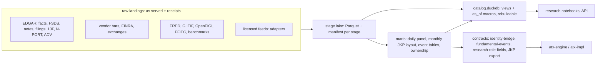
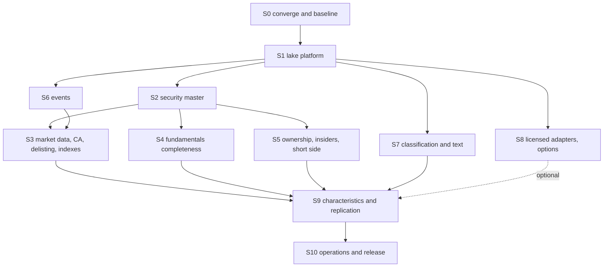

# Tier-1 v3: a US equity long/short warehouse at CRSP / Compustat / FactSet parity

> **For agentic workers:** REQUIRED SUB-SKILL: superpowers:subagent-driven-development, as in tier1-v2. Tasks are
> accepted on real-data measurements, not on claims. Working ledger: `.superpowers/sdd/tier1-v3/` (progress.md,
> CARRY.md, task-N brief / report / review per `.agents/harness/TEMPLATES.md`).

**Goal.** A point-in-time, survivorship-free data warehouse for US-listed equities. From it alone, a quant researcher
or PM can do what they would do with:
- CRSP;
- Compustat;
- FactSet Fundamentals, Ownership, Symbology and Events;
- the standard academic characteristic libraries (JKP, OSAP).

It covers every domain that free public data can reach. It holds tested adapters for the few domains only a license
can supply.

**Builds on:**
- the parity contract `docs/superpowers/specs/2026-09-19-tier1-parity-design.md` (items, clocks, derived families);
- the exit gates of `docs/superpowers/plans/2026-09-25-tier1-v2-00-dag-index.md` §2;
- the working stage lake `atx-db/data/alpha_panel/v1` (`atx-db/docs/ALPHA_PANEL_*.md`);
- the consumer contract `docs/plans/2026-09-28-mega-alpha-data-request-atx-db.md`.

**Replaces:** the not-started tier1-v2 nodes (1.8, 2.3-2.11, 3.x, 4.2-4.8, S5, X.1/X.2/X.7), once decision D1 is
taken.

**Stack.** Python 3.12, DuckDB 1.5 and pyarrow. Every job runs through `run_memory_guarded.py` at ≤ 1 GiB, as in
v2.

---

## 0. Where we are (2026-09-28)

Two tracks exist, and only one of them produces accepted data.

| track | works | does not work |
|---|---|---|
| **tier1-v2 warehouse** (`data/warehouse.duckdb`, 12.9 GB) | raw tables loaded: 47.9M CompanyFacts points, 31.96M bars, 10.3M submissions; code for standardization (450 rules), a derived DSL (173 metrics) and 379 quality checks | the standardized, derived, universe and delisting tables have **0 rows** (`atx-db/docs/TIER1_INTERIM_READINESS_2026-09-24.md`); paused since 2026-09-27; identity market-cap gate 0/132 months; A = L + E holds on 87-94%; price features reach 4,147 of 4,500 lines per month |
| **alpha_panel stage lake** (`data/alpha_panel/v1`, Parquet) | 18 stage directories published with SHA-bound manifests (details below) | v2 panel rebuild, borrow proxy and section 5 metrics not yet run (`atx-db/docs/ALPHA_PANEL_STATUS.md`) |

What the lake has published:
- PIT fundamentals v9: 421k events; own-filing match 100%; cutoff rebuild 118/118.
- CIK link table: 95.6-99.1% of member cells linked with all tiers, 77-83% with the point-in-time tiers.
- SEC filings (18.65M), 8-K events (1.08M), earnings calendar (327k), Form 4 (4.9M), 13F holdings (124M rows).
- FTD, Reg SHO, short volume with its splits, delisting causes, corporate actions.
- The consumer's loader accepted the identity bridge and the fundamental events.

**Reading.** The lake is the working base. The warehouse code holds the most reusable parts:
- the item catalog and vendor seed mappings (`seeds/fundamental_items.csv`: 150 Compustat, 158 FactSet, 130 CIQ rows;
  `research/items_map.py`);
- the derived DSL;
- the 379 quality checks.

This plan merges the two.

---

## 1. What parity means here

"Tier-1 parity" means a quant can run the standard US equity research and production workflow on our data with no
material loss. The workflow covers universe construction, characteristics, factor and alpha research, risk and cost
inputs, event studies, and short-side constraints. The data must be:
- point in time;
- free of survivorship bias;
- covering US-listed common stocks, ADRs, REITs and LPs, delisted names included;
- fundamentals from 2010, prices from 2012-03-26 (earlier if U4 is bought), and every gate measured on FY2015+.

### 1.1 Domain matrix

| # | domain | tier-1 reference | free source path | today | target | sprint |
|---|---|---|---|---|---|---|
| 1 | Security master, symbology | CRSP stocknames, CCM links, FactSet Symbology | submissions (formerNames, 8-A, 25, 15), cover-page `dei` tags, FINRA names, 13F/FTD/N-PORT CUSIPs, OpenFIGI, GLEIF | link table: 95.6-99.1% any tier, 77-83% PIT | PIT links ≥ 95% of member_equity cells from 2019; CUSIP/ISIN/FIGI/LEI histories; exchange and share-code history | S2 |
| 2 | Daily prices, returns, shares, market cap | CRSP DSF/MSF | TickerHistory3 (vendor) | 2012-03-26+, repaired | validated returns; daily shares by class; 1990+ only if U4 bought | S3 |
| 3 | Distributions, corporate actions | CRSP DSE, FactSet CA | vendor factors, XBRL dividends declared, 8-K / EX-99, Form 10 | ex-date factors only | declare, record and pay dates; spin-off ratios | S3 |
| 4 | Delisting returns | CRSP DLRET | 8-K 1.01/2.01, DEFM14A, SC TO-T, Form 25 | imputed (Shumway) | exact for cash deals, flagged imputation for the rest | S3 |
| 5 | Index membership | S&P, Russell constituents | rule-based proxies, public reconstitution and change lists | none | R1000/R2000/R3000 and S&P 500 proxies | S3 |
| 6 | Fundamentals, annual and quarterly | Compustat FUNDA/FUNDQ, FactSet FF | CompanyFacts, FSDS (NUM/PRE) | about 60-110 items, PIT; mega-alpha §2 targets mostly missed | ≥ 110 items at ≥ 90% (tier-1 gate); stretch 250 | S4 |
| 7 | Footnotes, segments | Compustat Segments, pension, debt schedules | SEC *Financial Statement and Notes* data sets | none | segments, debt maturities, leases, pension, SBC, tax | S4 |
| 8 | Bank, insurer, REIT and utility formats | Compustat Bank / FS | FFIEC Call Reports, FR Y-9C, XBRL, EX-99 FFO | templates only | bank items (loans, deposits, NII, provisions, capital); FFO | S4 |
| 9 | FX for non-USD filers | FactSet FX | FRED H.10 | money items NaN (5.5% of member_equity cells) | converted, flagged | S4 |
| 10 | Institutional and fund ownership | FactSet Ownership | 13F, N-PORT, Form ADV, 13D/13G | 13F done; filer type missing | + mutual funds, filer type, activist stakes | S5 |
| 11 | Insiders | FactSet Insiders | Forms 3/4/5, 144 | Form 4 done | + Form 144, net-buying measures | S5 |
| 12 | Short interest, fails, lending | FINRA, Markit | FINRA SI and short volume, SEC FTD, Reg SHO | done; lending is a proxy | Reg SHO complete; lending via license adapter | S5, S8 |
| 13 | Events | StreetAccount, SDC-lite | 8-K, S-4, DEFM14A, SC TO, 425, Form 10, S-1, 424B, 6-K | 8-K items, earnings calendar | M&A deals, IPO/SEO, buybacks, dividends, guidance, halts, governance | S6 |
| 14 | Classification | GICS, RBICS | SIC, SIC→NAICS crosswalk, FF, 10-K text (TNIC-style) | SIC, FF12/49 | + NAICS (approximate), text industries | S7 |
| 15 | Filing text | FactSet Filings | EDGAR documents | metadata only | risk-factor and MD&A change, length, readability | S7 |
| 16 | Estimates | I/B/E/S, FactSet Estimates | none free (guidance extraction as substitute) | none | license adapter + guidance substitute | S6, S8 |
| 17 | Options | OptionMetrics | atx-vol / vendor | ATM IV term only | skew, volume, OI (atx-vol or license) | S8 |
| 18 | Macro, rates, FX, factors | FRED, French | FRED, Treasury, French/JKP/OSAP | DTB3, benchmarks | yield curve, FX, VIX, factor files | S1 |
| 19 | Characteristic library | JKP, OSAP | computed | DSL (unrun), panel fields | ≥ 250 characteristics, replicated | S9 |
| 20 | Operations | vendor SLAs | own | manual runs | daily incremental, SLOs, reproducible releases | S10 |

### 1.2 What free data cannot reach (license only)

These need a purchase (D3). Until then the plan ships a contract, a mock loader and the best free substitute for
each.

| domain | free substitute |
|---|---|
| Analyst estimates (I/B/E/S / FactSet) | guidance from EX-99 (S6.4); time-series SUE |
| GICS | SIC, FF, text industries |
| Securities lending fee and utilization (Markit, S3) | public short-side proxy |
| Official index constituents and weights | rule-based proxies |
| Transcripts | none |
| Pre-2012 prices and a daily price feed (user gate U4) | none |
| TAQ intraday spreads | OHLC spread estimators |

---

## 2. Owner decisions (before S1; recommended default in bold)

| id | decision | default and reason |
|---|---|---|
| D1 | System of record | **Parquet stage lake; `warehouse.duckdb` becomes a rebuildable catalog of views plus the serving layer.** The lake runs under the 1 GiB guard, has no single-writer bottleneck, and is already bound by consumers. The warehouse's derived tables are still empty after 9 days. The warehouse raw tables stay read-only until S4 exits, then are archived. |
| D2 | Canonical fundamentals engine | **alpha_panel fundamentals v9.** The F.1 item-vintage engine's temporal-repair proofs become validation tests. The v2 standardization rules feed the S4 catalog. |
| D3 | Licensed data | **Buy nothing now; build adapters and substitutes.** Estimates, then securities lending, carry the most research value. Decide before S8. |
| D4 | Non-USD filers | **Convert with FRED H.10:** period-end rates for balances, period averages for flows. The FX clock is its publication date. The `fx_converted` flag is set and the reporting-currency value is kept. |
| D5 | Coverage scope | **US-listed only** (ADRs and FPIs included); no global coverage. |
| D6 | Holdout protection | **No return-based statistic on 2023+ data.** Factor-replication windows end 2022-12-31. Comparisons of values (for example against OSAP signal values) are allowed in any year. |
| D7 | Storage | New sources (Notes data sets, N-PORT, 10-K text, Form ADV) are estimated at 60-120 GB; S0.4 measures them. C: has 45 GB free. **Add a data drive, or approve deleting the 21.7 GB of non-lake candidates** listed in `atx-db/docs/ALPHA_PANEL_STATUS.md`. |
| D8 | Scheduling | **Windows Task Scheduler (user gate U10)** for the S10 daily runs. |

Record each decision as a `Ruling:` line in `.superpowers/sdd/tier1-v3/CARRY.md`.

---

## 3. Invariants (every task, every review)

1. **Point in time.** Every stage row carries `available_at` (UTC). A value is visible at decision session d only if
   `available_at < 22:00 UTC of session d-1`. No clock is backdated. A missing clock gets a documented conservative
   floor (for example filed + 46 h).
2. **Vintages.** Restatements, amendments and re-posted files are new rows with their own clocks. Nothing is
   overwritten. Re-posted sources carry `vintage_risk`.
3. **No survivorship.** Delisted lines are included. Identity tiers that depend on the snapshot (`backfill`) are
   labelled, and every issuer join carries `link_tier`.
4. **Identity keys.** TickerHistory3 `securityID` with the sid0-bracket repair for instruments; CIK for issuers.
5. **Reproducible.** Every stage manifest holds the SHA-256 of each output and of the code, plus the SHA-256 of every
   input manifest. A release rebuilds byte-identically.
6. **Holdout.** D6.
7. **Resources.**
   - ≤ 1 GiB per job, and a 2 GiB total guard budget.
   - `warehouse.duckdb` is only ever opened through the guard.
   - Wide Parquet writes use row groups of 32k rows or fewer.
   - Join steps use per-month scratch databases.
8. **Sources.**
   - SEC traffic stays ≤ 5 requests/s with the declared user agent. Other hosts are polite and sequential.
   - Every new source passes the S0.4 sizing and terms-of-service check, then the user's approval (X gate).
   - Raw landings are kept as served, with a receipt ledger.
9. **Files** are created and edited with the Write/Edit tools; no shell heredocs for content containing backslashes.

---

## 4. Target architecture

- **Stage registry** (`atx_db/lake/registry.py`): one entry per stage, holding schema id, inputs, outputs, clock
  column, staleness rule, vintage policy, guard cap and owner lane. The orchestrator, the invariant checker, the
  catalog and the scorecard all read it.
- **Scorecard** (`atx_db/parity/`): the catalog of every domain and item, with its reference-vendor field name, stage
  column, target and measured coverage. `docs/PARITY_SCORECARD.md` is generated from it after every release.

---

## 5. Roadmap

Size: S = 1 agent session, M = 2-4 sessions, L = 5-8 sessions.

| sprint | theme | size | depends on | exit gate (short) | new disk (est.) |
|---|---|---|---|---|---|
| S0 | converge, decide, baseline | M | — | scorecard v0 from measured numbers; D1-D8 ruled; sources approved | < 1 GB |
| S1 | lake platform | M | S0 | every stage passes `lake verify`; catalog rebuilds byte-identically | < 1 GB |
| S2 | security master, symbology | L | S1 | PIT links ≥ 95% of member_equity cells from 2019 | 2-5 GB |
| S3 | market data, CA, delisting, indexes | L | S2, S6.1 | French Mkt ρ ≥ 0.99 (≤ 2022); exact cash-deal DLRET ≥ 80% | 2-5 GB |
| S4 | fundamentals completeness | L | S2 | ≥ 110 items ≥ 90% FY2015-25; A = L + E ≥ 99%; FSDS benchmark | 20-60 GB |
| S5 | ownership, insiders, short side | M | S2 | filer type ≥ 90% of 13F value; fund ownership ≥ 95% of cells | 10-30 GB |
| S6 | events and calendars | M | S1 | precision ≥ 95% on hand-checked samples; calendar ≥ 95% incl. FPIs | 5-15 GB |
| S7 | classification, text | M | S1 | text industries ≥ 95% of 10-K filers per year | 10-30 GB |
| S8 | licensed adapters, options | S-M | S1, D3 | contract tests pass on mocks | — |
| S9 | characteristics, replication | L | S3, S4, S5, S7 | ≥ 250 characteristics; OSAP ρ ≥ 0.90 on ≥ 80% | 2-5 GB |
| S10 | operations, release | M | S9 | 5 unattended daily runs, SLOs green, byte-identical release | — |

The critical path is S0 → S1 → S2 → S4 → S9 → S10, about 30 sessions. S3 and S5-S8 run in parallel lanes, each
owning disjoint stage directories. Milestones:
- **M1 (after S4):** Compustat parity;
- **M2 (after S3 and S5):** CRSP and ownership parity;
- **M3 (after S10):** release 1.0.

---

## 6. Sprints

Every task brief states its done criteria as falsifiable measurements, the stage directories it owns, and its guard
cap. The acceptance command's output goes in the report.

### S0 Converge and baseline (M)

| task | output | done when |
|---|---|---|
| S0.1 Finish the mega-alpha v7 chain: Reg SHO build → panel v2 → borrow proxy → metrics → lo1 export → consumer acceptance load | `export/acceptance/*`, `docs/ALPHA_PANEL_METRICS.md` | the consumer's loader reports `fields-complete` on the lo1 role with our manifests bound |
| S0.2 Commit the alpha_panel code, tests and docs (explicit pathspecs) | commit | `git status` clean for those paths; tests green |
| S0.3 Parity catalog and scorecard generator | `atx_db/parity/catalog.csv` (domain, item, Compustat / CRSP / FactSet field, source, stage, column, basis, target, sprint), built from `seeds/fundamental_items.csv`, the design spec and §1.1; `parity/scorecard.py` → `docs/PARITY_SCORECARD.md` | every §1.1 row and every design-spec item appears; the scorecard renders measured numbers from `metrics/` |
| S0.4 Source sizing and terms check: HEAD requests and list files for each source in §1.1 | `atx-db/docs/SOURCES.md`: url, bytes, history, cadence, terms, rate limit | every source has measured bytes and a terms note; the user approves the landing list (X gate) |
| S0.5 Record rulings D1-D8 | `CARRY.md` | 8 `Ruling:` lines |

**Exit:** scorecard v0 computed from measured coverage. This is the baseline every later gate is compared to.

### S1 Lake platform (M)

| task | output | done when |
|---|---|---|
| S1.1 Promote `alpha_panel.common` to `atx_db/lake/` with a stage registry; register all existing stages | `lake/registry.py`, `lake/contract.py` | all stages registered; three stages rebuilt with hash-identical outputs |
| S1.2 Invariant checker `lake verify` | CLI + tests | runs on every stage. It checks manifest completeness, file SHA-256, input-manifest binding, `available_at` present and ≤ snapshot, and no `.partial` files. 0 failures |
| S1.3 Catalog database: views over stage Parquet, `as_of(ts)` table macros, column docs from the registry | `data/catalog.duckdb` + `lake/catalog.py` | rebuilt from scratch in < 10 min; two rebuilds byte-identical; read-only for consumers |
| S1.4 Orchestrator driven by the registry DAG, incremental by watermark (replaces `alpha_panel/build.py`) | `lake/orchestrate.py` | a changed input rebuilds only the stages downstream of it (measured on 2 cases) |
| S1.5 Reference stage: FRED (DGS1MO-DGS30, H.10 FX, VIXCLS), French/JKP/OSAP benchmark files | `reference/` | series complete 2010+; each clock = publication date |

### S2 Security master and symbology (L)

| task | output | done when |
|---|---|---|
| S2.1 Cover-page identity evidence: `dei:TradingSymbol`, `SecurityExchangeName`, `Security12bTitle`, and per-class `EntityCommonStockSharesOutstanding` (2019+), each at its filing clock | `identity/cover_page.parquet` | ≥ 95% of 10-K/10-Q filers from 2020 have a dated ticker/exchange row |
| S2.2 Listing events: 8-A12B/12G, 25/25-NSE, 15, S-1/424B4 dates; name history from `formerNames` | `security_master/listing_events.parquet` | listing date known (not censored) for ≥ 95% of lines first seen after 2012 |
| S2.3 CUSIP history from 13F, FTD, N-PORT and 13D/G; ISIN derived with check digit | `security_master/cusip_history.parquet` | ≥ 99.5% of 13F SH value maps; ISIN check digits valid 100% |
| S2.4 FIGI (OpenFIGI bulk mapping) and LEI (GLEIF golden copy + Level 2 parents) | `security_master/{figi,lei}.parquet` | FIGI for ≥ 98% of member lines; LEI for ≥ 90% of linked CIKs |
| S2.5 Link table v3: S2.1/S2.2 evidence becomes a new dated tier; CCM-style `linktype` / `linkprim`; `shrcd` / `exchcd`-style histories | `identity/link_table.parquet` v3, bridge exports | PIT tiers (strict + dated) ≥ 95% of member_equity cells every year 2019-2026, ≥ 90% in 2018; 0 ambiguous line-days |
| S2.6 Corporate hierarchy (GLEIF L2; Exhibit 21 subsidiaries optional) | `security_master/hierarchy.parquet` | parent known for every CIK with an LEI relationship |

### S3 Market data, corporate actions, delisting, indexes (L)

| task | output | done when |
|---|---|---|
| S3.1 Execute U4: daily feed and pre-2012 history if bought; else document the 2012-03-26 floor | ruling + stage | either new years land and validate, or the floor is documented in the scorecard |
| S3.2 Independent return validation on a stratified 500 line-month sample (second source within its terms); total-return identity | `validation/returns.json` | ≥ 99% of sampled daily returns within 1 bp after corporate actions; every exception explained |
| S3.3 Distributions: vendor ex-date factors joined to declared dividends (XBRL `CommonStockDividendsPerShareDeclared`, EX-99 declarations: declare, record, pay dates, amount), specials, spin-off ratios (Form 10 + 8-K) | `corporate_actions/distributions.parquet` | declare date for ≥ 90% of member-line cash dividends from 2019 |
| S3.4 Daily shares outstanding by class (CRSP `shrout` analog): `dei` cover counts (PIT), balance sheet, vendor, split-adjusted | `market/shares_daily.parquet` | ≥ 99% of member_equity cells; two sources agree within 5% on ≥ 95% (design-spec gate) |
| S3.5 DLRET v2: cash-deal consideration per share from 8-K 1.01 / DEFM14A / SC TO-T (from S6.1); stock deals via acquirer price × ratio; the rest imputed and flagged | `delisting/events.parquet` v2 | exact DLRET for ≥ 80% of M&A delistings from 2018 |
| S3.6 Index proxies: rule-based Russell 1000/2000/3000 (public methodology, rank day, bands); S&P 500 change list from public releases (terms-gated); CRSP-style VW/EW market returns | `indexes/` | proxy R2000 overlaps public reconstitution lists ≥ 95% where available |
| S3.7 Cost-model inputs: Corwin-Schultz and Abdi-Ranaldo spreads, Amihud illiquidity, turnover, halts | `market/liquidity.parquet` | ≥ 99% of member_equity cells |

**Exit:** French Mkt-RF ρ ≥ 0.99 and SMB ≥ 0.90 on monthly windows ending ≤ 2022-12, plus the task gates above.

### S4 Fundamentals completeness (L; the core Compustat sprint)

| task | output | done when |
|---|---|---|
| S4.1 Cross-concept Q4 / TTM repair (today 3.8% sale, 6.6% oi, 4.5% gp of 2020-2022 USD events have the quarter but no TTM; e.g. Visa FY2020) | `fund_items.py` rules + tests | those rates < 1% excluding issuers with < 4 quarters of history |
| S4.2 Catalog expansion to ≥ 110 Compustat items, from the S0.3 catalog; fall back to custom-tag lines via FSDS PRE labels ("cost of sales" and similar) | events v10 | per-item coverage table; ≥ 110 items at ≥ 90% |
| S4.3 FX conversion (D4) | events v10 | money items finite for ≥ 95% of non-USD filer events whose currency H.10 covers |
| S4.4 *Financial Statement and Notes* data sets: business and geographic segments (revenue, OI, assets), debt maturities, leases, pension, SBC, tax components, impairments | `fundamentals/notes/` | segment revenue for ≥ 90% of multi-segment 10-K filers; the segment sum reconciles to total within 1% on ≥ 95% |
| S4.5 Industry formats: banks from FFIEC Call Reports / FR Y-9C (RSSD→CIK via NIC); insurers (XBRL); REIT FFO/AFFO (EX-99); utilities | `fundamentals/industry/` | bank loans, deposits, NII, provisions and CET1 for ≥ 95% of linked bank holding companies |
| S4.6 Vintage access: as-first-reported vs latest, restatement flags (4.02, /A), Compustat-Snapshot-style `as_of` | catalog macros | the as-of query reproduces the S4.7 cutoff rebuild exactly |
| S4.7 Validation suite | `validation/fundamentals.json` | FSDS 10k-cell benchmark ≥ 95% mapped and ≥ 98% within 0.5%; A = L + E within 0.5% or $1M on ≥ 99% of issuer-periods; cutoff rebuild of 200 events with 0 differences; 50 tickers × 5 years spot-checked |

**Exit:**
- the design-spec gate: ≥ 110 items at ≥ 90% coverage on the top 3000 by market cap, every FY2015-FY2025;
- the mega-alpha §2 targets on the linked-USD, non-structural basis: gp_ttm 0.90, oi_ttm 0.92, xrd_ttm 0.95,
  capx_ttm 0.95, txt_q 0.95, sale_ttm 0.96, shrs_q 0.97.

### S5 Ownership, insiders, short side (M)

| task | output | done when |
|---|---|---|
| S5.1 Form ADV bulk data → 13F filer type (hedge fund via private-fund reporting, mutual fund, bank, pension, other), each dated | `thirteenf/filer_type.parquet` | a type for ≥ 90% of 13F SH value per quarter |
| S5.2 N-PORT holdings (2019Q4+) → fund holdings, fund-ownership aggregates, fund net-flow proxy | `nport/` | fund ownership for ≥ 95% of member_equity cells from 2020 |
| S5.3 13D/13G stakes: structured XML from Dec 2024; text before (% owned, purpose, filer) | `stakes/` | ≥ 95% of 2025 filings parsed; sample precision ≥ 95% on pre-2024 text |
| S5.4 Form 144 (structured from 2023) and insider net-buying measures | `insider/` | 144 notices with `available_at`; nets per issuer and month |
| S5.5 Short side: Reg SHO complete (NYSE family), borrow proxy, lending adapter hook (S8) | stages | threshold lists for all 5 listing markets 2018+ |

### S6 Events and calendars (M)

| task | output | done when |
|---|---|---|
| S6.1 M&A deal table: announce, parties, consideration, status, completion or termination (8-K 1.01/2.01, S-4, DEFM14A, SC TO-T / 14D-9, 425) | `events/mna.parquet` | 200-deal hand check: ≥ 95% precision; consideration parsed for ≥ 80% |
| S6.2 Capital-market events: IPO (S-1/424B4), follow-ons and shelf takedowns (424B*), converts, spin-offs (Form 10-12B) | `events/capital.parquet` | 200-event hand check ≥ 95% |
| S6.3 Buybacks: announcements (8-K 8.01/7.01, EX-99), repurchase tables (10-Q/10-K Part II), XBRL authorisation amounts | `events/buyback.parquet` | 200-event hand check ≥ 95% |
| S6.4 Guidance extracted from EX-99 releases (rule-based numeric ranges for EPS and revenue; no paid LLM), as the free estimate substitute | `events/guidance.parquet` | ≥ 90% precision on 300 hand-checked releases |
| S6.5 Earnings calendar v2: FPI 6-K EX-99; expected dates; timing | `earnings_calendar/` v2 | ≥ 95% of member_equity issuers covered, FPIs included |
| S6.6 Governance: 5.02 officer changes, 4.01 auditor changes, `dei:AuditorName` (2021+), 4.02 restatements, going concern (audit-report text) | `events/governance.parquet` | 200-event hand check ≥ 95% |

### S7 Classification and text (M)

| task | output | done when |
|---|---|---|
| S7.1 NAICS via the Census SIC→NAICS crosswalk (flagged approximate); FF 5/10/12/17/30/38/48/49 | `classification/` | 100% of linked issuers with a SIC |
| S7.2 Text industries (Hoberg-Phillips TNIC-style) from 10-K Item 1, yearly, at the 10-K clock | `classification/tnic/` | ≥ 95% of linked 10-K filers per year 2015+ |
| S7.3 Filing text features: risk-factor and MD&A similarity to the prior year (Lazy Prices), length, readability; a sentiment dictionary only if its license allows | `text/` | ≥ 90% of member_equity cells PIT |
| S7.4 (optional) Credit ratings from NRSRO Rule 17g-7(b) XBRL histories (lagged; publication clock) | `credit/` | ratings for ≥ 80% of rated linked issuers |

### S8 Licensed adapters and options (S-M, gated by D3)

| task | output | done when |
|---|---|---|
| S8.1 Adapter contracts (schema, PIT semantics, mock loader, tests) for estimates (consensus, detail, actuals, recommendations, targets), securities lending, GICS, index constituents and weights, transcripts | `atx_db/licensed/` | contract tests pass on mocks; each doc states the PIT rule |
| S8.2 Options: integrate atx-vol surfaces (25Δ skew, term slope, option volume, OI) by `security_id`; if atx-vol keeps no history, ask the vendor whether its core-history product covers them | `options/` | ≥ 95% of optionable member lines, or a documented license need |
| S8.3 Load purchased data (per D3) | stages | adapter gates on real data |

### S9 Characteristic library and replication (L)

| task | output | done when |
|---|---|---|
| S9.1 Port the derived DSL (173 metrics) onto the lake; extend to ≥ 250 characteristics (the JKP 153 plus the OSAP set whose inputs exist) | `characteristics/` | ≥ 250 characteristics with definitions, clocks and staleness |
| S9.2 Monthly JKP-layout export (≤ 1 GB) and daily research-role fields | `export/` | consumer loaders accept both by manifest SHA |
| S9.3 Value replication: monthly cross-sectional Spearman of each characteristic against OSAP signal files and JKP characteristics on overlapping names | `validation/replication.json` | median ρ ≥ 0.90 for ≥ 80% of replicable signals; every miss explained |
| S9.4 Factor replication against French/JKP factor returns (windows ≤ 2022-12 only, per D6) | `validation/factors.json` | ρ: Mkt 0.99, SMB/UMD 0.90, HML 0.85, RMW/CMA 0.75 |
| S9.5 Risk and cost input pack: style exposures, industries, returns, volatility, spreads, ADV, borrow proxy | `marts/risk_inputs/` | ≥ 99% of member_equity cells |

### S10 Operations and release (M)

| task | output | done when |
|---|---|---|
| S10.1 Daily incremental: EDGAR daily index / RSS → changed issuers → downstream stages; FINRA daily; prices daily (U4); FX daily | orchestrator jobs | the day's new filings are visible in stages within 24 h (measured) |
| S10.2 Scheduler (U10), supervisor, alerting, disk floor, guard | ops scripts | a killed run resumes to the same outputs |
| S10.3 SLOs and quality: port the 379 checks to the lake; freshness and completeness SLOs per source; SLO snapshots | `quality/`, `ops/slo/` | 379/379 checks run; 12/12 SLO snapshots recorded |
| S10.4 Release: release manifest, change log, byte-reproducible rebuild, consumer contract tests (atx-engine loaders) | `releases/r1/` | two rebuilds byte-identical; consumers load by SHA |
| S10.5 Serving: catalog views, Python client, API docs | `docs/WAREHOUSE_API.md` | notebook examples run against the catalog |

**Exit:** 5 consecutive unattended daily runs with every SLO green.

---

## 7. Parity gates (the scorecard's pass line)

| area | gate | measured by |
|---|---|---|
| Identity | PIT links ≥ 95% of member_equity cells 2019-2026; 0 ambiguous line-days | S2.5 |
| Market | French Mkt ρ ≥ 0.99, SMB ≥ 0.90 (≤ 2022); returns within 1 bp on ≥ 99% of sampled days | S3 |
| Fundamentals | ≥ 110 items ≥ 90% FY2015-25; FSDS 95% / 98%-within-0.5%; A = L + E ≥ 99% | S4.7 |
| Consumer | mega-alpha §2 targets; the lo1 acceptance load passes | S4, S0.1 |
| Ownership | filer type ≥ 90% of 13F value; fund ownership ≥ 95% of cells | S5 |
| Events | ≥ 95% precision on hand-checked samples, per type | S6 |
| Characteristics | ≥ 250; OSAP median ρ ≥ 0.90 on ≥ 80% | S9 |
| Operations | 379/379 checks; 12/12 SLOs; 5 unattended runs; byte-identical release | S10 |
| Holdout | no return-based statistic computed on 2023+ | review checklist, every task |

---

## 8. Risks

| risk | mitigation |
|---|---|
| Two tracks drift (v2 warehouse vs lake) | D1 ruled in S0; v2 nodes retired or ported explicitly |
| Disk: new sources 60-120 GB against 45 GB free | D7; S0.4 measures first; Parquet + ZSTD; zips deleted after parse, with the receipt kept |
| Memory: wide joins under 1 GiB | per-month scratch databases, materialised CTEs, 32k row groups (lesson from the panel v2 OOM) |
| SEC or host blocks | ≤ 5 req/s, declared user agent, resumable ledgers, backoff |
| Terms of service on scraped lists (S&P releases, Russell lists, dictionaries) | terms checked in S0.4; skip anything unlicensed and document the gap |
| XBRL custom tags cap item coverage | FSDS PRE label fallback (S4.2); report structural vs missing separately |
| Holdout contamination through validation | D6; return-based checks limited to ≤ 2022 |
| Identity survivorship (backfill tier) | S2 dated evidence replaces backfill; `link_tier` on every issuer join |
| Scope creep into research | this plan builds data and validation only; alpha work stays in the mega-alpha track |

---

## 9. Execution model

- **Lanes.** One lane per sprint theme, each owning disjoint stage directories (tokens: `ID`, `MKT`, `FUND`, `OWN`,
  `EVT`, `TXT`, `LIC`, `CHAR`, `OPS`).
  - At most two heavy (≥ 0.8 GiB) jobs run at once, inside the 2 GiB guard budget.
  - `PLAT` (S1) is the only lane that edits `lake/`.
- **Per task:**
  1. Brief (goal, owned paths, forbidden paths, falsifiable done criteria).
  2. Implement on real data under the guard.
  3. Report (exit code 0 output, measured numbers, deviations).
  4. Independent review against §3 and the brief.
  5. Commit with explicit pathspecs.
- **Rules as code.** Every rule has fixture tests. Every gate has a measurement script whose output lands in
  `.superpowers/sdd/tier1-v3/receipts/`.
- **User gates.** New source landings (X), licenses (D3), storage (D7), scheduler (U10), merges.
- **Status.** `progress.md` gets one line per task. `docs/PARITY_SCORECARD.md` is regenerated at each sprint exit.
